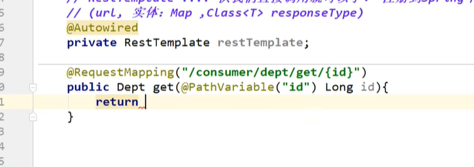

# Spring

## IOC

IOC(Inversion of Control),意思是控制反转，不是什么技术，而是一种设计思想，IOC意味着将你设计好的对象交给容器控制，而不是传统的在你的对象内部直接控制。

​		在传统的程序设计中，我们直接在对象内部通过new进行对象创建，是程序主动去创建依赖对象，而IOC是有专门的容器来进行对象的创建，即IOC容器来控制对象的创建。

​		在传统的应用程序中，我们是在对象中主动控制去直接获取依赖对象，这个是正转，反转是由容器来帮忙创建及注入依赖对象，在这个过程过程中，由容器帮我们查找级注入依赖对象，对象只是被动的接受依赖对象。

​		1、先准备一个基本的容器对象，包含一些map结构的集合，用来方便后续过程中存储具体的对象

​		2、进行配置文件的读取工作或者注解的解析工作，将需要创建的bean对象都封装成BeanDefinition对象存储在容器中

​		3、容器将封装好的BeanDefinition对象通过反射的方式进行实例化，完成对象的实例化工作

​		4、进行对象的初始化操作，也就是给类中的对应属性值就行设置，也就是进行依赖注入，完成整个对象的创建，变成一个完整的bean对象，存储在容器的某个map结构中

​		5、通过容器对象来获取对象，进行对象的获取和逻辑处理工作

​		6、提供销毁操作，当对象不用或者容器关闭的时候，将无用的对象进行销毁


## 代理模式

### 静态代理

- 使得真实角色的操作更加纯粹，不用去关注一些公共的事情，业务
- 公共业务交给代理角色!  实现了业务的分工!
- 公共业务发生扩展的时候，方便集中管理!

一个真实角色就会产生一个代理角色，代码量会翻倍，开发效率会变低~

### 动态代理

动态代理和静态代理的角色一样，分别为 抽象角色，真实角色，代理角色，使用类

动态代理的代理类是动态生成的，不是我们直接写好的!

需要了解两个类：Proxy 代理   InvocationHandler  调用处理程序

1.创建被代理的对象，UserService 的接口实现类

2.获取需要传递给Proxy的ClassLoader, 获取UserServiceImpl对应的 ClassLoader

3.获取需要传递给Proxy的interfaces,这里的UserServiceImpl只实现了一个接口UserService

4.生成需要传递给Proxy的IncovationHandler实现类, 须传入实际的执行对象 userServiceImpl

根据上面提供的信息，创建代理对象 在这个过程中，
a.JDK会通过根据传入的参数信息动态地在内存中创建和.class 文件等同的字节码
b.然后根据相应的字节码转换成对应的class，
c.然后调用newInstance()创建代理实例

UserService proxy  = (UserService) Proxy.newProxyInstance(classLoader, interfaces, userServiceProxy);


测试

```java
public class Client {
    public static void main(String[] args) {
        //真实角色
        UserServiceImpl userService = new UserServiceImpl();
        //代理角色，不存在
        ProxyInvocationHandler pih = new ProxyInvocationHandler();
        //设置需要代理的对象
        pih.setTarget(userService);
        //动态生成代理
        UserService proxy = (UserService) pih.getProxy();
        proxy.query();
    }
}
```


## 注解

### 注入

@Component

- dao层----> @Repository  和Conponent一样，
- service层 --->@Service   
- controller层  --->@Controller  代表这个类被spring托管

### 自动装配

@Autowired 自动装配通过类型，名字，如果Autowired不能唯一装配上属性，就用

@Qualifier("dog222")

@Nullable 字段标记了这个注解，说明这个字段可以为null

@Resource:名字  使用方式  @Resource(name="cat2")自动装配通过名字、类型

### Controller

@Component   代表是spring一个组件

@Service     代表service

@Controller    代表controller

@Repository  介于业务逻辑层和数据库之间，进行数据的访问和操作。


@RequestMapping("/HelloController")

@GetMapping就是一个组合注解

他相当于  @ReqeustMapping(mathod=RequestMethod.GET )的一个快捷方式，平时使用的会比较多


**@ResponseBody**的作用其实是将java对象转为json格式的数据，

注解的作用是将controller的方法返回的对象通过适当的转换器转换为指定的格式之后，写入到response对象的body区，通常用来返回JSON数据或者是XML数据。
注意：在使用此注解之后不会再走视图处理器，而是直接将数据写入到输入流中，他的效果等同于通过response对象输出指定格式的数据。


**@RestController** 是@controller和@ResponseBody 的结合

@RestController 里面所有的方法都只会返回 json 字符串了，不用再每一个都添加@ResponseBody 


**@CookieValue**的作用

　　用来获取Cookie中的值

```
public String toList(HttpSession session, Model model, @CookieValue("userTicket") String ticket)
```

**@cookieValue是springMvc中的注解：**

@CookieValue的作用

　　用来获取Cookie中的值

@**Transactional**事务注解

当一个方法添加@Transactional注解之后，spring会基于这个类生成一个代理对象，会将这个代理对象作为bean，当使用这个代理对象的方法的时候，如果有事务处理，那么会先把事务的自动提交给关系，然后去执行具体的业务逻辑，如果执行逻辑没有出现异常，那么代理逻辑就会直接提交，如果出现任何异常情况，那么直接进行回滚操作，当然用户可以控制对哪些异常进行回滚操作。





### SpringBoot

 **@SpringBootApplication`**

作用: 标注在某个类上面，说明这个类是springboot的主配置类，springboot就应该运行这个类的main方法来启动springboot应用，进入这个注解，可以看到上面还有很多其他的注解!

**@ComponentScan**

这个注解在spring中很重要，它对应XML配置中的元素，

作用： 自动扫描并加载符合条件的组件或者BEAN，将这个bean定义加载到ioc容器中

**@SpringBootConfiguration**

作用: SpringBoot的配置类，标注在某个类上，表示这是一个SrpingBoot的配置类

**@Configuration**，说明这是一个配置类 ，配置类就是对应Spring的xml 配置文件；

**@EnableAutoConfiguration ：开启自动配置功能**

**@AutoConfigurationPackage ：自动配置包**

**@import** ：Spring底层注解@import ， 给容器中导入一个组件

Registrar.class 作用：将主启动类的所在包及包下面所有子包里面的所有组件扫描到Spring容器 ；

这个分析完了，退到上一步，继续看

@Import(AutoConfigurationImportSelector.class)  给容器导入组件

**@EnableAsync**异步任务

**@EnableScheduling**   //开启定时功能的注解


## 习惯包名

### 1、POJO：

POJO（Plain Ordinary Java Object）简单的Java对象，实际就是普通JavaBeans，是为了避免和EJB混淆所创造的简称。
使用POJO名称是为了避免和EJB混淆起来, 而且简称比较直接。其中有一些属性及其getter setter方法的类，没有业务逻辑，有时可以作为VO(value -object)或dto(Data Transform Object)来使用。当然，如果你有一个简单的运算属性也是可以的，但不允许有业务方法,也不能携带有connection之类的方法。

### 2、DAO：

DAO层叫数据访问层，全称为data access object，某个DAO一定是和数据库的某一张表一一对应的，其中封装了CRUD（增加Create、检索Retrieve、更新Update和删除Delete）基本操作，DAO只做原子操作。无论多么复杂的查询，dao只是封装增删改查。至于增删查改如何去实现一个功能，dao是不管的。


DAO(Data Access Object)是一个数据访问接口，数据访问：顾名思义就是与数据库打交道，夹在业务逻辑与数据库资源中间。
DAO模式是标准的J2EE设计模式之一，开发人员使用这个模式把底层的数据访问操作和上层的商务逻辑分开，一个典型的DAO实现有下列几个组件：

一个DAO工厂类；
一个DAO接口；
一个实现DAO接口的具体类；
数据传递对象（有些时候叫做值对象）
具体的DAO类包含了从特定的数据源访问数据的逻辑！


### 3、SERVICE：

Service层叫服务层，被称为服务，粗略的理解就是对一个或多个DAO进行的再次封装，封装成一个服务，所以这里也就不会是一个原子操作了，需要事物控制。**管理具体的功能的。**

一般情况下，Hibernate DAO只操作一个POJO对象，因此一个DAO对应一个POJO对象。 Service层是为了处理包含多个POJO对象（即对多个表的数据操作）时，进行事务管理（声明式事务管理），Service层（其接口的实现类）被注入多个DAO对象，以完成其数据操作。
SSM中Service存放业务逻辑处理，也是一些关于数据库处理的操作，但不是直接和数据库打交道，他有接口还有接口的实现方法，在接口的实现方法中需要导入mapper层，mapper层是直接跟数据库打交道的，它也是个接口，只有方法名字，具体实现在mapper.xml文件里，service是供我们使用的方法。
mapper层等于dao层，现在用mybatis逆向工程生成的mapper层，其实就是dao层。对数据库进行数据持久化操作，他的方法语句是直接针对数据库操作的，而service层是针对我们controller，也就是针对我们使用者。service的impl是把mapper和service进行整合的文件


Service层是为了处理包含多个POJO对象（即对多个表的数据操作）时，进行事务管理（声明式事务管理），Service层（其接口的实现类）被注入多个DAO对象，以完成其数据操作。
Service存放业务逻辑处理，也是一些关于数据库处理的操作，但不是直接和数据库打交道，他有接口还有接口的实现方法，在接口的实现方法中需要导入mapper层，mapper层是直接跟数据库打交道的，它也是个接口，只有方法名字，具体实现在mapper.xml文件里，service是供我们使用的方法。

### 4、Controller层：

Controler负责请求转发，接受页面过来的参数，传给Service处理，接到返回值，再传给页面。**管理业务（Service）调度和管理跳转的。**


### 5、Filter层

Filter对用户请求进行预处理，接着将请求交给Servlet进行处理并生成响应，最后Filter再对服务器响应进行后处理。

# 其他

## SPI

SPI全称为 (Service Provider Interface),是JDK内置的一种服务提供发现机制

## 链式写法

      * Dept dept = new Dept();
            *
            * dept.setDeptNo(11).setDname('ssss').setDb_source('db01')

@Accessors(chain = true)

import lombok.experimental.Accessors;

@Builder也可以

## springcloud远程调用

发送请求到其他链接，获得实体

Http通信方式,同步,阻塞，Restful服务模板