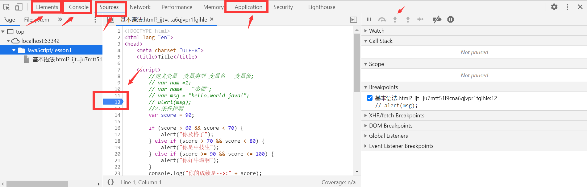
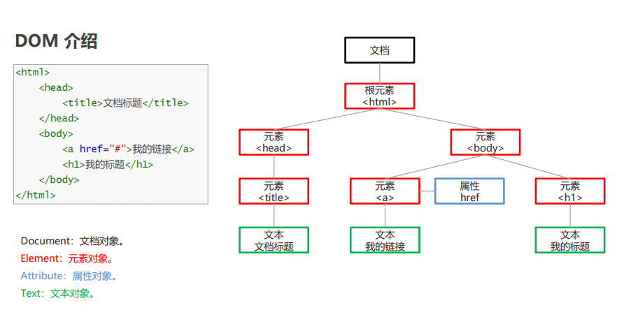
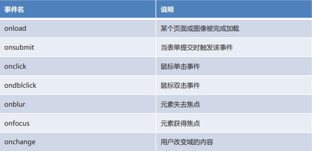
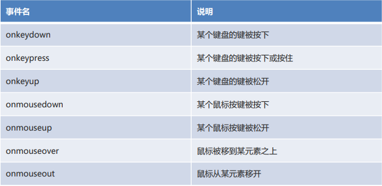
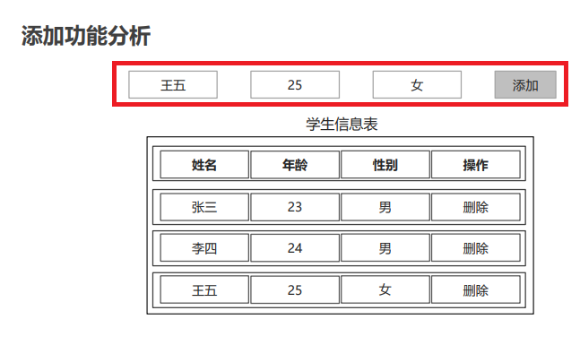
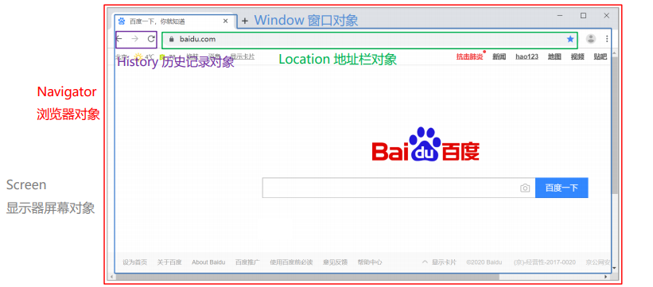

## JavaScript

## 1.快速入门

### 1.1 概述

JavaScript 是一种客户端脚本语言。运行在客户端浏览器中，每一个浏览器都具备解析 JavaScript 的引擎。

脚本语言：不需要编译，就可以被浏览器直接解析执行了。

作用：增强用户和 HTML 页面的交互过程，让页面产生动态效果，增强用户的体验。

组成部分：ECMAScript、DOM、BOM

开发环境搭建：安装Node.js，是JavaScript运行环境

### 1.2 引入

引入HTML文件

* 内部方式：<script>标签

  ```html
  <!DOCTYPE html>
  <html lang="en">
  <head>
      <meta charset="UTF-8">
      <title>JS快速入门</title>
  </head>
  <body>
      <!--html语句-->
  </body>
  <script>
      // JS语句
  </script>    
  </html>
  ```

* 外部方式

  * 创建js文件：my.js

    ```js
    alert("Hello");//js语句
    ```

  * 在html中引用外部js文件

    ```html
    <body>
        <!--html语句-->
    </body>
    <script src="js/my.js"></script>
    <html>
    ```


***


> 内部标签
>
> ```
>  <!--script标签，写javascript脚本-->
>  <!--直接引入,直接写入脚本-->
>  <script>
>      //这是一个注释，和Java是一样的
>      alert("Hello,World!");
>  </script>
> ```

> 2.外部引入
>
> abs.js
>
> ```
> <!--引入方式2 外部引入，必须这里script必须成对出现-->
> <script src="js/abs.js"></script>
> <!--不是必须要声明type类型-->
> <script type="text/javascript"></script>
> ```


示例代码

```html
<!DOCTYPE html>
<html lang="en">
<head>
    <meta charset="UTF-8">
    <title>Title</title>
    <!--script标签，写javascript脚本-->
    <!--直接写入脚本-->
    <script>
        alert("Hello,World!");
    </script>
    <!--引入方式2 外部引入-->
    <script src="js/qj.js"></script>
</head>
<body>
    <input type="button">
</body>
</html>
```

### 1.3 注释

* 单行注释

  ```javascript
  // 注释的内容
  ```

* 多行注释

  ```javascript
  /*
  注释的内容
  */
  ```

### 1.4 输入输出

- 输入框：prompt(“提示内容”);

- 弹出警告框：alert(“提示内容”); 

- 控制台输出：console.log(“显示内容”); 

- 页面内容输出：document.write(“显示内容”);

  注：`document.write("<br/>")`换行，通常输出数据后跟br标签


## 2.语法

### 2.1 变量常量

```javascript
//定义变量  变量类型 变量名 = 变量值;
var num =1;
var name = "秦僵";
var msg = "hello,world java!";
alert(msg);
```

**var是函数作用域，let是块作用域**

在函数中声明了var，整个函数内都是有效的，比如说在for循环内定义的一个var变量，实际上其在for循环以外也是可以访问的

而let由于是块作用域，所以如果在块作用域内定义的变量，比如说在for循环内，在其外面是不可被访问的，所以for循环推荐用let

JavaScript 属于弱类型的语言，定义变量时不区分具体的数据类型

* 定义局部变量：let 变量名 = 值; 

  ```js
  let name = "张三";
  let age = 23;
  document.write(name + "," + age +"<br>");
  ```

* 定义全局变量：变量名 = 值; 

  ```js
  {
      l2 = "bb";
  }
  document.write(l2 + "<br>");
  ```

* 定义常量：const 常量名 = 值;
  常量不能被重新赋值

  ```js
  const PI = 3.1415926;
  //PI = 3.15;  
  document.write(PI);
  ```


### 2.2 基本条件控制

```javascript
//2.条件控制
var score = 90;

if(score>60&&score<70){
    alert("你及格了");
}else if (score>70&&score<80) {
    alert("你是中技生");
}else if (score>=90&&score<=100){
    alert("你好牛逼啊");
}
```

> ```
> /*JavaScript严格区分大小写*/
> 
> ```
>
> 在浏览器调试打印js的方法
>
> console {debug: *ƒ*, error: *ƒ*, info: *ƒ*, log: *ƒ*, warn: *ƒ*, …}
>
> console.log(score) 	//在console控制台打印变量


### 2.3 浏览器必备调试js

​	0.Elements 页面元素，一般用来扒网站

​	1.console 控制台 调试使用	比如可以使用console.log("测试输出")，就可以在控制台输出语句，类似System.out.print()

	2. source 源代码  打断点使用,可以做调试，类似ide的debug



   	1. network  查看网络用
   	    
   	        	2. performance
   	    
   	     	3. application   应用
   	            	4. memory
   	           	5. Security
   	                  	6. Audits

### 2.4 数据类型

| 数据类型  | 说明                         |
| --------- | ---------------------------- |
| boolean   | 布尔类型，true或false        |
| null      | 声明null值的特殊关键字       |
| undefined | 代表变量未定义               |
| number    | 整数或浮点数                 |
| string    | 字符串                       |
| bigint    | 大整数，例如：let num = 10n; |

**typeof 用于判断变量的数据类型**

```js
let age = 18; 
document.write(typeof(age)); // number
```

等于

=
== 等于，类型不一样，值一样，也会判断为true  例如 1和“1” 在js使用==会判断为真
=== 等于 类型一样，值一样，才会判断为true
须知：
	Nan===Nan  这个与所有的数值都不相等，包括自己
    只能通过isNaN(NaN)来判断这个数是否为NaN
    浮点数问题 console.log((1/3)===(1-3/3))	不相等，尽量避免使用浮点数进行运算，存在精度的问题!
	可以使用绝对值进行判断 console.log(Math.abs(1/3-(1-2/3))<0.00001)  结果是true


**数值 number  js不区分小数和整数**

```javascript
/*数值表示*/
123 //定义整数123
123.10 //浮点数123.1
1.123e4	//科学计数法
Nan  //not a number
Infinity //无限大的数
/*字符串*/
'abc',"abc"
/*布尔值*/
true  false
/*l逻辑运算符*/
&& || ！
/*比较运算符*/


/*其他*/
null	空的意思
undefined	未定义


/*对象*/

数组是中括号，对象是大括号
//Person person = new Person(1,3,4,5,6) 在java使用方法
var person = {
    name:"秦僵",
    age:3,
    sex:"男",
    tags:['js','java','web','.....']
}

每个属性使用,号隔开，最后一个不需要使用,
取对象的值	：	console.log(person.name)

/*	变量	*/
不能使用数字开头定义变量定义，其他和java相同


```


### 2.5 严格检查模式

'use strict'  严格检查模式，必须卸载js的第一行，预防javascript的随意定义导致产生一些问题

局部变量 let，必须  IDEA需要设置支持ES6语法

```html
<!DOCTYPE html>
<html lang="en">
<head>
    <meta charset="UTF-8">
    <title>Title</title>
    <script>

        // 'use strict'  严格检查模式，必须卸载js的第一行，预防javascript的随意定义导致产生一些问题
        //局部变量 let，必须  IDEA需要设置支持ES6语法
        'use strict'
        //全局变量
         let i = 1;
        //ES6  局部变量使用let定义
    </script>
</head>
<body>
    测试严格检查模式
</body>
</html>
```


## 3.数据类型

### 3.1 字符串及方法

- 正常字符串我们使用单引号或者双引号包裹

- 注意转义字符 \  例如console.log("b\.\'a");  \' \n \t \r \u4e2d  例如  console.log('\u4e2d')

- 多行字符，使用tab上面那个符号

```javascript
var msg = `你好 你叫是么么 
你叫什么名字`
```

- 模板字符串,

```javascript
let name="qinjiang";
let age = 3;

let msg = `你好呀，${name} ,${age}`
```

- 字符串长度

```
var student ="student";
console.log(student.length)
console.log(student.index)
console.log(student.substring(1)) //从第一个字符串截取到最后一个字符串
console.log(student.substring(1，3)) //从第一个字符串截取到第三个字符串  //[1,3)
```

### 3.2 数组

**java的数值必须是相同类型的~js中不需要这样！**

```js
/*数组*/
var arr =[1,2,3,4,5,'hello',null, true]
arr
[1, 2, 3, 4, 5, "hello", null, true];
new Array(1,2,3,4,5,'hello',null, true);
arr[1];	//保证代码可读性，尽量使用[]
```

取数组下标，如果越界了，就会 undefined


Array可以包含任意的数据类型

> ​	var arr=[1,2,3,4,5,6]

长度

> console.log(arr.length)

注意.假如给array.length赋值，数组大小就会发生变化~ 如果赋值过小，元素就会丢失，如果赋值过大，就会添加几个空的元素

通过元素获得下标索引，indexOf

> ​	arr.indexOf(2)	
>
> var arr=[1,2,3,4,5,6,"1","2"]
>
> arr.indexOf(1)	 //0
>
> arr.indexOf("1")  //6
>
> ​	字符串的1和数字1是不同的

slice() 截取Array的一部分，返回一个新的数组,类似于String的substring

> 		arr.slice(3)
>
> 	(7) [4, 5, 6, empty × 4]
> 	arr.slice(3,7)
> 	(4) [4, 5, 6, empty]

数组丢值	使用push pop，尾部弹出压入元素

push: 压入到尾部

pop：弹出尾部的一个元素

```javascript
arr = [0, 2, 3, 4, 5, 6, "1","b"]
(8) [0, 2, 3, 4, 5, 6, "1", "b"]
arr
(8) [0, 2, 3, 4, 5, 6, "1", "b"]
arr.push('c',"d");
10
arr
(10) [0, 2, 3, 4, 5, 6, "1", "b", "c", "d"]
arr.pop()
"d"
arr
(9) [0, 2, 3, 4, 5, 6, "1", "b", "c"]
```

unshift()  shift() 头部弹出压入元素

unshift: 压入到头部

shift：弹出头部的一个元素


排序 array.sort()  

> arr.sort()
> (9) [0, "1", 2, 3, 4, 5, 6, "b", "c"]

元素反转  array.reverse()  

> arr.reverse()
> (9) ["c", "b", 6, 5, 4, 3, 2, "1", 0]


### 3.3 对象

若干个键值对,对象的定义方式如下：

```javascript
var 对象名 = {
	属性名:属性值，
	属性名:属性值，
	属性名:属性值，
	属性名:属性值，
}
var person = {
name:"张萨姆",
age:100,
sex:"男",
email:"2324242@qq.com",
score:0
}
```

js中对象 {.......}表示一个对象，键值对描述属性 xxxx:xxxx，多个属性之间使用逗号隔开，最后一个属性不用加, 


1.对象赋值

```javascript
person.name="罗岭峰"
"罗岭峰"
person.name
"罗岭峰"
person
{name: "罗岭峰", age: 100, sex: "男", email: "2324242@qq.com", score: 0}
```


2、使用一个不存在的对象属性，是不会报错的

```javascript
person.haha
undefined
```

3、动态的添加、删减属性

```javascript
person
{name: "罗岭峰", age: 100, sex: "男", email: "2324242@qq.com", score: 0}
person.haha
undefined
delete person.name
添加
person.hah="haha"
"haha"
person
{age: 100, sex: "男", email: "2324242@qq.com", score: 0, name: "罗岭峰", …}

```

4.判断属性值是否在这个对象中! xxx in xxxx!

```javascript
javascript中的所有的键都是字符串，值是任意对象!
   'age' in person
true
toString' in person
true
```

5. 查看是否有对象

>  person.hasOwnProperty('age')
>
>  true

### 3.4 流程控制

if语句

```javascript
var age =3;
if (age>3){//第一个判断
    console.log("haha");
}else if(age<4) {//第二个判断
    console.log("kuwa");
}else {//否则
    console.log("kuwa");
}
```

while 语句，避免死循环

```javascript
while (age<100){
    age+=1;
    console.log("age-->"+age);
}


do{age+=1;
    console.log("age-->"+age);

}  while (age<100)
```

for 循环，

```javascript
for (let i = 0; i < 100; i++) {
    console.log("age-->"+age+i)
}
```

数组循环

```javascript
demo = [1,2,3,4,5,6,7,8,9,10]
demo.forEach(function (value) {
    console.log(value)
})


方式2：
// for (Type str: Elements){} //java方式

// for(var num in age){}  //javascript方式

//for(var index in object)  使用的是索引
for (var num in demo){
    console.log("for in 方式遍历数组-->"+num);
}
方式3：
for of 可以适用 数组、字符串、Map、Set对象
for(var chr of uniquewords){ console.log(chr)}
```

### 3.5 Map和Set

这两个在ES6才出现，要解决的问题

例如 我既想统计学生成绩，又想统计学生的名字

**Map:**

var names = ['tom','jack','haha'];

var scores = [100,90,80];

为了解决这个查询，所以就提出了Map，这个类似python的字典

```javascript
var map = new Map([['tom', 100], ['jack', 90], ['tom', 80]]);
var name = map.get('tom');
console.log("tom的成绩是:" + map.get('tom')) //通过key获得value
map.set('admin','123456')

```

**Set 是一个无序不重复集合**

```javascript
var set = new Set([3,1,1,1,1]);//set 可以去重
set.add(2);
set.delete(2);

>>>>>>console
set
Set(2) {3, 1}
set.add(7)  //添加!
Set(3) {3, 1, 7}
set.delete(7)  //删除!
true
set
Set(2) {3, 1} 

console.log(set.has(3)) //是否包含元素
```


**Iterator**

通过for of 我们可以实现打印出来具体数组的值，ES6的新特性

```javascript
var arr2 = [1,2,3,4,5]
for (let ar of arr2) {
    console.log("for.... of...-->"+ar);
}
```

也可以实现map和set的迭代遍历

```javascript
var map2 = new Map([['tom',100],['jack',100],['haha',100]])

for (let x of map2) {
    console.log("map--->"+x)
}

>>>>>>
map--->tom,100
map--->jack,100
map--->haha,100
```


## 4.函数及面向对象

方法： 对象里面，(属性，方法)

函数:  方法的本质还是函数，放在对象里面就是方法

### 4.1 定义函数

> **定义方式1**

```javascript
public 返回值类型 方法名(参数列表){return 返回值}

//定义一个绝对值函数

function abs(x){
    if(x>=0){
        return x;
    }else{
        return -x;
    }
}
```

一旦执行到return代表函数结束，返回结果!

如果没有执行retrun,函数执行完也会返回结果，结果就是undefined

> **定义方式二  这是一种匿名函数定义方式，但是可以把结果赋值给前面的变量，通过abs2就可以进行调用!**

```javascript
var abs2 = function (x) {
    if (x>0){
        return x;
    }else {
        return -x;
    }
}
```

>  **调用函数**

直接调用就行 

```javascript
abs(10) //10
abs(-10) //10
```

参数问题:JavaScript可以传递任意个参数，也可以不传递参数~

参数进来之后是否存在的问题？

假设不存在参数，那如何来规避？

```javascript
abs(-10,123,123,123123,123123,312)  //10
```

> **arguments()**

`arguments` 是js免费赠送的关键字，代表传递进来的所有参数，是一个数组, 利用arguments我们可以拿到所有的参数.

```javascript
var abs3 = function (x){
    console.log("x--->"+x);
    for (let i = 0; i < arguments.length; i++) {
        console.log("arguments-->"+arguments[i]);
    }
    if (x>0){
        return x;
    }else {
        return -x;
    }
}
>>>>输出结果

abs3(13123,1231231,3123123,12312312,32131231,321321312,312312312,312312312,312312312,3123123)
定义函数.html?_ijt=6cq4ea7994jbep8e299a5ndnbb:24 x--->13123
定义函数.html?_ijt=6cq4ea7994jbep8e299a5ndnbb:26 arguments-->13123
定义函数.html?_ijt=6cq4ea7994jbep8e299a5ndnbb:26 arguments-->1231231
定义函数.html?_ijt=6cq4ea7994jbep8e299a5ndnbb:26 arguments-->3123123
定义函数.html?_ijt=6cq4ea7994jbep8e299a5ndnbb:26 arguments-->12312312
定义函数.html?_ijt=6cq4ea7994jbep8e299a5ndnbb:26 arguments-->32131231
定义函数.html?_ijt=6cq4ea7994jbep8e299a5ndnbb:26 arguments-->321321312
3定义函数.html?_ijt=6cq4ea7994jbep8e299a5ndnbb:26 arguments-->312312312
定义函数.html?_ijt=6cq4ea7994jbep8e299a5ndnbb:26 
```

问题：arguments包含所有的参数，我们有时候想使用多余的参数来进行附加操作，需要排除已有的参数~

> **rest参数，在es6引入，接收参数之外的参数**

```javascript
var abs4 = function (x,y,...rest){
    console.log("x->"+x);
    console.log("y->"+y);
    console.log("rest->"+rest);
}
>>>>
abs4(10,20,10,20,20)
定义函数.html?_ijt=6cq4ea7994jbep8e299a5ndnbb:36 x->10
定义函数.html?_ijt=6cq4ea7994jbep8e299a5ndnbb:37 y->20
定义函数.html?_ijt=6cq4ea7994jbep8e299a5ndnbb:38 rest->10,20,20    
```

rest参数只能卸载最后面的参数，必须用...标识，就是抄袭java的可变长参数

### 4.2 变量的作用域

在javascript中，var定义的变量实际是有作用域的。假设在函数体内声明，则在函数体外不可使用~（闭包）

```javascript
<script>
    'use strict'
function qj() {
    var x =1;
    x=x+1;
}
x= x+2;//Uncaught ReferenceError  x is not defined
</script>
```

> 内部函数可以访问外部函数的成员，反之则不行

```javascript
function outerfun() {
    var x =1;
    function innerfun() {
        var x='a';
        console.log("inner-->"+x);
    }
    console.log("outer-->"+x);
    innerfun();
}
```

> 假设在javaScript中，函数查找变量从自身函数开始~由"内"到"外"查找, 假设外部存在这个同名的函数变量，则内部函数会屏蔽外部函数的变量。

`提升变量作用域，s所以我们都是在函数最前面进行变量声明`

```javascript
function qj5() {
    var x = "x"+y;
    console.log(x);
    var y = 'y';
}  //x undefined
```

> 全局函数

定义在脚本起始,定义的就是全局变量

```javascript
    var dem= 5;
    function demf() {
        console.log(dem);
    }
    demf();
    console.log(dem);
</script>
```

JavaScript实际上只有一个全局作用域，任何变量(函数也可以视为变量)，假设没有再函数作用范围内找到，就会向外查找，如果在外面找到了就可以直接使用，最终会找到window下面。如果在全局作用域都没找到，报错`RefrenceError`


> 规范
>
> 由于我们所有的全局变量都会绑定到我们的window上，如果不同的js文件，使用了相同的全局变量，就会产生冲突~ 如何减少冲突

```javascript
//唯一的全局变量
var kuangApp ={};
//定义全局变量
kuangApp.name = 'kuangshen';
//定义全局方法
kuangApp.add = function (a,b) {
    return a+b;
}
```

把自己的代码全部放入自己定义的唯一空间名字中，降低全局命名冲突的问题~


> 局部作用域let

```javascript
function fff() {
    for (let i = 0; i < 100; i++) {
        console.log(i);
    }
    console.log(i);//问题。 i出了作用域，在外面仍然可以使用
}
```

Es6 let关键字，解决局部作用域冲突的问题，建议大家都使用`let`去定于局部作用域的变量。

> 常量 const

在ES6之前，var定义 的变量都可以修改，只会口头约定只要大写字母命名的变量，就是常量，建议不要修改这样的值，但是仍然可以修改

在ES6,引入了`const`，定义为常量（只读变量）

### 4.3 方法

方法就是把函数放在对象里面，对象只有两个东西: 属性和方法。

```javascript
var kuangshen = {
    name:"秦僵",
    birth:2020,
    //方法
    age:function () {
        //今年-chusheng de出生的年
        var now = new Date().getFullYear();
        return now-this.birth;
    }
}

//属性
kuangshen.name
//方法，使用时候一定要带()
kuangshen.age()

```

this. 代表的是什么？ 拆开上面的代码看看, 可以发现this是始终指向调用他的那个人, this是无法指向的，是默认指向调用它的那个对象；

```javascript
function getAge() {
//今年-chusheng de出生的年
var now = new Date().getFullYear();
return now-this.birth;
}
var kuangshen = {
name:"秦僵",
birth:2020,
//方法
age:getAge
}
```

在js中可以控制this的指向，使用apple()

```javascript
getAge().apply(kuangshen,[])//传递空参
```

### 4.4 什么是面向对象

JavaScript,Java,c#。。。。这些语言都是面向对象，javascript有一些区别!  

普通上。一个叫做类，一个叫做对象! 类是对象的模板，对象的抽象，对象是类的具体表现

在JavaScript这个需要大家换一下思维模式：

最开始js有个原型，__proto__

```javascript
<script>
    'use strick';
var user = {
    name: "qinjiang",
    age: "3",
    sex: "男",
    run:function () {
        console.log(this.name+"run......");
    }
};
var xiaoming = {
    name: "xiaoming",
};
//小明的原型指向user,这样小明就具有了user的相关属性
//这个时候小明的原型是user
xiaoming.__proto__=user;

var Brid =  {
    fly:function f() {
        console.log(this.name+'可以飞了!')
    }
}
//这个时候小明的原型被只想了Brid，小明可以飞了
xiaoming.__proto__=Brid;

</script>
```

### 4.5 class继承

`class`关键字，是在ES6引入的,还有老的浏览器还不支持

1、定义一个类，属性，方法，直接使用class

```javascript
<script>
    class Student{
        constructor(name) {
            this.name =name;
        }
        hello(){
            console.log('hello');
        }
    }
    </script>
```

2、在js里面使用类

```javascript
//使用创建一个实例
var xuesheng = new Student("xuesheng");
var xiaoming = new Student("xiaoming");
var xiaohong = new Student("xiaohong");
xiaoming.hello();
```

3、在js里面进行类继承

```javascript
    <script>
        class Student {
            constructor(name) {
                this.name = name;
            }

            hello() {
                console.log('hello');
            }
        }

        //使用创建一个实例
        var xuesheng = new Student("xuesheng");
        var xiaoming = new Student("xiaoming");
        var xiaohong = new Student("xiaohong");
        xiaoming.hello();
        class Xiaoxuesheng extends Student{
            constructor(name,grade) {
                super(name);
                this.grade = grade;
            }

            hello() {
                console.log('hello,xiaoxuesheng');
            }
            myGrade(){
                console.log("我是一名小学生")
            }
        }
        var daxuesheng = new Xiaoxuesheng("daxuesheng");
        daxuesheng.myGrade();
        
    </script>
```

本质：查看对象原型，本质还是和原来一样的__proto__，只不过写法发生了改变

查询一个单词，**原型链**  在js中所有的对象最终都是指向object

### 4.6 封装

封装思想：

- **封装：**将复杂的操作进行封装隐藏，对外提供更加简单的操作。

- **获取元素的方法**

  - document.getElementById(id值)：根据 id 值获取元素 
  - document.getElementsByName(name值)：根据 name 属性值获取元素们 
  - document.getElementsByTagName(标签名)：根据标签名获取元素们

代码实现：

* my.js

  ```js
  function getById(id){
      return document.getElementById(id);
  }
  
  function getByName(name) {
      return document.getElementsByName(name);
  }
  
  function getByTag(tag) {
      return document.getElementsByTagName(tag);
  }
  ```

* 封装.html

  ```html
  <body>
      <div id="div1">div1</div>
  </body>
  <script src="my.js"></script>	<!--引入js文件-->
  <script>
      let div1 = getById("div1");
      alert(div1);
  </script>
  ```


## 5.内部对象

标准对象 测试对象类型 typeof

typeof 123 --->number

typeof NaN ---> number

typeof [] --->object

typeof true --->boolean

typeof Math.abs --->function

typeof 'string' ---->string

### 5.1 Date

Date是个日期类型，使用直接使用 new Date()

基本使用

```javascript
<script>
    var now = new Date();
console.log(now.getFullYear()); //年
now.getMonth(); //月
now.getDate(); //日

now.getHours(); //时
now.getMinutes();//分
now.getSeconds();//秒

now.getDay();// 星期几
now.getTime(); //时间戳  全世界统一 ，1970 1.1 0:00:00到现在的时间
console.log(new Date(1321312312312312)) //时间戳转为时间
now.toLocaleString()  //转化为本地时间
</script>
```

### 5.2 Json对象

Json是什么？早期所有的数据传输使用xml文件!

在JavaScript，一切皆为对象，任何js支持的类型都可以使用json来进行表示：number string....

格式：

	- 对象都用大括号{}来进行
	- 数组都是使用[]
	- 所有的键值对都是使用key:value

```javascript
<script>
    'use strick';
    var user = {
        name: "qinjiang",
        age: "3",
        sex: "男"
    }
    //对象转换为json字符串
    var jsonUser = JSON.stringify(user);
    //json字符串解析为对象,参数为json字符串
    var obj = JSON.parse('{"name":"qinjiang","age":"3","sex":"男"}');
</script>
```

上述例子是JSON字符串和JS对象的转化，JSON和JS对象的区别

```javascript
var user = {name: "qinjiang", age: "3", sex: "男"}   //这个是js对象
var obj = JSON.parse('{"name":"qinjiang","age":"3","sex":"男"}');	//这个是json字符串
```

### 5.3 Ajax

- 原生的js写法，xhr一步请求
- JQuery封装好，方法$("#name").ajax("")
- axios请求


## 6.操作Dom对象(重点)

DOM Document Object Model  文档对象模型。浏览器网页就是一个Dom树形结构!

将 HTML 文档的各个组成部分，封装为对象。借助这些对象，可以对 HTML 文档进行增删改查的动态操作。



	- 更新 更新Dom节点
	- 遍历Dom节点  得到Dom节点
	- 删除  删除一个Dom节点
	- 添加  添加一个新的Dom节点

要操作一个Dom节点，就必须先获得这个Dom节点

### 6.1 获取Dom节点

```javascript
<body>
    <div id="father">
        <h1>标题一</h1>
        <p id="p1">p1</p>
        <p class="p2">p1</p>
    </div>
    <script>
        //对应css选择器
        var h1 = document.getElementsByTagName('h1')//标签选择器
        var p1 = document.getElementById('p1') //id选择器
        var p2 = document.getElementsByClassName('p2') //类选择器
        var father = document.getElementById('father') //id选择器
        var childrens = father.children; //获取父节点的孩子节点
    </script>
```


### 6.2 更新节点信息

```javascript
<body>
    <div id="123"></div>
    <script>
        var id1 = document.getElementById('123');
        id1.innerText='123';
        id1.innerHTML='<strong>123</strong>';

        id1.style.color ='red';
        id1.style.fontSize ='200px';
        id1.style.border ='10px solid red';
    </script>
</body>
```


操作文本

	-	` id1.innerText='123';`  修改文本的值
	-	`id1.innerHTML='<strong>123</strong>';` 可以解析HTML文本标签

操作js

```javascript
id1.style.color ='red';	//属性使用字符串，包裹
id1.style.fontSize ='200px';	//下划线转驼峰命名
id1.style.border ='10px solid red';
```


### 6.3 删除节点

删除节点的步骤，先获取到父节点，再通过父节点删除自己

```javascript
<body>
    <div id="father">
        <h1>标题</h1>
        <p id="p1">我是p1</p>
        <p class="p222">我是p2</p>
    </div>
    <script>
        var h1 = document.getElementsByTagName('h1');
        var p1 = document.getElementById('p1');
        var p2 = document.getElementsByClassName('p222')[0]
        var father = document.getElementById('father')

        var childrens = father.children; //获取父节点下的所有子节点
        father.removeChild(p2)

    </script>
</body>
```

基本上我们在项目中使用删除节点方法是如下的

```javascript
<script>
    var self = document.getElementById('p1');
    var father = self.parentElement;
    father.removeChild(self)
</script>
```


注意：删除多个节点时候，节点实在动态变化的，删除节点的时候一定要注意

```javascript
father.removeChild(father.children[0]);
father.removeChild(father.children[1]);
father.removeChild(father.children[2]); //删除了0之后，2就没了。
```


### 6.4 添加/插入 节点

我们获得了某个Dom节点，假设这个dom节点是空的，我们通过innerHTML就可以增加一个元素了，但是如果这个dom节点已经存在元素了，我们就不能这么干了，因为会产生覆盖!

我们一般使用追加的函数  append()

```javascript
<body>
    <p id="js">JavaScript</p>
    <div id="list">
        <p id="javase">JavaSE</p>
        <p id="javaee">JavaEE</p>
        <p id="javame">JavaME</p>
    </div>
    <script>
        var js = document.getElementById('js');
        var list = document.getElementById('list');
        list.appendChild(js);  //追加到后面
    </script>
</body>
```

执行了list.appendChild(js) 就把js这个元素插入到list的子元素中去了。


**通过js创建一个新的节点**

```javascript
var newP = document.createElement("p") //创建一个p标签
newP.id = 'newP';
newP.innerText = "Hello,kuangshen";
list.appendChild(newP);
```

## 事件

### 事件介绍

事件指的就是当某些组件执行了某些操作后，会触发某些代码的执行

* 常用的事件：

  

* 更多的事件：

  


***


### 事件操作

绑定事件的方式

* 方式一：通过标签中的事件属性进行绑定

* 方式二：通过 DOM 元素属性绑定

  ```html
  <body>
      
      <br>
      <!-- <button id="up" onclick="up()">上一张</button> 
      <button id="down" onclick="down()">下一张</button> -->
      <button id="up">上一张</button> <!--图片 上一张 下一张  类似百度图库-->
      <button id="down">下一张</button>
  </body>
  <script>
      //显示第一张图片的方法
      function up(){
          let img = document.getElementById("img");
          img.setAttribute("src","img/01.png");
      }
  
      //显示第二张图片的方法
      function down(){
          let img = document.getElementById("img");
          img.setAttribute("src","img/02.png");
      }
  
      //为上一张按钮绑定单击事件
      let upBtn = document.getElementById("up");
      upBtn.onclick = up;
  
      //为下一张按钮绑定单击事件
      let downBtn = document.getElementById("down");
      downBtn.onclick = down;
  </script>
  </html>
  ```

  

***


### 综合案例

案例介绍：

在姓名、年龄、性别三个文本框中填写信息后，添加到“学生信息表”列表（表格），点击删除后，删除该行数据，并且不需刷新




* 添加功能分析

  1. 为添加按钮绑定单击事件
  2. 创建 tr 元素
  3. 创建 4 个 td 元素
  4. 将 td 添加到 tr 中
  5. 获取文本框输入的信息
  6. 创建 3 个文本元素
  7. 将文本元素添加到对应的 td 中
  8. 创建 a 元素
  9. 将 a 元素添加到对应的 td 中
  10. 将 tr 添加到 table 中

* 删除功能分析

  1. 为每个删除超链接添加单击事件属性
  2. 定义删除的方法
  3. 获取 table 元素
  4. 获取 tr 元素
  5. 通过 table 删除 tr

* HTML

  ```html
  <!DOCTYPE html>
  <html lang="en">
  <head>
      <meta charset="UTF-8">
      <title>动态表格</title>
      <link rel="stylesheet" href="../css/table.css"/>
  </head>
  <body>
  <div>
      <input type="text" id="name" placeholder="请输入姓名" autocomplete="off">
      <input type="text" id="age"  placeholder="请输入年龄" autocomplete="off">
      <input type="text" id="gender"  placeholder="请输入性别" autocomplete="off">
      <input type="button" value="添加" id="add">
  </div>
  
      <table id="tb">
          <caption>学生信息表</caption>
          <tr>
              <th>姓名</th>
              <th>年龄</th>
              <th>性别</th>
              <th>操作</th>
          </tr>
          <tr>
              <td>张三</td>
              <td>23</td>
              <td>男</td>
              <td><a href="JavaScript:void(0);"onclick="drop(this)">删除</a></td>
          </tr>
      </table>
  </body>
  <script>
      //一、添加功能
      //1.为添加按钮绑定单击事件
      document.getElementById("add").onclick = function(){
          //2.创建行元素
          let tr = document.createElement("tr");
          //3.创建4个单元格元素
          let nameTd = document.createElement("td");
          let ageTd = document.createElement("td");
          let genderTd = document.createElement("td");
          let deleteTd = document.createElement("td");
          //4.将td添加到tr中
          tr.appendChild(nameTd);
          tr.appendChild(ageTd);
          tr.appendChild(genderTd);
          tr.appendChild(deleteTd);
          //5.获取输入框的文本信息
          let name = document.getElementById("name").value;
          let age = document.getElementById("age").value;
          let gender = document.getElementById("gender").value;
          //6.根据获取到的信息创建3个文本元素
          let nameText = document.createTextNode(name);
          let ageText = document.createTextNode(age);
          let genderText = document.createTextNode(gender);
          //7.将3个文本元素添加到td中
          nameTd.appendChild(nameText);
          ageTd.appendChild(ageText);
          genderTd.appendChild(genderText);
          //8.创建超链接元素和显示的文本以及添加href属性
          let a = document.createElement("a");
          let aText = document.createTextNode("删除");
          a.setAttribute("href","JavaScript:void(0);");
          a.setAttribute("onclick","drop(this)");
          a.appendChild(aText);
          //9.将超链接元素添加到td中
          deleteTd.appendChild(a);
          //10.获取table元素，将tr添加到table中
          let table = document.getElementById("tb");
          table.appendChild(tr);
      }
  
      //二、删除的功能
      //1.为每个删除超链接标签添加单击事件的属性
      //2.定义删除的方法
      function drop(obj){
          //3.获取table元素
          let table = obj.parentElement.parentElement.parentElement;
          //4.获取tr元素
          let tr = obj.parentElement.parentElement;
          //5.通过table删除tr
          table.removeChild(tr);
      }
  </script>
  </html>
  ```

* CSS

  ```css
  table{
      border: 1px solid;
      margin: auto;
      width: 500px;
  }
  td,th{
      text-align: center;
      border: 1px solid;
  }
  div{
      text-align: center;
      margin: 50px;
  }
  ```


## 7. 操作Bom元素(重点)

BOM浏览器对象模型，B:Browser  O Object M Model

将浏览器的各个组成部分封装成不同的对象，方便我们进行操作。



javascript和浏览器的关系？ js的诞生就是为了能够让他能够在浏览器中运行! 所以我们学习js，

目前的主流浏览器内核

	- IE 6-11	Windows系统用的多，默认
	- Chrome   Windows系统用的多
	- Safari   Mac系统的默认浏览器
	- Firefox   Linux用的多，默认就是Firefox浏览器

### 7.1 window对象

window代表我们的浏览器窗口

```javascript
window.alert(1)
undefined
window.innerWidth
742
window.innerHeight
571
window.outerHeight
1179
window.outerWidth
758
window.innerHeight
317
window.innerWidth
1026
window.innerWidth
1964
window.innerWidth
2563
//大家可以调整浏览器的窗口试试....
```

Windows窗口对象：

- **定时器**
  - 唯一标识 setTimeout(功能，毫秒值)：设置一次性定时器。
  - clearTimeout(标识)：取消一次性定时器。
  - 唯一标识 setInterval(功能，毫秒值)：设置循环定时器。
  - clearInterval(标识)：取消循环定时器。
- 加载事件
  - window.onload：在页面加载完毕后触发此事件的功能

```js
<script>
    //一、定时器
    function fun(){
        alert("该起床了！");
    }

	//设置一次性定时器
    let d1 = setTimeout("fun()",3000);
    //取消一次性定时器
    clearTimeout(d1);

    //设置循环定时器，3秒弹出一次
    let d2 = setInterval("fun()",3000);
    //取消循环定时器
    clearInterval(d2);

    //加载事件
    let div = document.getElementById("div");
    alert(div);
</script>
```

```html
<!DOCTYPE html>
<html lang="en">
<head>
    <title>window窗口对象</title>
    <script>
        function fun(){
            alert("该起床了！");
        }
        //加载事件
        window.onload = function(){
            let div = document.getElementById("div");
            alert(div);
        }
    </script>
</head>
<body>
    <div id="div">dddd</div>
</body>
</html>
```


### 7.2 navigator对象

Navigator,代表浏览器封装了浏览器的信息

```javascript
window.navigator
Navigator {vendorSub: "", productSub: "20030107", vendor: "Google Inc.", maxTouchPoints: 0, hardwareConcurrency: 12, …}
navigator.appVersion
"5.0 (Windows NT 10.0; Win64; x64) AppleWebKit/537.36 (KHTML, like Gecko) Chrome/85.0.4183.83 Safari/537.36"
navigator.userAgent
"Mozilla/5.0 (Windows NT 10.0; Win64; x64) AppleWebKit/537.36 (KHTML, like Gecko) Chrome/85.0.4183.83 Safari/537.36"
navigator.appName
"Netscape"
navigator.platform
"Win32"
navigator.getUserMedia
ƒ () { [native code] }
navigator.storage
StorageManager {}
navigator.connection
NetworkInformation {onchange: null, effectiveType: "4g", rtt: 50, downlink: 10, saveData: false}
```

大多数的时候，我们不会使用`navigator`对象，因为会被认为修改!

不建议使用这些属性来判断和编写代码!

### 7.3 screen对象

代表屏幕的尺寸

```javascript
screen
Screen {availWidth: 2560, availHeight: 1400, width: 2560, height: 1440, colorDepth: 24, …}
screen.width
2560  //代表屏幕宽度2560px
screen.height
1440	//代表屏幕高度1440px
```


### 7.4 location(重要)

Location地址栏对象：

* href 属性：浏览器的地址栏。我们可以通过为该属性设置新的URL，使浏览器读取并显示新URL的内容

实现效果：秒数会自动变小，倒计时，5，4，3，2，1

```html
<body>
    <p>
        注册成功！<span id="time">5</span>秒之后自动跳转到首页...
    </p>
</body>
<script>
    //1.定义方法。改变秒数，跳转页面
    let num = 5;
    function showTime() {
        num--;

        if(num <= 0) {
            //跳转首页
            location.href = "index.html";
        }
        let span = document.getElementById("time");
        span.innerText = num;
    }
    //2.设置循环定时器，每1秒钟执行showTime方法
    setInterval("showTime()",1000);
</script>
```


location 代表当前页面的URL信息

```javascript
location
Location {
    href: "https://www.baidu.com/", 
    ancestorOrigins: DOMStringList, 
    origin: "https://www.baidu.com", 
    protocol: "https:", 
    host: "www.baidu.com",
    hostname: "www.baidu.com"
    pathname: "/"
    protocol: "https:"协议
    reload: ƒ reload()//刷新网页
   	location.assign('http://www.aigoo.top') //重新定位到一个地址
    …}
```


### 7.5 Document

document代表当前页面，HTML  DOM文档树

```javascript
document.title
"百度一下，你就知道"
document.title="金根说"
"金根说"
```

可以直接获取页面文档树节点

`var dl = document.getElementById('app');`

可以获取cookie

>document.cookie
>"PSTM=1600411949; BD_UPN=12314753; BIDUPSID=1D639F0E11F0B036BE51C714906845B4; BDORZ=B490B5EBF6F3CD402E515D22BCDA1598; BAIDUID=4AD7A56C0D4FCC6548188ED8BDBE69EF:FG=1; H_WISE_SIDS=154758_153758_160799_159578_156287_150775_159614_148855_160935_159383_158927_154173_150772_157264_127969_160765_146732_160274_159740_131423_114550_132548_159703_155395_107315_160868_160319_155344_155255_159954_157792_144966_159797_159950_154619_158717_158642_159588_147551_160708_159157_159092_110085_157006; plus_cv=1::m:49a3f4a6; sug=3; sugstore=0; ORIGIN=2; bdime=0; H_PS_PSSID=32818_1436_33102_32944_33061_31254_32723_33098_33100_32962_26350; H_PS_645EC=019bhFQ5sv6H7OBPdS6a9FVZZ%2FzG4fhCE%2FfXXNjzUD3rksS5xWKHrs8Vt2FC%2BkTjp0Bg; delPer=0; BD_CK_SAM=1; PSINO=1; MCITY=-%3A; BD_HOME=1"

可以劫持cookie原理，获取你的cookie然后上传到他的服务器


### 7.6 History

history代表浏览器的历史记录	

​	history.back()  //后退

​	history.forward() //前进


## 8.操作表单

表单是什么，from DOM 树

### 文本框

```javascript
<body>
<form action="" method="post">
    <span>用户名:</span><input type="text" id="username">
</form>
<script>
    var input_text = document.getElementById('username');
</script>
</body>

输出结果：input_text.value
""
input_text.value
"12313"
input_text.value='12312312'
"12312312"
```

### 下拉框     <select>

### 复选框，单选框   <radio> <checkbox>

```javascript
<form action="" method="post">
    <p>
        <span>用户名:</span><input type="text" id="username">
    </p>
    <p>
        <span>用户名:</span><input type="password" id="username">
    </p>
    <p>
        <span>性别:</span>
        <input type="radio" name="sex" value="man" id="boy">男
        <input type="radio" name="sex" value="women" id="girl">女
    </p>
</form>

<script>
    var input_text = document.getElementById('username');

    //对于单选框
    var boy_radio=document.getElementById("boy");
    var girl_radio=document.getElementById("girl");
    //对于单选框，多选框等固定的值，boy_radio.value只能取到当前值，需要用checked
    boy_radio.checked;//查看返回的结果，是否为true，如果是true就是选中~
    girl_radio.checked=true;
</script>
```

### 隐藏域   hidden

### 密码框   password

表单目的，提交信息，获得要提交的信息


### MD5加密

```javascript
<form action="" method="post">
    <p>
        <span>用户名:</span><input type="text" id="username" name="username"/>
    </p>
    <p>
        <span>密码:</span><input type="password" id="password" name="password"/>
    </p>
    <!--绑定时间，当按钮被点击，我们要支持的动作-->
    <button type="submit" onclick="aaa()" name="" id="">提交</button>


</form>
<script>
    function aaa() {
        var uname = document.getElementById('username');
        var pwd =document.getElementById('password');
        console.log("用户名:"+uname.value);
        console.log("密码:"+pwd.value);
    }
</script>
```


采用隐藏输入框进行加密行为

```javascript
<body>
<form action="" method="post" onsubmit="return aaa()">
    <p>
        <span>用户名:</span>
        <input type="text" id="username" name="username">
    </p>
    <p>
        <span>密码:</span>
        <input type="password" id="password" name="password">
    </p>
        <input type="hidden" id="md5password" name="md5_password">
    <!--绑定事件-->
    <button type="submit">提交</button>
</form>
<script>
    function aaa() {
        var uname = document.getElementById('username');
        var pwd = document.getElementById('password');
        var md5pwd = document.getElementById('md5password');
        md5pwd.value = md5(pwd.value);

        console.log("用户名:" + uname.value);
        console.log("input_pwd密码:" + pwd.value);
        console.log("md5_pwd密码:" + md5pwd.value);
        return  false;
    }
</script>
</body>
```


## 9 JQuery初步入门

### 简介

jQuery 是一个 JavaScript 库

- 所谓的库，就是一个 JS 文件，里面封装了很多预定义的函数，比如获取元素，执行隐藏、移动等，目的就是在使用时直接调用，不需要再重复定义，这样就可以极大地简化了 JavaScript 编程。
- jQuery 官网：https://www.jquery.com


引入jQ文件

```html
<!--引入 jQuery 文件-->
<script src="js/jquery-3.3.1.min.js"></script>
<script>
    //jQ语句
</script>
```

- jQuery 的核心语法 $()


***


### 语法

#### 对象转换

jQuery 本质上虽然也是 JS，但二者的 API 方法不能混合使用，若想使用对方的 API，需要进行对象的转换

* JS 的 DOM 对象转换成 jQuery 对象：$(JS的DOM对象);

  ```js
  // JS方式，通过id属性值获取div元素
  let jsDiv = document.getElementById("div");
  // 将 JS 对象转换为jQuery对象
  let jq = $(jsDiv);
  ```

* jQuery 对象转换成 JS 对象

  * jQuery对象[索引];
  * jQuery对象.get(索引);

  ```js
  //jQuery方式，通过id属性值获取div元素
  let jqDiv = $("#div");
  //将 jQuery对象转换为JS对象
  let js = jqDiv[0];
  ```

  

***


#### 事件操作

##### 绑定解绑

在 jQuery 中将事件封装成了对应的方法。去掉了 JS 中的 .on 语法

* 绑定事件：`jQuery对象.on(事件名称,执行的功能);`

  ```js
  //给btn1按钮绑定单击事件
  $("#btn1").on("click",function(){
  	alert("点我干嘛?");
  });
  ```

* 解绑事件：`jQuery对象.off(事件名称);`
  如果不指定事件名称，则会把该对象绑定的所有事件都解绑

  ```js
  //通过btn2解绑btn1的单击事件
  $("#btn2").on("click",function(){
  	$("#btn1").off("click");
  });
  ```


##### 事件切换

事件切换：需要给同一个对象绑定多个事件，而且多个事件还有先后顺序关系

* 方式一：单独定义

  * $(元素).事件方法名1(要执行的功能); 
  * $(元素).事件方法名2(要执行的功能);

  ```js
  //将鼠标移到某元素，添加css样式
  $("#div").mouseover(function(){
      //背景色：红色
      //$("#div").css("background","red");
      $(this).css("background","red");
  });
  $("#div").mouseout(function(){
      //背景色：蓝色
      $(this).css("background","blue");
  });
  ```

* 方式二：链式定义

  * $(元素).事件方法名1(要执行的功能) .事件方法名2(要执行的功能);

  ```js
  $("#div").mouseover(function(){
     $(this).css("background","red");
  }).mouseout(function(){
     $(this).css("background","blue");
  });
  ```


***


#### 遍历操作

* 数据准备，实现按键后遍历无序列表

  ```html
  <body>
      <input type="button" id="btn" value="遍历列表项">
      <ul>
          <li>传智播客</li>
          <li>黑马程序员</li>
          <li>传智专修学院</li>
      </ul>
  </body>
  ```

* for循环

  ```js
  for(let i = 0; i < 容器对象长度; i++){
  		执行功能;
  }
  ```

* 对象.each方法

  ```js
  容器对象.each(function(index,ele){
  	执行功能;
  });
  ```

  ```js
  $("#btn").click(function(){
      let lis = $("li");
      lis.each(function(index,ele){
          alert(index + ":" + ele.innerHTML);
      });
  });
  ```

* $.each()方法

  ```js
  $.each(容器对象,function(index,ele){
  	执行功能;
  });
  ```

  ```js
  $("#btn").click(function(){
      let lis = $("li");
      $.each(lis,function(index,ele){
          alert(index + ":" + ele.innerHTML);
      });
  });
  ```

* for of语句

  ```js
  $("#btn").click(function(){
      let lis = $("li");
      for(ele of lis){
          alert(ele.innerHTML);
      }
  });
  ```

  

***


### 选择器

#### 基本选择器

选择器：类似于 CSS 的选择器，可以帮助我们获取元素。

* 下面所有的A B均为标签名

| 选择器     | 语法                | 作用                                |
| ---------- | ------------------- | ----------------------------------- |
| 元素选择器 | $("元素的名称")     | 根据元素名称获取元素对象（数组）    |
| id选择器   | $("#id的属性值")    | 根据id属性值获取元素对象            |
| 类选择器   | $(".class的属性值") | 根据class属性值获取元素对象（数组） |


#### 层级选择器

| 选择器     | 语法       | 作用                       |
| ---------- | ---------- | -------------------------- |
| 后代选择器 | $("A B")   | A下的所有B，包括B的子级    |
| 子选择器   | $("A > B") | A下的所有B，不 包括B的子级 |
| 兄弟选择器 | $("A + B") | A相邻的下一个B             |
| 兄弟选择器 | $("A ~ B") | A相邻的所有B               |


#### 属性选择器

| 选择器       | 语法                  | 作用                                       |
| ------------ | --------------------- | ------------------------------------------ |
| 属性名选择器 | $("A[属性名]")        | 根据指定属性名获取元素对象（数组）         |
| 属性值选择器 | $("A[属性名=属性值]") | 根据指定属性名和属性值获取元素对象（数组） |


***


#### 过滤器选择器

| 选择器         | 语法             | 作用                           |
| -------------- | ---------------- | ------------------------------ |
| 首元素选择器   | $("A:first")     | 获取选择的元素中的第一个元素   |
| 尾元素选择器   | $("A:last")      | 获取选择的元素中的最后一个元素 |
| 非元素选择器   | $("A:not(B)")    | 不包括指定内容的元素           |
| 偶数选择器     | $("A:even")      | 偶数，从0开始计数              |
| 奇数选择器     | $("A:odd")       | 奇数，从0开始计数              |
| 等于索引选择器 | $("A:eq(index)") | 指定索引的元素                 |
| 大于索引选择器 | $("A:gt(index)") | 大于指定索引的元素             |
| 小于索引选择器 | $("A:lt(index)") | 小于指定索引的元素             |

```html
<body>
    <div>div1</div>
    <div id="div2">div2</div>
    <div>div3</div>
    <div>div4</div>
</body>
<script src="js/jquery-3.3.1.min.js"></script>
<script>
    // 首元素选择器	$("A:first");
    let div1 = $("div:first");
    //alert(div1.html());

    // 非元素选择器	$("A:not(B)");
    let divs1 = $("div:not(#div2)");//数组

    // 偶数选择器	    $("A:even");
    let divs2 = $("div:even");
    alert(divs2.length);
    alert(divs2[0].innerHTML);
    alert(divs2[1].innerHTML);

    // 等于索引选择器	 $("A:eq(index)");
    let div3 = $("div:eq(2)");
    //alert(div3.html());
</script>
```


***


#### 表单属性选择器

| 选择器                  | 语法            | 作用                        |
| ----------------------- | --------------- | --------------------------- |
| 可用选择器              | $("A:enabled")  | 获得可用元素                |
| 不可用元素选择器        | $("A:disabled") | 获得不可用元素              |
| 单选/复选框被选中的元素 | $("A:checked")  | 获取单选/复选框被选中的元素 |
| 下拉框被选中的元素      | $("A:selected") | 获取下拉框被选中的元素      |

```html
<body>
    <input type="text" disabled>
    <input type="text" >
    <input type="radio" name="gender" value="men" checked>男
    <input type="radio" name="gender" value="women">女
    <input type="checkbox" name="hobby" value="study" checked>学习
    <input type="checkbox" name="hobby" value="sleep" checked>睡觉
    <select>
        <option>---请选择---</option>
        <option selected>本科</option>
        <option>专科</option>
    </select>
</body>
<script src="js/jquery-3.3.1.min.js"></script>
<script>
    // 1.可用元素选择器  $("A:enabled");
    let ins1 = $("input:enabled");

    // 2.不可用元素选择器  $("A:disabled");
    let ins2 = $("input:disabled");

    // 3.单选/复选框被选中的元素  $("A:checked");
    let ins3 = $("input:checked");
    alert(ins3.length);
    alert(ins3[0].name);
    alert(ins3[1].value);

    // 4.下拉框被选中的元素   $("A:selected");
    let select = $("select option:selected");
    alert(select.html());  
</script>
```


***


### DOM

#### 文本操作

| 方法        | 作用                         |
| ----------- | ---------------------------- |
| html()      | 获取标签的文本               |
| html(value) | 设置标签的文本内容，解析标签 |

```js
//获取div标签的文本内容
let value = $("#div").html();
//设置div标签的文本内容
$("#div").html("<b>我是div</b>");
```


***


#### 对象操作

| 方法               | 作用                                                       |
| ------------------ | ---------------------------------------------------------- |
| $("元素")          | 创建指定元素                                               |
| append(element)    | 添加成最后一个子元素，由添加者对象调用                     |
| appendTo(element)  | 添加成最后一个子元素，由被添加者对象调用                   |
| prepend(element)   | 添加成第一个子元素，由添加者对象调用                       |
| prependTo(element) | 添加成第一个子元素，由被添加者对象调用                     |
| before(element)    | 添加到当前元素的前面，两者之间是兄弟关系，由添加者对象调用 |
| after(element)     | 添加到当前元素的后面，两者之间是兄弟关系，由添加者对象调用 |
| remove()           | 删除指定元素（自己移除自己）                               |
| empty()            | 清空指定元素的所有子元素（自己还在）                       |

<div id="div"></div>
<ul id="city">
    <li id="bj">北京</li>
    <li id="sh">上海</li>
</ul>
<ul id="desc">
    <li id="jy">加油</li>
</ul> 


```js
// 按钮一：添加一个span到div
$("#btn1").click(function(){
    let span = $("<span>span</span>");
    $("#div").append(span);
});
//按钮二：将加油添加到城市列表最下方
$("#btn2").click(function(){
    $("#city").append($("#jy"));
});
//按钮三：将加油添加到城市列表最上方
$("#btn3").click(function(){
    $("#jy").prependTo($("#city"));
});
//按钮四：将加油添加到北京下方
$("#btn4").click(function(){
    $("#bj").after($("#jy"));
});
```


***


#### 样式操作

| 方法               | 作用                                   |
| ------------------ | -------------------------------------- |
| css(name)          | 根据样式名称获取css样式                |
| css(name,value)    | 设置css样式                            |
| addClass(value)    | 给指定的对象添加样式类名               |
| removeClass(value) | 给指定的对象删除样式类名               |
| toggleClass(value) | 没有样式类名就添加，有就删除，循环如此 |

```css
.cls{
    background: pink;
}
```

```html
<div style="border: 1px solid red;" id="div">我是div</div>
```

```js
// 1.css(name)   获取css样式
$("#btn1").click(function(){
    alert($("#div").css("border"));  //1px solid rgb(255, 0, 0)
});

// 2.css(name,value)   设置CSS样式
$("#btn2").click(function(){
    $("#div").css("background","blue");
});

// 3.addClass(value)   给指定的对象添加样式类名
$("#btn3").click(function(){
    $("#div").addClass("cls");  //cls是一个css样式
});

// 4.toggleClass(value)  如果没有样式类名，则添加。如果有，则删除
$("#btn5").click(function(){
    $("#div").toggleClass("cls");
});
```


***


#### 属性操作

| 方法               | 作用                                   |
| ------------------ | -------------------------------------- |
| attr(name,[value]) | 获得/设置属性的值                      |
| prop(name,[value]) | 获得/设置属性的值（checked, selected） |

<!DOCTYPE html>
<html lang="en">
<head>
    <meta charset="UTF-8">
    <title>操作属性</title>
</head>
<body>
    <input type="text" id="username"> <br>
    <input type="button" id="btn1" value="获取输入框的id属性">  &nbsp;&nbsp;
    <input type="button" id="btn2" value="给输入框设置value属性"><br/>
    <input type="radio" id="gender1" name="gender">男
	<input type="radio" id="gender2" name="gender">女<br/>
	<input type="button" id="btn3" value="选中女"><br/><br/>
    <select>
    <option>---请选择---</option>
    <option id="bk">本科</option>
    <option id="zk">专科</option>
	</select><br/>
    <input type="button" id="btn4" value="选中本科">
</body>
</html>


```html
<script src="js/jquery-3.3.1.min.js"></script>
<script>
    //按钮一：获取输入框的id属性  attr(name,[value])
    $("#btn1").click(function(){
        alert($("#username").attr("id"));
    });
    
    //按钮二：给输入框设置value属性  attr(name,[value])
    $("#btn2").click(function(){
        $("#username").attr("value","hello...");
    });
    
    //按钮三：选中女   prop(name,[value]) 
    $("#btn3").click(function(){
        $("#gender2").prop("checked",true);
    });

    //按钮四：选中本科  prop(name,[value]) 
    $("#btn4").click(function(){
        $("#bk").prop("selected",true);
    });
</script>
```


