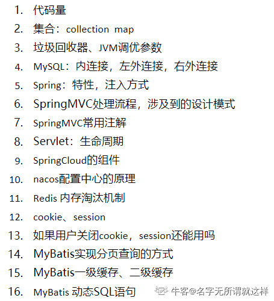

# 技术

Java八大基本类型及相应大小

List的实现类(Arr….)和底层，Arraylist线程安全吗

concurrentHashmap的实现，怎么保证线程安全

redis在项目里怎么用的

redis瓶颈遇到过吗？怎么解决

讲讲Spring

谈谈Spring的IOC和AOP，他们分别用了JVM的什么原理

SpringMVC了解吗？讲一讲

对前端知识有了解吗，知道哪些前端框架

SQL语句：left join ,r……,join的区别

用过哪些数据库，使用过数据库调优吗

Linux的调优用过吗，怎么查询文件名包含arr的文件

接口和抽象类的区别

wait和sleep的区别

重载和重写区别

设计模式，讲讲工厂

hashmap和hashtable区别

数据库索引原理

jvm什么时候触发gc，如何减少fullgc次数

线程池有哪几种，怎么用？

抽象类和接口； 

static关键字； 

重写与重载区别； 

反射机制； 

几种线程创建方式； 

线程池用法好处； 

wait和sleep用法异同； 

java中char能存放汉字吗； 

数据库怎么删除整个表，delete和truncate用法区别； 

数据库中索引作用； 

where和having用法区别； 

find和grep用法区别；cal;

JVM有哪些算法，优缺点？（jvm，balabala扯了好久）

项目对于高并发的情况是如何保证的？

接口和抽象类的区别； 

http长连接和短链接； 

HashMap和hashtable的区别； 

HashMap在多线程怎么实现线程安全； 

手写http三次握手； 

算法题：字符串里统计数字和字母的个数 

了解简历上的论文和科研项目；

1、说一说设计模式的六大原则 

  2、数组和[链表]()的区别，[链表]()删除某个元素的时间复杂度 

  3、听说过TCC吗 

  4、分布式之间如何保证最终一致性，除了用rabbitmq 

  5、了解easy-rule规则引擎的底层实现吗 

  6、easy-rule这个框架是如何识别规则的 

  7、如果规则太多，影响到性能你会怎么处理？ 

  8、如何判断一个[链表]()是否有环，写一个[链表]()的数据结构 

  9、说说对spring boot的理解

四种访问修饰符的区别 

 抽象类和接口的区别 

 线程和进程 

 线程安全的理解和实现 

 线程间通信 

 学过计算机组成原理吗？ 

 七层网络模型 

 http,tcp,ip协议分别属于哪一层 

 对jvm的理解，分为几部分，分别有什么用 

 String  StringBuilder  StringBuffer的区别 

 HashMap、Hashtable和ConcurrentHashMap底层实现原理和线程安全问题 

 访问[百度]()和访问一个普通IP地址的区别（dns协议） 

 [链表]()和数组的区别，分别在哪些情况使用 

 代码量 

 除了实习以外的项目情况 

 做过数据库优化吗？

一、java 

  1、NIO和BIO 

  2、线程、线程死锁的条件 

  3、抽象类和接口 

  等等忘了哈 

  二、数据库 

  sql和nosql讲讲 

  三、网络 

  1、tcp和udp 

  2、路由器在哪一层 

  3、tcp/ip分层 

  4、ping的底层协议 

  5、telnet的默认端口号 

  四、操作系统 

  1、线程和进程 

  2、进程的状态 

  3、进程的通信 

  其他忘了 

  
 

  9.22综合面试 

  1、自我介绍 

  2、工作地点 

  3、平时作息 

  4、参加的社团活动 

  5、英文自我介绍 

  6、加班的容忍度 

  7、有没有女朋友 

  8、期望薪资

本人双非菜鸟硕士，写面经也是为了还愿嘛。由于我是后转的java，所以一直忙着项目和实习，复习基础，没怎么刷题。投的都是非互联网企业居多。
中兴
15~20min
中兴同学都说随便聊聊经历，项目也不问技术栈。我可能运气好，碰到的面试官负责，没问项目都是基础把。
接口和抽象类区别（常问的，但自己说还是磕巴）
代理模式了解吗（我只会单例模式啊，但我说了aop里用到了）
jvm垃圾回收（我还说了说垃圾回收器都有哪些，强行抢答为自己加分。。）
反射了解吗（说的不太清，只说了调用方法Class.forName和jdbc里用到了反射）
说快速排序思路（说的磕磕巴巴的，第一次面试太紧张了）
判断链表有环（还好我做了offer，set集合或者用双指针）
接着问为啥快指针每次走两步？（不会，据说是数学问题）

美的
25min左右
主要是问项目经历，做了哪些，运气比较好，基础就问了个springmvc流程。
面试官很和蔼，终于体会到了聊天的感觉。。

# 非技术

代码量

英文自我介绍，

英文提问问题， 

有没有好朋友 

优缺点， 

和队员合作时的困难， 

做项目中的困难， 

如果项目中领导给的或比另一个队友多，无法完成怎么办， 

意向工作地，期望岗位， 

为什么来[中兴]()， 

家人对工作有什么看法， 

三五年内职业规划是啥

有什么想问的，家住哪，有对象吗

# 总结

考理解比较多

还考英语？

问意向

# 提炼

java经典

进程间的通信

ssm经典知识点理解

JVM组成

GC

springcloud组件

redis缓存淘汰机制

数据库 两张表联合

Linux的经典使用

设计模式基础和几个常见设计模式

