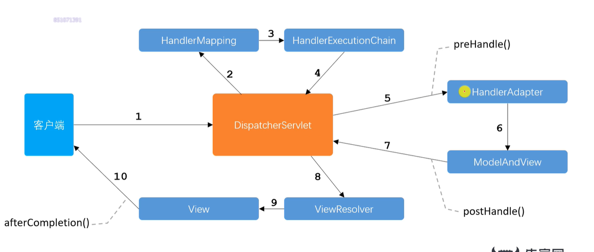

# MySQL

## 存储引擎

## 事务

A

C

I

D

## 锁

## 索引

# Redis

数据类型、过期策略、淘汰机制、缓存穿透、缓存击穿、缓存雪崩、分布式锁

# Spring

IOC

AOP

## MVC

1 servlet

2 解析请求，找到controller

3 封装拦截器

4 找到controller

preHandler

5 视图名称或视图对象

6 进行业务寻址的，就是设置对应的要请求的静态文件

7 找视图解析器

postHandler

8 视图解析器进行查找

9 模板引擎

afterCompletion

10 返回客户端

preHandler
调用时间：Controller方法处理之前
执行顺序：链式Intercepter情况下，Intercepter按照声明的顺序一个接一个执行
若返回false，则中断执行，注意：不会进入afterCompletion

postHandler
调用前提：preHandle返回true
调用时间：Controller方法处理完之后，DispatcherServlet进行视图的渲染之前，也就是说在这个方法中你可以对ModelAndView进行操作
执行顺序：链式Intercepter情况下，Intercepter按照声明的顺序倒着执行。

afterCompletion
调用前提：preHandle返回true
调用时间：DispatcherServlet进行视图的渲染之后
多用于清理资源