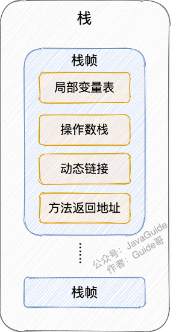
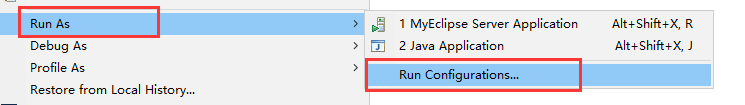
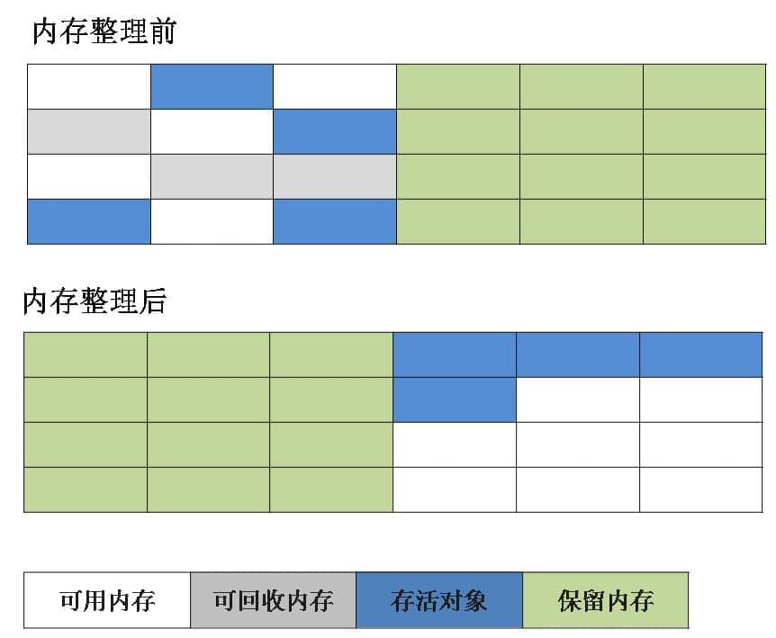
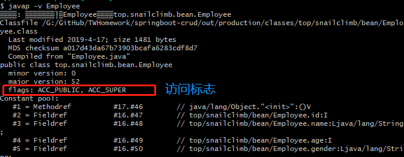
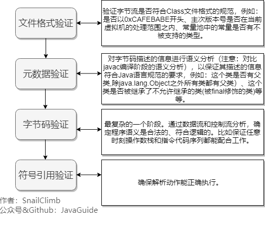
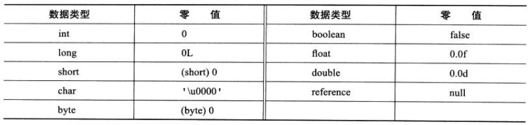

# JVM

# 内存区域

> 如果没有特殊说明，都是针对的是 HotSpot 虚拟机。
>
> 本文基于《深入理解 Java 虚拟机：JVM 高级特性与最佳实践》进行总结补充。
>
> 常见面试题 ：
>
> - 介绍下 Java 内存区域（运行时数据区）
> - Java 对象的创建过程（五步，建议能默写出来并且要知道每一步虚拟机做了什么）
> - 对象的访问定位的两种方式（句柄和直接指针两种方式）

## 前言

对于 Java 程序员来说，在虚拟机自动内存管理机制下，不再需要像 C/C++程序开发程序员这样为每一个 new 操作去写对应的 delete/free 操作，不容易出现内存泄漏和内存溢出问题。正是因为 Java 程序员把内存控制权利交给 Java 虚拟机，一旦出现内存泄漏和溢出方面的问题，如果不了解虚拟机是怎样使用内存的，那么排查错误将会是一个非常艰巨的任务。

## 运行时数据区域

Java 虚拟机在执行 Java 程序的过程中会把它管理的内存划分成若干个不同的数据区域。JDK 1.8 和之前的版本略有不同，下面会介绍到。

**JDK 1.8 之前** ：


**JDK 1.8** ：


**线程私有的：**

- 程序计数器
- 虚拟机栈
- 本地方法栈

**线程共享的：**

- 堆
- 方法区
- 直接内存 (非运行时数据区的一部分)

Java 虚拟机规范对于运行时数据区域的规定是相当宽松的。以堆为例：堆可以是连续空间，也可以不连续。堆的大小可以固定，也可以在运行时按需扩展 。虚拟机实现者可以使用任何垃圾回收算法管理堆，甚至完全不进行垃圾收集也是可以的。

### 程序计数器

程序计数器是一块较小的内存空间，可以看作是当前线程所执行的字节码的行号指示器。字节码解释器工作时通过改变这个计数器的值来选取下一条需要执行的字节码指令，分支、循环、跳转、异常处理、线程恢复等功能都需要依赖这个计数器来完成。

另外，为了线程切换后能恢复到正确的执行位置，每条线程都需要有一个独立的程序计数器，各线程之间计数器互不影响，独立存储，我们称这类内存区域为“线程私有”的内存。

从上面的介绍中我们知道了程序计数器主要有两个作用：

- 字节码解释器通过改变程序计数器来依次读取指令，从而实现代码的流程控制，如：顺序执行、选择、循环、异常处理。
- 在多线程的情况下，程序计数器用于记录当前线程执行的位置，从而当线程被切换回来的时候能够知道该线程上次运行到哪儿了。

⚠️ 注意 ：程序计数器是唯一一个不会出现 `OutOfMemoryError` 的内存区域，它的生命周期随着线程的创建而创建，随着线程的结束而死亡。

### Java 虚拟机栈

与程序计数器一样，Java 虚拟机栈（后文简称栈）也是线程私有的，它的生命周期和线程相同，随着线程的创建而创建，随着线程的死亡而死亡。

栈绝对算的上是 JVM 运行时数据区域的一个核心，除了一些 Native 方法调用是通过本地方法栈实现的(后面会提到)，其他所有的 Java 方法调用都是通过栈来实现的（也需要和其他运行时数据区域比如程序计数器配合）。

方法调用的数据需要通过栈进行传递，每一次方法调用都会有一个对应的栈帧被压入栈中，每一个方法调用结束后，都会有一个栈帧被弹出。

栈由一个个栈帧组成，而每个栈帧中都拥有：局部变量表、操作数栈、动态链接、方法返回地址。和数据结构上的栈类似，两者都是先进后出的数据结构，只支持出栈和入栈两种操作。



**局部变量表** 主要存放了编译期可知的各种数据类型（boolean、byte、char、short、int、float、long、double）、对象引用（reference 类型，它不同于对象本身，可能是一个指向对象起始地址的引用指针，也可能是指向一个代表对象的句柄或其他与此对象相关的位置）。

**操作数栈** 主要作为方法调用的中转站使用，用于存放方法执行过程中产生的中间计算结果。另外，计算过程中产生的临时变量也会放在操作数栈中。

**动态链接** 主要服务一个方法需要调用其他方法的场景。在 Java 源文件被编译成字节码文件时，所有的变量和方法引用都作为符号引用（Symbilic Reference）保存在 Class 文件的常量池里。当一个方法要调用其他方法，需要将常量池中指向方法的符号引用转化为其在内存地址中的直接引用。动态链接的作用就是为了将符号引用转换为调用方法的直接引用。


栈空间虽然不是无限的，但一般正常调用的情况下是不会出现问题的。不过，如果函数调用陷入无限循环的话，就会导致栈中被压入太多栈帧而占用太多空间，导致栈空间过深。那么当线程请求栈的深度超过当前 Java 虚拟机栈的最大深度的时候，就抛出 `StackOverFlowError` 错误。

Java 方法有两种返回方式，一种是 return 语句正常返回，一种是抛出异常。不管哪种返回方式，都会导致栈帧被弹出。也就是说， **栈帧随着方法调用而创建，随着方法结束而销毁。无论方法正常完成还是异常完成都算作方法结束。**

除了 `StackOverFlowError` 错误之外，栈还可能会出现`OutOfMemoryError`错误，这是因为如果栈的内存大小可以动态扩展， 如果虚拟机在动态扩展栈时无法申请到足够的内存空间，则抛出`OutOfMemoryError`异常。

简单总结一下程序运行中栈可能会出现两种错误：

- **`StackOverFlowError`：** 若栈的内存大小不允许动态扩展，那么当线程请求栈的深度超过当前 Java 虚拟机栈的最大深度的时候，就抛出 `StackOverFlowError` 错误。
- **`OutOfMemoryError`：** 如果栈的内存大小可以动态扩展， 如果虚拟机在动态扩展栈时无法申请到足够的内存空间，则抛出`OutOfMemoryError`异常。


### 本地方法栈

和虚拟机栈所发挥的作用非常相似，区别是： **虚拟机栈为虚拟机执行 Java 方法 （也就是字节码）服务，而本地方法栈则为虚拟机使用到的 Native 方法服务。** 在 HotSpot 虚拟机中和 Java 虚拟机栈合二为一。

本地方法被执行的时候，在本地方法栈也会创建一个栈帧，用于存放该本地方法的局部变量表、操作数栈、动态链接、出口信息。

方法执行完毕后相应的栈帧也会出栈并释放内存空间，也会出现 `StackOverFlowError` 和 `OutOfMemoryError` 两种错误。

### 堆

Java 虚拟机所管理的内存中最大的一块，Java 堆是所有线程共享的一块内存区域，在虚拟机启动时创建。**此内存区域的唯一目的就是存放对象实例，几乎所有的对象实例以及数组都在这里分配内存。**

Java 世界中“几乎”所有的对象都在堆中分配，但是，随着 JIT 编译器的发展与逃逸分析技术逐渐成熟，栈上分配、标量替换优化技术将会导致一些微妙的变化，所有的对象都分配到堆上也渐渐变得不那么“绝对”了。从 JDK 1.7 开始已经默认开启逃逸分析，如果某些方法中的对象引用没有被返回或者未被外面使用（也就是未逃逸出去），那么对象可以直接在栈上分配内存。

Java 堆是垃圾收集器管理的主要区域，因此也被称作 **GC 堆（Garbage Collected Heap）**。从垃圾回收的角度，由于现在收集器基本都采用分代垃圾收集算法，所以 Java 堆还可以细分为：新生代和老年代；再细致一点有：Eden、Survivor、Old 等空间。进一步划分的目的是更好地回收内存，或者更快地分配内存。

在 JDK 7 版本及 JDK 7 版本之前，堆内存被通常分为下面三部分：

1. 新生代内存(Young Generation)
2. 老生代(Old Generation)
3. 永久代(Permanent Generation)

下图所示的 Eden 区、两个 Survivor 区 S0 和 S1 都属于新生代，中间一层属于老年代，最下面一层属于永久代。


**JDK 8 版本之后 PermGen(永久) 已被 Metaspace(元空间) 取代，元空间使用的是直接内存** （我会在方法区这部分内容详细介绍到）。

大部分情况，对象都会首先在 Eden 区域分配，在一次新生代垃圾回收后，如果对象还存活，则会进入 S0 或者 S1，并且对象的年龄还会加 1(Eden 区->Survivor 区后对象的初始年龄变为 1)，当它的年龄增加到一定程度（默认为 15 岁），就会被晋升到老年代中。对象晋升到老年代的年龄阈值，可以通过参数 `-XX:MaxTenuringThreshold` 来设置。

> **🐛 修正（参见：[issue552](https://github.com/Snailclimb/JavaGuide/issues/552)）** ：“Hotspot 遍历所有对象时，按照年龄从小到大对其所占用的大小进行累积，当累积的某个年龄大小超过了 survivor 区的一半时，取这个年龄和 MaxTenuringThreshold 中更小的一个值，作为新的晋升年龄阈值”。
>
> **动态年龄计算的代码如下**
>
> ```c++
> uint ageTable::compute_tenuring_threshold(size_t survivor_capacity) {
> 	//survivor_capacity是survivor空间的大小
> size_t desired_survivor_size = (size_t)((((double) survivor_capacity)*TargetSurvivorRatio)/100);
> size_t total = 0;
> uint age = 1;
> while (age < table_size) {
> total += sizes[age];//sizes数组是每个年龄段对象大小
> if (total > desired_survivor_size) break;
> age++;
> }
> uint result = age < MaxTenuringThreshold ? age : MaxTenuringThreshold;
> 	...
> }
> ```

堆这里最容易出现的就是 `OutOfMemoryError` 错误，并且出现这种错误之后的表现形式还会有几种，比如：

1. **`java.lang.OutOfMemoryError: GC Overhead Limit Exceeded`** ： 当 JVM 花太多时间执行垃圾回收并且只能回收很少的堆空间时，就会发生此错误。
2. **`java.lang.OutOfMemoryError: Java heap space`** :假如在创建新的对象时, 堆内存中的空间不足以存放新创建的对象, 就会引发此错误。(和配置的最大堆内存有关，且受制于物理内存大小。最大堆内存可通过`-Xmx`参数配置，若没有特别配置，将会使用默认值，详见：[Default Java 8 max heap size](https://stackoverflow.com/questions/28272923/default-xmxsize-in-java-8-max-heap-size))
3. ......

### 方法区

方法区属于是 JVM 运行时数据区域的一块逻辑区域，是各个线程共享的内存区域。

《Java 虚拟机规范》只是规定了有方法区这么个概念和它的作用，方法区到底要如何实现那就是虚拟机自己要考虑的事情了。也就是说，在不同的虚拟机实现上，方法区的实现是不同的。

当虚拟机要使用一个类时，它需要读取并解析 Class 文件获取相关信息，再将信息存入到方法区。方法区会存储已被虚拟机加载的 **类信息、字段信息、方法信息、常量、静态变量、即时编译器编译后的代码缓存等数据**。

**方法区和永久代以及元空间是什么关系呢？** 方法区和永久代以及元空间的关系很像 Java 中接口和类的关系，类实现了接口，这里的类就可以看作是永久代和元空间，接口可以看作是方法区，也就是说永久代以及元空间是 HotSpot 虚拟机对虚拟机规范中方法区的两种实现方式。并且，永久代是 JDK 1.8 之前的方法区实现，JDK 1.8 及以后方法区的实现变成了元空间。


**为什么要将永久代 (PermGen) 替换为元空间 (MetaSpace) 呢?**

下图来自《深入理解 Java 虚拟机》第 3 版 2.2.5


1、整个永久代有一个 JVM 本身设置的固定大小上限，无法进行调整，而元空间使用的是直接内存，受本机可用内存的限制，虽然元空间仍旧可能溢出，但是比原来出现的几率会更小。

> 当元空间溢出时会得到如下错误： `java.lang.OutOfMemoryError: MetaSpace`

你可以使用 `-XX：MaxMetaspaceSize` 标志设置最大元空间大小，默认值为 unlimited，这意味着它只受系统内存的限制。`-XX：MetaspaceSize` 调整标志定义元空间的初始大小如果未指定此标志，则 Metaspace 将根据运行时的应用程序需求动态地重新调整大小。

2、元空间里面存放的是类的元数据，这样加载多少类的元数据就不由 `MaxPermSize` 控制了, 而由系统的实际可用空间来控制，这样能加载的类就更多了。

3、在 JDK8，合并 HotSpot 和 JRockit 的代码时, JRockit 从来没有一个叫永久代的东西, 合并之后就没有必要额外的设置这么一个永久代的地方了。

**方法区常用参数有哪些？**

JDK 1.8 之前永久代还没被彻底移除的时候通常通过下面这些参数来调节方法区大小。

```java
-XX:PermSize=N //方法区 (永久代) 初始大小
-XX:MaxPermSize=N //方法区 (永久代) 最大大小,超过这个值将会抛出 OutOfMemoryError 异常:java.lang.OutOfMemoryError: PermGen
```

相对而言，垃圾收集行为在这个区域是比较少出现的，但并非数据进入方法区后就“永久存在”了。

JDK 1.8 的时候，方法区（HotSpot 的永久代）被彻底移除了（JDK1.7 就已经开始了），取而代之是元空间，元空间使用的是直接内存。下面是一些常用参数：

```java
-XX:MetaspaceSize=N //设置 Metaspace 的初始（和最小大小）
-XX:MaxMetaspaceSize=N //设置 Metaspace 的最大大小
```

与永久代很大的不同就是，如果不指定大小的话，随着更多类的创建，虚拟机会耗尽所有可用的系统内存。

### 运行时常量池

Class 文件中除了有类的版本、字段、方法、接口等描述信息外，还有用于存放编译期生成的各种字面量（Literal）和符号引用（Symbolic Reference）的 **常量池表(Constant Pool Table)** 。

字面量是源代码中的固定值的表示法，即通过字面我们就能知道其值的含义。字面量包括整数、浮点数和字符串字面量，符号引用包括类符号引用、字段符号引用、方法符号引用和接口方法符号引用。

常量池表会在类加载后存放到方法区的运行时常量池中。

运行时常量池的功能类似于传统编程语言的符号表，尽管它包含了比典型符号表更广泛的数据。

既然运行时常量池是方法区的一部分，自然受到方法区内存的限制，当常量池无法再申请到内存时会抛出 `OutOfMemoryError` 错误。

### 字符串常量池

**字符串常量池** 是 JVM 为了提升性能和减少内存消耗针对字符串（String 类）专门开辟的一块区域，主要目的是为了避免字符串的重复创建。

```java
// 在堆中创建字符串对象”ab“
// 将字符串对象”ab“的引用保存在字符串常量池中
String aa = "ab";
// 直接返回字符串常量池中字符串对象”ab“的引用
String bb = "ab";
System.out.println(aa==bb);// true
```

HotSpot 虚拟机中字符串常量池的实现是 `src/hotspot/share/classfile/stringTable.cpp` ,`StringTable` 本质上就是一个`HashSet<String>` ,容量为 `StringTableSize`（可以通过 `-XX:StringTableSize` 参数来设置）。

**`StringTable` 中保存的是字符串对象的引用，字符串对象的引用指向堆中的字符串对象。**

JDK1.7 之前，字符串常量池存放在永久代。JDK1.7 字符串常量池和静态变量从永久代移动了 Java 堆中。


**JDK 1.7 为什么要将字符串常量池移动到堆中？**

主要是因为永久代（方法区实现）的 GC 回收效率太低，只有在整堆收集 (Full GC)的时候才会被执行 GC。Java 程序中通常会有大量的被创建的字符串等待回收，将字符串常量池放到堆中，能够更高效及时地回收字符串内存。

相关问题：[JVM 常量池中存储的是对象还是引用呢？ - RednaxelaFX - 知乎](https://www.zhihu.com/question/57109429/answer/151717241)

最后再来分享一段周志明老师在[《深入理解 Java 虚拟机（第 3 版）》样例代码&勘误](https://github.com/fenixsoft/jvm_book) Github 仓库的 [issue#112](https://github.com/fenixsoft/jvm_book/issues/112) 中说过的话：

> **运行时常量池、方法区、字符串常量池这些都是不随虚拟机实现而改变的逻辑概念，是公共且抽象的，Metaspace、Heap 是与具体某种虚拟机实现相关的物理概念，是私有且具体的。**

### 直接内存

直接内存并不是虚拟机运行时数据区的一部分，也不是虚拟机规范中定义的内存区域，但是这部分内存也被频繁地使用。而且也可能导致 OutOfMemoryError 错误出现。

JDK1.4 中新加入的 **NIO(New Input/Output) 类**，引入了一种基于**通道（Channel）**与**缓存区（Buffer）**的 I/O 方式，它可以直接使用 Native 函数库直接分配堆外内存，然后通过一个存储在 Java 堆中的 DirectByteBuffer 对象作为这块内存的引用进行操作。这样就能在一些场景中显著提高性能，因为**避免了在 Java 堆和 Native 堆之间来回复制数据**。

本机直接内存的分配不会受到 Java 堆的限制，但是，既然是内存就会受到本机总内存大小以及处理器寻址空间的限制。

## HotSpot 虚拟机对象探秘

通过上面的介绍我们大概知道了虚拟机的内存情况，下面我们来详细的了解一下 HotSpot 虚拟机在 Java 堆中对象分配、布局和访问的全过程。

### 对象的创建

Java 对象的创建过程我建议最好是能默写出来，并且要掌握每一步在做什么。

#### Step1:类加载检查

虚拟机遇到一条 new 指令时，首先将去检查这个指令的参数是否能在常量池中定位到这个类的符号引用，并且检查这个符号引用代表的类是否已被加载过、解析和初始化过。如果没有，那必须先执行相应的类加载过程。

#### Step2:分配内存

在**类加载检查**通过后，接下来虚拟机将为新生对象**分配内存**。对象所需的内存大小在类加载完成后便可确定，为对象分配空间的任务等同于把一块确定大小的内存从 Java 堆中划分出来。**分配方式**有 **“指针碰撞”** 和 **“空闲列表”** 两种，**选择哪种分配方式由 Java 堆是否规整决定，而 Java 堆是否规整又由所采用的垃圾收集器是否带有压缩整理功能决定**。

**内存分配的两种方式** （补充内容，需要掌握）：

- 指针碰撞 ：
  - 适用场合 ：堆内存规整（即没有内存碎片）的情况下。
  - 原理 ：用过的内存全部整合到一边，没有用过的内存放在另一边，中间有一个分界指针，只需要向着没用过的内存方向将该指针移动对象内存大小位置即可。
  - 使用该分配方式的 GC 收集器：Serial, ParNew
- 空闲列表 ：
  - 适用场合 ： 堆内存不规整的情况下。
  - 原理 ：虚拟机会维护一个列表，该列表中会记录哪些内存块是可用的，在分配的时候，找一块儿足够大的内存块儿来划分给对象实例，最后更新列表记录。
  - 使用该分配方式的 GC 收集器：CMS

选择以上两种方式中的哪一种，取决于 Java 堆内存是否规整。而 Java 堆内存是否规整，取决于 GC 收集器的算法是"标记-清除"，还是"标记-整理"（也称作"标记-压缩"），值得注意的是，复制算法内存也是规整的。

**内存分配并发问题（补充内容，需要掌握）**

在创建对象的时候有一个很重要的问题，就是线程安全，因为在实际开发过程中，创建对象是很频繁的事情，作为虚拟机来说，必须要保证线程是安全的，通常来讲，虚拟机采用两种方式来保证线程安全：

- **CAS+失败重试：** CAS 是乐观锁的一种实现方式。所谓乐观锁就是，每次不加锁而是假设没有冲突而去完成某项操作，如果因为冲突失败就重试，直到成功为止。**虚拟机采用 CAS 配上失败重试的方式保证更新操作的原子性。**
- **TLAB：** 为每一个线程预先在 Eden 区分配一块儿内存，JVM 在给线程中的对象分配内存时，首先在 TLAB 分配，当对象大于 TLAB 中的剩余内存或 TLAB 的内存已用尽时，再采用上述的 CAS 进行内存分配

#### Step3:初始化零值

内存分配完成后，虚拟机需要将分配到的内存空间都初始化为零值（不包括对象头），这一步操作保证了对象的实例字段在 Java 代码中可以不赋初始值就直接使用，程序能访问到这些字段的数据类型所对应的零值。

#### Step4:设置对象头

初始化零值完成之后，**虚拟机要对对象进行必要的设置**，例如这个对象是哪个类的实例、如何才能找到类的元数据信息、对象的哈希码、对象的 GC 分代年龄等信息。 **这些信息存放在对象头中。** 另外，根据虚拟机当前运行状态的不同，如是否启用偏向锁等，对象头会有不同的设置方式。

#### Step5:执行 init 方法

在上面工作都完成之后，从虚拟机的视角来看，一个新的对象已经产生了，但从 Java 程序的视角来看，对象创建才刚开始，`<init>` 方法还没有执行，所有的字段都还为零。所以一般来说，执行 new 指令之后会接着执行 `<init>` 方法，把对象按照程序员的意愿进行初始化，这样一个真正可用的对象才算完全产生出来。

### 对象的内存布局

在 Hotspot 虚拟机中，对象在内存中的布局可以分为 3 块区域：**对象头**、**实例数据**和**对齐填充**。

**Hotspot 虚拟机的对象头包括两部分信息**，**第一部分用于存储对象自身的运行时数据**（哈希码、GC 分代年龄、锁状态标志等等），**另一部分是类型指针**，即对象指向它的类元数据的指针，虚拟机通过这个指针来确定这个对象是哪个类的实例。

**实例数据部分是对象真正存储的有效信息**，也是在程序中所定义的各种类型的字段内容。

**对齐填充部分不是必然存在的，也没有什么特别的含义，仅仅起占位作用。** 因为 Hotspot 虚拟机的自动内存管理系统要求对象起始地址必须是 8 字节的整数倍，换句话说就是对象的大小必须是 8 字节的整数倍。而对象头部分正好是 8 字节的倍数（1 倍或 2 倍），因此，当对象实例数据部分没有对齐时，就需要通过对齐填充来补全。

### 对象的访问定位

建立对象就是为了使用对象，我们的 Java 程序通过栈上的 reference 数据来操作堆上的具体对象。对象的访问方式由虚拟机实现而定，目前主流的访问方式有：**使用句柄**、**直接指针**。

#### 句柄

如果使用句柄的话，那么 Java 堆中将会划分出一块内存来作为句柄池，reference 中存储的就是对象的句柄地址，而句柄中包含了对象实例数据与类型数据各自的具体地址信息。


#### 直接指针

如果使用直接指针访问，那么 Java 堆对象的布局中就必须考虑如何放置访问类型数据的相关信息，而 reference 中存储的直接就是对象的地址。


这两种对象访问方式各有优势。使用句柄来访问的最大好处是 reference 中存储的是稳定的句柄地址，在对象被移动时只会改变句柄中的实例数据指针，而 reference 本身不需要修改。使用直接指针访问方式最大的好处就是速度快，它节省了一次指针定位的时间开销。

## 参考

- 《深入理解 Java 虚拟机：JVM 高级特性与最佳实践（第二版》
- 《自己动手写 Java 虚拟机》
- Chapter 2. The Structure of the Java Virtual Machine：https://docs.oracle.com/javase/specs/jvms/se8/html/jvms-2.html
- JVM 栈帧内部结构-动态链接：https://chenxitag.com/archives/368
- Java 中 new String("字面量") 中 "字面量" 是何时进入字符串常量池的? - 木女孩的回答 - 知乎： https://www.zhihu.com/question/55994121/answer/147296098
- JVM 常量池中存储的是对象还是引用呢？ - RednaxelaFX 的回答 - 知乎： https://www.zhihu.com/question/57109429/answer/151717241
- <http://www.pointsoftware.ch/en/under-the-hood-runtime-data-areas-javas-memory-model/>
- <https://dzone.com/articles/jvm-permgen-%E2%80%93-where-art-thou>
- <https://stackoverflow.com/questions/9095748/method-area-and-permgen>


# 垃圾回收机制

问题答案在文中都有提到

+ 如何判断对象是否死亡（两种方法）。
+ 简单的介绍一下强引用、软引用、弱引用、虚引用（虚引用与软引用和弱引用的区别、使用软引用能带来的好处）。
+ 如何判断一个常量是废弃常量
+ 如何判断一个类是无用的类
+ 垃圾收集有哪些算法，各自的特点？
+ HotSpot 为什么要分为新生代和老年代？
+ 常见的垃圾回收器有哪些？
+ 介绍一下 CMS,G1 收集器。
+ Minor Gc 和 Full GC 有什么不同呢？

### 本文导火索


当需要排查各种内存溢出问题、当垃圾收集成为系统达到更高并发的瓶颈时，我们就需要对这些“自动化”的技术实施必要的监控和调节。

## 1 揭开 JVM 内存分配与回收的神秘面纱

Java 的自动内存管理主要是针对对象内存的回收和对象内存的分配。同时，Java 自动内存管理最核心的功能是 **堆** 内存中对象的分配与回收。

Java 堆是垃圾收集器管理的主要区域，因此也被称作**GC 堆（Garbage Collected Heap）**.从垃圾回收的角度，由于现在收集器基本都采用分代垃圾收集算法，所以 Java 堆还可以细分为：新生代和老年代：再细致一点有：Eden 空间、From Survivor、To Survivor 空间等。**进一步划分的目的是更好地回收内存，或者更快地分配内存。**

**堆空间的基本结构：**


上图所示的 Eden 区、From Survivor0("From") 区、To Survivor1("To") 区都属于新生代，Old Memory 区属于老年代。

大部分情况，对象都会首先在 Eden 区域分配，在一次新生代垃圾回收后，如果对象还存活，则会进入 s0 或者 s1，并且对象的年龄还会加 1(Eden 区->Survivor 区后对象的初始年龄变为 1)，当它的年龄增加到一定程度（默认为大于 15 岁），就会被晋升到老年代中。对象晋升到老年代的年龄阈值，可以通过参数 `-XX:MaxTenuringThreshold` 来设置默认值，这个值会在虚拟机运行过程中进行调整，可以通过`-XX:+PrintTenuringDistribution`来打印出当次 GC 后的 Threshold。

> **🐛 修正（参见：[issue552](https://gitee.com/link?target=https%3A%2F%2Fgithub.com%2FSnailclimb%2FJavaGuide%2Fissues%2F552)）**：“Hotspot 遍历所有对象时，按照年龄从小到大对其所占用的大小进行累积，当累积的某个年龄大小超过了 survivor 区的一半时，取这个年龄和 MaxTenuringThreshold 中更小的一个值，作为新的晋升年龄阈值”。
>
> **动态年龄计算的代码如下**
>
> ```
> uint ageTable::compute_tenuring_threshold(size_t survivor_capacity) {
> //survivor_capacity是survivor空间的大小
> size_t desired_survivor_size = (size_t)((((double)survivor_capacity)*TargetSurvivorRatio)/100);
> size_t total = 0;
> uint age = 1;
> while (age < table_size) {
>   //sizes数组是每个年龄段对象大小
>   total += sizes[age];
>   if (total > desired_survivor_size) {
>       break;
>   }
>   age++;
> }
> uint result = age < MaxTenuringThreshold ? age : MaxTenuringThreshold;
> ...
> }
> ```

经过这次 GC 后，Eden 区和"From"区已经被清空。这个时候，"From"和"To"会交换他们的角色，也就是新的"To"就是上次 GC 前的“From”，新的"From"就是上次 GC 前的"To"。不管怎样，都会保证名为 To 的 Survivor 区域是空的。Minor GC 会一直重复这样的过程，在这个过程中，有可能当次 Minor GC 后，Survivor 的"From"区域空间不够用，有一些还达不到进入老年代条件的实例放不下，则放不下的部分会提前进入老年代。

接下来我们提供一个调试脚本来测试这个过程。

**调试代码参数如下**

```
-verbose:gc
-Xmx200M
-Xms200M
-Xmn50M
-XX:+PrintGCDetails
-XX:TargetSurvivorRatio=60
-XX:+PrintTenuringDistribution
-XX:+PrintGCDateStamps
-XX:MaxTenuringThreshold=3
-XX:+UseConcMarkSweepGC
-XX:+UseParNewGC
```

**示例代码如下：**

```java
/*
* 本实例用于java GC以后，新生代survivor区域的变化，以及晋升到老年代的时间和方式的测试代码。需要自行分步注释不需要的代码进行反复测试对比
*
* 由于java的main函数以及其他基础服务也会占用一些eden空间，所以要提前空跑一次main函数，来看看这部分占用。
*
* 自定义的代码中，我们使用堆内分配数组和栈内分配数组的方式来分别模拟不可被GC的和可被GC的资源。
*
*
* */

public class JavaGcTest {

    public static void main(String[] args) throws InterruptedException {
        //空跑一次main函数来查看java服务本身占用的空间大小，我这里是占用了3M。所以40-3=37，下面分配三个1M的数组和一个34M的垃圾数组。


        // 为了达到TargetSurvivorRatio（期望占用的Survivor区域的大小）这个比例指定的值, 即5M*60%=3M(Desired survivor size)，
        // 这里用1M的数组的分配来达到Desired survivor size
        //说明: 5M为S区的From或To的大小，60%为TargetSurvivorRatio参数指定,可以更改参数获取不同的效果。
        byte[] byte1m_1 = new byte[1 * 1024 * 1024];
        byte[] byte1m_2 = new byte[1 * 1024 * 1024];
        byte[] byte1m_3 = new byte[1 * 1024 * 1024];

        //使用函数方式来申请空间，函数运行完毕以后，就会变成垃圾等待回收。此时应保证eden的区域占用达到100%。可以通过调整传入值来达到效果。
        makeGarbage(34);

        //再次申请一个数组，因为eden已经满了，所以这里会触发Minor GC
        byte[] byteArr = new byte[10*1024*1024];
        // 这次Minor Gc时, 三个1M的数组因为尚有引用，所以进入From区域（因为是第一次GC）age为1
        // 且由于From区已经占用达到了60%(-XX:TargetSurvivorRatio=60), 所以会重新计算对象晋升的age。
        // 计算方法见上文，计算出age：min(age, MaxTenuringThreshold) = 1，输出中会有Desired survivor size 3145728 bytes, new threshold 1 (max 3)字样
        //新的数组byteArr进入eden区域。


        //再次触发垃圾回收，证明三个1M的数组会因为其第二次回收后age为2，大于上一次计算出的new threshold 1，所以进入老年代。
        //而byteArr因为超过survivor的单个区域，直接进入了老年代。
        makeGarbage(34);
    }
    private static void makeGarbage(int size){
        byte[] byteArrTemp = new byte[size * 1024 * 1024];
    }
}
```

注意:如下输出结果中老年代的信息为 `concurrent mark-sweep generation` 和以前版本略有不同。另外，还列出了某次 GC 后是否重新生成了 threshold，以及各个年龄占用空间的大小。

```
2021-07-01T10:41:32.257+0800: [GC (Allocation Failure) 2021-07-01T10:41:32.257+0800: [ParNew
Desired survivor size 3145728 bytes, new threshold 1 (max 3)
- age   1:    3739264 bytes,    3739264 total
: 40345K->3674K(46080K), 0.0014584 secs] 40345K->3674K(199680K), 0.0015063 secs] [Times: user=0.00 sys=0.00, real=0.00 secs]
2021-07-01T10:41:32.259+0800: [GC (Allocation Failure) 2021-07-01T10:41:32.259+0800: [ParNew
Desired survivor size 3145728 bytes, new threshold 3 (max 3)
: 13914K->0K(46080K), 0.0046596 secs] 13914K->13895K(199680K), 0.0046873 secs] [Times: user=0.00 sys=0.00, real=0.00 secs]
Heap
 par new generation   total 46080K, used 35225K [0x05000000, 0x08200000, 0x08200000)
  eden space 40960K,  86% used [0x05000000, 0x072667f0, 0x07800000)
  from space 5120K,   0% used [0x07800000, 0x07800000, 0x07d00000)
  to   space 5120K,   0% used [0x07d00000, 0x07d00000, 0x08200000)
 concurrent mark-sweep generation total 153600K, used 13895K [0x08200000, 0x11800000, 0x11800000)
 Metaspace       used 153K, capacity 2280K, committed 2368K, reserved 4480K
```

### 1.1 对象优先在 eden 区分配

目前主流的垃圾收集器都会采用分代回收算法，因此需要将堆内存分为新生代和老年代，这样我们就可以根据各个年代的特点选择合适的垃圾收集算法。

大多数情况下，对象在新生代中 eden 区分配。当 eden 区没有足够空间进行分配时，虚拟机将发起一次 Minor GC.下面我们来进行实际测试以下。

**测试：**

```
public class GCTest {
	public static void main(String[] args) {
		byte[] allocation1, allocation2;
		allocation1 = new byte[30900*1024];
		//allocation2 = new byte[900*1024];
	}
}
```

通过以下方式运行： 

添加的参数：`-XX:+PrintGCDetails` 

运行结果 (红色字体描述有误，应该是对应于 JDK1.7 的永久代)：


从上图我们可以看出 eden 区内存几乎已经被分配完全（即使程序什么也不做，新生代也会使用 2000 多 k 内存）。假如我们再为 allocation2 分配内存会出现什么情况呢？

```
allocation2 = new byte[900*1024];
```


**简单解释一下为什么会出现这种情况：** 因为给 allocation2 分配内存的时候 eden 区内存几乎已经被分配完了，我们刚刚讲了当 Eden 区没有足够空间进行分配时，虚拟机将发起一次 Minor GC.GC 期间虚拟机又发现 allocation1 无法存入 Survivor 空间，所以只好通过 **分配担保机制** 把新生代的对象提前转移到老年代中去，老年代上的空间足够存放 allocation1，所以不会出现 Full GC。执行 Minor GC 后，后面分配的对象如果能够存在 eden 区的话，还是会在 eden 区分配内存。可以执行如下代码验证：

```
public class GCTest {

	public static void main(String[] args) {
		byte[] allocation1, allocation2,allocation3,allocation4,allocation5;
		allocation1 = new byte[32000*1024];
		allocation2 = new byte[1000*1024];
		allocation3 = new byte[1000*1024];
		allocation4 = new byte[1000*1024];
		allocation5 = new byte[1000*1024];
	}
}
```

### 1.2 大对象直接进入老年代

大对象就是需要大量连续内存空间的对象（比如：字符串、数组）。

**为什么要这样呢？**

为了避免为大对象分配内存时由于分配担保机制带来的复制而降低效率。

### 1.3 长期存活的对象将进入老年代

既然虚拟机采用了分代收集的思想来管理内存，那么内存回收时就必须能识别哪些对象应放在新生代，哪些对象应放在老年代中。为了做到这一点，虚拟机给每个对象一个对象年龄（Age）计数器。

如果对象在 Eden 出生并经过第一次 Minor GC 后仍然能够存活，并且能被 Survivor 容纳的话，将被移动到 Survivor 空间中，并将对象年龄设为 1.对象在 Survivor 中每熬过一次 MinorGC,年龄就增加 1 岁，当它的年龄增加到一定程度（默认为 15 岁），就会被晋升到老年代中。对象晋升到老年代的年龄阈值，可以通过参数 `-XX:MaxTenuringThreshold` 来设置。

### 1.4 动态对象年龄判定

大部分情况，对象都会首先在 Eden 区域分配，在一次新生代垃圾回收后，如果对象还存活，则会进入 s0 或者 s1，并且对象的年龄还会加 1(Eden 区->Survivor 区后对象的初始年龄变为 1)，当它的年龄增加到一定程度（默认为 15 岁），就会被晋升到老年代中。对象晋升到老年代的年龄阈值，可以通过参数 `-XX:MaxTenuringThreshold` 来设置。

> 修正（[issue552](https://gitee.com/link?target=https%3A%2F%2Fgithub.com%2FSnailclimb%2FJavaGuide%2Fissues%2F552)）：“Hotspot 遍历所有对象时，按照年龄从小到大对其所占用的大小进行累积，当累积的某个年龄大小超过了 survivor 区的 50% 时（默认值是 50%，可以通过 `-XX:TargetSurvivorRatio=percent` 来设置，参见 [issue1199](https://gitee.com/link?target=https%3A%2F%2Fgithub.com%2FSnailclimb%2FJavaGuide%2Fissues%2F1199) ），取这个年龄和 MaxTenuringThreshold 中更小的一个值，作为新的晋升年龄阈值”。
>
> jdk8 官方文档引用 ：[https://docs.oracle.com/javase/8/docs/technotes/tools/unix/java.html](https://gitee.com/link?target=https%3A%2F%2Fdocs.oracle.com%2Fjavase%2F8%2Fdocs%2Ftechnotes%2Ftools%2Funix%2Fjava.html) 。
>
> 
>
> **动态年龄计算的代码如下：**
>
> ```
> uint ageTable::compute_tenuring_threshold(size_t survivor_capacity) {
> //survivor_capacity是survivor空间的大小
> size_t desired_survivor_size = (size_t)((((double)survivor_capacity)*TargetSurvivorRatio)/100);
> size_t total = 0;
> uint age = 1;
> while (age < table_size) {
> //sizes数组是每个年龄段对象大小
> total += sizes[age];
> if (total > desired_survivor_size) {
>    break;
> }
> age++;
> }
> uint result = age < MaxTenuringThreshold ? age : MaxTenuringThreshold;
> ...
> }
> ```
>
> 额外补充说明([issue672](https://gitee.com/link?target=https%3A%2F%2Fgithub.com%2FSnailclimb%2FJavaGuide%2Fissues%2F672))：**关于默认的晋升年龄是 15，这个说法的来源大部分都是《深入理解 Java 虚拟机》这本书。** 如果你去 Oracle 的官网阅读[相关的虚拟机参数](https://gitee.com/link?target=https%3A%2F%2Fdocs.oracle.com%2Fjavase%2F8%2Fdocs%2Ftechnotes%2Ftools%2Funix%2Fjava.html)，你会发现`-XX:MaxTenuringThreshold=threshold`这里有个说明
>
> **Sets the maximum tenuring threshold for use in adaptive GC sizing. The largest value is 15. The default value is 15 for the parallel (throughput) collector, and 6 for the CMS collector.默认晋升年龄并不都是 15，这个是要区分垃圾收集器的，CMS 就是 6.**

### 1.5 主要进行 gc 的区域

周志明先生在《深入理解 Java 虚拟机》第二版中 P92 如是写道：

> ~~*“老年代 GC（Major GC/Full GC），指发生在老年代的 GC……”*~~

上面的说法已经在《深入理解 Java 虚拟机》第三版中被改正过来了。感谢 R 大的回答：


**总结：**

针对 HotSpot VM 的实现，它里面的 GC 其实准确分类只有两大种：

部分收集 (Partial GC)：

+ 新生代收集（Minor GC / Young GC）：只对新生代进行垃圾收集；
+ 老年代收集（Major GC / Old GC）：只对老年代进行垃圾收集。需要注意的是 Major GC 在有的语境中也用于指代整堆收集；
+ 混合收集（Mixed GC）：对整个新生代和部分老年代进行垃圾收集。

整堆收集 (Full GC)：收集整个 Java 堆和方法区。

### 1.6 空间分配担保

空间分配担保是为了确保在 Minor GC 之前老年代本身还有容纳新生代所有对象的剩余空间。

《深入理解 Java 虚拟机》第三章对于空间分配担保的描述如下：

> JDK 6 Update 24 之前，在发生 Minor GC 之前，虚拟机必须先检查老年代最大可用的连续空间是否大于新生代所有对象总空间，如果这个条件成立，那这一次 Minor GC 可以确保是安全的。如果不成立，则虚拟机会先查看 `-XX:HandlePromotionFailure` 参数的设置值是否允许担保失败(Handle Promotion Failure);如果允许，那会继续检查老年代最大可用的连续空间是否大于历次晋升到老年代对象的平均大小，如果大于，将尝试进行一次 Minor GC，尽管这次 Minor GC 是有风险的;如果小于，或者 `-XX: HandlePromotionFailure` 设置不允许冒险，那这时就要改为进行一次 Full GC。
>
> JDK 6 Update 24 之后的规则变为只要老年代的连续空间大于新生代对象总大小或者历次晋升的平均大小，就会进行 Minor GC，否则将进行 Full GC。

## 2 对象已经死亡？

堆中几乎放着所有的对象实例，对堆垃圾回收前的第一步就是要判断哪些对象已经死亡（即不能再被任何途径使用的对象）。

### 2.1 引用计数法

给对象中添加一个引用计数器，每当有一个地方引用它，计数器就加 1；当引用失效，计数器就减 1；任何时候计数器为 0 的对象就是不可能再被使用的。

**这个方法实现简单，效率高，但是目前主流的虚拟机中并没有选择这个算法来管理内存，其最主要的原因是它很难解决对象之间相互循环引用的问题。** 所谓对象之间的相互引用问题，如下面代码所示：除了对象 objA 和 objB 相互引用着对方之外，这两个对象之间再无任何引用。但是他们因为互相引用对方，导致它们的引用计数器都不为 0，于是引用计数算法无法通知 GC 回收器回收他们。

```
public class ReferenceCountingGc {
    Object instance = null;
	public static void main(String[] args) {
		ReferenceCountingGc objA = new ReferenceCountingGc();
		ReferenceCountingGc objB = new ReferenceCountingGc();
		objA.instance = objB;
		objB.instance = objA;
		objA = null;
		objB = null;

	}
}
```

### 2.2 可达性分析算法

这个算法的基本思想就是通过一系列的称为 **“GC Roots”** 的对象作为起点，从这些节点开始向下搜索，节点所走过的路径称为引用链，当一个对象到 GC Roots 没有任何引用链相连的话，则证明此对象是不可用的，需要被回收。

下图中的 `Object 6 ~ Object 10` 之间虽有引用关系，但它们到 GC Roots 不可达，因此为需要被回收的对象。


**哪些对象可以作为 GC Roots 呢？**

+ 虚拟机栈(栈帧中的本地变量表)中引用的对象
+ 本地方法栈(Native 方法)中引用的对象
+ 方法区中类静态属性引用的对象
+ 方法区中常量引用的对象
+ 所有被同步锁持有的对象

**对象可以被回收，就代表一定会被回收吗？**

即使在可达性分析法中不可达的对象，也并非是“非死不可”的，这时候它们暂时处于“缓刑阶段”，要真正宣告一个对象死亡，至少要经历两次标记过程；可达性分析法中不可达的对象被第一次标记并且进行一次筛选，筛选的条件是此对象是否有必要执行 `finalize` 方法。当对象没有覆盖 `finalize` 方法，或 `finalize` 方法已经被虚拟机调用过时，虚拟机将这两种情况视为没有必要执行。

被判定为需要执行的对象将会被放在一个队列中进行第二次标记，除非这个对象与引用链上的任何一个对象建立关联，否则就会被真的回收。

> `Object` 类中的 `finalize` 方法一直被认为是一个糟糕的设计，成为了 Java 语言的负担，影响了 Java 语言的安全和 GC 的性能。JDK9 版本及后续版本中各个类中的 `finalize` 方法会被逐渐弃用移除。忘掉它的存在吧！
>
> 参考：
>
> + [JEP 421: Deprecate Finalization for Removal](https://gitee.com/link?target=https%3A%2F%2Fopenjdk.java.net%2Fjeps%2F421)
> + [是时候忘掉 finalize 方法了](https://gitee.com/link?target=https%3A%2F%2Fmp.weixin.qq.com%2Fs%2FLW-paZAMD08DP_3-XCUxmg)

### 2.3 再谈引用

无论是通过引用计数法判断对象引用数量，还是通过可达性分析法判断对象的引用链是否可达，判定对象的存活都与“引用”有关。

JDK1.2 之前，Java 中引用的定义很传统：如果 reference 类型的数据存储的数值代表的是另一块内存的起始地址，就称这块内存代表一个引用。

JDK1.2 以后，Java 对引用的概念进行了扩充，将引用分为强引用、软引用、弱引用、虚引用四种（引用强度逐渐减弱）

**1．强引用（StrongReference）**

以前我们使用的大部分引用实际上都是强引用，这是使用最普遍的引用。如果一个对象具有强引用，那就类似于**必不可少的生活用品**，垃圾回收器绝不会回收它。当内存空间不足，Java 虚拟机宁愿抛出 OutOfMemoryError 错误，使程序异常终止，也不会靠随意回收具有强引用的对象来解决内存不足问题。

**2．软引用（SoftReference）**

如果一个对象只具有软引用，那就类似于**可有可无的生活用品**。如果内存空间足够，垃圾回收器就不会回收它，如果内存空间不足了，就会回收这些对象的内存。只要垃圾回收器没有回收它，该对象就可以被程序使用。软引用可用来实现内存敏感的高速缓存。

软引用可以和一个引用队列（ReferenceQueue）联合使用，如果软引用所引用的对象被垃圾回收，JAVA 虚拟机就会把这个软引用加入到与之关联的引用队列中。

**3．弱引用（WeakReference）**

如果一个对象只具有弱引用，那就类似于**可有可无的生活用品**。弱引用与软引用的区别在于：只具有弱引用的对象拥有更短暂的生命周期。在垃圾回收器线程扫描它所管辖的内存区域的过程中，一旦发现了只具有弱引用的对象，不管当前内存空间足够与否，都会回收它的内存。不过，由于垃圾回收器是一个优先级很低的线程， 因此不一定会很快发现那些只具有弱引用的对象。

弱引用可以和一个引用队列（ReferenceQueue）联合使用，如果弱引用所引用的对象被垃圾回收，Java 虚拟机就会把这个弱引用加入到与之关联的引用队列中。

**4．虚引用（PhantomReference）**

"虚引用"顾名思义，就是形同虚设，与其他几种引用都不同，虚引用并不会决定对象的生命周期。如果一个对象仅持有虚引用，那么它就和没有任何引用一样，在任何时候都可能被垃圾回收。

**虚引用主要用来跟踪对象被垃圾回收的活动**。

**虚引用与软引用和弱引用的一个区别在于：** 虚引用必须和引用队列（ReferenceQueue）联合使用。当垃圾回收器准备回收一个对象时，如果发现它还有虚引用，就会在回收对象的内存之前，把这个虚引用加入到与之关联的引用队列中。程序可以通过判断引用队列中是否已经加入了虚引用，来了解被引用的对象是否将要被垃圾回收。程序如果发现某个虚引用已经被加入到引用队列，那么就可以在所引用的对象的内存被回收之前采取必要的行动。

特别注意，在程序设计中一般很少使用弱引用与虚引用，使用软引用的情况较多，这是因为**软引用可以加速 JVM 对垃圾内存的回收速度，可以维护系统的运行安全，防止内存溢出（OutOfMemory）等问题的产生**。

### 2.5 如何判断一个常量是废弃常量？

运行时常量池主要回收的是废弃的常量。那么，我们如何判断一个常量是废弃常量呢？

~~**JDK1.7 及之后版本的 JVM 已经将运行时常量池从方法区中移了出来，在 Java 堆（Heap）中开辟了一块区域存放运行时常量池。**~~

> **🐛 修正（参见：[issue747](https://gitee.com/link?target=https%3A%2F%2Fgithub.com%2FSnailclimb%2FJavaGuide%2Fissues%2F747)，[reference](https://gitee.com/link?target=https%3A%2F%2Fblog.csdn.net%2Fq5706503%2Farticle%2Fdetails%2F84640762)）** ：
>
> 1. **JDK1.7 之前运行时常量池逻辑包含字符串常量池存放在方法区, 此时 hotspot 虚拟机对方法区的实现为永久代**
> 2. **JDK1.7 字符串常量池被从方法区拿到了堆中, 这里没有提到运行时常量池,也就是说字符串常量池被单独拿到堆,运行时常量池剩下的东西还在方法区, 也就是 hotspot 中的永久代** 。
> 3. **JDK1.8 hotspot 移除了永久代用元空间(Metaspace)取而代之, 这时候字符串常量池还在堆, 运行时常量池还在方法区, 只不过方法区的实现从永久代变成了元空间(Metaspace)**

假如在字符串常量池中存在字符串 "abc"，如果当前没有任何 String 对象引用该字符串常量的话，就说明常量 "abc" 就是废弃常量，如果这时发生内存回收的话而且有必要的话，"abc" 就会被系统清理出常量池了。

### 2.6 如何判断一个类是无用的类

方法区主要回收的是无用的类，那么如何判断一个类是无用的类的呢？

判定一个常量是否是“废弃常量”比较简单，而要判定一个类是否是“无用的类”的条件则相对苛刻许多。类需要同时满足下面 3 个条件才能算是 **“无用的类”** ：

+ 该类所有的实例都已经被回收，也就是 Java 堆中不存在该类的任何实例。
+ 加载该类的 `ClassLoader` 已经被回收。
+ 该类对应的 `java.lang.Class` 对象没有在任何地方被引用，无法在任何地方通过反射访问该类的方法。

虚拟机可以对满足上述 3 个条件的无用类进行回收，这里说的仅仅是“可以”，而并不是和对象一样不使用了就会必然被回收。

## 3 垃圾收集算法

### 3.1 标记-清除算法

该算法分为“标记”和“清除”阶段：首先标记出所有不需要回收的对象，在标记完成后统一回收掉所有没有被标记的对象。它是最基础的收集算法，后续的算法都是对其不足进行改进得到。这种垃圾收集算法会带来两个明显的问题：

1. **效率问题**
2. **空间问题（标记清除后会产生大量不连续的碎片）**


### 3.2 标记-复制算法

为了解决效率问题，“标记-复制”收集算法出现了。它可以将内存分为大小相同的两块，每次使用其中的一块。当这一块的内存使用完后，就将还存活的对象复制到另一块去，然后再把使用的空间一次清理掉。这样就使每次的内存回收都是对内存区间的一半进行回收。



### 3.3 标记-整理算法

根据老年代的特点提出的一种标记算法，标记过程仍然与“标记-清除”算法一样，但后续步骤不是直接对可回收对象回收，而是让所有存活的对象向一端移动，然后直接清理掉端边界以外的内存。


### 3.4 分代收集算法

当前虚拟机的垃圾收集都采用分代收集算法，这种算法没有什么新的思想，只是根据对象存活周期的不同将内存分为几块。一般将 java 堆分为新生代和老年代，这样我们就可以根据各个年代的特点选择合适的垃圾收集算法。

**比如在新生代中，每次收集都会有大量对象死去，所以可以选择”标记-复制“算法，只需要付出少量对象的复制成本就可以完成每次垃圾收集。而老年代的对象存活几率是比较高的，而且没有额外的空间对它进行分配担保，所以我们必须选择“标记-清除”或“标记-整理”算法进行垃圾收集。**

**延伸面试问题：** HotSpot 为什么要分为新生代和老年代？

根据上面的对分代收集算法的介绍回答。

## 4 垃圾收集器

**如果说收集算法是内存回收的方法论，那么垃圾收集器就是内存回收的具体实现。**

虽然我们对各个收集器进行比较，但并非要挑选出一个最好的收集器。因为直到现在为止还没有最好的垃圾收集器出现，更加没有万能的垃圾收集器，**我们能做的就是根据具体应用场景选择适合自己的垃圾收集器**。试想一下：如果有一种四海之内、任何场景下都适用的完美收集器存在，那么我们的 HotSpot 虚拟机就不会实现那么多不同的垃圾收集器了。

### 4.1 Serial 收集器

Serial（串行）收集器是最基本、历史最悠久的垃圾收集器了。大家看名字就知道这个收集器是一个单线程收集器了。它的 **“单线程”** 的意义不仅仅意味着它只会使用一条垃圾收集线程去完成垃圾收集工作，更重要的是它在进行垃圾收集工作的时候必须暂停其他所有的工作线程（ **"Stop The World"** ），直到它收集结束。

**新生代采用标记-复制算法，老年代采用标记-整理算法。**


虚拟机的设计者们当然知道 Stop The World 带来的不良用户体验，所以在后续的垃圾收集器设计中停顿时间在不断缩短（仍然还有停顿，寻找最优秀的垃圾收集器的过程仍然在继续）。

但是 Serial 收集器有没有优于其他垃圾收集器的地方呢？当然有，它**简单而高效（与其他收集器的单线程相比）**。Serial 收集器由于没有线程交互的开销，自然可以获得很高的单线程收集效率。Serial 收集器对于运行在 Client 模式下的虚拟机来说是个不错的选择。

### 4.2 ParNew 收集器

**ParNew 收集器其实就是 Serial 收集器的多线程版本，除了使用多线程进行垃圾收集外，其余行为（控制参数、收集算法、回收策略等等）和 Serial 收集器完全一样。**

**新生代采用标记-复制算法，老年代采用标记-整理算法。**


它是许多运行在 Server 模式下的虚拟机的首要选择，除了 Serial 收集器外，只有它能与 CMS 收集器（真正意义上的并发收集器，后面会介绍到）配合工作。

**并行和并发概念补充：**

+ **并行（Parallel）** ：指多条垃圾收集线程并行工作，但此时用户线程仍然处于等待状态。
+ **并发（Concurrent）**：指用户线程与垃圾收集线程同时执行（但不一定是并行，可能会交替执行），用户程序在继续运行，而垃圾收集器运行在另一个 CPU 上。

### 4.3 Parallel Scavenge 收集器

Parallel Scavenge 收集器也是使用标记-复制算法的多线程收集器，它看上去几乎和 ParNew 都一样。 **那么它有什么特别之处呢？**

```
-XX:+UseParallelGC

    使用 Parallel 收集器+ 老年代串行

-XX:+UseParallelOldGC

    使用 Parallel 收集器+ 老年代并行
```

**Parallel Scavenge 收集器关注点是吞吐量（高效率的利用 CPU）。CMS 等垃圾收集器的关注点更多的是用户线程的停顿时间（提高用户体验）。所谓吞吐量就是 CPU 中用于运行用户代码的时间与 CPU 总消耗时间的比值。** Parallel Scavenge 收集器提供了很多参数供用户找到最合适的停顿时间或最大吞吐量，如果对于收集器运作不太了解，手工优化存在困难的时候，使用 Parallel Scavenge 收集器配合自适应调节策略，把内存管理优化交给虚拟机去完成也是一个不错的选择。

**新生代采用标记-复制算法，老年代采用标记-整理算法。**


**这是 JDK1.8 默认收集器**

使用 java -XX:+PrintCommandLineFlags -version 命令查看

```
-XX:InitialHeapSize=262921408 -XX:MaxHeapSize=4206742528 -XX:+PrintCommandLineFlags -XX:+UseCompressedClassPointers -XX:+UseCompressedOops -XX:+UseParallelGC
java version "1.8.0_211"
Java(TM) SE Runtime Environment (build 1.8.0_211-b12)
Java HotSpot(TM) 64-Bit Server VM (build 25.211-b12, mixed mode)
```

JDK1.8 默认使用的是 Parallel Scavenge + Parallel Old，如果指定了-XX:+UseParallelGC 参数，则默认指定了-XX:+UseParallelOldGC，可以使用-XX:-UseParallelOldGC 来禁用该功能

### 4.4.Serial Old 收集器

**Serial 收集器的老年代版本**，它同样是一个单线程收集器。它主要有两大用途：一种用途是在 JDK1.5 以及以前的版本中与 Parallel Scavenge 收集器搭配使用，另一种用途是作为 CMS 收集器的后备方案。

### 4.5 Parallel Old 收集器

**Parallel Scavenge 收集器的老年代版本**。使用多线程和“标记-整理”算法。在注重吞吐量以及 CPU 资源的场合，都可以优先考虑 Parallel Scavenge 收集器和 Parallel Old 收集器。

### 4.6 CMS 收集器

**CMS（Concurrent Mark Sweep）收集器是一种以获取最短回收停顿时间为目标的收集器。它非常符合在注重用户体验的应用上使用。**

**CMS（Concurrent Mark Sweep）收集器是 HotSpot 虚拟机第一款真正意义上的并发收集器，它第一次实现了让垃圾收集线程与用户线程（基本上）同时工作。**

从名字中的**Mark Sweep**这两个词可以看出，CMS 收集器是一种 **“标记-清除”算法**实现的，它的运作过程相比于前面几种垃圾收集器来说更加复杂一些。整个过程分为四个步骤：

+ **初始标记：** 暂停所有的其他线程，并记录下直接与 root 相连的对象，速度很快 ；
+ **并发标记：** 同时开启 GC 和用户线程，用一个闭包结构去记录可达对象。但在这个阶段结束，这个闭包结构并不能保证包含当前所有的可达对象。因为用户线程可能会不断的更新引用域，所以 GC 线程无法保证可达性分析的实时性。所以这个算法里会跟踪记录这些发生引用更新的地方。
+ **重新标记：** 重新标记阶段就是为了修正并发标记期间因为用户程序继续运行而导致标记产生变动的那一部分对象的标记记录，这个阶段的停顿时间一般会比初始标记阶段的时间稍长，远远比并发标记阶段时间短
+ **并发清除：** 开启用户线程，同时 GC 线程开始对未标记的区域做清扫。


从它的名字就可以看出它是一款优秀的垃圾收集器，主要优点：**并发收集、低停顿**。但是它有下面三个明显的缺点：

+ **对 CPU 资源敏感；**
+ **无法处理浮动垃圾；**
+ **它使用的回收算法-“标记-清除”算法会导致收集结束时会有大量空间碎片产生。**

### 4.7 G1 收集器

**G1 (Garbage-First) 是一款面向服务器的垃圾收集器,主要针对配备多颗处理器及大容量内存的机器. 以极高概率满足 GC 停顿时间要求的同时,还具备高吞吐量性能特征.**

被视为 JDK1.7 中 HotSpot 虚拟机的一个重要进化特征。它具备以下特点：

+ **并行与并发**：G1 能充分利用 CPU、多核环境下的硬件优势，使用多个 CPU（CPU 或者 CPU 核心）来缩短 Stop-The-World 停顿时间。部分其他收集器原本需要停顿 Java 线程执行的 GC 动作，G1 收集器仍然可以通过并发的方式让 java 程序继续执行。
+ **分代收集**：虽然 G1 可以不需要其他收集器配合就能独立管理整个 GC 堆，但是还是保留了分代的概念。
+ **空间整合**：与 CMS 的“标记-清理”算法不同，G1 从整体来看是基于“标记-整理”算法实现的收集器；从局部上来看是基于“标记-复制”算法实现的。
+ **可预测的停顿**：这是 G1 相对于 CMS 的另一个大优势，降低停顿时间是 G1 和 CMS 共同的关注点，但 G1 除了追求低停顿外，还能建立可预测的停顿时间模型，能让使用者明确指定在一个长度为 M 毫秒的时间片段内。

G1 收集器的运作大致分为以下几个步骤：

+ **初始标记**
+ **并发标记**
+ **最终标记**
+ **筛选回收**

**G1 收集器在后台维护了一个优先列表，每次根据允许的收集时间，优先选择回收价值最大的 Region(这也就是它的名字 Garbage-First 的由来)** 。这种使用 Region 划分内存空间以及有优先级的区域回收方式，保证了 G1 收集器在有限时间内可以尽可能高的收集效率（把内存化整为零）。

### 4.8 ZGC 收集器

与 CMS 中的 ParNew 和 G1 类似，ZGC 也采用标记-复制算法，不过 ZGC 对该算法做了重大改进。

在 ZGC 中出现 Stop The World 的情况会更少！

详情可以看 ： [《新一代垃圾回收器 ZGC 的探索与实践》](https://gitee.com/link?target=https%3A%2F%2Ftech.meituan.com%2F2020%2F08%2F06%2Fnew-zgc-practice-in-meituan.html)

## 参考

+ 《深入理解 Java 虚拟机：JVM 高级特性与最佳实践（第二版》
+ [https://my.oschina.net/hosee/blog/644618](https://gitee.com/link?target=https%3A%2F%2Fmy.oschina.net%2Fhosee%2Fblog%2F644618)
+ [https://docs.oracle.com/javase/specs/jvms/se8/html/index.html](https://gitee.com/link?target=https%3A%2F%2Fdocs.oracle.com%2Fjavase%2Fspecs%2Fjvms%2Fse8%2Fhtml%2Findex.html)

# JDK 监控和故障处理工具总结

## JDK 命令行工具

这些命令在 JDK 安装目录下的 bin 目录下：

+ **`jps`** (JVM Process Status）: 类似 UNIX 的 `ps` 命令。用于查看所有 Java 进程的启动类、传入参数和 Java 虚拟机参数等信息；
+ **`jstat`**（JVM Statistics Monitoring Tool）: 用于收集 HotSpot 虚拟机各方面的运行数据;
+ **`jinfo`** (Configuration Info for Java) : Configuration Info for Java,显示虚拟机配置信息;
+ **`jmap`** (Memory Map for Java) : 生成堆转储快照;
+ **`jhat`** (JVM Heap Dump Browser) : 用于分析 heapdump 文件，它会建立一个 HTTP/HTML 服务器，让用户可以在浏览器上查看分析结果;
+ **`jstack`** (Stack Trace for Java) : 生成虚拟机当前时刻的线程快照，线程快照就是当前虚拟机内每一条线程正在执行的方法堆栈的集合。

### `jps`:查看所有 Java 进程

`jps`(JVM Process Status) 命令类似 UNIX 的 `ps` 命令。

`jps`：显示虚拟机执行主类名称以及这些进程的本地虚拟机唯一 ID（Local Virtual Machine Identifier,LVMID）。`jps -q` ：只输出进程的本地虚拟机唯一 ID。

```
C:\Users\SnailClimb>jps
7360 NettyClient2
17396
7972 Launcher
16504 Jps
17340 NettyServer
```

`jps -l`:输出主类的全名，如果进程执行的是 Jar 包，输出 Jar 路径。

```
C:\Users\SnailClimb>jps -l
7360 firstNettyDemo.NettyClient2
17396
7972 org.jetbrains.jps.cmdline.Launcher
16492 sun.tools.jps.Jps
17340 firstNettyDemo.NettyServer
```

`jps -v`：输出虚拟机进程启动时 JVM 参数。

`jps -m`：输出传递给 Java 进程 main() 函数的参数。

### `jstat`: 监视虚拟机各种运行状态信息

jstat（JVM Statistics Monitoring Tool） 使用于监视虚拟机各种运行状态信息的命令行工具。 它可以显示本地或者远程（需要远程主机提供 RMI 支持）虚拟机进程中的类信息、内存、垃圾收集、JIT 编译等运行数据，在没有 GUI，只提供了纯文本控制台环境的服务器上，它将是运行期间定位虚拟机性能问题的首选工具。

**`jstat` 命令使用格式：**

```
jstat -<option> [-t] [-h<lines>] <vmid> [<interval> [<count>]]
```

比如 `jstat -gc -h3 31736 1000 10`表示分析进程 id 为 31736 的 gc 情况，每隔 1000ms 打印一次记录，打印 10 次停止，每 3 行后打印指标头部。

**常见的 option 如下：**

+ `jstat -class vmid` ：显示 ClassLoader 的相关信息；
+ `jstat -compiler vmid` ：显示 JIT 编译的相关信息；
+ `jstat -gc vmid` ：显示与 GC 相关的堆信息；
+ `jstat -gccapacity vmid` ：显示各个代的容量及使用情况；
+ `jstat -gcnew vmid` ：显示新生代信息；
+ `jstat -gcnewcapcacity vmid` ：显示新生代大小与使用情况；
+ `jstat -gcold vmid` ：显示老年代和永久代的行为统计，从jdk1.8开始,该选项仅表示老年代，因为永久代被移除了；
+ `jstat -gcoldcapacity vmid` ：显示老年代的大小；
+ `jstat -gcpermcapacity vmid` ：显示永久代大小，从jdk1.8开始,该选项不存在了，因为永久代被移除了；
+ `jstat -gcutil vmid` ：显示垃圾收集信息；

另外，加上 `-t`参数可以在输出信息上加一个 Timestamp 列，显示程序的运行时间。

### `jinfo`: 实时地查看和调整虚拟机各项参数

`jinfo vmid` :输出当前 jvm 进程的全部参数和系统属性 (第一部分是系统的属性，第二部分是 JVM 的参数)。

`jinfo -flag name vmid` :输出对应名称的参数的具体值。比如输出 MaxHeapSize、查看当前 jvm 进程是否开启打印 GC 日志 ( `-XX:PrintGCDetails` :详细 GC 日志模式，这两个都是默认关闭的)。

```
C:\Users\SnailClimb>jinfo  -flag MaxHeapSize 17340
-XX:MaxHeapSize=2124414976
C:\Users\SnailClimb>jinfo  -flag PrintGC 17340
-XX:-PrintGC
```

使用 jinfo 可以在不重启虚拟机的情况下，可以动态的修改 jvm 的参数。尤其在线上的环境特别有用,请看下面的例子：

`jinfo -flag [+|-]name vmid` 开启或者关闭对应名称的参数。

```
C:\Users\SnailClimb>jinfo  -flag  PrintGC 17340
-XX:-PrintGC

C:\Users\SnailClimb>jinfo  -flag  +PrintGC 17340

C:\Users\SnailClimb>jinfo  -flag  PrintGC 17340
-XX:+PrintGC
```

### `jmap`:生成堆转储快照

`jmap`（Memory Map for Java）命令用于生成堆转储快照。 如果不使用 `jmap` 命令，要想获取 Java 堆转储，可以使用 `“-XX:+HeapDumpOnOutOfMemoryError”` 参数，可以让虚拟机在 OOM 异常出现之后自动生成 dump 文件，Linux 命令下可以通过 `kill -3` 发送进程退出信号也能拿到 dump 文件。

`jmap` 的作用并不仅仅是为了获取 dump 文件，它还可以查询 finalizer 执行队列、Java 堆和永久代的详细信息，如空间使用率、当前使用的是哪种收集器等。和`jinfo`一样，`jmap`有不少功能在 Windows 平台下也是受限制的。

示例：将指定应用程序的堆快照输出到桌面。后面，可以通过 jhat、Visual VM 等工具分析该堆文件。

```
C:\Users\SnailClimb>jmap -dump:format=b,file=C:\Users\SnailClimb\Desktop\heap.hprof 17340
Dumping heap to C:\Users\SnailClimb\Desktop\heap.hprof ...
Heap dump file created
```

### **`jhat`**: 分析 heapdump 文件

**`jhat`** 用于分析 heapdump 文件，它会建立一个 HTTP/HTML 服务器，让用户可以在浏览器上查看分析结果。

```
C:\Users\SnailClimb>jhat C:\Users\SnailClimb\Desktop\heap.hprof
Reading from C:\Users\SnailClimb\Desktop\heap.hprof...
Dump file created Sat May 04 12:30:31 CST 2019
Snapshot read, resolving...
Resolving 131419 objects...
Chasing references, expect 26 dots..........................
Eliminating duplicate references..........................
Snapshot resolved.
Started HTTP server on port 7000
Server is ready.
```

访问 [http://localhost:7000/](https://gitee.com/link?target=http%3A%2F%2Flocalhost%3A7000%2F)

### **`jstack`** :生成虚拟机当前时刻的线程快照

`jstack`（Stack Trace for Java）命令用于生成虚拟机当前时刻的线程快照。线程快照就是当前虚拟机内每一条线程正在执行的方法堆栈的集合.

生成线程快照的目的主要是定位线程长时间出现停顿的原因，如线程间死锁、死循环、请求外部资源导致的长时间等待等都是导致线程长时间停顿的原因。线程出现停顿的时候通过`jstack`来查看各个线程的调用堆栈，就可以知道没有响应的线程到底在后台做些什么事情，或者在等待些什么资源。

**下面是一个线程死锁的代码。我们下面会通过 `jstack` 命令进行死锁检查，输出死锁信息，找到发生死锁的线程。**

```
public class DeadLockDemo {
    private static Object resource1 = new Object();//资源 1
    private static Object resource2 = new Object();//资源 2

    public static void main(String[] args) {
        new Thread(() -> {
            synchronized (resource1) {
                System.out.println(Thread.currentThread() + "get resource1");
                try {
                    Thread.sleep(1000);
                } catch (InterruptedException e) {
                    e.printStackTrace();
                }
                System.out.println(Thread.currentThread() + "waiting get resource2");
                synchronized (resource2) {
                    System.out.println(Thread.currentThread() + "get resource2");
                }
            }
        }, "线程 1").start();

        new Thread(() -> {
            synchronized (resource2) {
                System.out.println(Thread.currentThread() + "get resource2");
                try {
                    Thread.sleep(1000);
                } catch (InterruptedException e) {
                    e.printStackTrace();
                }
                System.out.println(Thread.currentThread() + "waiting get resource1");
                synchronized (resource1) {
                    System.out.println(Thread.currentThread() + "get resource1");
                }
            }
        }, "线程 2").start();
    }
}
```

Output

```
Thread[线程 1,5,main]get resource1
Thread[线程 2,5,main]get resource2
Thread[线程 1,5,main]waiting get resource2
Thread[线程 2,5,main]waiting get resource1
```

线程 A 通过 synchronized (resource1) 获得 resource1 的监视器锁，然后通过` Thread.sleep(1000);`让线程 A 休眠 1s 为的是让线程 B 得到执行然后获取到 resource2 的监视器锁。线程 A 和线程 B 休眠结束了都开始企图请求获取对方的资源，然后这两个线程就会陷入互相等待的状态，这也就产生了死锁。

**通过 `jstack` 命令分析：**

```
C:\Users\SnailClimb>jps
13792 KotlinCompileDaemon
7360 NettyClient2
17396
7972 Launcher
8932 Launcher
9256 DeadLockDemo
10764 Jps
17340 NettyServer

C:\Users\SnailClimb>jstack 9256
```

输出的部分内容如下：

```
Found one Java-level deadlock:
=============================
"线程 2":
  waiting to lock monitor 0x000000000333e668 (object 0x00000000d5efe1c0, a java.lang.Object),
  which is held by "线程 1"
"线程 1":
  waiting to lock monitor 0x000000000333be88 (object 0x00000000d5efe1d0, a java.lang.Object),
  which is held by "线程 2"

Java stack information for the threads listed above:
===================================================
"线程 2":
        at DeadLockDemo.lambda$main$1(DeadLockDemo.java:31)
        - waiting to lock <0x00000000d5efe1c0> (a java.lang.Object)
        - locked <0x00000000d5efe1d0> (a java.lang.Object)
        at DeadLockDemo$$Lambda$2/1078694789.run(Unknown Source)
        at java.lang.Thread.run(Thread.java:748)
"线程 1":
        at DeadLockDemo.lambda$main$0(DeadLockDemo.java:16)
        - waiting to lock <0x00000000d5efe1d0> (a java.lang.Object)
        - locked <0x00000000d5efe1c0> (a java.lang.Object)
        at DeadLockDemo$$Lambda$1/1324119927.run(Unknown Source)
        at java.lang.Thread.run(Thread.java:748)

Found 1 deadlock.
```

可以看到 `jstack` 命令已经帮我们找到发生死锁的线程的具体信息。

## JDK 可视化分析工具

### JConsole:Java 监视与管理控制台

JConsole 是基于 JMX 的可视化监视、管理工具。可以很方便的监视本地及远程服务器的 java 进程的内存使用情况。你可以在控制台输出`console`命令启动或者在 JDK 目录下的 bin 目录找到`jconsole.exe`然后双击启动。

#### 连接 Jconsole


如果需要使用 JConsole 连接远程进程，可以在远程 Java 程序启动时加上下面这些参数:

```
-Djava.rmi.server.hostname=外网访问 ip 地址 
-Dcom.sun.management.jmxremote.port=60001   //监控的端口号
-Dcom.sun.management.jmxremote.authenticate=false   //关闭认证
-Dcom.sun.management.jmxremote.ssl=false
```

在使用 JConsole 连接时，远程进程地址如下：

```
外网访问 ip 地址:60001 
```

#### 查看 Java 程序概况


#### 内存监控

JConsole 可以显示当前内存的详细信息。不仅包括堆内存/非堆内存的整体信息，还可以细化到 eden 区、survivor 区等的使用情况，如下图所示。

点击右边的“执行 GC(G)”按钮可以强制应用程序执行一个 Full GC。

> + **新生代 GC（Minor GC）**:指发生新生代的的垃圾收集动作，Minor GC 非常频繁，回收速度一般也比较快。
> + **老年代 GC（Major GC/Full GC）**:指发生在老年代的 GC，出现了 Major GC 经常会伴随至少一次的 Minor GC（并非绝对），Major GC 的速度一般会比 Minor GC 的慢 10 倍以上。


#### 线程监控

类似我们前面讲的 `jstack` 命令，不过这个是可视化的。

最下面有一个"检测死锁 (D)"按钮，点击这个按钮可以自动为你找到发生死锁的线程以及它们的详细信息 。


### Visual VM:多合一故障处理工具

VisualVM 提供在 Java 虚拟机 (Java Virutal Machine, JVM) 上运行的 Java 应用程序的详细信息。在 VisualVM 的图形用户界面中，您可以方便、快捷地查看多个 Java 应用程序的相关信息。Visual VM 官网：[https://visualvm.github.io/](https://gitee.com/link?target=https%3A%2F%2Fvisualvm.github.io%2F) 。Visual VM 中文文档:[https://visualvm.github.io/documentation.html](https://gitee.com/link?target=https%3A%2F%2Fvisualvm.github.io%2Fdocumentation.html)。

下面这段话摘自《深入理解 Java 虚拟机》。

> VisualVM（All-in-One Java Troubleshooting Tool）是到目前为止随 JDK 发布的功能最强大的运行监视和故障处理程序，官方在 VisualVM 的软件说明中写上了“All-in-One”的描述字样，预示着他除了运行监视、故障处理外，还提供了很多其他方面的功能，如性能分析（Profiling）。VisualVM 的性能分析功能甚至比起 JProfiler、YourKit 等专业且收费的 Profiling 工具都不会逊色多少，而且 VisualVM 还有一个很大的优点：不需要被监视的程序基于特殊 Agent 运行，因此他对应用程序的实际性能的影响很小，使得他可以直接应用在生产环境中。这个优点是 JProfiler、YourKit 等工具无法与之媲美的。

VisualVM 基于 NetBeans 平台开发，因此他一开始就具备了插件扩展功能的特性，通过插件扩展支持，VisualVM 可以做到：

+ **显示虚拟机进程以及进程的配置、环境信息（jps、jinfo）。**
+ **监视应用程序的 CPU、GC、堆、方法区以及线程的信息（jstat、jstack）。**
+ **dump 以及分析堆转储快照（jmap、jhat）。**
+ **方法级的程序运行性能分析，找到被调用最多、运行时间最长的方法。**
+ **离线程序快照：收集程序的运行时配置、线程 dump、内存 dump 等信息建立一个快照，可以将快照发送开发者处进行 Bug 反馈。**
+ **其他 plugins 的无限的可能性......**

这里就不具体介绍 VisualVM 的使用，如果想了解的话可以看:

+ [https://visualvm.github.io/documentation.html](https://gitee.com/link?target=https%3A%2F%2Fvisualvm.github.io%2Fdocumentation.html)
+ [https://www.ibm.com/developerworks/cn/java/j-lo-visualvm/index.html](https://gitee.com/link?target=https%3A%2F%2Fwww.ibm.com%2Fdeveloperworks%2Fcn%2Fjava%2Fj-lo-visualvm%2Findex.html)

# 类文件结构详解

## 一 概述

在 Java 中，JVM 可以理解的代码就叫做`字节码`（即扩展名为 `.class` 的文件），它不面向任何特定的处理器，只面向虚拟机。Java 语言通过字节码的方式，在一定程度上解决了传统解释型语言执行效率低的问题，同时又保留了解释型语言可移植的特点。所以 Java 程序运行时比较高效，而且，由于字节码并不针对一种特定的机器，因此，Java 程序无须重新编译便可在多种不同操作系统的计算机上运行。

Clojure（Lisp 语言的一种方言）、Groovy、Scala 等语言都是运行在 Java 虚拟机之上。下图展示了不同的语言被不同的编译器编译成`.class`文件最终运行在 Java 虚拟机之上。`.class`文件的二进制格式可以使用 [WinHex](https://gitee.com/link?target=https%3A%2F%2Fwww.x-ways.net%2Fwinhex%2F) 查看。


可以说`.class`文件是不同的语言在 Java 虚拟机之间的重要桥梁，同时也是支持 Java 跨平台很重要的一个原因。

## 二 Class 文件结构总结

根据 Java 虚拟机规范，Class 文件通过 `ClassFile` 定义，有点类似 C 语言的结构体。

`ClassFile` 的结构如下：

```
ClassFile {
    u4             magic; //Class 文件的标志
    u2             minor_version;//Class 的小版本号
    u2             major_version;//Class 的大版本号
    u2             constant_pool_count;//常量池的数量
    cp_info        constant_pool[constant_pool_count-1];//常量池
    u2             access_flags;//Class 的访问标记
    u2             this_class;//当前类
    u2             super_class;//父类
    u2             interfaces_count;//接口
    u2             interfaces[interfaces_count];//一个类可以实现多个接口
    u2             fields_count;//Class 文件的字段属性
    field_info     fields[fields_count];//一个类可以有多个字段
    u2             methods_count;//Class 文件的方法数量
    method_info    methods[methods_count];//一个类可以有个多个方法
    u2             attributes_count;//此类的属性表中的属性数
    attribute_info attributes[attributes_count];//属性表集合
}
```

通过分析 `ClassFile` 的内容，我们便可以知道 class 文件的组成。


下面这张图是通过 IDEA 插件 `jclasslib` 查看的，你可以更直观看到 Class 文件结构。


使用 `jclasslib` 不光可以直观地查看某个类对应的字节码文件，还可以查看类的基本信息、常量池、接口、属性、函数等信息。

下面详细介绍一下 Class 文件结构涉及到的一些组件。

### 2.1 魔数（Magic Number）

```
    u4             magic; //Class 文件的标志
```

每个 Class 文件的头 4 个字节称为魔数（Magic Number）,它的唯一作用是**确定这个文件是否为一个能被虚拟机接收的 Class 文件**。

程序设计者很多时候都喜欢用一些特殊的数字表示固定的文件类型或者其它特殊的含义。

### 2.2 Class 文件版本号（Minor&Major Version）

```
    u2             minor_version;//Class 的小版本号
    u2             major_version;//Class 的大版本号
```

紧接着魔数的四个字节存储的是 Class 文件的版本号：第 5 和第 6 位是**次版本号**，第 7 和第 8 位是**主版本号**。

每当 Java 发布大版本（比如 Java 8，Java9）的时候，主版本号都会加 1。你可以使用 `javap -v` 命令来快速查看 Class 文件的版本号信息。

高版本的 Java 虚拟机可以执行低版本编译器生成的 Class 文件，但是低版本的 Java 虚拟机不能执行高版本编译器生成的 Class 文件。所以，我们在实际开发的时候要确保开发的的 JDK 版本和生产环境的 JDK 版本保持一致。

### 2.3 常量池（Constant Pool）

```
    u2             constant_pool_count;//常量池的数量
    cp_info        constant_pool[constant_pool_count-1];//常量池
```

紧接着主次版本号之后的是常量池，常量池的数量是 `constant_pool_count-1`（**常量池计数器是从 1 开始计数的，将第 0 项常量空出来是有特殊考虑的，索引值为 0 代表“不引用任何一个常量池项”**）。

常量池主要存放两大常量：字面量和符号引用。字面量比较接近于 Java 语言层面的的常量概念，如文本字符串、声明为 final 的常量值等。而符号引用则属于编译原理方面的概念。包括下面三类常量：

+ 类和接口的全限定名
+ 字段的名称和描述符
+ 方法的名称和描述符

常量池中每一项常量都是一个表，这 14 种表有一个共同的特点：**开始的第一位是一个 u1 类型的标志位 -tag 来标识常量的类型，代表当前这个常量属于哪种常量类型．**

| 类型                             | 标志（tag） | 描述                   |
| -------------------------------- | ----------- | ---------------------- |
| CONSTANT_utf8_info               | 1           | UTF-8 编码的字符串     |
| CONSTANT_Integer_info            | 3           | 整形字面量             |
| CONSTANT_Float_info              | 4           | 浮点型字面量           |
| CONSTANT_Long_info               | ５          | 长整型字面量           |
| CONSTANT_Double_info             | ６          | 双精度浮点型字面量     |
| CONSTANT_Class_info              | ７          | 类或接口的符号引用     |
| CONSTANT_String_info             | ８          | 字符串类型字面量       |
| CONSTANT_Fieldref_info           | ９          | 字段的符号引用         |
| CONSTANT_Methodref_info          | 10          | 类中方法的符号引用     |
| CONSTANT_InterfaceMethodref_info | 11          | 接口中方法的符号引用   |
| CONSTANT_NameAndType_info        | 12          | 字段或方法的符号引用   |
| CONSTANT_MothodType_info         | 16          | 标志方法类型           |
| CONSTANT_MethodHandle_info       | 15          | 表示方法句柄           |
| CONSTANT_InvokeDynamic_info      | 18          | 表示一个动态方法调用点 |

`.class` 文件可以通过`javap -v class类名` 指令来看一下其常量池中的信息(`javap -v class类名-> temp.txt` ：将结果输出到 temp.txt 文件)。

### 2.4 访问标志(Access Flags)

在常量池结束之后，紧接着的两个字节代表访问标志，这个标志用于识别一些类或者接口层次的访问信息，包括：这个 Class 是类还是接口，是否为 `public` 或者 `abstract` 类型，如果是类的话是否声明为 `final` 等等。

类访问和属性修饰符:


我们定义了一个 Employee 类

```
package top.snailclimb.bean;
public class Employee {
   ...
}
```

通过`javap -v class类名` 指令来看一下类的访问标志。



### 2.5 当前类（This Class）、父类（Super Class）、接口（Interfaces）索引集合

```
    u2             this_class;//当前类
    u2             super_class;//父类
    u2             interfaces_count;//接口
    u2             interfaces[interfaces_count];//一个类可以实现多个接口
```

类索引用于确定这个类的全限定名，父类索引用于确定这个类的父类的全限定名，由于 Java 语言的单继承，所以父类索引只有一个，除了 `java.lang.Object` 之外，所有的 java 类都有父类，因此除了 `java.lang.Object` 外，所有 Java 类的父类索引都不为 0。

接口索引集合用来描述这个类实现了那些接口，这些被实现的接口将按 `implements` (如果这个类本身是接口的话则是`extends`) 后的接口顺序从左到右排列在接口索引集合中。

### 2.6 字段表集合（Fields）

```
    u2             fields_count;//Class 文件的字段的个数
    field_info     fields[fields_count];//一个类会可以有个字段
```

字段表（field info）用于描述接口或类中声明的变量。字段包括类级变量以及实例变量，但不包括在方法内部声明的局部变量。

**field info(字段表) 的结构:**


+ **access_flags:** 字段的作用域（`public` ,`private`,`protected`修饰符），是实例变量还是类变量（`static`修饰符）,可否被序列化（transient 修饰符）,可变性（final）,可见性（volatile 修饰符，是否强制从主内存读写）。
+ **name_index:** 对常量池的引用，表示的字段的名称；
+ **descriptor_index:** 对常量池的引用，表示字段和方法的描述符；
+ **attributes_count:** 一个字段还会拥有一些额外的属性，attributes_count 存放属性的个数；
+ **attributes[attributes_count]:** 存放具体属性具体内容。

上述这些信息中，各个修饰符都是布尔值，要么有某个修饰符，要么没有，很适合使用标志位来表示。而字段叫什么名字、字段被定义为什么数据类型这些都是无法固定的，只能引用常量池中常量来描述。

**字段的 access_flag 的取值:**


### 2.7 方法表集合（Methods）

```
    u2             methods_count;//Class 文件的方法的数量
    method_info    methods[methods_count];//一个类可以有个多个方法
```

methods_count 表示方法的数量，而 method_info 表示方法表。

Class 文件存储格式中对方法的描述与对字段的描述几乎采用了完全一致的方式。方法表的结构如同字段表一样，依次包括了访问标志、名称索引、描述符索引、属性表集合几项。

**method_info(方法表的) 结构:**


**方法表的 access_flag 取值：**


注意：因为`volatile`修饰符和`transient`修饰符不可以修饰方法，所以方法表的访问标志中没有这两个对应的标志，但是增加了`synchronized`、`native`、`abstract`等关键字修饰方法，所以也就多了这些关键字对应的标志。

### 2.8 属性表集合（Attributes）

```
   u2             attributes_count;//此类的属性表中的属性数
   attribute_info attributes[attributes_count];//属性表集合
```

在 Class 文件，字段表，方法表中都可以携带自己的属性表集合，以用于描述某些场景专有的信息。与 Class 文件中其它的数据项目要求的顺序、长度和内容不同，属性表集合的限制稍微宽松一些，不再要求各个属性表具有严格的顺序，并且只要不与已有的属性名重复，任何人实现的编译器都可以向属性表中写 入自己定义的属性信息，Java 虚拟机运行时会忽略掉它不认识的属性。

## 参考

+ [https://docs.oracle.com/javase/specs/jvms/se7/html/jvms-4.html](https://gitee.com/link?target=https%3A%2F%2Fdocs.oracle.com%2Fjavase%2Fspecs%2Fjvms%2Fse7%2Fhtml%2Fjvms-4.html)
+ [https://coolshell.cn/articles/9229.html](https://gitee.com/link?target=https%3A%2F%2Fcoolshell.cn%2Farticles%2F9229.html)
+ [https://blog.csdn.net/luanlouis/article/details/39960815](https://gitee.com/link?target=https%3A%2F%2Fblog.csdn.net%2Fluanlouis%2Farticle%2Fdetails%2F39960815)
+ 《实战 Java 虚拟机》

# 类加载过程详解

## 类的生命周期

一个类的完整生命周期如下：


## 类加载过程

Class 文件需要加载到虚拟机中之后才能运行和使用，那么虚拟机是如何加载这些 Class 文件呢？

系统加载 Class 类型的文件主要三步：**加载->连接->初始化**。连接过程又可分为三步：**验证->准备->解析**。


详见：[jvm规范5.4](https://gitee.com/link?target=https%3A%2F%2Fdocs.oracle.com%2Fjavase%2Fspecs%2Fjvms%2Fse8%2Fhtml%2Fjvms-5.html%23jvms-5.4) 。


### 加载

类加载过程的第一步，主要完成下面 3 件事情：

1. 通过全类名获取定义此类的二进制字节流
2. 将字节流所代表的静态存储结构转换为方法区的运行时数据结构
3. 在内存中生成一个代表该类的 `Class` 对象，作为方法区这些数据的访问入口

虚拟机规范上面这 3 点并不具体，因此是非常灵活的。比如："通过全类名获取定义此类的二进制字节流" 并没有指明具体从哪里获取、怎样获取。比如：比较常见的就是从 `ZIP` 包中读取（日后出现的 `JAR`、`EAR`、`WAR` 格式的基础）、其他文件生成（典型应用就是 `JSP`）等等。

**一个非数组类的加载阶段（加载阶段获取类的二进制字节流的动作）是可控性最强的阶段，这一步我们可以去完成还可以自定义类加载器去控制字节流的获取方式（重写一个类加载器的 `loadClass()` 方法）。数组类型不通过类加载器创建，它由 Java 虚拟机直接创建。**

类加载器、双亲委派模型也是非常重要的知识点，这部分内容会在后面的文章中单独介绍到。

加载阶段和连接阶段的部分内容是交叉进行的，加载阶段尚未结束，连接阶段可能就已经开始了。

### 验证



### 准备

**准备阶段是正式为类变量分配内存并设置类变量初始值的阶段**，这些内存都将在方法区中分配。对于该阶段有以下几点需要注意：

1. 这时候进行内存分配的仅包括类变量（ Class Variables ，即静态变量，被 `static` 关键字修饰的变量，只与类相关，因此被称为类变量），而不包括实例变量。实例变量会在对象实例化时随着对象一块分配在 Java 堆中。
2. 从概念上讲，类变量所使用的内存都应当在 **方法区** 中进行分配。不过有一点需要注意的是：JDK 7 之前，HotSpot 使用永久代来实现方法区的时候，实现是完全符合这种逻辑概念的。 而在 JDK 7 及之后，HotSpot 已经把原本放在永久代的字符串常量池、静态变量等移动到堆中，这个时候类变量则会随着 Class 对象一起存放在 Java 堆中。相关阅读：[《深入理解Java虚拟机（第3版）》勘误#75](https://gitee.com/link?target=https%3A%2F%2Fgithub.com%2Ffenixsoft%2Fjvm_book%2Fissues%2F75)
3. 这里所设置的初始值"通常情况"下是数据类型默认的零值（如 0、0L、null、false 等），比如我们定义了`public static int value=111` ，那么 value 变量在准备阶段的初始值就是 0 而不是 111（初始化阶段才会赋值）。特殊情况：比如给 value 变量加上了 final 关键字`public static final int value=111` ，那么准备阶段 value 的值就被赋值为 111。

**基本数据类型的零值** ： (图片来自《深入理解 Java 虚拟机》第 3 版 7.33 )



### 解析

解析阶段是虚拟机将常量池内的符号引用替换为直接引用的过程。解析动作主要针对类或接口、字段、类方法、接口方法、方法类型、方法句柄和调用限定符 7 类符号引用进行。

符号引用就是一组符号来描述目标，可以是任何字面量。**直接引用**就是直接指向目标的指针、相对偏移量或一个间接定位到目标的句柄。在程序实际运行时，只有符号引用是不够的，举个例子：在程序执行方法时，系统需要明确知道这个方法所在的位置。Java 虚拟机为每个类都准备了一张方法表来存放类中所有的方法。当需要调用一个类的方法的时候，只要知道这个方法在方法表中的偏移量就可以直接调用该方法了。通过解析操作符号引用就可以直接转变为目标方法在类中方法表的位置，从而使得方法可以被调用。

综上，解析阶段是虚拟机将常量池内的符号引用替换为直接引用的过程，也就是得到类或者字段、方法在内存中的指针或者偏移量。

### 初始化

初始化阶段是执行初始化方法 `<clinit> ()`方法的过程，是类加载的最后一步，这一步 JVM 才开始真正执行类中定义的 Java 程序代码(字节码)。

> 说明： `<clinit> ()`方法是编译之后自动生成的。

对于`<clinit> ()` 方法的调用，虚拟机会自己确保其在多线程环境中的安全性。因为 `<clinit> ()` 方法是带锁线程安全，所以在多线程环境下进行类初始化的话可能会引起多个进程阻塞，并且这种阻塞很难被发现。

对于初始化阶段，虚拟机严格规范了有且只有 5 种情况下，必须对类进行初始化(只有主动去使用类才会初始化类)：

1. 当遇到

    

   ```
   new
   ```

    

   、

    

   ```
   getstatic
   ```

   、

   ```
   putstatic
   ```

    

   或

    

   ```
   invokestatic
   ```

    

   这 4 条直接码指令时，比如

    

   ```
   new
   ```

    

   一个类，读取一个静态字段(未被 final 修饰)、或调用一个类的静态方法时。

   + 当 jvm 执行 `new` 指令时会初始化类。即当程序创建一个类的实例对象。
   + 当 jvm 执行 `getstatic` 指令时会初始化类。即程序访问类的静态变量(不是静态常量，常量会被加载到运行时常量池)。
   + 当 jvm 执行 `putstatic` 指令时会初始化类。即程序给类的静态变量赋值。
   + 当 jvm 执行 `invokestatic` 指令时会初始化类。即程序调用类的静态方法。

2. 使用 `java.lang.reflect` 包的方法对类进行反射调用时如 `Class.forname("...")`, `newInstance()` 等等。如果类没初始化，需要触发其初始化。

3. 初始化一个类，如果其父类还未初始化，则先触发该父类的初始化。

4. 当虚拟机启动时，用户需要定义一个要执行的主类 (包含 `main` 方法的那个类)，虚拟机会先初始化这个类。

5. `MethodHandle` 和 `VarHandle` 可以看作是轻量级的反射调用机制，而要想使用这 2 个调用， 就必须先使用 `findStaticVarHandle` 来初始化要调用的类。

6. **「补充，来自[issue745](https://gitee.com/link?target=https%3A%2F%2Fgithub.com%2FSnailclimb%2FJavaGuide%2Fissues%2F745)」** 当一个接口中定义了 JDK8 新加入的默认方法（被 default 关键字修饰的接口方法）时，如果有这个接口的实现类发生了初始化，那该接口要在其之前被初始化。

## 卸载

> 卸载这部分内容来自 [issue#662](https://gitee.com/link?target=https%3A%2F%2Fgithub.com%2FSnailclimb%2FJavaGuide%2Fissues%2F662)由 **[guang19](https://gitee.com/link?target=https%3A%2F%2Fgithub.com%2Fguang19)** 补充完善。

卸载类即该类的 Class 对象被 GC。

卸载类需要满足 3 个要求:

1. 该类的所有的实例对象都已被 GC，也就是说堆不存在该类的实例对象。
2. 该类没有在其他任何地方被引用
3. 该类的类加载器的实例已被 GC

所以，在 JVM 生命周期内，由 jvm 自带的类加载器加载的类是不会被卸载的。但是由我们自定义的类加载器加载的类是可能被卸载的。

只要想通一点就好了，jdk 自带的 `BootstrapClassLoader`, `ExtClassLoader`, `AppClassLoader` 负责加载 jdk 提供的类，所以它们(类加载器的实例)肯定不会被回收。而我们自定义的类加载器的实例是可以被回收的，所以使用我们自定义加载器加载的类是可以被卸载掉的。

**参考**

+ 《深入理解 Java 虚拟机》
+ 《实战 Java 虚拟机》
+ [https://docs.oracle.com/javase/specs/jvms/se7/html/jvms-5.html](https://gitee.com/link?target=https%3A%2F%2Fdocs.oracle.com%2Fjavase%2Fspecs%2Fjvms%2Fse7%2Fhtml%2Fjvms-5.html)

# 类加载器详解

## 回顾一下类加载过程

类加载过程：**加载->连接->初始化**。连接过程又可分为三步：**验证->准备->解析**。


一个非数组类的加载阶段（加载阶段获取类的二进制字节流的动作）是可控性最强的阶段，这一步我们可以去自定义类加载器去控制字节流的获取方式（重写一个类加载器的 `loadClass()` 方法）。数组类型不通过类加载器创建，它由 Java 虚拟机直接创建。

所有的类都由类加载器加载，加载的作用就是将 `.class`文件加载到内存。

## 类加载器总结

JVM 中内置了三个重要的 ClassLoader，除了 BootstrapClassLoader 其他类加载器均由 Java 实现且全部继承自`java.lang.ClassLoader`：

1. **BootstrapClassLoader(启动类加载器)** ：最顶层的加载类，由 C++实现，负责加载 `%JAVA_HOME%/lib`目录下的 jar 包和类或者被 `-Xbootclasspath`参数指定的路径中的所有类。
2. **ExtensionClassLoader(扩展类加载器)** ：主要负责加载 `%JRE_HOME%/lib/ext` 目录下的 jar 包和类，或被 `java.ext.dirs` 系统变量所指定的路径下的 jar 包。
3. **AppClassLoader(应用程序类加载器)** ：面向我们用户的加载器，负责加载当前应用 classpath 下的所有 jar 包和类。

## 双亲委派模型

### 双亲委派模型介绍

每一个类都有一个对应它的类加载器。系统中的 ClassLoader 在协同工作的时候会默认使用 **双亲委派模型** 。即在类加载的时候，系统会首先判断当前类是否被加载过。已经被加载的类会直接返回，否则才会尝试加载。加载的时候，首先会把该请求委派给父类加载器的 `loadClass()` 处理，因此所有的请求最终都应该传送到顶层的启动类加载器 `BootstrapClassLoader` 中。当父类加载器无法处理时，才由自己来处理。当父类加载器为 null 时，会使用启动类加载器 `BootstrapClassLoader` 作为父类加载器。


每个类加载都有一个父类加载器，我们通过下面的程序来验证。

```
public class ClassLoaderDemo {
    public static void main(String[] args) {
        System.out.println("ClassLodarDemo's ClassLoader is " + ClassLoaderDemo.class.getClassLoader());
        System.out.println("The Parent of ClassLodarDemo's ClassLoader is " + ClassLoaderDemo.class.getClassLoader().getParent());
        System.out.println("The GrandParent of ClassLodarDemo's ClassLoader is " + ClassLoaderDemo.class.getClassLoader().getParent().getParent());
    }
}
```

Output

```
ClassLodarDemo's ClassLoader is sun.misc.Launcher$AppClassLoader@18b4aac2
The Parent of ClassLodarDemo's ClassLoader is sun.misc.Launcher$ExtClassLoader@1b6d3586
The GrandParent of ClassLodarDemo's ClassLoader is null
```

`AppClassLoader`的父类加载器为`ExtClassLoader`， `ExtClassLoader`的父类加载器为 null，**null 并不代表`ExtClassLoader`没有父类加载器，而是 `BootstrapClassLoader`** 。

其实这个双亲翻译的容易让别人误解，我们一般理解的双亲都是父母，这里的双亲更多地表达的是“父母这一辈”的人而已，并不是说真的有一个 Mother ClassLoader 和一个 Father ClassLoader 。另外，类加载器之间的“父子”关系也不是通过继承来体现的，是由“优先级”来决定。官方 API 文档对这部分的描述如下:

> The Java platform uses a delegation model for loading classes. **The basic idea is that every class loader has a "parent" class loader.** When loading a class, a class loader first "delegates" the search for the class to its parent class loader before attempting to find the class itself.

### 双亲委派模型实现源码分析

双亲委派模型的实现代码非常简单，逻辑非常清晰，都集中在 `java.lang.ClassLoader` 的 `loadClass()` 中，相关代码如下所示。

```java
private final ClassLoader parent;

protected Class<?> loadClass(String name, boolean resolve)
        throws ClassNotFoundException
    {
        synchronized (getClassLoadingLock(name)) {
            // 首先，检查请求的类是否已经被加载过
            Class<?> c = findLoadedClass(name);
            if (c == null) {
                long t0 = System.nanoTime();
                try {
                    if (parent != null) {//父加载器不为空，调用父加载器loadClass()方法处理
                        c = parent.loadClass(name, false);
                    } else {//父加载器为空，使用启动类加载器 BootstrapClassLoader 加载
                        c = findBootstrapClassOrNull(name);
                    }
                } catch (ClassNotFoundException e) {
                   //抛出异常说明父类加载器无法完成加载请求
                }

                if (c == null) {
                    long t1 = System.nanoTime();
                    //自己尝试加载
                    c = findClass(name);

                    // this is the defining class loader; record the stats
                    sun.misc.PerfCounter.getParentDelegationTime().addTime(t1 - t0);
                    sun.misc.PerfCounter.getFindClassTime().addElapsedTimeFrom(t1);
                    sun.misc.PerfCounter.getFindClasses().increment();
                }
            }
            if (resolve) {
                resolveClass(c);
            }
            return c;
        }
    }
```

### 双亲委派模型的好处

双亲委派模型保证了 Java 程序的稳定运行，可以避免类的重复加载（JVM 区分不同类的方式不仅仅根据类名，相同的类文件被不同的类加载器加载产生的是两个不同的类），也保证了 Java 的核心 API 不被篡改。如果没有使用双亲委派模型，而是每个类加载器加载自己的话就会出现一些问题，比如我们编写一个称为 `java.lang.Object` 类的话，那么程序运行的时候，系统就会出现多个不同的 `Object` 类。

### 如果我们不想用双亲委派模型怎么办？

~~为了避免双亲委托机制，我们可以自己定义一个类加载器，然后重写 `loadClass()` 即可。~~

**🐛 修正（参见：[issue871](https://gitee.com/link?target=https%3A%2F%2Fgithub.com%2FSnailclimb%2FJavaGuide%2Fissues%2F871) ）** ：自定义加载器的话，需要继承 `ClassLoader` 。如果我们不想打破双亲委派模型，就重写 `ClassLoader` 类中的 `findClass()` 方法即可，无法被父类加载器加载的类最终会通过这个方法被加载。但是，如果想打破双亲委派模型则需要重写 `loadClass()` 方法

## 自定义类加载器

除了 `BootstrapClassLoader` 其他类加载器均由 Java 实现且全部继承自`java.lang.ClassLoader`。如果我们要自定义自己的类加载器，很明显需要继承 `ClassLoader`。

## 推荐阅读

+ [https://blog.csdn.net/xyang81/article/details/7292380](https://gitee.com/link?target=https%3A%2F%2Fblog.csdn.net%2Fxyang81%2Farticle%2Fdetails%2F7292380)
+ [https://juejin.im/post/5c04892351882516e70dcc9b](https://gitee.com/link?target=https%3A%2F%2Fjuejin.im%2Fpost%2F5c04892351882516e70dcc9b)
+ [http://gityuan.com/2016/01/24/java-classloader/](https://gitee.com/link?target=http%3A%2F%2Fgityuan.com%2F2016%2F01%2F24%2Fjava-classloader%2F)

# 最重要的 JVM 参数总结

本文由 JavaGuide 翻译自 [https://www.baeldung.com/jvm-parameters](https://gitee.com/link?target=https%3A%2F%2Fwww.baeldung.com%2Fjvm-parameters)，并对文章进行了大量的完善补充。翻译不易，如需转载请注明出处，作者：[baeldung](https://gitee.com/link?target=https%3A%2F%2Fwww.baeldung.com%2Fauthor%2Fbaeldung%2F) 。

## 1.概述

在本篇文章中，你将掌握最常用的 JVM 参数配置。如果对于下面提到了一些概念比如堆、

## 2.堆内存相关

> Java 虚拟机所管理的内存中最大的一块，Java 堆是所有线程共享的一块内存区域，在虚拟机启动时创建。**此内存区域的唯一目的就是存放对象实例，几乎所有的对象实例以及数组都在这里分配内存。**

### 2.1.显式指定堆内存`–Xms`和`-Xmx`

与性能有关的最常见实践之一是根据应用程序要求初始化堆内存。如果我们需要指定最小和最大堆大小（推荐显示指定大小），以下参数可以帮助你实现：

```
-Xms<heap size>[unit] 
-Xmx<heap size>[unit]
```

+ **heap size** 表示要初始化内存的具体大小。
+ **unit** 表示要初始化内存的单位。单位为***“ g”*** (GB) 、***“ m”***（MB）、***“ k”***（KB）。

举个栗子🌰，如果我们要为JVM分配最小2 GB和最大5 GB的堆内存大小，我们的参数应该这样来写：

```
-Xms2G -Xmx5G
```

### 2.2.显式新生代内存(Young Generation)

根据[Oracle官方文档](https://gitee.com/link?target=https%3A%2F%2Fdocs.oracle.com%2Fjavase%2F8%2Fdocs%2Ftechnotes%2Fguides%2Fvm%2Fgctuning%2Fsizing.html)，在堆总可用内存配置完成之后，第二大影响因素是为 `Young Generation` 在堆内存所占的比例。默认情况下，YG 的最小大小为 1310 *MB*，最大大小为*无限制*。

一共有两种指定 新生代内存(Young Ceneration)大小的方法：

**1.通过`-XX:NewSize`和`-XX:MaxNewSize`指定**

```
-XX:NewSize=<young size>[unit] 
-XX:MaxNewSize=<young size>[unit]
```

举个栗子🌰，如果我们要为 新生代分配 最小256m 的内存，最大 1024m的内存我们的参数应该这样来写：

```
-XX:NewSize=256m
-XX:MaxNewSize=1024m
```

**2.通过`-Xmn<young size>[unit] `指定**

举个栗子🌰，如果我们要为 新生代分配256m的内存（NewSize与MaxNewSize设为一致），我们的参数应该这样来写：

```
-Xmn256m 
```

GC 调优策略中很重要的一条经验总结是这样说的：

> 将新对象预留在新生代，由于 Full GC 的成本远高于 Minor GC，因此尽可能将对象分配在新生代是明智的做法，实际项目中根据 GC 日志分析新生代空间大小分配是否合理，适当通过“-Xmn”命令调节新生代大小，最大限度降低新对象直接进入老年代的情况。

另外，你还可以通过**`-XX:NewRatio=<int>`**来设置新生代和老年代内存的比值。

比如下面的参数就是设置新生代（包括Eden和两个Survivor区）与老年代的比值为1。也就是说：新生代与老年代所占比值为1：1，新生代占整个堆栈的 1/2。

```
-XX:NewRatio=1
```

### 2.3.显式指定永久代/元空间的大小

**从Java 8开始，如果我们没有指定 Metaspace 的大小，随着更多类的创建，虚拟机会耗尽所有可用的系统内存（永久代并不会出现这种情况）。**

JDK 1.8 之前永久代还没被彻底移除的时候通常通过下面这些参数来调节方法区大小

```
-XX:PermSize=N //方法区 (永久代) 初始大小
-XX:MaxPermSize=N //方法区 (永久代) 最大大小,超过这个值将会抛出 OutOfMemoryError 异常:java.lang.OutOfMemoryError: PermGen
```

相对而言，垃圾收集行为在这个区域是比较少出现的，但并非数据进入方法区后就“永久存在”了。

**JDK 1.8 的时候，方法区（HotSpot 的永久代）被彻底移除了（JDK1.7 就已经开始了），取而代之是元空间，元空间使用的是本地内存。**

下面是一些常用参数：

```
-XX:MetaspaceSize=N //设置 Metaspace 的初始（和最小大小）
-XX:MaxMetaspaceSize=N //设置 Metaspace 的最大大小，如果不指定大小的话，随着更多类的创建，虚拟机会耗尽所有可用的系统内存。
```

## 3.垃圾收集相关

### 3.1.垃圾回收器

为了提高应用程序的稳定性，选择正确的[垃圾收集](https://gitee.com/link?target=http%3A%2F%2Fwww.oracle.com%2Fwebfolder%2Ftechnetwork%2Ftutorials%2Fobe%2Fjava%2Fgc01%2Findex.html)算法至关重要。

JVM具有四种类型的*GC*实现：

+ 串行垃圾收集器
+ 并行垃圾收集器
+ CMS垃圾收集器
+ G1垃圾收集器

可以使用以下参数声明这些实现：

```
-XX:+UseSerialGC
-XX:+UseParallelGC
-XX:+UseParNewGC
-XX:+UseG1GC
```

有关*垃圾回收*实施的更多详细信息，请参见[此处](https://gitee.com/link?target=https%3A%2F%2Fgithub.com%2FSnailclimb%2FJavaGuide%2Fblob%2Fmaster%2Fdocs%2Fjava%2Fjvm%2FJVM%E5%9E%83%E5%9C%BE%E5%9B%9E%E6%94%B6.md)。

### 3.2.GC记录

为了严格监控应用程序的运行状况，我们应该始终检查JVM的*垃圾回收*性能。最简单的方法是以人类可读的格式记录*GC*活动。

使用以下参数，我们可以记录*GC*活动：

```
-XX:+UseGCLogFileRotation 
-XX:NumberOfGCLogFiles=< number of log files > 
-XX:GCLogFileSize=< file size >[ unit ]
-Xloggc:/path/to/gc.log
```

## 推荐阅读

+ [CMS GC 默认新生代是多大？](https://gitee.com/link?target=https%3A%2F%2Fwww.jianshu.com%2Fp%2F832fc4d4cb53)
+ [CMS GC启动参数优化配置](https://gitee.com/link?target=https%3A%2F%2Fwww.cnblogs.com%2Fhongdada%2Fp%2F10277782.html)
+ [从实际案例聊聊Java应用的GC优化-美团技术团队](https://gitee.com/link?target=https%3A%2F%2Ftech.meituan.com%2F2017%2F12%2F29%2Fjvm-optimize.html)
+ [JVM性能调优详解](https://gitee.com/link?target=https%3A%2F%2Fwww.choupangxia.com%2F2019%2F11%2F11%2Finterview-jvm-gc-08%2F) （2019-11-11）
+ [JVM参数使用手册](https://gitee.com/link?target=https%3A%2F%2Fsegmentfault.com%2Fa%2F1190000010603813)

# 大白话带你认识JVM

> 来自掘金用户：[说出你的愿望吧丷](https://gitee.com/link?target=https%3A%2F%2Fjuejin.im%2Fuser%2F5c2400afe51d45451758aa96)投稿，原文地址：[https://juejin.im/post/5e1505d0f265da5d5d744050#heading-28](https://gitee.com/link?target=https%3A%2F%2Fjuejin.im%2Fpost%2F5e1505d0f265da5d5d744050%23heading-28)

## 前言

如果在文中用词或者理解方面出现问题，欢迎指出。此文旨在提及而不深究，但会尽量效率地把知识点都抛出来

## 一、JVM的基本介绍

JVM 是 Java Virtual Machine 的缩写，它是一个虚构出来的计算机，一种规范。通过在实际的计算机上仿真模拟各类计算机功能实现···

好，其实抛开这么专业的句子不说，就知道JVM其实就类似于一台小电脑运行在windows或者linux这些操作系统环境下即可。它直接和操作系统进行交互，与硬件不直接交互，而操作系统可以帮我们完成和硬件进行交互的工作。


### 1.1 Java文件是如何被运行的

比如我们现在写了一个 HelloWorld.java 好了，那这个 HelloWorld.java 抛开所有东西不谈，那是不是就类似于一个文本文件，只是这个文本文件它写的都是英文，而且有一定的缩进而已。

那我们的 **JVM** 是不认识文本文件的，所以它需要一个 **编译** ，让其成为一个它会读二进制文件的 **HelloWorld.class**

#### ① 类加载器

如果 **JVM** 想要执行这个 **.class** 文件，我们需要将其装进一个 **类加载器** 中，它就像一个搬运工一样，会把所有的 **.class** 文件全部搬进JVM里面来。


#### ② 方法区

**方法区** 是用于存放类似于元数据信息方面的数据的，比如类信息，常量，静态变量，编译后代码···等

类加载器将 .class 文件搬过来就是先丢到这一块上

#### ③ 堆

**堆** 主要放了一些存储的数据，比如对象实例，数组···等，它和方法区都同属于 **线程共享区域** 。也就是说它们都是 **线程不安全** 的

#### ④ 栈

**栈** 这是我们的代码运行空间。我们编写的每一个方法都会放到 **栈** 里面运行。

我们会听说过 本地方法栈 或者 本地方法接口 这两个名词，不过我们基本不会涉及这两块的内容，它俩底层是使用C来进行工作的，和Java没有太大的关系。

#### ⑤ 程序计数器

主要就是完成一个加载工作，类似于一个指针一样的，指向下一行我们需要执行的代码。和栈一样，都是 **线程独享** 的，就是说每一个线程都会有自己对应的一块区域而不会存在并发和多线程的问题。


#### 小总结

1. Java文件经过编译后变成 .class 字节码文件
2. 字节码文件通过类加载器被搬运到 JVM 虚拟机中
3. 虚拟机主要的5大块：方法区，堆都为线程共享区域，有线程安全问题，栈和本地方法栈和计数器都是独享区域，不存在线程安全问题，而 JVM 的调优主要就是围绕堆，栈两大块进行

### 1.2 简单的代码例子

一个简单的学生类


一个main方法


执行main方法的步骤如下:

1. 编译好 App.java 后得到 App.class 后，执行 App.class，系统会启动一个 JVM 进程，从 classpath 路径中找到一个名为 App.class 的二进制文件，将 App 的类信息加载到运行时数据区的方法区内，这个过程叫做 App 类的加载
2. JVM 找到 App 的主程序入口，执行main方法
3. 这个main中的第一条语句为 Student student = new Student("tellUrDream") ，就是让 JVM 创建一个Student对象，但是这个时候方法区中是没有 Student 类的信息的，所以 JVM 马上加载 Student 类，把 Student 类的信息放到方法区中
4. 加载完 Student 类后，JVM 在堆中为一个新的 Student 实例分配内存，然后调用构造函数初始化 Student 实例，这个 Student 实例持有 **指向方法区中的 Student 类的类型信息** 的引用
5. 执行student.sayName();时，JVM 根据 student 的引用找到 student 对象，然后根据 student 对象持有的引用定位到方法区中 student 类的类型信息的方法表，获得 sayName() 的字节码地址。
6. 执行sayName()

其实也不用管太多，只需要知道对象实例初始化时会去方法区中找类信息，完成后再到栈那里去运行方法。找方法就在方法表中找。

## 二、类加载器的介绍

之前也提到了它是负责加载.class文件的，它们在文件开头会有特定的文件标示，将class文件字节码内容加载到内存中，并将这些内容转换成方法区中的运行时数据结构，并且ClassLoader只负责class文件的加载，而是否能够运行则由 Execution Engine 来决定

### 2.1 类加载器的流程

从类被加载到虚拟机内存中开始，到释放内存总共有7个步骤：加载，验证，准备，解析，初始化，使用，卸载。其中**验证，准备，解析三个部分统称为连接**

#### 2.1.1 加载

1. 将class文件加载到内存
2. 将静态数据结构转化成方法区中运行时的数据结构
3. 在堆中生成一个代表这个类的 java.lang.Class对象作为数据访问的入口

#### 2.1.2 链接

1. 验证：确保加载的类符合 JVM 规范和安全，保证被校验类的方法在运行时不会做出危害虚拟机的事件，其实就是一个安全检查
2. 准备：为static变量在方法区中分配内存空间，设置变量的初始值，例如 static int a = 3 （注意：准备阶段只设置类中的静态变量（方法区中），不包括实例变量（堆内存中），实例变量是对象初始化时赋值的）
3. 解析：虚拟机将常量池内的符号引用替换为直接引用的过程（符号引用比如我现在import java.util.ArrayList这就算符号引用，直接引用就是指针或者对象地址，注意引用对象一定是在内存进行）

#### 2.1.3 初始化

初始化其实就是执行类构造器方法的`<clinit>()`的过程，而且要保证执行前父类的`<clinit>()`方法执行完毕。这个方法由编译器收集，顺序执行所有类变量（static修饰的成员变量）显式初始化和静态代码块中语句。此时准备阶段时的那个 `static int a` 由默认初始化的0变成了显式初始化的3。 由于执行顺序缘故，初始化阶段类变量如果在静态代码块中又进行了更改，会覆盖类变量的显式初始化，最终值会为静态代码块中的赋值。

> 注意：字节码文件中初始化方法有两种，非静态资源初始化的`<init>`和静态资源初始化的`<clinit>`，类构造器方法`<clinit>()`不同于类的构造器，这些方法都是字节码文件中只能给JVM识别的特殊方法。

#### 2.1.4 卸载

GC将无用对象从内存中卸载

### 2.2 类加载器的加载顺序

加载一个Class类的顺序也是有优先级的，类加载器从最底层开始往上的顺序是这样的

1. BootStrap ClassLoader：rt.jar
2. Extension ClassLoader: 加载扩展的jar包
3. App ClassLoader：指定的classpath下面的jar包
4. Custom ClassLoader：自定义的类加载器

### 2.3 双亲委派机制

当一个类收到了加载请求时，它是不会先自己去尝试加载的，而是委派给父类去完成，比如我现在要 new 一个 Person，这个 Person 是我们自定义的类，如果我们要加载它，就会先委派 App ClassLoader ，只有当父类加载器都反馈自己无法完成这个请求（也就是父类加载器都没有找到加载所需的 Class）时，子类加载器才会自行尝试加载。

这样做的好处是，加载位于 rt.jar 包中的类时不管是哪个加载器加载，最终都会委托到 BootStrap ClassLoader 进行加载，这样保证了使用不同的类加载器得到的都是同一个结果。

其实这个也是一个隔离的作用，避免了我们的代码影响了 JDK 的代码，比如我现在自己定义一个 `java.lang.String` ：

```
package java.lang;
public class String {
    public static void main(String[] args) {
        System.out.println();
    }
}
```

尝试运行当前类的 `main` 函数的时候，我们的代码肯定会报错。这是因为在加载的时候其实是找到了 rt.jar 中的`java.lang.String`，然而发现这个里面并没有 `main` 方法。

## 三、运行时数据区

### 3.1 本地方法栈和程序计数器

比如说我们现在点开Thread类的源码，会看到它的start0方法带有一个native关键字修饰，而且不存在方法体，这种用native修饰的方法就是本地方法，这是使用C来实现的，然后一般这些方法都会放到一个叫做本地方法栈的区域。

程序计数器其实就是一个指针，它指向了我们程序中下一句需要执行的指令，它也是内存区域中唯一一个不会出现OutOfMemoryError的区域，而且占用内存空间小到基本可以忽略不计。这个内存仅代表当前线程所执行的字节码的行号指示器，字节码解析器通过改变这个计数器的值选取下一条需要执行的字节码指令。

如果执行的是native方法，那这个指针就不工作了。

### 3.2 方法区

方法区主要的作用是存放类的元数据信息，常量和静态变量···等。当它存储的信息过大时，会在无法满足内存分配时报错。

### 3.3 虚拟机栈和虚拟机堆

一句话便是：栈管运行，堆管存储。则虚拟机栈负责运行代码，而虚拟机堆负责存储数据。

#### 3.3.1 虚拟机栈的概念

它是Java方法执行的内存模型。里面会对局部变量，动态链表，方法出口，栈的操作（入栈和出栈）进行存储，且线程独享。同时如果我们听到局部变量表，那也是在说虚拟机栈

```
public class Person{
    int a = 1;
    
    public void doSomething(){
        int b = 2;
    }
}
```

#### 3.3.2 虚拟机栈存在的异常

如果线程请求的栈的深度大于虚拟机栈的最大深度，就会报 **StackOverflowError** （这种错误经常出现在递归中）。Java虚拟机也可以动态扩展，但随着扩展会不断地申请内存，当无法申请足够内存时就会报错 **OutOfMemoryError**。

#### 3.3.3 虚拟机栈的生命周期

对于栈来说，不存在垃圾回收。只要程序运行结束，栈的空间自然就会释放了。栈的生命周期和所处的线程是一致的。

这里补充一句：8种基本类型的变量+对象的引用变量+实例方法都是在栈里面分配内存。

#### 3.3.4 虚拟机栈的执行

我们经常说的栈帧数据，说白了在JVM中叫栈帧，放到Java中其实就是方法，它也是存放在栈中的。

栈中的数据都是以栈帧的格式存在，它是一个关于方法和运行期数据的数据集。比如我们执行一个方法a，就会对应产生一个栈帧A1，然后A1会被压入栈中。同理方法b会有一个B1，方法c会有一个C1，等到这个线程执行完毕后，栈会先弹出C1，后B1,A1。它是一个先进后出，后进先出原则。

#### 3.3.5 局部变量的复用

局部变量表用于存放方法参数和方法内部所定义的局部变量。它的容量是以Slot为最小单位，一个slot可以存放32位以内的数据类型。

虚拟机通过索引定位的方式使用局部变量表，范围为[0,局部变量表的slot的数量]。方法中的参数就会按一定顺序排列在这个局部变量表中，至于怎么排的我们可以先不关心。而为了节省栈帧空间，这些slot是可以复用的，当方法执行位置超过了某个变量，那么这个变量的slot可以被其它变量复用。当然如果需要复用，那我们的垃圾回收自然就不会去动这些内存。

#### 3.3.6 虚拟机堆的概念

JVM内存会划分为堆内存和非堆内存，堆内存中也会划分为**年轻代**和**老年代**，而非堆内存则为**永久代**。年轻代又会分为**Eden**和**Survivor**区。Survivor也会分为**FromPlace**和**ToPlace**，toPlace的survivor区域是空的。Eden，FromPlace和ToPlace的默认占比为 **8:1:1**。当然这个东西其实也可以通过一个 -XX:+UsePSAdaptiveSurvivorSizePolicy 参数来根据生成对象的速率动态调整

堆内存中存放的是对象，垃圾收集就是收集这些对象然后交给GC算法进行回收。非堆内存其实我们已经说过了，就是方法区。在1.8中已经移除永久代，替代品是一个元空间(MetaSpace)，最大区别是metaSpace是不存在于JVM中的，它使用的是本地内存。并有两个参数

```
MetaspaceSize：初始化元空间大小，控制发生GC
MaxMetaspaceSize：限制元空间大小上限，防止占用过多物理内存。
```

移除的原因可以大致了解一下：融合HotSpot JVM和JRockit VM而做出的改变，因为JRockit是没有永久代的，不过这也间接性地解决了永久代的OOM问题。

#### 3.3.7 Eden年轻代的介绍

当我们new一个对象后，会先放到Eden划分出来的一块作为存储空间的内存，但是我们知道对堆内存是线程共享的，所以有可能会出现两个对象共用一个内存的情况。这里JVM的处理是每个线程都会预先申请好一块连续的内存空间并规定了对象存放的位置，而如果空间不足会再申请多块内存空间。这个操作我们会称作TLAB，有兴趣可以了解一下。

当Eden空间满了之后，会触发一个叫做Minor GC（就是一个发生在年轻代的GC）的操作，存活下来的对象移动到Survivor0区。Survivor0区满后触发 Minor GC，就会将存活对象移动到Survivor1区，此时还会把from和to两个指针交换，这样保证了一段时间内总有一个survivor区为空且to所指向的survivor区为空。经过多次的 Minor GC后仍然存活的对象（**这里的存活判断是15次，对应到虚拟机参数为 -XX:MaxTenuringThreshold 。为什么是15，因为HotSpot会在对象投中的标记字段里记录年龄，分配到的空间仅有4位，所以最多只能记录到15**）会移动到老年代。老年代是存储长期存活的对象的，占满时就会触发我们最常听说的Full GC，期间会停止所有线程等待GC的完成。所以对于响应要求高的应用应该尽量去减少发生Full GC从而避免响应超时的问题。

而且当老年区执行了full gc之后仍然无法进行对象保存的操作，就会产生OOM，这时候就是虚拟机中的堆内存不足，原因可能会是堆内存设置的大小过小，这个可以通过参数-Xms、-Xmx来调整。也可能是代码中创建的对象大且多，而且它们一直在被引用从而长时间垃圾收集无法收集它们。


补充说明：关于-XX:TargetSurvivorRatio参数的问题。其实也不一定是要满足-XX:MaxTenuringThreshold才移动到老年代。可以举个例子：如对象年龄5的占30%，年龄6的占36%，年龄7的占34%，加入某个年龄段（如例子中的年龄6）后，总占用超过Survivor空间*TargetSurvivorRatio的时候，从该年龄段开始及大于的年龄对象就要进入老年代（即例子中的年龄6对象，就是年龄6和年龄7晋升到老年代），这时候无需等到MaxTenuringThreshold中要求的15

#### 3.3.8 如何判断一个对象需要被干掉


图中程序计数器、虚拟机栈、本地方法栈，3个区域随着线程的生存而生存的。内存分配和回收都是确定的。随着线程的结束内存自然就被回收了，因此不需要考虑垃圾回收的问题。而Java堆和方法区则不一样，各线程共享，内存的分配和回收都是动态的。因此垃圾收集器所关注的都是堆和方法这部分内存。

在进行回收前就要判断哪些对象还存活，哪些已经死去。下面介绍两个基础的计算方法

1.引用计数器计算：给对象添加一个引用计数器，每次引用这个对象时计数器加一，引用失效时减一，计数器等于0时就是不会再次使用的。不过这个方法有一种情况就是出现对象的循环引用时GC没法回收。

2.可达性分析计算：这是一种类似于二叉树的实现，将一系列的GC ROOTS作为起始的存活对象集，从这个节点往下搜索，搜索所走过的路径成为引用链，把能被该集合引用到的对象加入到集合中。搜索当一个对象到GC Roots没有使用任何引用链时，则说明该对象是不可用的。主流的商用程序语言，例如Java，C#等都是靠这招去判定对象是否存活的。

（了解一下即可）在Java语言汇总能作为GC Roots的对象分为以下几种：

1. 虚拟机栈（栈帧中的本地方法表）中引用的对象（局部变量）
2. 方法区中静态变量所引用的对象（静态变量）
3. 方法区中常量引用的对象
4. 本地方法栈（即native修饰的方法）中JNI引用的对象（JNI是Java虚拟机调用对应的C函数的方式，通过JNI函数也可以创建新的Java对象。且JNI对于对象的局部引用或者全局引用都会把它们指向的对象都标记为不可回收）
5. 已启动的且未终止的Java线程

这种方法的优点是能够解决循环引用的问题，可它的实现需要耗费大量资源和时间，也需要GC（它的分析过程引用关系不能发生变化，所以需要停止所有进程）

#### 3.3.9 如何宣告一个对象的真正死亡

首先必须要提到的是一个名叫 **finalize()** 的方法

finalize()是Object类的一个方法、一个对象的finalize()方法只会被系统自动调用一次，经过finalize()方法逃脱死亡的对象，第二次不会再调用。

补充一句：并不提倡在程序中调用finalize()来进行自救。建议忘掉Java程序中该方法的存在。因为它执行的时间不确定，甚至是否被执行也不确定（Java程序的不正常退出），而且运行代价高昂，无法保证各个对象的调用顺序（甚至有不同线程中调用）。在Java9中已经被标记为 **deprecated** ，且 `java.lang.ref.Cleaner`（也就是强、软、弱、幻象引用的那一套）中已经逐步替换掉它，会比 `finalize` 来的更加的轻量及可靠。 　　 

判断一个对象的死亡至少需要两次标记

1. 如果对象进行可达性分析之后没发现与GC Roots相连的引用链，那它将会第一次标记并且进行一次筛选。判断的条件是决定这个对象是否有必要执行finalize()方法。如果对象有必要执行finalize()方法，则被放入F-Queue队列中。
2. GC对F-Queue队列中的对象进行二次标记。如果对象在finalize()方法中重新与引用链上的任何一个对象建立了关联，那么二次标记时则会将它移出“即将回收”集合。如果此时对象还没成功逃脱，那么只能被回收了。

如果确定对象已经死亡，我们又该如何回收这些垃圾呢

### 3.4 垃圾回收算法

不会非常详细的展开，常用的有标记清除，复制，标记整理和分代收集算法

#### 3.4.1 标记清除算法

标记清除算法就是分为“标记”和“清除”两个阶段。标记出所有需要回收的对象，标记结束后统一回收。这个套路很简单，也存在不足，后续的算法都是根据这个基础来加以改进的。

其实它就是把已死亡的对象标记为空闲内存，然后记录在一个空闲列表中，当我们需要new一个对象时，内存管理模块会从空闲列表中寻找空闲的内存来分给新的对象。

不足的方面就是标记和清除的效率比较低下。且这种做法会让内存中的碎片非常多。这个导致了如果我们需要使用到较大的内存块时，无法分配到足够的连续内存。比如下图


此时可使用的内存块都是零零散散的，导致了刚刚提到的大内存对象问题

#### 3.4.2 复制算法

为了解决效率问题，复制算法就出现了。它将可用内存按容量划分成两等分，每次只使用其中的一块。和survivor一样也是用from和to两个指针这样的玩法。fromPlace存满了，就把存活的对象copy到另一块toPlace上，然后交换指针的内容。这样就解决了碎片的问题。

这个算法的代价就是把内存缩水了，这样堆内存的使用效率就会变得十分低下了


不过它们分配的时候也不是按照1:1这样进行分配的，就类似于Eden和Survivor也不是等价分配是一个道理。

#### 3.4.3 标记整理算法

复制算法在对象存活率高的时候会有一定的效率问题，标记过程仍然与“标记-清除”算法一样，但后续步骤不是直接对可回收对象进行清理，而是让所有存活的对象都向一端移动，然后直接清理掉边界以外的内存


#### 3.4.4 分代收集算法

这种算法并没有什么新的思想，只是根据对象存活周期的不同将内存划分为几块。一般是把Java堆分为新生代和老年代，这样就可以根据各个年代的特点采用最适当的收集算法。在新生代中，每次垃圾收集时都发现有大批对象死去，只有少量存活，那就选用复制算法，只需要付出少量存活对象的复制成本就可以完成收集。而老年代中因为对象存活率高、没有额外空间对它进行分配担保，就必须使用“标记-清理”或者“标记-整理”算法来进行回收。

说白了就是八仙过海各显神通，具体问题具体分析了而已。

### 3.5 （了解）各种各样的垃圾回收器

HotSpot VM中的垃圾回收器，以及适用场景


到jdk8为止，默认的垃圾收集器是Parallel Scavenge 和 Parallel Old

从jdk9开始，G1收集器成为默认的垃圾收集器 目前来看，G1回收器停顿时间最短而且没有明显缺点，非常适合Web应用。在jdk8中测试Web应用，堆内存6G，新生代4.5G的情况下，Parallel Scavenge 回收新生代停顿长达1.5秒。G1回收器回收同样大小的新生代只停顿0.2秒。

### 3.6 （了解）JVM的常用参数

JVM的参数非常之多，这里只列举比较重要的几个，通过各种各样的搜索引擎也可以得知这些信息。

| 参数名称                   | 含义                                                       | 默认值               | 说明                                                         |
| -------------------------- | ---------------------------------------------------------- | -------------------- | ------------------------------------------------------------ |
| -Xms                       | 初始堆大小                                                 | 物理内存的1/64(<1GB) | 默认(MinHeapFreeRatio参数可以调整)空余堆内存小于40%时，JVM就会增大堆直到-Xmx的最大限制. |
| -Xmx                       | 最大堆大小                                                 | 物理内存的1/4(<1GB)  | 默认(MaxHeapFreeRatio参数可以调整)空余堆内存大于70%时，JVM会减少堆直到 -Xms的最小限制 |
| -Xmn                       | 年轻代大小(1.4or later)                                    |                      | 注意：此处的大小是（eden+ 2 survivor space).与jmap -heap中显示的New gen是不同的。整个堆大小=年轻代大小 + 老年代大小 + 持久代（永久代）大小.增大年轻代后,将会减小年老代大小.此值对系统性能影响较大,Sun官方推荐配置为整个堆的3/8 |
| -XX:NewSize                | 设置年轻代大小(for 1.3/1.4)                                |                      |                                                              |
| -XX:MaxNewSize             | 年轻代最大值(for 1.3/1.4)                                  |                      |                                                              |
| -XX:PermSize               | 设置持久代(perm gen)初始值                                 | 物理内存的1/64       |                                                              |
| -XX:MaxPermSize            | 设置持久代最大值                                           | 物理内存的1/4        |                                                              |
| -Xss                       | 每个线程的堆栈大小                                         |                      | JDK5.0以后每个线程堆栈大小为1M,以前每个线程堆栈大小为256K.根据应用的线程所需内存大小进行 调整.在相同物理内存下,减小这个值能生成更多的线程.但是操作系统对一个进程内的线程数还是有限制的,不能无限生成,经验值在3000~5000左右一般小的应用， 如果栈不是很深， 应该是128k够用的 大的应用建议使用256k。这个选项对性能影响比较大，需要严格的测试。（校长）和threadstacksize选项解释很类似,官方文档似乎没有解释,在论坛中有这样一句话:-Xss is translated in a VM flag named ThreadStackSize”一般设置这个值就可以了 |
| -XX:NewRatio               | 年轻代(包括Eden和两个Survivor区)与年老代的比值(除去持久代) |                      | -XX:NewRatio=4表示年轻代与年老代所占比值为1:4,年轻代占整个堆栈的1/5Xms=Xmx并且设置了Xmn的情况下，该参数不需要进行设置。 |
| -XX:SurvivorRatio          | Eden区与Survivor区的大小比值                               |                      | 设置为8,则两个Survivor区与一个Eden区的比值为2:8,一个Survivor区占整个年轻代的1/10 |
| -XX:+DisableExplicitGC     | 关闭System.gc()                                            |                      | 这个参数需要严格的测试                                       |
| -XX:PretenureSizeThreshold | 对象超过多大是直接在旧生代分配                             | 0                    | 单位字节 新生代采用Parallel ScavengeGC时无效另一种直接在旧生代分配的情况是大的数组对象,且数组中无外部引用对象. |
| -XX:ParallelGCThreads      | 并行收集器的线程数                                         |                      | 此值最好配置与处理器数目相等 同样适用于CMS                   |
| -XX:MaxGCPauseMillis       | 每次年轻代垃圾回收的最长时间(最大暂停时间)                 |                      | 如果无法满足此时间,JVM会自动调整年轻代大小,以满足此值.       |

其实还有一些打印及CMS方面的参数，这里就不以一一列举了

## 四、关于JVM调优的一些方面

根据刚刚涉及的jvm的知识点，我们可以尝试对JVM进行调优，主要就是堆内存那块

所有线程共享数据区大小=新生代大小 + 年老代大小 + 持久代大小。持久代一般固定大小为64m。所以java堆中增大年轻代后，将会减小年老代大小（因为老年代的清理是使用fullgc，所以老年代过小的话反而是会增多fullgc的）。此值对系统性能影响较大，Sun官方推荐配置为java堆的3/8。

### 4.1 调整最大堆内存和最小堆内存

-Xmx –Xms：指定java堆最大值（默认值是物理内存的1/4(<1GB)）和初始java堆最小值（默认值是物理内存的1/64(<1GB))

默认(MinHeapFreeRatio参数可以调整)空余堆内存小于40%时，JVM就会增大堆直到-Xmx的最大限制.，默认(MaxHeapFreeRatio参数可以调整)空余堆内存大于70%时，JVM会减少堆直到 -Xms的最小限制。简单点来说，你不停地往堆内存里面丢数据，等它剩余大小小于40%了，JVM就会动态申请内存空间不过会小于-Xmx，如果剩余大小大于70%，又会动态缩小不过不会小于–Xms。就这么简单

开发过程中，通常会将 -Xms 与 -Xmx两个参数配置成相同的值，其目的是为了能够在java垃圾回收机制清理完堆区后不需要重新分隔计算堆区的大小而浪费资源。

我们执行下面的代码

```
System.out.println("Xmx=" + Runtime.getRuntime().maxMemory() / 1024.0 / 1024 + "M");    //系统的最大空间
System.out.println("free mem=" + Runtime.getRuntime().freeMemory() / 1024.0 / 1024 + "M");  //系统的空闲空间
System.out.println("total mem=" + Runtime.getRuntime().totalMemory() / 1024.0 / 1024 + "M");  //当前可用的总空间
```

注意：此处设置的是Java堆大小，也就是新生代大小 + 老年代大小


设置一个VM options的参数

```
-Xmx20m -Xms5m -XX:+PrintGCDetails
```


再次启动main方法


这里GC弹出了一个Allocation Failure分配失败，这个事情发生在PSYoungGen，也就是年轻代中

这时候申请到的内存为18M，空闲内存为4.214195251464844M

我们此时创建一个字节数组看看，执行下面的代码

```
byte[] b = new byte[1 * 1024 * 1024];
System.out.println("分配了1M空间给数组");
System.out.println("Xmx=" + Runtime.getRuntime().maxMemory() / 1024.0 / 1024 + "M");  //系统的最大空间
System.out.println("free mem=" + Runtime.getRuntime().freeMemory() / 1024.0 / 1024 + "M");  //系统的空闲空间
System.out.println("total mem=" + Runtime.getRuntime().totalMemory() / 1024.0 / 1024 + "M");
```


此时free memory就又缩水了，不过total memory是没有变化的。Java会尽可能将total mem的值维持在最小堆内存大小

```
byte[] b = new byte[10 * 1024 * 1024];
System.out.println("分配了10M空间给数组");
System.out.println("Xmx=" + Runtime.getRuntime().maxMemory() / 1024.0 / 1024 + "M");  //系统的最大空间
System.out.println("free mem=" + Runtime.getRuntime().freeMemory() / 1024.0 / 1024 + "M");  //系统的空闲空间
System.out.println("total mem=" + Runtime.getRuntime().totalMemory() / 1024.0 / 1024 + "M");  //当前可用的总空间
```


这时候我们创建了一个10M的字节数据，这时候最小堆内存是顶不住的。我们会发现现在的total memory已经变成了15M，这就是已经申请了一次内存的结果。

此时我们再跑一下这个代码

```
System.gc();
System.out.println("Xmx=" + Runtime.getRuntime().maxMemory() / 1024.0 / 1024 + "M");    //系统的最大空间
System.out.println("free mem=" + Runtime.getRuntime().freeMemory() / 1024.0 / 1024 + "M");  //系统的空闲空间
System.out.println("total mem=" + Runtime.getRuntime().totalMemory() / 1024.0 / 1024 + "M");  //当前可用的总空间
```


此时我们手动执行了一次fullgc，此时total memory的内存空间又变回5.5M了，此时又是把申请的内存释放掉的结果。

### 4.2 调整新生代和老年代的比值

-XX:NewRatio --- 新生代（eden+2*Survivor）和老年代（不包含永久区）的比值

例如：-XX:NewRatio=4，表示新生代:老年代=1:4，即新生代占整个堆的1/5。在Xms=Xmx并且设置了Xmn的情况下，该参数不需要进行设置。

### 4.3 调整Survivor区和Eden区的比值

-XX:SurvivorRatio（幸存代）--- 设置两个Survivor区和eden的比值

例如：8，表示两个Survivor:eden=2:8，即一个Survivor占年轻代的1/10

### 4.4 设置年轻代和老年代的大小

-XX:NewSize --- 设置年轻代大小

-XX:MaxNewSize --- 设置年轻代最大值

可以通过设置不同参数来测试不同的情况，反正最优解当然就是官方的Eden和Survivor的占比为8:1:1，然后在刚刚介绍这些参数的时候都已经附带了一些说明，感兴趣的也可以看看。反正最大堆内存和最小堆内存如果数值不同会导致多次的gc，需要注意。

### 4.5 小总结

根据实际事情调整新生代和幸存代的大小，官方推荐新生代占java堆的3/8，幸存代占新生代的1/10

在OOM时，记得Dump出堆，确保可以排查现场问题，通过下面命令你可以输出一个.dump文件，这个文件可以使用VisualVM或者Java自带的Java VisualVM工具。

```
-Xmx20m -Xms5m -XX:+HeapDumpOnOutOfMemoryError -XX:HeapDumpPath=你要输出的日志路径
```

一般我们也可以通过编写脚本的方式来让OOM出现时给我们报个信，可以通过发送邮件或者重启程序等来解决。

### 4.6 永久区的设置

```
-XX:PermSize -XX:MaxPermSize
```

初始空间（默认为物理内存的1/64）和最大空间（默认为物理内存的1/4）。也就是说，jvm启动时，永久区一开始就占用了PermSize大小的空间，如果空间还不够，可以继续扩展，但是不能超过MaxPermSize，否则会OOM。

tips：如果堆空间没有用完也抛出了OOM，有可能是永久区导致的。堆空间实际占用非常少，但是永久区溢出 一样抛出OOM。

### 4.7 JVM的栈参数调优

#### 4.7.1 调整每个线程栈空间的大小

可以通过-Xss：调整每个线程栈空间的大小

JDK5.0以后每个线程堆栈大小为1M，以前每个线程堆栈大小为256K。在相同物理内存下,减小这个值能生成更多的线程。但是操作系统对一个进程内的线程数还是有限制的，不能无限生成，经验值在3000~5000左右

#### 4.7.2 设置线程栈的大小

```
-XXThreadStackSize：
    设置线程栈的大小(0 means use default stack size)
```

这些参数都是可以通过自己编写程序去简单测试的，这里碍于篇幅问题就不再提供demo了

### 4.8 (可以直接跳过了)JVM其他参数介绍

形形色色的参数很多，就不会说把所有都扯个遍了，因为大家其实也不会说一定要去深究到底。

#### 4.8.1 设置内存页的大小

```
-XXThreadStackSize：
    设置内存页的大小，不可设置过大，会影响Perm的大小
```

#### 4.8.2 设置原始类型的快速优化

```
-XX:+UseFastAccessorMethods：
    设置原始类型的快速优化
```

#### 4.8.3 设置关闭手动GC

```
-XX:+DisableExplicitGC：
    设置关闭System.gc()(这个参数需要严格的测试)
```

#### 4.8.4 设置垃圾最大年龄

```
-XX:MaxTenuringThreshold
    设置垃圾最大年龄。如果设置为0的话,则年轻代对象不经过Survivor区,直接进入年老代.
    对于年老代比较多的应用,可以提高效率。如果将此值设置为一个较大值,
    则年轻代对象会在Survivor区进行多次复制,这样可以增加对象再年轻代的存活时间,
    增加在年轻代即被回收的概率。该参数只有在串行GC时才有效.
```

#### 4.8.5 加快编译速度

```
-XX:+AggressiveOpts
```

加快编译速度

#### 4.8.6 改善锁机制性能

```
-XX:+UseBiasedLocking
```

#### 4.8.7 禁用垃圾回收

```
-Xnoclassgc
```

#### 4.8.8 设置堆空间存活时间

```
-XX:SoftRefLRUPolicyMSPerMB
    设置每兆堆空闲空间中SoftReference的存活时间，默认值是1s。
```

#### 4.8.9 设置对象直接分配在老年代

```
-XX:PretenureSizeThreshold
    设置对象超过多大时直接在老年代分配，默认值是0。
```

#### 4.8.10 设置TLAB占eden区的比例

```
-XX:TLABWasteTargetPercent
    设置TLAB占eden区的百分比，默认值是1% 。 
```

#### 4.8.11设置是否优先YGC

```
-XX:+CollectGen0First
    设置FullGC时是否先YGC，默认值是false。
```

## finally

真的扯了很久这东西，参考了多方的资料，有极客时间的《深入拆解虚拟机》和《Java核心技术面试精讲》，也有百度，也有自己在学习的一些线上课程的总结。希望对你有所帮助，谢谢。