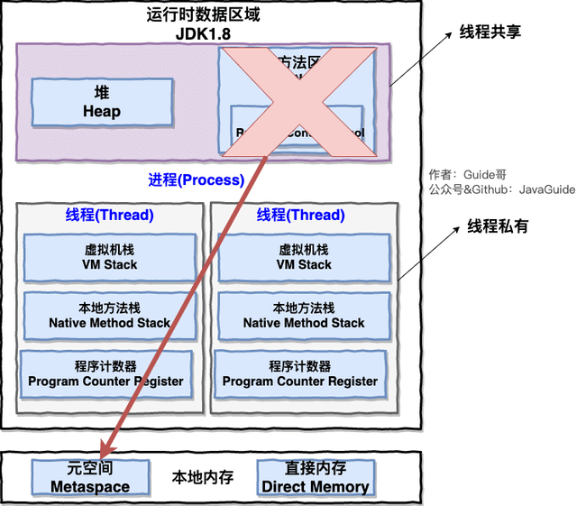
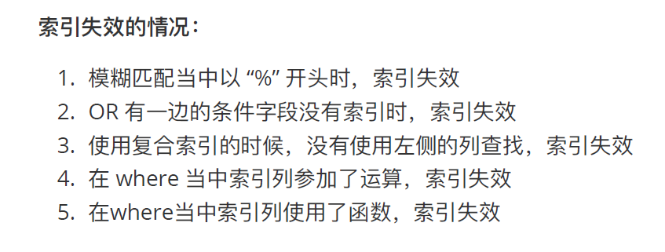

# Java基础


# 集合


# I/O


# 反射


# 并发


# JVM


## 内存区域

**JDK 1.8 之前** ：


**JDK 1.8** ：



**线程私有的：**

- 程序计数器
- 虚拟机栈
- 本地方法栈

**线程共享的：**

- 堆
- 方法区
- 直接内存 (非运行时数据区的一部分)

Java 虚拟机规范对于运行时数据区域的规定是相当宽松的。以堆为例：堆可以是连续空间，也可以不连续。堆的大小可以固定，也可以在运行时按需扩展 。虚拟机实现者可以使用任何垃圾回收算法管理堆，甚至完全不进行垃圾收集也是可以的。

#### 程序计数器

记录每个线程字节码运行位置，当线程被切换回来的时候能够知道该线程上次运行到哪儿了。

程序计数器是唯一一个不会出现 `OutOfMemoryError` 的内存区域，它的生命周期随着线程的创建而创建，随着线程的结束而死亡。

### Java虚拟机栈

线程私有的，它的生命周期和线程相同，随着线程的创建而创建，随着线程的死亡而死亡。

每个栈帧中都拥有：局部变量表、操作数栈、动态链接、方法返回地址。

**局部变量表**：基本数据类型和对象的引用

**操作数栈**：中间技术结果和临时变量

**动态链接**：动态链接的作用就是为了将符号引用转换为调用方法的直接引用。

**方法返回地址**：Java 方法有两种返回方式，一种是 return 语句正常返回，一种是抛出异常。

**栈溢出**

栈空间虽然不是无限的，但一般正常调用的情况下是不会出现问题的。不过，如果函数调用陷入无限循环的话，就会导致栈中被压入太多栈帧而占用太多空间，导致栈空间过深。那么当线程请求栈的深度超过当前 Java 虚拟机栈的最大深度的时候，就抛出 `StackOverFlowError` 错误。

### 本地方法栈

虚拟机栈为虚拟机执行 Java 方法 （也就是字节码）服务，而本地方法栈则为虚拟机使用到的 Native 方法服务。

本地方法被执行的时候，在本地方法栈也会创建一个栈帧，用于存放该本地方法的局部变量表、操作数栈、动态链接、出口信息。

方法执行完毕后相应的栈帧也会出栈并释放内存空间，也会出现 `StackOverFlowError` 和 `OutOfMemoryError` 两种错误。

### 堆

此内存区域的唯一目的就是存放对象实例，几乎所有的对象实例以及数组都在这里分配内存。

Java 堆是垃圾收集器管理的主要区域，因此也被称作 **GC 堆（Garbage Collected Heap）**。

### 方法区

方法区属于是 JVM 运行时数据区域的一块逻辑区域，是各个线程共享的内存区域。

当虚拟机要使用一个类时，它需要读取并解析 Class 文件获取相关信息，再将信息存入到方法区。方法区会存储已被虚拟机加载的 **类信息、字段信息、方法信息、常量、静态变量、即时编译器编译后的代码缓存等数据**。

### 运行时常量池

用于存放编译期生成的各种字面量（Literal）和符号引用（Symbolic Reference）的 **常量池表(Constant Pool Table)** 。

### 字符串常量池（堆中）

**字符串常量池** 是 JVM 为了提升性能和减少内存消耗针对字符串（String 类）专门开辟的一块区域，主要目的是为了避免字符串的重复创建。

**JDK 1.7 为什么要将字符串常量池移动到堆中？**

主要是因为永久代（方法区实现）的 GC 回收效率太低，只有在整堆收集 (Full GC)的时候才会被执行 GC。Java 程序中通常会有大量的被创建的字符串等待回收，将字符串常量池放到堆中，能够更高效及时地回收字符串内存。

String类型的字符串常量也就是属于字面量，存储与堆中，而不是符号引用。

### 直接内存

本机直接内存的分配不会受到 Java 堆的限制，但是，既然是内存就会受到本机总内存大小以及处理器寻址空间的限制


## 垃圾回收机制


自动内存管理最核心的功能是 **堆** 内存中对象的分配与回收。

Java 堆还可以细分为：新生代和老年代：再细致一点有：Eden 空间、From Survivor、To Survivor 空间等。**进一步划分的目的是更好地回收内存，或者更快地分配内存。**

### 回收过程

经过 GC 后，Eden 区和"From"区已经被清空。这个时候，"From"和"To"会交换他们的角色，也就是新的"To"就是上次 GC 前的“From”，新的"From"就是上次 GC 前的"To"。不管怎样，都会保证名为 To 的 Survivor 区域是空的。Minor GC 会一直重复这样的过程，在这个过程中，有可能当次 Minor GC 后，Survivor 的"From"区域空间不够用，有一些还达不到进入老年代条件的实例放不下，则放不下的部分会提前进入老年代。

#### 对象优先在 eden 区分配

* **对象优先在 Eden 分配**：当创建一个对象的时候，对象会被分配在新生代的 Eden 区，当 Eden 区要满了时候，触发 YoungGC
* 当进行 YoungGC 后，此时在 Eden 区存活的对象被移动到 to 区，并且当前对象的年龄会加 1，清空 Eden 区
* 当再一次触发 YoungGC 的时候，会把 Eden 区中存活下来的对象和 to 中的对象，移动到 from 区中，这些对象的年龄会加 1，清空 Eden 区和 to 区
* To 区永远是空 Survivor 区，From 区是有数据的，每次 MinorGC 后两个区域互换
* From 区和 To 区 也可以叫做 S0 区和 S1 区

#### 大对象直接进入老年代

**大对象直接进入老年代**：需要连续内存空间的对象，最典型的大对象是很长的字符串以及数组；避免在 Eden 和 Survivor 之间的大量复制；经常出现大对象会提前触发 GC 以获取足够的连续空间分配给大对象

#### 长期存活的对象将进入老年代

**长期存活的对象进入老年代**：为对象定义年龄计数器，对象在 Eden 出生并经过 Minor GC 依然存活，将移动到 Survivor 中，年龄就增加 1 岁，增加到一定年龄则移动到老年代中

`-XX:MaxTenuringThreshold`：定义年龄的阈值，对象头中用 4 个 bit 存储，所以最大值是 15，默认也是 15


#### 动态对象年龄判定

**动态对象年龄判定**：如果在 Survivor 区中相同年龄的对象的所有大小之和超过 Survivor 空间的一半，年龄大于等于该年龄的对象就可以直接进入老年代

> 修正（[issue552](https://gitee.com/link?target=https%3A%2F%2Fgithub.com%2FSnailclimb%2FJavaGuide%2Fissues%2F552)）：“Hotspot 遍历所有对象时，按照年龄从小到大对其所占用的大小进行累积，当累积的某个年龄大小超过了 survivor 区的 50% 时（默认值是 50%，可以通过 `-XX:TargetSurvivorRatio=percent` 来设置，参见 [issue1199](https://gitee.com/link?target=https%3A%2F%2Fgithub.com%2FSnailclimb%2FJavaGuide%2Fissues%2F1199) ），取这个年龄和 MaxTenuringThreshold 中更小的一个值，作为新的晋升年龄阈值”。
>
> 如果在Survivor空间中相同年龄所有对象大小的总和大于Survivor空间的一半，年龄大于或等于该年龄的对象就可以直接进入老年代，无须等到MaxTenuringThreshold中要求的年龄。


#### GC回收区域

针对 HotSpot VM 的实现，它里面的 GC 其实准确分类只有两大种：

部分收集 (Partial GC)：

+ 新生代收集（Minor GC / Young GC）：只对新生代进行垃圾收集；
+ 老年代收集（Major GC / Old GC）：只对老年代进行垃圾收集。需要注意的是 Major GC 在有的语境中也用于指代整堆收集；
+ 混合收集（Mixed GC）：对整个新生代和部分老年代进行垃圾收集。

整堆收集 (Full GC)：收集整个 Java 堆和方法区。


#### 空间分配担保

空间分配担保是为了确保在 Minor GC 之前老年代本身还有容纳新生代所有对象的剩余空间。


### 判断对象死亡

#### 引用计数法

给对象中添加一个引用计数器，每当有一个地方引用它，计数器就加 1；当引用失效，计数器就减 1；任何时候计数器为 0 的对象就是不可能再被使用的。

**这个方法实现简单，效率高，但是目前主流的虚拟机中并没有选择这个算法来管理内存，其最主要的原因是它很难解决对象之间相互循环引用的问题。**


#### 可达性分析算法

这个算法的基本思想就是通过一系列的称为 **“GC Roots”** 的对象作为起点，从这些节点开始向下搜索，节点所走过的路径称为引用链，当一个对象到 GC Roots 没有任何引用链相连的话，则证明此对象是不可用的，需要被回收。

下图中的 `Object 6 ~ Object 10` 之间虽有引用关系，但它们到 GC Roots 不可达，因此为需要被回收的对象。


常量是废弃常量

#### 再谈引用

**强引用（StrongReference）**

以前我们使用的大部分引用实际上都是强引用，这是使用最普遍的引用。如果一个对象具有强引用，那就类似于**必不可少的生活用品**，垃圾回收器绝不会回收它。当内存空间不足，Java 虚拟机宁愿抛出 OutOfMemoryError 错误，使程序异常终止，也不会靠随意回收具有强引用的对象来解决内存不足问题。

**软引用（SoftReference）**

如果一个对象只具有软引用，那就类似于**可有可无的生活用品**。如果内存空间足够，垃圾回收器就不会回收它，如果内存空间不足了，就会回收这些对象的内存。只要垃圾回收器没有回收它，该对象就可以被程序使用。软引用可用来实现内存敏感的高速缓存。

软引用可以和一个引用队列（ReferenceQueue）联合使用，如果软引用所引用的对象被垃圾回收，JAVA 虚拟机就会把这个软引用加入到与之关联的引用队列中。

**弱引用（WeakReference）**

如果一个对象只具有弱引用，那就类似于**可有可无的生活用品**。弱引用与软引用的区别在于：只具有弱引用的对象拥有更短暂的生命周期。在垃圾回收器线程扫描它所管辖的内存区域的过程中，一旦发现了只具有弱引用的对象，不管当前内存空间足够与否，都会回收它的内存。不过，由于垃圾回收器是一个优先级很低的线程， 因此不一定会很快发现那些只具有弱引用的对象。

弱引用可以和一个引用队列（ReferenceQueue）联合使用，如果弱引用所引用的对象被垃圾回收，Java 虚拟机就会把这个弱引用加入到与之关联的引用队列中。

**虚引用（PhantomReference）**

"虚引用"顾名思义，就是形同虚设，与其他几种引用都不同，虚引用并不会决定对象的生命周期。如果一个对象仅持有虚引用，那么它就和没有任何引用一样，在任何时候都可能被垃圾回收。

**虚引用主要用来跟踪对象被垃圾回收的活动**。


#### 如何判断一个常量是废弃常量

假如在字符串常量池中存在字符串 "abc"，如果当前没有任何 String 对象引用该字符串常量的话，就说明常量 "abc" 就是废弃常量，如果这时发生内存回收的话而且有必要的话，"abc" 就会被系统清理出常量池了。


#### 如何判断一个类是无用的类

判定一个常量是否是“废弃常量”比较简单，而要判定一个类是否是“无用的类”的条件则相对苛刻许多。类需要同时满足下面 3 个条件才能算是 **“无用的类”** ：

+ 该类所有的实例都已经被回收，也就是 Java 堆中不存在该类的任何实例。
+ 加载该类的 `ClassLoader` 已经被回收。
+ 该类对应的 `java.lang.Class` 对象没有在任何地方被引用，无法在任何地方通过反射访问该类的方法。

虚拟机可以对满足上述 3 个条件的无用类进行回收，这里说的仅仅是“可以”，而并不是和对象一样不使用了就会必然被回收。

### 垃圾收集算法

#### 标记-清除算法

1. **效率问题**
2. **空间问题（标记清除后会产生大量不连续的碎片）**


#### 标记-复制算法


#### 标记-整理算法


#### 分代收集算法

当前虚拟机的垃圾收集都采用分代收集算法，这种算法没有什么新的思想，只是根据对象存活周期的不同将内存分为几块。一般将 java 堆分为新生代和老年代，这样我们就可以根据各个年代的特点选择合适的垃圾收集算法。

**比如在新生代中，每次收集都会有大量对象死去，所以可以选择”标记-复制“算法，只需要付出少量对象的复制成本就可以完成每次垃圾收集。而老年代的对象存活几率是比较高的，而且没有额外的空间对它进行分配担保，所以我们必须选择“标记-清除”或“标记-整理”算法进行垃圾收集。**

**延伸面试问题：** HotSpot 为什么要分为新生代和老年代？

根据上面的对分代收集算法的介绍回答。

## JDK监控工具

`jps`:查看所有 Java 进程

`jstat`: 监视虚拟机各种运行状态信息

`jinfo`: 实时地查看和调整虚拟机各项参数

`jmap`:生成堆转储快照

**`jhat`**: 分析 heapdump 文件

**`jstack`** :生成虚拟机当前时刻的线程快照

## 类加载过程

### 类的生命周期

一个类的完整生命周期如下：


### 类加载过程

Class 文件需要加载到虚拟机中之后才能运行和使用，那么虚拟机是如何加载这些 Class 文件呢？

系统加载 Class 类型的文件主要三步：**加载->连接->初始化**。连接过程又可分为三步：**验证->准备->解析**。

### 类加载器总结

JVM 中内置了三个重要的 ClassLoader，除了 BootstrapClassLoader 其他类加载器均由 Java 实现且全部继承自`java.lang.ClassLoader`：

1. **BootstrapClassLoader(启动类加载器)** ：最顶层的加载类，由 C++实现，负责加载 `%JAVA_HOME%/lib`目录下的 jar 包和类或者被 `-Xbootclasspath`参数指定的路径中的所有类。
2. **ExtensionClassLoader(扩展类加载器)** ：主要负责加载 `%JRE_HOME%/lib/ext` 目录下的 jar 包和类，或被 `java.ext.dirs` 系统变量所指定的路径下的 jar 包。
3. **AppClassLoader(应用程序类加载器)** ：面向我们用户的加载器，负责加载当前应用 classpath 下的所有 jar 包和类。


### 双亲委派模型介绍

每一个类都有一个对应它的类加载器。系统中的 ClassLoader 在协同工作的时候会默认使用 **双亲委派模型** 。即在类加载的时候，系统会首先判断当前类是否被加载过。已经被加载的类会直接返回，否则才会尝试加载。加载的时候，首先会把该请求委派给父类加载器的 `loadClass()` 处理，因此所有的请求最终都应该传送到顶层的启动类加载器 `BootstrapClassLoader` 中。当父类加载器无法处理时，才由自己来处理。当父类加载器为 null 时，会使用启动类加载器 `BootstrapClassLoader` 作为父类加载器。


双亲委派模型保证了 Java 程序的稳定运行，可以避免类的重复加载（JVM 区分不同类的方式不仅仅根据类名，相同的类文件被不同的类加载器加载产生的是两个不同的类）

也保证了 Java 的核心 API 不被篡改。如果没有使用双亲委派模型，而是每个类加载器加载自己的话就会出现一些问题，比如我们编写一个称为 `java.lang.Object` 类的话，那么程序运行的时候，系统就会出现多个不同的 `Object` 类。

### 如果我们不想用双亲委派模型怎么办？

自定义加载器的话，需要继承 `ClassLoader` 。如果我们不想打破双亲委派模型，就重写 `ClassLoader` 类中的 `findClass()` 方法即可，无法被父类加载器加载的类最终会通过这个方法被加载。但是，如果想打破双亲委派模型则需要重写 `loadClass()` 方法


## JVM 参数总结

对于 JVM 调优，主要就是调整年轻代、老年代、元空间的内存空间大小及使用的垃圾回收器类型

* 设置堆的初始大小和最大大小，为了防止垃圾收集器在初始大小、最大大小之间收缩堆而产生额外的时间，通常把最大、初始大小设置为相同的值

  ```sh
  -Xms：设置堆的初始化大小
  -Xmx：设置堆的最大大小
  ```

* 设置年轻代中 Eden 区和两个 Survivor 区的大小比例。该值如果不设置，则默认比例为 8:1:1。Java 官方通过增大 Eden 区的大小，来减少 YGC 发生的次数，虽然次数减少了，但 Eden 区满的时候，由于占用的空间较大，导致释放缓慢，此时 STW 的时间较长，因此需要按照程序情况去调优

  ```sh
  -XX:SurvivorRatio
  ```

* 年轻代和老年代默认比例为 1:2，可以通过调整二者空间大小比率来设置两者的大小。

  ```sh
  -XX:newSize   设置年轻代的初始大小
  -XX:MaxNewSize   设置年轻代的最大大小，  初始大小和最大大小两个值通常相同
  ```

* 线程堆栈的设置：**每个线程默认会开启 1M 的堆栈**，用于存放栈帧、调用参数、局部变量等，但一般 256K 就够用，通常减少每个线程的堆栈，可以产生更多的线程，但这实际上还受限于操作系统

  ```sh
  -Xss   对每个线程stack大小的调整,-Xss128k
  ```

* 一般一天超过一次 FullGC 就是有问题，首先通过工具查看是否出现内存泄露，如果出现内存泄露则调整代码，没有的话则调整 JVM 参数

* 系统 CPU 持续飙高的话，首先先排查代码问题，如果代码没问题，则咨询运维或者云服务器供应商，通常服务器重启或者服务器迁移即可解决

* 如果数据查询性能很低下的话，如果系统并发量并没有多少，则应更加关注数据库的相关问题

* 如果服务器配置还不错，JDK8 开始尽量使用 G1 或者新生代和老年代组合使用并行垃圾回收器

# MySQL

## 基础知识

### 三大范式


第一范式：每个列都不可以再拆分。

第二范式：在第一范式的基础上，非主键列完全依赖于主键，而不能是依赖于主键的一部分。

第三范式：在第二范式的基础上，非主键列只依赖于主键，不依赖于其他非主键。

在设计数据库结构的时候，要尽量遵守三范式，如果不遵守，必须有足够的理由。比如性能。事实上我
们经常会为了性能而妥协数据库的设计。



### 索引有哪几种类型？

主键索引：数据列不允许重复，不允许为NULL，一个表只有一个主键。

唯一索引：数据列不允许重复，允许为NULL，一个表允许多个列创建唯一索引。

普通索引：基本的索引类型，没有唯一性的限制，允许为NULL值。

全文索引：是目前搜索引擎使用的一种关键技术，对文本的内容进行分词、搜索。

覆盖索引：查询列要被创建的索引覆盖，不必读取数据行。

组合索引：多列值组成一个索引，用于组合搜索，效率大于索引合并。


### 索引失效

1.查询条件中有or,即使有部分条件带索引也会失效

2.like查询是以%开头

3.如果列类型是字符串，那在查询条件中需要将数据用引号引用起来，否则不走索引

4.索引列上参与计算会导致索引失效

5.违背最左匹配原则，没有用联合索引的第一个字段

6.如果mysql估计全表扫描要比使用索引要快，会不适用索引（因为其他索引要回主键索引拿其他值）

7.other

### 索引优化

1. 只为用于搜索、排序或分组的列创建索引
2. 考虑列的基数（区分度）
3. 索引列的类型尽量小
4. 索引列前缀 - 只对字符串的前几个字符进行索引
5. 让索引列在比较表达式中单独出现，不能判空
6. 消除冗余和重复索引


### B+树详解


# 网络

## HTTP


### HTTPS

**混合加密**对称加密和非对称加密

+ 在通信建立前采用**非对称加密**的方式交换「会话秘钥」，后续就不再使用非对称加密。
+ 在通信过程中全部使用**对称加密**的「会话秘钥」的方式加密明文数据。

**摘要算法**的方式来实现**完整性**，它能够为数据生成独一无二的「指纹」，指纹用于校验数据的完整性，解决了篡改的风险。

### 非对称加密

发送消息：对方的公钥加密，对方收到用自己私钥解密

身份验证：自己的私钥加密，对方用我的公钥解密，对比相同哈希算法计算出来的的hsh值是否相同

jwt中间是负载，后面是身份验证


# 其他

## 池化技术

池化技术指的是提前准备一些资源，在需要时可以重复使用这些预先准备的资源。

在系统开发过程中，我们经常会用到池化技术。通俗的讲，池化技术就是：把一些资源预先分配好，组织到对象池中，之后的业务使用资源从对象池中获取，使用完后放回到对象池中。这样做带来几个明显的好处：

资源重复使用， 减少了资源分配和释放过程中的系统消耗。比如，在IO密集型的服务器上，并发处理过程中的子线程或子进程的创建和销毁过程，带来的系统开销将是难以接受的。所以在业务实现上，通常把一些资源预先分配好，如线程池，数据库连接池，Redis连接池，HTTP连接池等，来减少系统消耗，提升系统性能。

可以对资源的整体使用做限制。这个好理解，相关资源预分配且只在预分配是生成，后续不再动态添加，从而限制了整个系统对资源的使用上限。类似一个令牌桶的功能。

池化技术分配对象池，通常会集中分配，这样有效避免了碎片化的问题。

池化技术简单点来说，就是提前保存大量的资源，以备不时之需。池化技术有两个特点，提前创建和重复利用。
————————————————
版权声明：本文为CSDN博主「小熊coder」的原创文章，遵循CC 4.0 BY-SA版权协议，转载请附上原文出处链接及本声明。
原文链接：https://blog.csdn.net/qq_41854911/article/details/121895526

## mybatis缓存

一级缓存是SQLSession级别缓存，在操作数据库时都需要构造SQLSession对象，在对象中有一个数据结构（HashMap）用于存储缓存数据，不同的SQLSession之间的缓存数据区域是互不影响的。
一级缓存的作用于是在同一个SQLSession，在同一个SQLSession中执行相同的两次SQL，第一次执行完毕在后会将数据写到缓存中，第二次从缓存中进行后去就不在数据库中查询，从而提高了效率，
当一个SQLSession结束后该SQLSession中的一级缓存也就不存在了，mybatis默认开启一级缓存。

二级缓存是mapper级别缓存，多个SQLSession去操作同一个mapper的SQL语句，多个SQLSession操作都会存在二级缓存中，多个SQLSession共用二级缓存，二级缓存是跨SQLSession的。
二级缓存是多个SQLSession共享的，作用域是mapper下的同一个namespace。不同的SQLSession两次执行相同的namespace下的SQL最终能获取相同的SQL语句结果。
mybatis默认是没有开启二级缓存的，需要在全局配置文件中配置开启二级缓存。
————————————————
版权声明：本文为CSDN博主「西财彭于晏」的原创文章，遵循CC 4.0 BY-SA版权协议，转载请附上原文出处链接及本声明。
原文链接：https://blog.csdn.net/m0_46853673/article/details/123705466


## 幂等操作

## 非对称加密

