# 基础篇

## TCP/IP哪几层

### 应用层

HTTP、FTP、Telnet、DNS、SMTP

### 传输层

传输层会有两个传输协议，分别是 TCP 和 UDP。

### 网络层

IP 协议

### 网络接口层

MAC 头部

## 键入网址到网页显示

### HTTP

进行解析

### DNS

**只指路不带路**

再去 hosts 文件看

本地 DNS 服务器

根域名服务器

顶级域名服务器

权威 DNS 服务器

### 协议栈

协议栈的上半部分有两块，分别是负责收发数据的 TCP 和 UDP 协议，这两个传输协议会接受应用层的委托执行收发数据的操作。

协议栈的下面一半是用 IP 协议控制网络包收发操作，在互联网上传数据时，数据会被切分成一块块的网络包，而将网络包发送给对方的操作就是由 IP 负责的。

### TCP

源端口号和目标端口号

**确认号**

**状态位** `SYN` 是发起一个连接，`ACK` 是回复，`RST` 是重新连接，`FIN` 是结束连接等

**窗口大小**

**拥塞控制**

### IP

源地址和目标地址

#### 假设客户端有多个网卡，就会有多个 IP 地址，那 IP 头部的源地址应该选择哪个 IP 呢？

根据**路由表**规则，来判断哪一个网卡作为源地址 IP

如果匹配上了就使用局域网网卡的ip

第三条目比较特殊，它目标地址和子网掩码都是 `0.0.0.0`，这表示**默认网关**，如果其他所有条目都无法匹配，就会自动匹配这一行。并且后续就把包发给路由器，`Gateway` 即是路由器的 IP 地址。

### MAC

**路由表**

**ARP**地址解析协议

广播

### 网卡

**开头加上报头和起始帧分界符，在末尾加上用于检测错误的帧校验序列**。

### 交换机

**二层**网络设备

网卡本身具有 MAC 地址

**交换机的端口不具有 MAC 地址**，不核对接收方 MAC 地址，而是直接接收所有的包并存放到缓冲区中

 MAC 地址表

广播地址

### 路由器

**三层**网络设备，路由器的各个端口都具有 MAC 地址和 IP 地址

**路由表**

发送出去的网络包会通过**交换机**到达下一个路由器。由于接收方 MAC 地址就是下一个路由器的地址，所以交换机会根据这一地址将包传输到下一个路由器。

## Linux系统是如何收发网络包的？

### 分层

**OSI 网络模型**，该模型主要有 7 层，分别是应用层、表示层、会话层、传输层、网络层、数据链路层以及物理层。

每一层负责的职能都不同，如下：

+ 应用层，负责给应用程序提供统一的接口；
+ 表示层，负责把数据转换成兼容另一个系统能识别的格式；
+ 会话层，负责建立、管理和终止表示层实体之间的通信会话；
+ 传输层，负责端到端的数据传输；
+ 网络层，负责数据的路由、转发、分片；
+ 数据链路层，负责数据的封帧和差错检测，以及 MAC 寻址；
+ 物理层，负责在物理网络中传输数据帧；

**TCP/IP 网络模型**共有 4 层，分别是应用层、传输层、网络层和网络接口层，每一层负责的职能如下：

+ 应用层，负责向用户提供一组应用程序，比如 HTTP、DNS、FTP 等;
+ 传输层，负责端到端的通信，比如 TCP、UDP 等；
+ 网络层，负责网络包的封装、分片、路由、转发，比如 IP、ICMP 等；
+ 网络接口层，负责网络包在物理网络中的传输，比如网络包的封帧、 MAC 寻址、差错检测，以及通过网卡传输网络帧等；

封装格式

+ 传输层，给应用数据前面增加了 TCP 头；
+ 网络层，给 TCP 数据包前面增加了 IP 头；
+ 网络接口层，给 IP 数据包前后分别增加了帧头和帧尾；

### Linux 网络协议栈

最大传输单元（MTU）

网络层分片

+ 应用程序需要通过系统调用，来跟 Socket 层进行数据交互；
+ Socket 层的下面就是传输层、网络层和网络接口层；
+ 最下面的一层，则是网卡驱动程序和硬件网卡设备；

### Linux 接收网络包的流程

 **NAPI 机制**它是混合「中断和轮询」的方式来接收网络包，不采用中断的方式读取数据

**中断处理函数处理完需要「暂时屏蔽中断」，然后唤醒「软中断」来轮询处理数据，直到没有新数据时才恢复中断，这样一次中断处理多个网络包**

四元组「源 IP、源端口、目的 IP、目的端口」 作为标识，找出对应的 Socket，并把数据拷贝到 Socket 的接收缓冲区。

###  Linux 发送网络包的流程

应用程序会调用 Socket 发送数据包的接口，由于这个是系统调用，所以会从用户态陷入到内核态中的 Socket 层，Socket 层会将应用层数据拷贝到 Socket 发送缓冲区中。

接下来，网络协议栈从 Socket 发送缓冲区中取出数据包，并按照 TCP/IP 协议栈从上到下逐层处理。

## socket

接受队列和发送队列

套接字

四元组：绝对唯一的连接

# HTTP

## HTTP

### 缓存

强制缓存和协商缓存

## HTTPS

SSL/TLS

SSL(Secure Sockets Layer,安全套接字层)

TLS（Transport Layer Security，传输层安全）

混合加密

1. 建立连接时候：https 比 http多了 TLS 的握手过程；
2. 传输内容的时候：https 会把数据进行加密，通常是对称加密数据；

摘要算法

数字证书

## 演变

### HTTP/1.1

长连接

管道

### HTTP/2

头部压缩

二进制格式

数据流

多路复用

服务器推送

没有解决TCP中的队头阻塞

### HTTP/3

无队头阻塞：QUIC

更快的连接建立

连接迁移

## HTTP/1.1

+ 尽量避免发送 HTTP 请求；
+ 在需要发送 HTTP 请求时，考虑如何减少请求次数；
+ 减少服务器的 HTTP 响应的数据大小；

### 避免发送 HTTP 请求；

**缓存技术**

304 不具有跳转的含义，表示资源未修改，重定向已存在的缓冲文件，也称缓存重定向，也就是告诉客户端可以继续使用缓存资源，用于缓存控制。

Etag 唯一标识：更准确

`Last-Modified`：标示这个响应资源的最后修改时间

协商缓存只有在未能命中强制缓存的时候，才能发起带有协商缓存字段的请求。

### 如何减少请求次数；

#### 减少重定向请求次数

重定向的工作交由代理服务器完成，就能减少 HTTP 请求次数了

#### 合并请求

减少了重复发送的 HTTP 头部

**通过将多个小图片合并成一个大图片来减少 HTTP 请求的次数，以减少 HTTP 请求的次数，从而减少网络的开销**。

还可以将图片的二进制数据用 `base64` 编码后，以 URL 的形式潜入到 HTML 文件，跟随 HTML 文件一并发送.

#### 延迟发送请求

按需获取

### 减少服务器的 HTTP 响应的数据大小；

**压缩**

+ *无损压缩*；
+ *有损压缩*；

HTTP 请求头部中的 `Accept` 字段里的「 q 质量因子」

## HTTP RSA

HTTPS 是应用层协议，需要先完成 TCP 连接建立，然后走 TLS 握手过程后，才能建立通信安全的连接。

### TLS 握手过程

**通常经过「四个消息」就可以完成 TLS 握手，也就是需要 2个 RTT 的时延**

### RSA 握手过程

#### TLS 第一次握手「**Client Hello**」

打招呼

消息里面有客户端使用的 TLS 版本号、支持的密码套件列表，以及生成的**随机数（\*Client Random\*）**，这个随机数会被服务端保留，它是生成对称加密密钥的材料之一。

#### TLS 第二次握手「**Server Hello**」

确认 TLS 版本号是否支持，和从密码套件列表中选择一个密码套件，以及生成**随机数（\*Server Random\*）**。

#### 客户端验证证书

####  TLS 第三次握手「**Change Cipher Key Exchange**」

密钥交换

客户端就会生成一个新的**随机数 (\*pre-master\*)**，用服务器的 RSA 公钥加密该随机数

**客户端和服务端双方都共享了三个随机数，分别是 Client Random、Server Random、pre-master**。

#### TLS 第四次握手

服务器也是同样的操作

**使用 RSA 密钥协商算法的最大问题是不支持前向保密**。

一旦服务端的私钥泄漏了，过去被第三方截获的所有 TLS 通讯密文都会被破解。

## HTTP ECDHE 握手解析

### 理论

既然固定一方的私钥有被破解的风险，那么干脆就让双方的私钥在每次密钥交换通信时，都是随机生成的、临时的，这个方式也就是 DHE 算法，E 全称是 ephemeral（临时性的）。

ECDHE 算法是在 DHE 算法的基础上利用了 ECC 椭圆曲线特性，可以用更少的计算量计算出公钥，以及最终的会话密钥。

### 区别

ECDHE 算法，客户端可以不用等服务端的最后一次 TLS 握手，就可以提前发出加密的 HTTP 数据，节省了一个消息的往返时间；

使用 ECDHE， 在 TLS 第 2 次握手中，会出现服务器端发出的「Server Key Exchange」消息，而 RSA 握手过程没有该消息（这个是 RFC 文档规定的，具体原因文档没有说明，所以这点我也不太明白）；

## HTTPS优化

### 原因

因为 HTTPS 相比 HTTP 协议多一个 TLS 协议握手过程，**目的是为了通过非对称加密握手协商或者交换出对称加密密钥**，这个过程最长可以花费掉 2 RTT，接着后续传输的应用数据都得使用对称加密密钥来加密/解密。

+ 第一个环节， TLS 协议握手过程；
+ 第二个环节，握手后的对称加密报文传输。

第二个环节

+ 对于 ECDHE 密钥协商算法，握手过程中会客户端和服务端都需要临时生成椭圆曲线公私钥；
+ 客户端验证证书时，会访问 CA 获取 CRL 或者 OCSP，目的是验证服务器的证书是否有被吊销；
+ 双方计算 Pre-Master，也就是对称加密密钥；

### 解决

加钱，加缓存，加轮询，减大小，减间隔，减步骤

#### 硬件

**HTTPS 协议是计算密集型，而不是 I/O 密集型**，所以不能把钱花在网卡、硬盘等地方，应该花在 CPU 上。

#### 协议

因此如果可以，尽量**选用 ECDHE 密钥交换**算法替换 RSA 算法，因为该算法由于支持「False Start」，它是“抢跑”的意思，客户端可以在 TLS 协议的第 3 次握手后，第 4 次握手前，发送加密的应用数据，以此将 **TLS 握手的消息往返由 2 RTT 减少到 1 RTT，而且安全性也高，具备前向安全性**。

 **TLS 1.3 把 Hello 和公钥交换这两个消息合并成了一个消息，于是这样就减少到只需 1 RTT 就能完成 TLS 握手**。

客户端在 Client Hello 消息里带上了支持的椭圆曲线，以及这些椭圆曲线对应的公钥。

#### 证书优化

**对于服务器的证书应该选择椭圆曲线（ECDSA）证书，而不是 RSA 证书，因为在相同安全强度下， ECC 密钥长度比 RSA 短的多**

证书链逐级验证

CRL 称为证书吊销列表：**实时性较差**；**随着吊销证书的增多，列表会越来越大，下载的速度就会越慢**；

OCSP 在线证书状态协议（*Online Certificate Status Protocol*）**向 CA 发送查询请求，让 CA 返回证书的有效状态**。

周期性地查询证书状态，获得一个带有时间戳和签名的响应结果并缓存它。

#### 会话重用

**客户端和服务器首次 TLS 握手连接后，双方会在内存缓存会话密钥，并用唯一的 Session ID 来标识**

Session ID 和 Session Ticket

## HTTP/2

### HTTP/1.1 协议的性能问题

### 兼容 HTTP/1.1

### 头部压缩

压缩固定字段

避免重复

二进制编码：不需要冒号空格和末尾的\r\n作为分隔符，于是改用表示字符串长度（Value Length）来分割 Index 和 Value。

#### 静态表编码

**而使用了静态表和 Huffman 编码，可以将它压缩成 8 字节，压缩率大概 47 %**

#### 动态表编码

添加一个新的 Index 号 62。**那么在下一次发送的时候，就不用重复发这个字段的数据了，只用发 1 个字节的 Index 号就好了，因为双方都可以根据自己的动态表获取到字段的数据**。

**必须同一个连接上，重复传输完全相同的 HTTP 头部**。

### 二进制帧

响应报文划分成了两类**帧（\*Frame\*）**，图中的 HEADERS（首部）和 DATA（消息负载） 是帧的类型，也就是说一条 HTTP 响应，划分成了两类帧来传输，并且采用二进制来编码。

### 并发传输

**多个 Stream 复用一条 TCP 连接，达到并发的效果**，解决了 HTTP/1.1 队头阻塞的问题，提高了 HTTP 传输的吞吐量。

Stream全双工流

Message 对应 HTTP/1 中的请求或响应

Frame 是 HTTP/2 最小单位，以二进制压缩格式存放 HTTP/1 中的内容（头部和包体）

**不同 Stream 的帧是可以乱序发送的（因此可以并发不同的 Stream ）**，**同一 Stream 内部的帧必须是严格有序的**。

### 服务器主动推送资源

客户端发起的请求，必须使用的是奇数号 Stream，服务器主动的推送，使用的是偶数号 Stream。服务器在推送资源时，会通过 `PUSH_PROMISE` 帧传输 HTTP 头部，并通过帧中的 `Promised Stream ID` 字段告知客户端，接下来会在哪个偶数号 Stream 中发送包体。

## HTTP/3 强势来袭

### 美中不足的 HTTP/2

#### 队头阻塞

HTTP/2 多个请求是跑在一个 TCP 连接中的，那么当 TCP 丢包时，整个 TCP 都要等待重传，那么就会阻塞该 TCP 连接中的所有请求。

每个 packet 都有自己的序号，你可以认为是 TCP 的序列号，其中 packet 3 在网络中丢失了，即使 packet 4-6 被接收方收到后，由于内核中的 TCP 数据不是连续的

#### TCP 与 TLS 的握手时延迟

 TCP 三次握手和 TLS 四次握手（TLS 1.2）的过程，因此共需要 3 个 RTT 的时延才能发出请求数据。

#### 网络迁移需要重新连接

一个 TCP 连接是由四元组（源 IP 地址，源端口，目标 IP 地址，目标端口）确定的，这意味着如果 IP 地址或者端口变动了，就会导致需要 TCP 与 TLS 重新握手，这不利于移动设备切换网络的场景，比如 4G 网络环境切换成 WIFI。

### QUIC 协议的特点

UDP 是一个简单、不可靠的传输协议，而且是 UDP 包之间是无序的，也没有依赖关系。

UDP 是不需要连接的，也就不需要握手和挥手的过程，所以天然的就比 TCP 快。

#### 无队头阻塞

QUIC 连接上的多个 Stream 之间并没有依赖，都是独立的，某个流发生丢包了，只会影响该流，其他流不受影响

#### 更快的连接建立

**QUIC 内部包含了 TLS，它在自己的帧会携带 TLS 里的“记录”，再加上 QUIC 使用的是 TLS1.3，因此仅需 1 个 RTT 就可以「同时」完成建立连接与密钥协商，甚至在第二次连接的时候，应用数据包可以和 QUIC 握手信息（连接信息 + TLS 信息）一起发送，达到 0-RTT 的效果**。

#### 连接迁移

是通过**连接 ID**来标记通信的两个端点，客户端和服务器可以各自选择一组 ID 来标记自己，因此即使移动设备的网络变化后，导致 IP 地址变化了，只要仍保有上下文信息（比如连接 ID、TLS 密钥等），就可以“无缝”地复用原连接，消除重连的成本，没有丝毫卡顿感，达到了**连接迁移**的功能。

### HTTP/3 协议

自身不需要再定义 Stream，直接使用 QUIC 里的 Stream，于是 HTTP/3 的帧的结构也变简单了。

# TCP

## 4.1 TCP 三次握手与四次挥手面试题

### 基础

+ *ACK*：该位为 `1` 时，「确认应答」的字段变为有效，TCP 规定除了最初建立连接时的 `SYN` 包之外该位必须设置为 `1` 。

+ *RST*：该位为 `1` 时，表示 TCP 连接中出现异常必须强制断开连接。

+ *SYN*：该位为 `1` 时，表示希望建立连接，并在其「序列号」的字段进行序列号初始值的设定。

+ *FIN*：该位为 `1` 时，表示今后不会再有数据发送，希望断开连接。当通信结束希望断开连接时，通信双方的主机之间就可以相互交换 `FIN` 位为 1 的 TCP 段。

### 连接

因为三次握手才能保证双方具有接收和发送的能力（片面）

+ 三次握手才可以阻止重复历史连接的初始化（主要原因）seq确认
+ 三次握手才可以同步双方的初始序列号
+ 三次握手才可以避免资源浪费

### 断开

+ 客户端打算关闭连接，此时会发送一个 TCP 首部 `FIN` 标志位被置为 `1` 的报文，也即 `FIN` 报文，之后客户端进入 `FIN_WAIT_1` 状态。
+ 服务端收到该报文后，就向客户端发送 `ACK` 应答报文，接着服务端进入 `CLOSED_WAIT` 状态。
+ 客户端收到服务端的 `ACK` 应答报文后，之后进入 `FIN_WAIT_2` 状态。
+ 等待服务端处理完数据后，也向客户端发送 `FIN` 报文，之后服务端进入 `LAST_ACK` 状态。
+ 客户端收到服务端的 `FIN` 报文后，回一个 `ACK` 应答报文，之后进入 `TIME_WAIT` 状态
+ 服务器收到了 `ACK` 应答报文后，就进入了 `CLOSED` 状态，至此服务端已经完成连接的关闭。
+ 客户端在经过 `2MSL` 一段时间后，自动进入 `CLOSED` 状态，至此客户端也完成连接的关闭。

### 2MSL

为什么不是 4 或者 8 MSL 的时长呢？你可以想象一个丢包率达到百分之一的糟糕网络，连续两次丢包的概率只有万分之一，这个概率实在是太小了，忽略它比解决它更具性价比。

客户端又接收到了服务端重发的 FIN 报文，那么 **2MSL 时间将重新计时**

原因一：防止历史连接中的数据，被后面相同四元组的连接错误的接收（所有相同TCP的报文在网络中过期）

原因二：保证「被动关闭连接」的一方，能被正确的关闭

## 4.2 TCP 重传、滑动窗口、流量控制、拥塞控制

### 重传机制

#### 超时重传

`RTT` 指的是**数据发送时刻到接收到确认的时刻的差值**

超时重传时间是以 `RTO` （Retransmission Timeout 超时重传时间）

+ 当超时时间 **RTO 较大**时，重发就慢，丢了老半天才重发，没有效率，性能差；
+ 当超时时间 **RTO 较小**时，会导致可能并没有丢就重发，于是重发的就快，会增加网络拥塞，导致更多的超时，更多的超时导致更多的重发。

**超时重传时间 RTO 的值应该略大于报文往返 RTT 的值**。

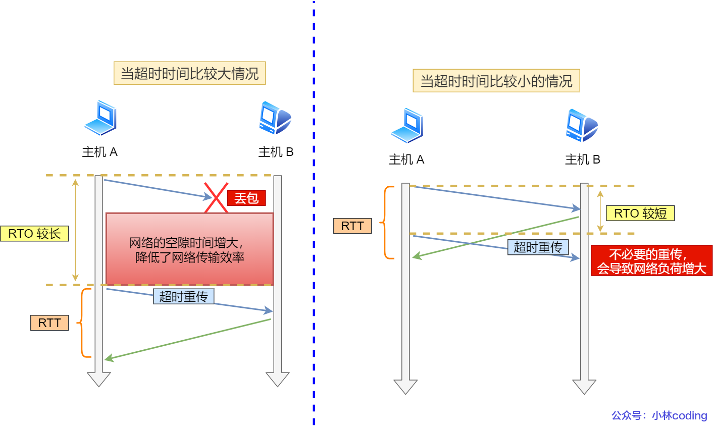

#### 快速重传

**快速重传（Fast Retransmit）机制**，它**不以时间为驱动，而是以数据驱动重传**。

+ **发送端收到了三个 Ack = 2 的确认，知道了 Seq2 还没有收到，就会在定时器过期之前，重传丢失的 Seq2。**

快速重传的工作方式是当收到三个相同的 ACK 报文时，会在定时器过期之前，重传丢失的报文段。

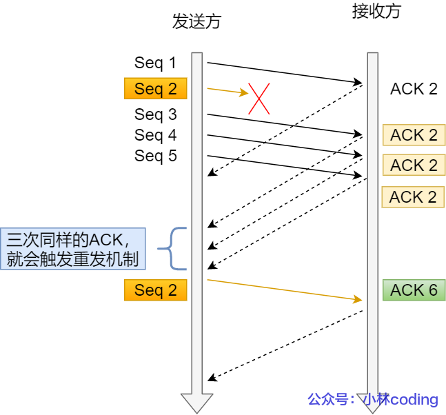

#### SACK 方法

`SACK`（ Selective Acknowledgment 选择性确认）

在 TCP 头部「选项」字段里加一个 `SACK` 的东西，它**可以将缓存的地图发送给发送方**，这样发送方就可以知道哪些数据收到了，哪些数据没收到，知道了这些信息，就可以**只重传丢失的数据**。

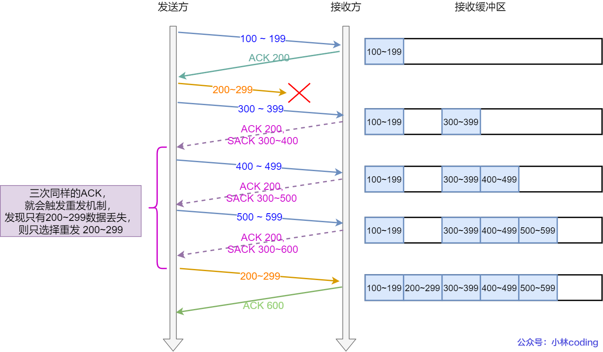

#### Duplicate SACK

**使用了 SACK 来告诉「发送方」有哪些数据被重复接收了。**

*栗子一号：ACK 丢包*

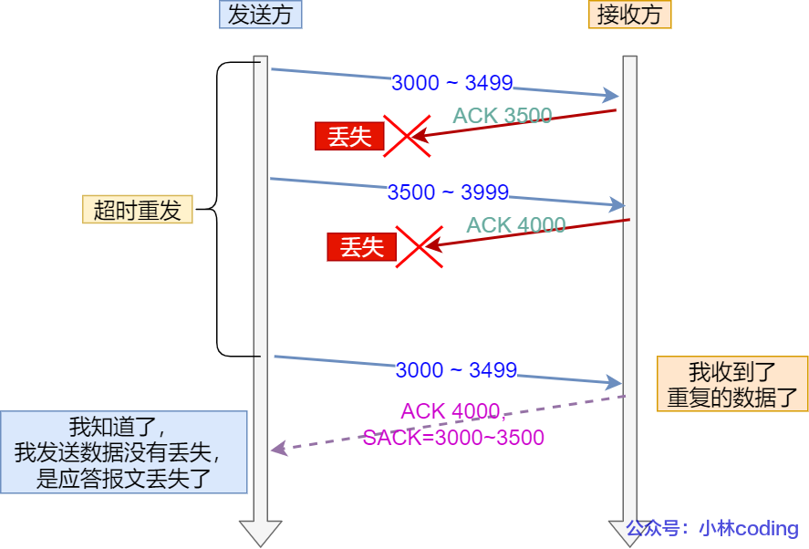

*栗子二号：网络延时*

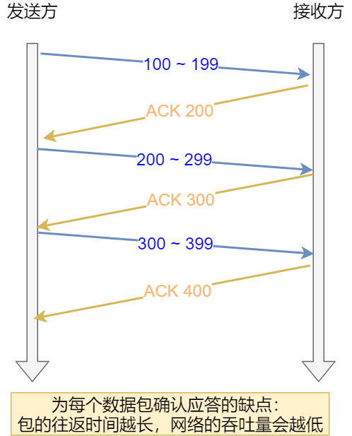

### 滑动窗口

**无需等待确认应答，而可以继续发送数据的最大值**。

### 流量控制

**TCP 提供一种机制可以让「发送方」根据「接收方」的实际接收能力控制发送的数据量，这就是所谓的流量控制**

#### 操作系统缓冲区与滑动窗口的关系

当应用进程没办法及时读取缓冲区的内容时，也会对我们的缓冲区造成影响

当应用程序没有及时读取缓存时，发送窗口和接收窗口的变化。

**为了防止这种情况发生，TCP 规定是不允许同时减少缓存又收缩窗口的，而是采用先收缩窗口，过段时间再减少缓存，这样就可以避免了丢包情况。**

#### 窗口关闭

**窗口探测 ( Window probe ) 报文**

#### 糊涂窗口综合症

**如果接收方腾出几个字节并告诉发送方现在有几个字节的窗口，而发送方会义无反顾地发送这几个字节，这就是糊涂窗口综合症**。

就好像一个可以承载 50 人的大巴车，每次来了一两个人，就直接发车。除非家里有矿的大巴司机，才敢这样玩，不然迟早破产。要解决这个问题也不难，大巴司机等乘客数量超过了 25 个，才认定可以发车。

+ 让接收方不通告小窗口给发送方
+ 让发送方避免发送小数据（是延时处理，囤积数据）

### 拥塞控制

流量控制是避免「发送方」的数据填满「接收方」的缓存，但是并不知道网络的中发生了什么。

**在网络出现拥堵时，如果继续发送大量数据包，可能会导致数据包时延、丢失等，这时 TCP 就会重传数据，但是一重传就会导致网络的负担更重，于是会导致更大的延迟以及更多的丢包，这个情况就会进入恶性循环被不断地放大....**

其实只要「发送方」没有在规定时间内接收到 ACK 应答报文，也就是**发生了超时重传，就会认为网络出现了拥塞。**

#### 慢启动

慢启动的意思就是一点一点的提高发送数据包的数量

慢启动的算法记住一个规则就行：**当发送方每收到一个 ACK，拥塞窗口 cwnd 的大小就会加 1。**

#### 拥塞避免算法

当拥塞窗口 `cwnd` 「超过」慢启动门限 `ssthresh` 就会进入拥塞避免算法。

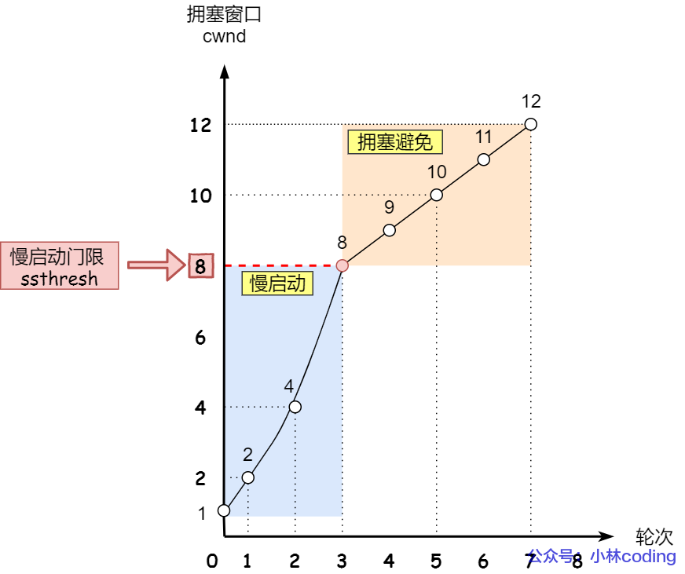

#### 拥塞发生

+ 超时重传
+ 快速重传

当发生了「超时重传」，则就会使用拥塞发生算法。

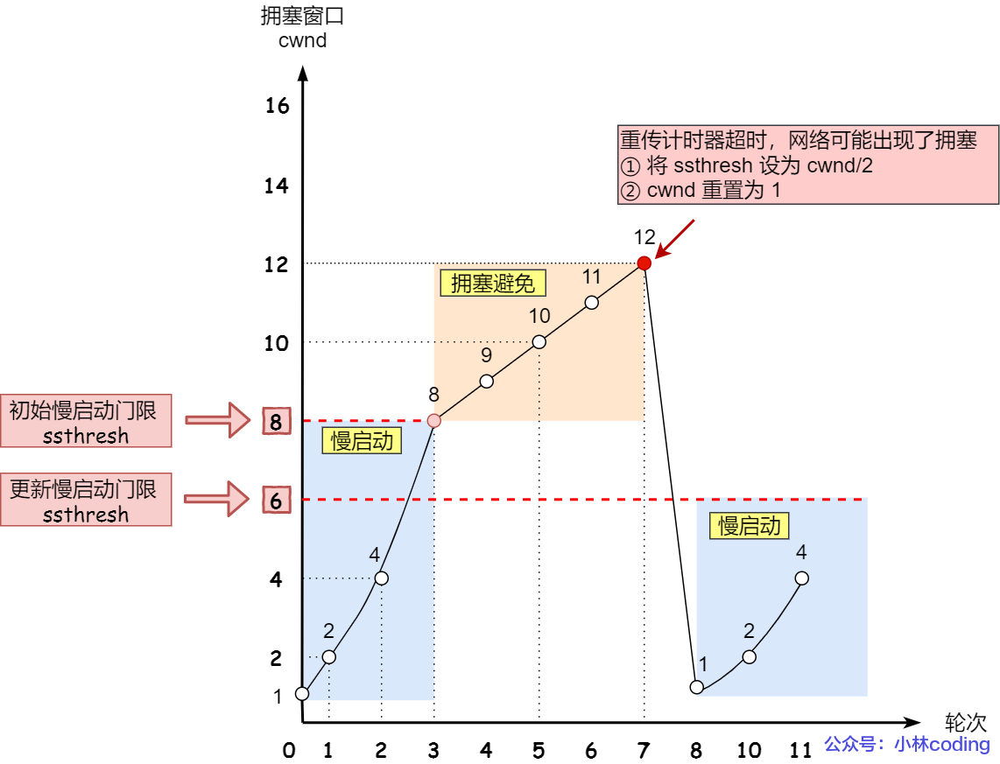

#### 快速恢复

当接收方发现丢了一个中间包的时候，发送三次前一个包的 ACK，于是发送端就会快速地重传，不必等待超时再重传。

快速重传和快速恢复算法一般同时使用，快速恢复算法是认为，你还能收到 3 个重复 ACK 说明网络也不那么糟糕，所以没有必要像 `RTO` 超时那么强烈。

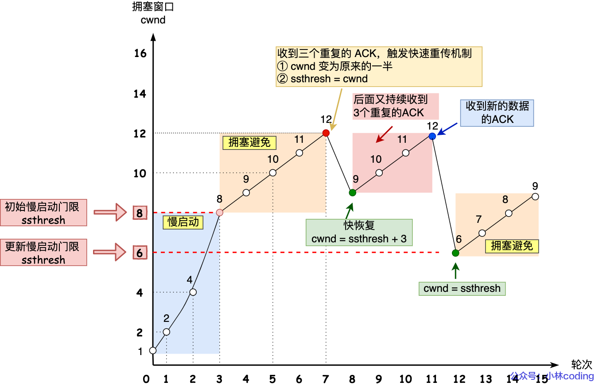

### 读者问答

## 4.3 TCP 实战抓包分析

## 4.4 TCP 半连接队列和全连接队列

## 4.5 如何优化 TCP?

如果客户端长时间没有收到 SYN+ACK 报文，则会重发 SYN 包，**重发的次数由 tcp_syn_retries 参数控制**，默认是 5 次：

## 4.6 如何理解是 TCP 面向字节流协议？

如何理解字节流？
如何解决粘包？
特殊字符作为边界
自定义消息结构

## 4.7 为什么 TCP 每次建立连接时，初始化序列号都要不一样呢？

## 4.8 SYN 报文什么时候情况下会被丢弃？

 **TCP 半连接队列满了，这时后面来的 syn 包都会被丢弃**。

但是，**如果开启了syncookies 功能，即使半连接队列满了，也不会丢弃syn 包**。

*方式一：增大半连接队列*

*方式二：开启 tcp_syncookies 功能*

*方式三：减少 SYN+ACK 重传次数*

**在服务端并发处理大量请求时，如果 TCP accpet 队列过小，或者应用程序调用 accept() 不及时，就会造成 accpet 队列满了 ，这时后续的连接就会被丢弃，这样就会出现服务端请求数量上不去的现象。**

**调大 backlog 以及 somaxconn 参数**

## 4.9 已建立连接的TCP，收到SYN会发生什么？

**1. 客户端的 SYN 报文里的端口号与历史连接不相同**

如果服务端发送了数据包给客户端，由于客户端的连接已经被关闭了，此时客户的内核就会回 RST 报文，服务端收到后就会释放连接。

**2. 客户端的 SYN 报文里的端口号与历史连接相同**

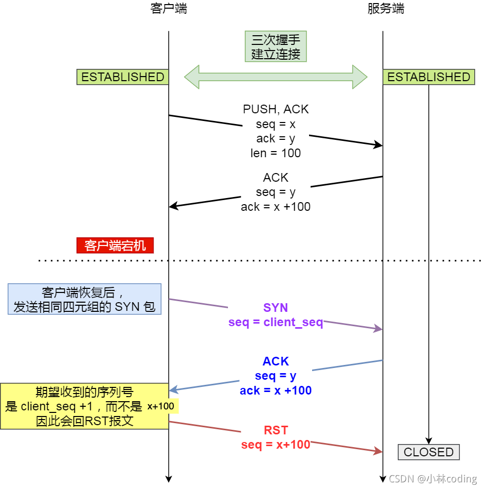

**处于 establish 状态的服务端如果收到了客户端的 SYN 报文（注意此时的 SYN 报文其实是乱序的，因为 SYN 报文的初始化序列号其实是一个随机数），会回复一个携带了正确序列号和确认号的 ACK 报文，这个 ACK 被称之为 Challenge ACK。**

**接着，客户端收到这个 Challenge ACK，发现序列号并不是自己期望收到的，于是就会回 RST 报文，服务端收到后，就会释放掉该连接。**

### 如何关闭一个 TCP 连接？

**要伪造一个能关闭 TCP 连接的 RST 报文，必须同时满足「四元组相同」和「序列号正好落在对方的滑动窗口内」这两个条件。**

**我们可以伪造一个四元组相同的 SYN 报文，来拿到“合法”的序列号！**

会回复一个 Challenge ACK，这个 ACK 报文里的「确认号」，正好是服务端下一次想要接收的序列号，说白了，就是可以通过这一步拿到服务端下一次预期接收的序列号。

然后用这个确认号作为 RST 报文的序列号，发送给服务端，此时服务端会认为这个 RST 报文里的序列号是合法的，于是就会释放连接！

## 4.10 四次挥手中收到乱序的 FIN 包会如何处理？

**在 FIN_WAIT_2 状态时，如果收到乱序的 FIN 报文，那么就被会加入到「乱序队列」，并不会进入到 TIME_WAIT 状态。**

等再次收到前面被网络延迟的数据包时，会判断乱序队列有没有数据，然后会检测乱序队列中是否有可用的数据，如果能在乱序队列中找到与当前报文的序列号保持的顺序的报文，就会看该报文是否有 FIN 标志，如果发现有 FIN 标志，这时才会进入 TIME_WAIT 状态。

## 4.11 在 TIME_WAIT 状态的 TCP 连接，收到 SYN 后会发生什么？

针对这个问题，**关键是要看 SYN 的「序列号和时间戳」是否合法**，因为处于 TIME_WAIT 状态的连接收到 SYN 后，会判断 SYN 的「序列号和时间戳」是否合法，然后根据判断结果的不同做不同的处理。

先跟大家说明下， 什么是「合法」的 SYN？

+ **合法 SYN**：客户端的 SYN 的「序列号」比服务端「期望下一个收到的序列号」要**大**，**并且** SYN 的「时间戳」比服务端「最后收到的报文的时间戳」要**大**。
+ **非法 SYN**：客户端的 SYN 的「序列号」比服务端「期望下一个收到的序列号」要**小**，**或者** SYN 的「时间戳」比服务端「最后收到的报文的时间戳」要**小**。

#### 收到合法 SYN

如果处于 TIME_WAIT 状态的连接收到「合法的 SYN 」后，就会重用此四元组连接，跳过 2MSL 而转变为 SYN_RECV 状态，接着就能进行建立连接过程。

#### 收到非法的 SYN

如果处于 TIME_WAIT 状态的连接收到「非法的 SYN 」后，就会再回复一个第四次挥手的 ACK 报文，客户端收到后，发现并不是自己期望收到确认号（ack num），就回 RST 报文给服务端。

## 4.12 TCP 连接，一端断电和进程崩溃有什么区别？

### 一端断电

如果两端的 TCP 连接一直没有数据交互，达到了触发 TCP 保活机制的条件，那么内核里的 TCP 协议栈就会发送探测报文。

+ 如果对端程序是正常工作的。当 TCP 保活的探测报文发送给对端, 对端会正常响应，这样 **TCP 保活时间会被重置**，等待下一个 TCP 保活时间的到来。
+ 如果对端主机崩溃，或对端由于其他原因导致报文不可达。当 TCP 保活的探测报文发送给对端后，石沉大海，没有响应，连续几次，达到保活探测次数后，**TCP 会报告该 TCP 连接已经死亡**。

### 进程崩溃

即使没有开启 TCP keepalive，且双方也没有数据交互的情况下，如果其中一方的进程发生了崩溃，这个过程操作系统是可以感知的到的，于是就会发送 FIN 报文给对方，然后与对方进行 TCP 四次挥手。

## 4.13 拔掉网线后， 原本的 TCP 连接还存在吗？

TCP 连接在 Linux 内核中是一个名为 `struct socket` 的结构体，该结构体的内容包含 TCP 连接的状态等信息。当拔掉网线的时候，操作系统并不会变更该结构体的任何内容，所以 TCP 连接的状态也不会发生改变。

## 4.14 tcptwreuse 为什么默认是关闭的？

net.ipv4.tcp_tw_recycle和net.ipv4.tcp_tw_reuse。其中，前者表示是否开启TIME_WAIT套接字的快速回收，后者表示是否允许重用TIME_WAIT套接字。一般情况下，都是建议大家打开这两个选项。

如果如果主动关闭连接方的 TIME_WAIT 状态过多，占满了所有端口资源，则会导致无法创建新连接。

+ net.ipv4.tcp_tw_reuse，如果开启该选项的话，客户端（连接发起方） 在调用 connect() 函数时，**内核会随机找一个 TIME_WAIT 状态超过 1 秒的连接给新的连接复用**，所以该选项只适用于连接发起方。
+ net.ipv4.tcp_tw_recycle，如果开启该选项的话，允许处于 TIME_WAIT 状态的连接被快速回收，该参数在 **NAT 的网络下是不安全的！**

 **RST 报文的时间戳即使过期了，只要 RST 报文的序列号在对方的接收窗口内，也是能被接受的**。

## 4.14 HTTPS 中 TLS 和 TCP 能同时握手吗？

**在第二次以后到通信过程中，客户端可以绕过三次握手直接发送数据，而且服务端也不需要等收到第三次握手后才发送数据。**

如果 HTTPS 的 TLS 版本是 1.3，那么 TLS 过程只需要 1-RTT。

**因此如果「TCP Fast Open + TLSv1.3」情况下，在第二次以后的通信过程中，TLS 和 TCP 的握手过程是可以同时进行的。**

**如果基于 TCP Fast Open 场景下的 TLSv1.3 0-RTT 会话恢复过程，不仅 TLS 和 TCP 的握手过程是可以同时进行的，而且 HTTP 请求也可以在这期间内一同完成。**

## 4.15 TCP Keepalive 和 HTTP Keep-Alive 是一个东西吗？

**这两个完全是两样不同东西**，实现的层面也不同：

+ HTTP 的 Keep-Alive，是由**应用层（用户态）** 实现的，称为 HTTP 长连接；
+ TCP 的 Keepalive，是由 **TCP 层（内核态）** 实现的，称为 TCP 保活机制；

HTTP 长连接的特点是，只要任意一端没有明确提出断开连接，则保持 TCP 连接状态。

HTTP 长连接不仅仅减少了 TCP 连接资源的开销，而且这给 **HTTP 流水线**技术提供了可实现的基础。

所谓的 HTTP 流水线，是**客户端可以先一次性发送多个请求，而在发送过程中不需先等待服务器的回应**，可以减少整体的响应时间。

HTTP 的 Keep-Alive 也叫 HTTP 长连接，该功能是由「应用程序」实现的，可以使得用同一个 TCP 连接来发送和接收多个 HTTP 请求/应答，减少了 HTTP 短连接带来的多次 TCP 连接建立和释放的开销。

TCP 的 Keepalive 也叫 TCP 保活机制，该功能是由「内核」实现的，当客户端和服务端长达一定时间没有进行数据交互时，内核为了确保该连接是否还有效，就会发送探测报文，来检测对方是否还在线，然后来决定是否要关闭该连接。

## 4.16 TCP 协议有什么缺陷？

+ 升级 TCP 的工作很困难；
+ TCP 建立连接的延迟；
+ TCP 存在队头阻塞问题；
+ 网络迁移需要重新建立 TCP 连接；

## 4.17 如何基于 UDP 协议实现可靠传输？

### QUIC 是如何实现可靠传输的？

#### Packet Header

QUIC 也是需要三次握手来建立连接的，主要目的是为了协商连接 ID。

 `Packet Number` 是每个报文独一无二的编号，它是**严格递增**的，

**QUIC 使用的 Packet Number 单调递增的设计，可以让数据包不再像 TCP 那样必须有序确认，QUIC 支持乱序确认，当数据包Packet N 丢失后，只要有新的已接收数据包确认，当前窗口就会继续向右滑动**（后面讲流量控制的时候，会举例子）。

#### QUIC Frame Header

一个 Packet 报文中可以存放多个 QUIC Frame（负载）。

### QUIC 是如何解决 TCP 队头阻塞问题的？

什么是 TCP 队头阻塞问题？
HTTP/2 的队头阻塞
没有队头阻塞的 QUIC

### QUIC 是如何做流量控制的？

Stream 级别的流量控制
Connection 流量控制
QUIC 对拥塞控制改进
QUIC 更快的连接建立

### QUIC 是如何迁移连接的？

QUIC 协议没有用四元组的方式来“绑定”连接，而是通过**连接 ID**来标记通信的两个端点，客户端和服务器可以各自选择一组 ID 来标记自己，因此即使移动设备的网络变化后，导致 IP 地址变化了，只要仍保有上下文信息（比如连接 ID、TLS 密钥等），就可以“无缝”地复用原连接，消除重连的成本，没有丝毫卡顿感，达到了**连接迁移**的功能。

# IP

## 5.1 IP 基础知识全家桶

### 前菜 —— IP 基本认识

**MAC 的作用则是实现「直连」的两个设备之间通信，而 IP 则负责在「没有直连」的两个网络之间进行通信传输。**

**源IP地址和目标IP地址在传输过程中是不会变化的，只有源 MAC 地址和目标 MAC 一直在变化。**

### 主菜 —— IP 地址的基础知识

#### IP 地址的分类

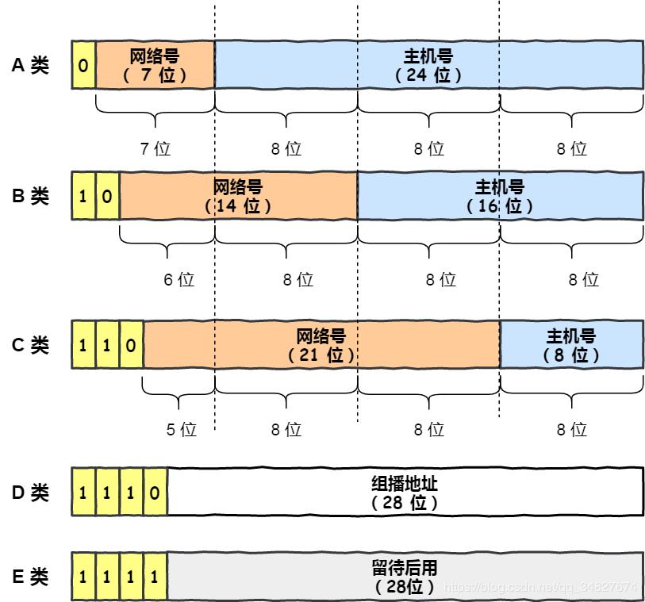

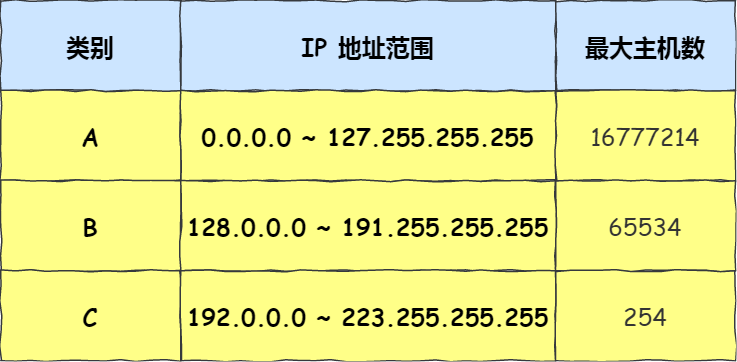

最大主机个数，就是要看主机号的位数，如 C 类地址的主机号占 8 位，那么 C 类地址的最大主机个数：

为什么要减 2 呢？

因为在 IP 地址中，有两个 IP 是特殊的，分别是主机号全为 1 和 全为 0 地址。

+ 主机号全为 1 指定某个网络下的所有主机，用于广播
+ 主机号全为 0 指定某个网络

而 D 类和 E 类地址是没有主机号的，所以不可用于主机 IP，D 类常被用于**多播**，E 类是预留的分类，暂时未使用。

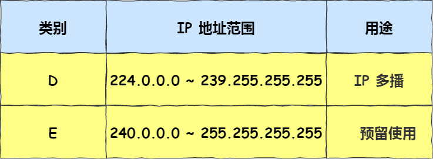

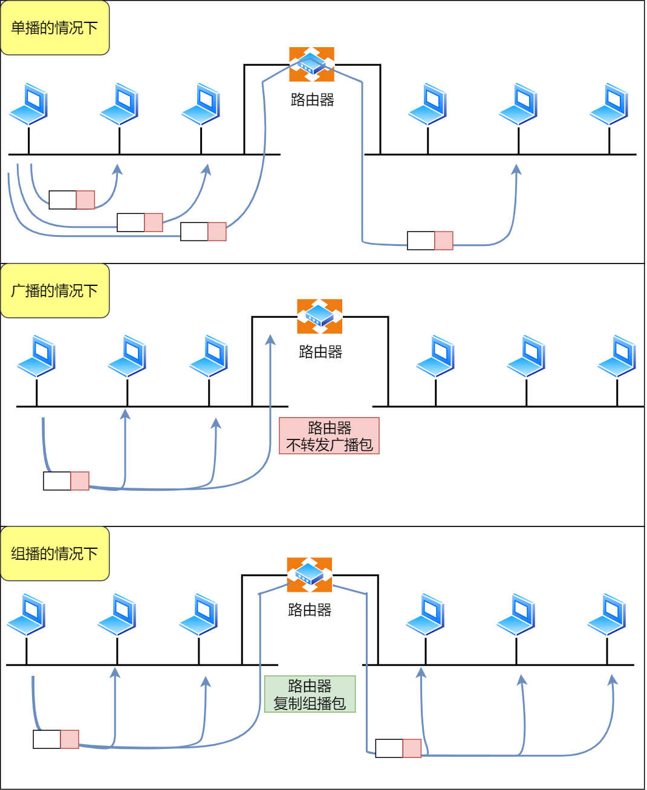

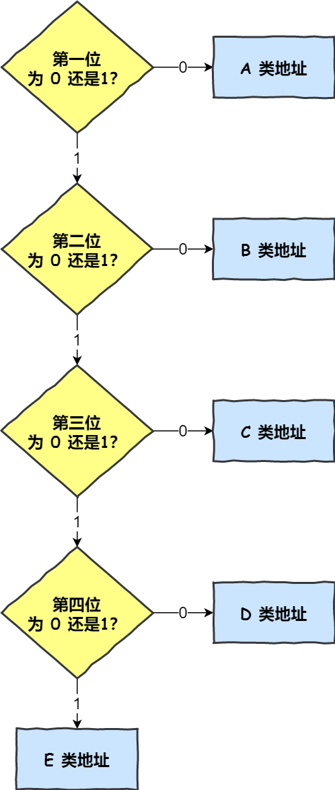

#### 无分类地址 CIDR

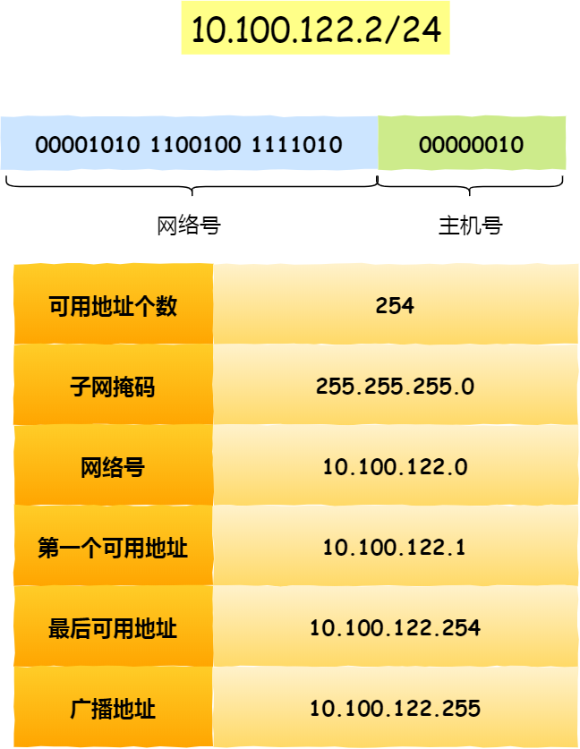

C 类地址中前 24 位是网络号，最后 8 位是主机号，根据子网掩码可知**从 8 位主机号中借用 2 位作为子网号**。

#### 公有 IP 地址与私有 IP 地址

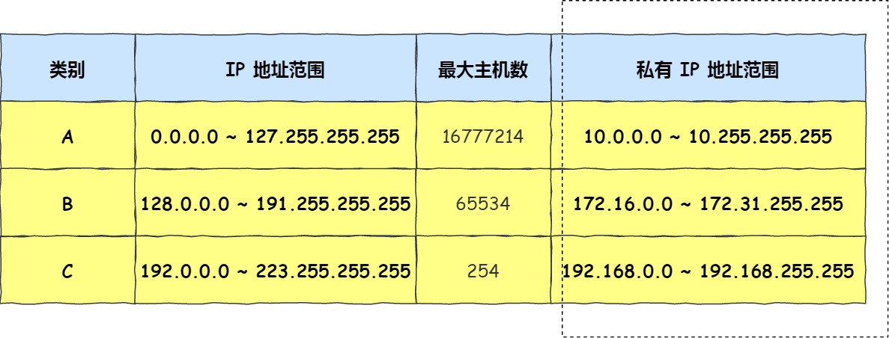

#### IP 地址与路由控制

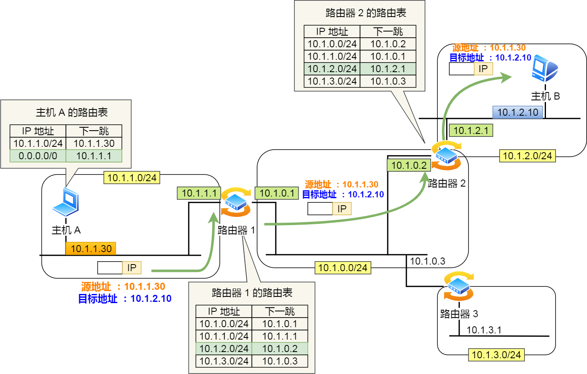

> 环回地址是不会流向网络

环回地址是在同一台计算机上的程序之间进行网络通信时所使用的一个默认地址。

计算机使用一个特殊的 IP 地址 **127.0.0.1 作为环回地址**。与该地址具有相同意义的是一个叫做 `localhost` 的主机名。使用这个 IP 或主机名时，数据包不会流向网络

#### IP 分片与重组

我们最常见数据链路是以太网，它的 MTU 是 `1500` 字节。

那么当 IP 数据包大小大于 MTU 时， IP 数据包就会被分片。

经过分片之后的 IP 数据报在被重组的时候，只能由目标主机进行，路由器是不会进行重组的。

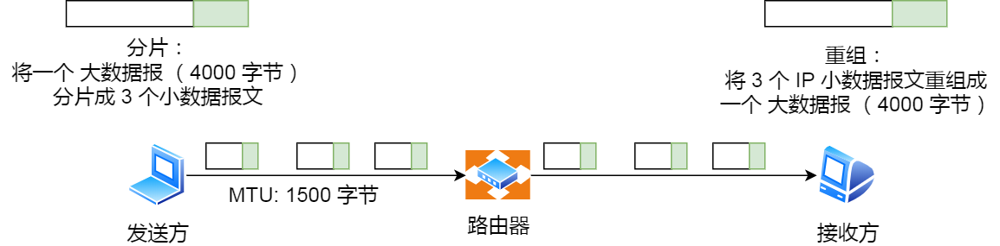

#### IPv6 基本认识

+ IPv6 可自动配置，即使没有 DHCP 服务器也可以实现自动分配IP地址，真是**便捷到即插即用**啊。
+ IPv6 包头包首部长度采用固定的值 `40` 字节，去掉了包头校验和，简化了首部结构，减轻了路由器负荷，大大**提高了传输的性能**。
+ IPv6 有应对伪造 IP 地址的网络安全功能以及防止线路窃听的功能，大大**提升了安全性**。

IPv4 地址长度共 32 位，是以每 8 位作为一组，并用点分十进制的表示方式。

IPv6 地址长度是 128 位，是以每 16 位作为一组，每组用冒号 「:」 隔开。

#### IPv4 首部与 IPv6 首部

+ **取消了首部校验和字段。** 因为在数据链路层和传输层都会校验，因此 IPv6 直接取消了 IP 的校验。
+ **取消了分片/重新组装相关字段。** 分片与重组是耗时的过程，IPv6 不允许在中间路由器进行分片与重组，这种操作只能在源与目标主机，这将大大提高了路由器转发的速度。
+ **取消选项字段。** 选项字段不再是标准 IP 首部的一部分了，但它并没有消失，而是可能出现在 IPv6 首部中的「下一个首部」指出的位置上。删除该选项字段使的 IPv6 的首部成为固定长度的 `40` 字节。

### 点心 —— IP 协议相关技术

#### DNS

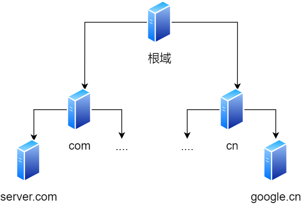

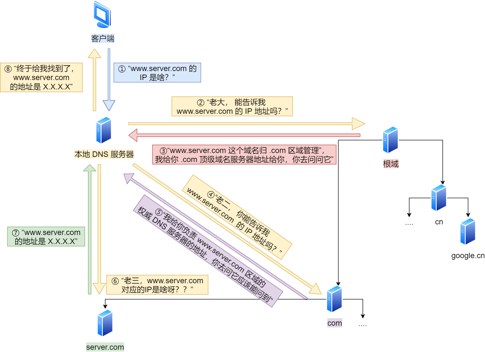

**只指路不带路**

#### ARP 地址解析协议

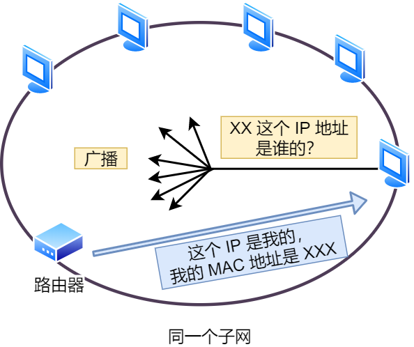

ARP 协议是已知 IP 地址求 MAC 地址，那 RARP 协议正好相反，它是**已知 MAC 地址求 IP 地址**

小型嵌入式设备接入到网络时就经常会用得到。

#### DHCP 动态主机配置协议

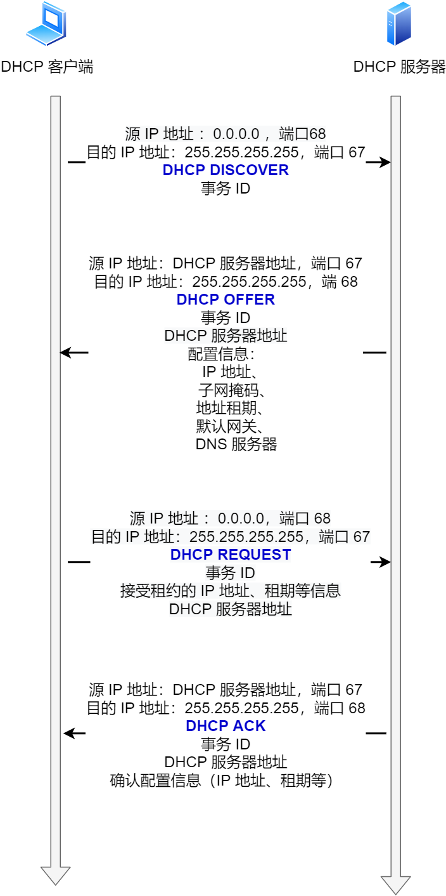

#### NAT **网络地址转换**

简单的来说 NAT 就是同个公司、家庭、教室内的主机对外部通信时，把私有 IP 地址转换成公有 IP 地址。

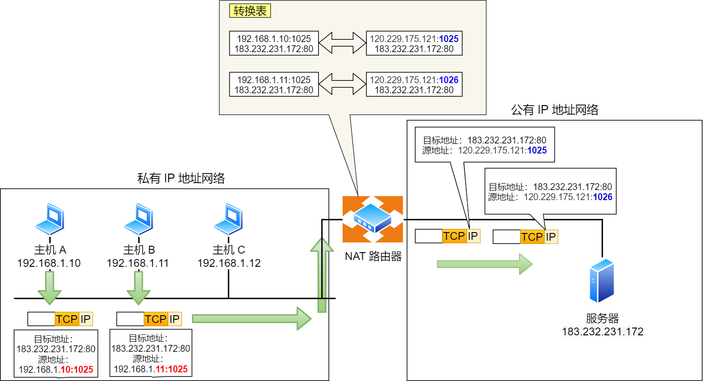

**两个私有 IP 地址都转换 IP 地址为公有地址 120.229.175.121，但是以不同的端口号作为区分。**

#### ICMP **互联网控制报文协议**

**确认 IP 包是否成功送达目标地址、报告发送过程中 IP 包被废弃的原因和改善网络设置等。**

在 `IP` 通信中如果某个 `IP` 包因为某种原因未能达到目标地址，那么这个具体的原因将**由 ICMP 负责通知**。

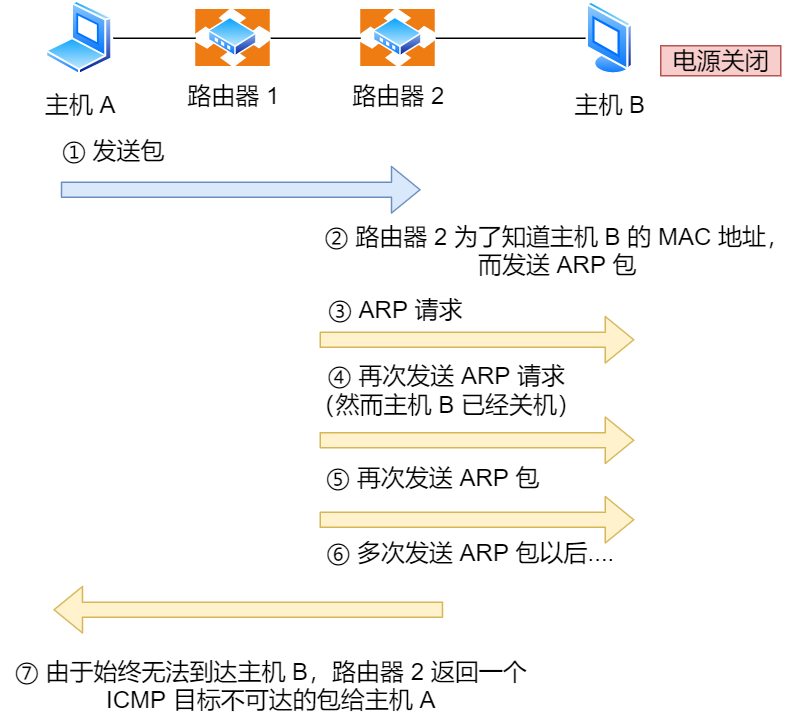

#### IGMP 组播成员管理协议

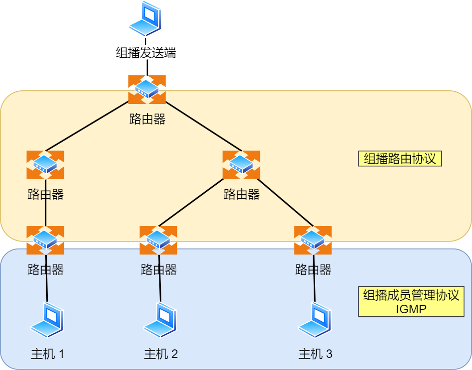

#### 读者问答

## 5.2 ping 的工作原理

### IP协议的助手 —— ICMP 协议

`ICMP` 主要的功能包括：**确认 IP 包是否成功送达目标地址、报告发送过程中 IP 包被废弃的原因和改善网络设置等。**

在 `IP` 通信中如果某个 `IP` 包因为某种原因未能达到目标地址，那么这个具体的原因将**由 ICMP 负责通知**。

### 查询报文类型

+ 目标不可达消息 —— 类型 为 `3`
+ 原点抑制消息 —— 类型 `4`
+ 重定向消息 —— 类型 `5`
+ 超时消息 —— 类型 `11`

### 差错报文类型

### ping —— 查询报文类型的使用

### traceroute —— 差错报文类型的使用

# ——底部——

