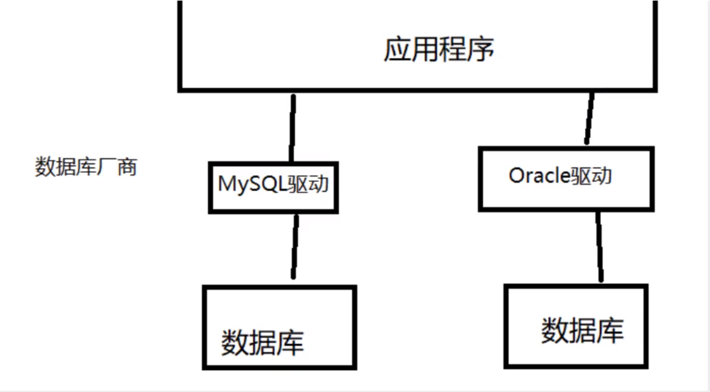
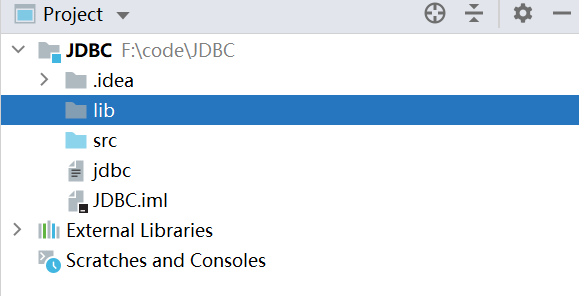
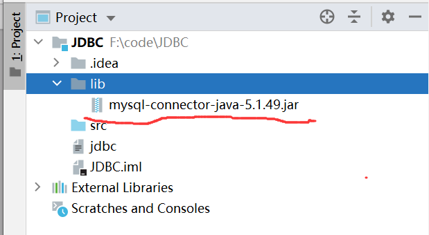
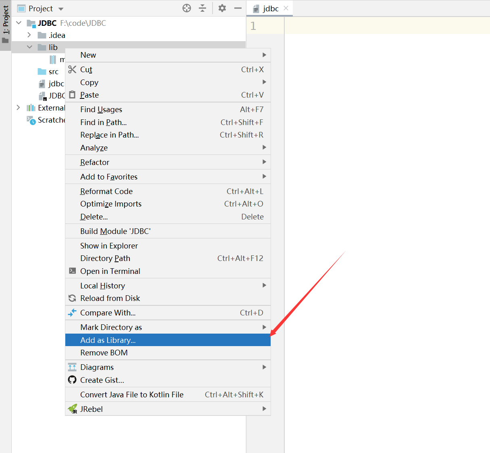
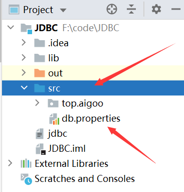

## 11. JDBC

### 11.1 数据库驱动




我们的程序会通过数据库驱动，和数据库打交道


### 10.2 JDBC

SUN公司为了简化开发人员(对数据库的统一)的操作，提供了一个java操作数据库的规范，俗称JDBC，这些规范的实现，由具体的厂商去做! 对于开发人员，我们只需要学习JDBC的接口操作既可以!

java.sq

javax.sql

还需要导入一个数据库驱动包  mysql-connector-java-5.1.49.jar


### 11.3 第一个JDBC程序

准备工作：先在数据库创建一个初始化表供测试用

```mysql
CREATE DATABASE jdbcStudy CHARACTER SET utf8 COLLATE utf8_general_ci;

USE jdbcStudy;

CREATE TABLE users(
	id int PRIMARY KEY,
	NAME VARCHAR(40),
	PASSWORD VARCHAR(40),
	email VARCHAR(60),
	birthday DATE
);

INSERT INTO users(id,NAME,PASSWORD,email,birthday)
VALUE(1,'zhangsan','123456','zs@sina.com','1980-12-04'),
(2,'lisi','123456','lisi@sina.com','1981-12-04'),
(3,'wangwu','123456','wangwu@sina.com','1979-12-04');

```

准备工作2：打开IDEA，创建一个空的JAVA项目，一路继续创建项目

准备工作3：导入JAVA包

	- 首先在项目根目录，点击右键，新建一个lib目录，如下图



	- 然后将我们的JAR包拷贝到lib目录中



- 选择目录，点击右键，选择 [add as libray] 这个时候就导入包成功了




编写我们的测试代码

```java
//我的第一个jdbc程序
public class JdbcFirstDemo {
    public static void main(String[] args) throws ClassNotFoundException, SQLException {
        //1.加载驱动
        /*三种反射方式  Class.forName  ;JdbcFirstDemo.calss ;jdbcFirstDemo.getClass()*/
        Class.forName("com.mysql.jdbc.Driver");  //固定写法，加载驱动
        //2.连接数据库信息  用户信息和url
        /*?useUnicode=true   支持中文编码，&characterEncoding=utf8 设定字符集为utf8  &useSSL=true 使用安全连接*/
        String url = "jdbc:mysql://localhost:3306/jdbcStudy?useUnicode=true&characterEncoding=utf8&useSSL=false";
        String username ="root";
        String password = "123456";
        //3.连接成功了，返回数据库对象  connection代表数据库
        Connection connection = DriverManager.getConnection(url, username, password);
        //4.执行sql的对象   Statement statement执行sql的对象
        Statement statement = connection.createStatement();
        //5.用执行sql的对象去执行sql语句，可能存在结果，查看返回结果
        String sql = "select * from users";
        ResultSet resultSet = statement.executeQuery(sql); //返回的结果集，结果集封装了我们查询出来的所有结果
        //resultSet是一个链表结构
        while (resultSet.next()){
            System.out.println("==========================================");
            System.out.println("id="+resultSet.getObject("id"));
            System.out.println("name="+resultSet.getObject("NAME"));
            System.out.println("pwd="+resultSet.getObject("PASSWORD"));
            System.out.println("email="+resultSet.getObject("email"));
            System.out.println("birthday="+resultSet.getObject("birthday"));
        }

        //6.释放连接
        resultSet.close();
        statement.close();
        connection.close();

    }
}
```


总结

​	1 加载驱动 Class.forName

​	2  连接数据库

​	3 获得执行的Sql的对象Statement

​	4 获得返回的结果集

​	5 释放连接

> DriverManager

```java
//DriverManager.registerDriver(new com.mysql.jdbc.Driver())
Class.forName("com.mysql.jdbc.Driver"); //固定写法，加载驱动
```

> ```java
> String url = "jdbc:mysql://localhost:3306/jdbcStudy?useUnicode=true&characterEncoding=utf8&useSSL=false";
> ```
>
> //mysql-3306
>
> //jdbc:mysql://主机地址:端口号/数据库名?参数1&参数2&参数3.....
>
> //oracle---1521
>
> //jdbc:oracle:thin:@主机地址:端口号:1521:sid
>
> ```java
> Connection connection = DriverManager.getConnection(url, username, password);
> ```
>
> connection 代表数据库，
>
> //数据库设置自动提交
>
> //事务提交
>
> //事务回滚
>
> ​	connection.rollback();
>
> ​	connection.commit();
>
> ​	connection.setAutoCommit();
>
> 


> Statement 执行SQL事务的类  PrepareStatement 执行SQL的对象  createStatement
>
> 
>
> statement.executeQuery() //查询操作返回ResultSet
>
> statement.execute(); //执行任何SQL
>
> statement.executeUpdate(); //更新、插入、删除，都是用这个，返回一个受影响的行数；


> 查询的结果集对象 ResultSet 封装了所有查询结果
>
> Resultset resultSet = statement.exeQuery("select * from users")
>
> resultget.getObject()
>
> resultget.getInt()
>
> resultget.getFloat()
>
> resultget.getDate()
>
> ...........
>
> resultget.next()

> 遍历指针
>
> resultSet.beforeFirst(); //移动到最前面
>
> resultSet.afterLast(); //移动到最后面
>
> resultSet.next()  移动到下一个数据
>
> resultSet.previous()  移动到下一行
>
> resultSet.absolute(row) 移动到指定行
>
> 

> 释放资源
>
> ```java
> resultSet.close();
> statement.close();
> connection.close();
> ```

### 11.4 statement对象

1.编写提取工具类

 - step1. 首先，我们在项目的目录里面，添加我们的mysql配置文件 db.properties,记住这个目录一定要放到项目根目录src下，不然接下来的ClassLoader().getResourceAsStream()可能无法获取到，



 - 在配置文件写入对应的配置信息

   ```java
   driver=com.mysql.jdbc.Driver
   url=jdbc:mysql://localhost:3306/jdbcStudy?useUnicode=true&characterEncoding=utf8&useSSL=false
   username=root
   password=123456
   ```

2.编写工具类，工具类的目的，首先需要加载我们的配置文件

```java
public class JDBCUtils{
    private static String driver =null;//获取数据库的驱动信息
    private static String url =null;//获取连接信息
    private static String username=null; //获取配置文件的用户名
    private static String password=null;//获取配置文件中的密码信息
    /*静态代码，获取配置文件*/
    static{
        try{
            InputStream in = JDBCUtils.class.getClassLoader().getResourceAsStream("db.properties");//读取db.properties配置文件信息
            Properties properties = new Properties();
            properties.load(in);

            driver = properties.getProperty("driver");
            url = properties.getProperty("url");
            username = properties.getProperty("username");
            password = properties.getProperty("password");

            //驱动只会加载一次
            Class.forName(driver);
          }catch(IOException e){
            e.printStackTrace();
        }catch(Exception e){
            e.printStackTrace();
        }
    }
    
    //获取connection
    public static Connection getConnection() throws SQLException{
        return DriverManager.getConnection(url, username, password);
    }
    
    //释放资源
    public static void release(Connection conn, Statement st, ResultSet rs){
        if (rs!=null){
            try {
                rs.close();
            } catch (SQLException throwables) {
                throwables.printStackTrace();
            }
        }
        if (st!=null){
            try {
                st.close();
            } catch (SQLException throwables) {
                throwables.printStackTrace();
            }
        }
        if(conn!=null){
            try {
                conn.close();
            } catch (SQLException throwables) {
                throwables.printStackTrace();
            }
        }
    }
}
```


3.编写增删改  executeUpdate()

增加一条数据

```java
import top.aigoo.lesson02.utils.JDBCUtils;

import java.sql.Connection;
import java.sql.ResultSet;
import java.sql.SQLException;
import java.sql.Statement;

public class TestInsert {
    public static void main(String[] args) {
        Connection conn =null;
        Statement st = null;
        ResultSet rs =null;
        try {
            conn = JDBCUtils.getConnection();
            st = conn.createStatement();
            String sql = "INSERT INTO users(id, `NAME`,`PASSWORD`,`email`,`birthday`)" +
                    "value(4,'kuangshen','1234560','123455@qq.com','2020-10-10')";
            int i = st.executeUpdate(sql);
            if (i>0){
                System.out.println("插入成功!");
            }
        } catch (SQLException throwables) {
            throwables.printStackTrace();
        }finally {
            JDBCUtils.release(conn,st,rs);
        }
    }
}
```

删除一条数据

```java
public class TestDelete {
    public static void main(String[] args) {
        Connection conn = null;
        Statement st = null;
        ResultSet rs = null;
        try {
            conn = JDBCUtils.getConnection();
            st = conn.createStatement();
            String sql = "DELETE FROM `users` WHERE id=4";
            int i = st.executeUpdate(sql);
            if (i > 0) {
                System.out.println("删除成功!");
            }
        } catch (SQLException throwables) {
            throwables.printStackTrace();
        } finally {
            JDBCUtils.release(conn, st, rs);
        }
    }
}
```

修改一条数据

```java
import java.sql.Connection;
import java.sql.ResultSet;
import java.sql.SQLException;
import java.sql.Statement;

public class TestUpdate {
    public static void main(String[] args) {
        Connection conn = null;
        Statement st = null;
        ResultSet rs = null;
        try {
            conn = JDBCUtils.getConnection();
            st = conn.createStatement();
            String sql = "UPDATE `users` set NAME='修改的狂神' WHERE id=4;";
            int i = st.executeUpdate(sql);
            if (i > 0) {
                System.out.println("修改成功!");
            }
        } catch (SQLException throwables) {
            throwables.printStackTrace();
        } finally {
            JDBCUtils.release(conn, st, rs);
        }
    }
}
```


4.查询操作executeQuery()


```java
import top.aigoo.lesson02.utils.JDBCUtils;

import java.sql.Connection;
import java.sql.ResultSet;
import java.sql.SQLException;
import java.sql.Statement;

public class TestQuery {
    public static void main(String[] args) {
        Connection conn = null;
        Statement st = null;
        ResultSet rs = null;
        try {
            conn = JDBCUtils.getConnection();
            st = conn.createStatement();
            String sql = "select * from users";
            rs=st.executeQuery(sql);
            while (rs.next()){
                System.out.println("==========================================");
                System.out.println("id="+rs.getObject("id"));
                System.out.println("name="+rs.getObject("NAME"));
                System.out.println("pwd="+rs.getObject("PASSWORD"));
                System.out.println("email="+rs.getObject("email"));
                System.out.println("birthday="+rs.getObject("birthday"));
            }
        } catch (SQLException throwables) {
            throwables.printStackTrace();
        } finally {
            JDBCUtils.release(conn, st, rs);
        }
    }
}
```


5.SQL注入的问题


SQL存在漏洞，导致攻击导致数据泄露，SQL会被拼接  or

示例代码

```java
import top.aigoo.lesson02.utils.JDBCUtils;

import java.sql.Connection;
import java.sql.ResultSet;
import java.sql.SQLException;
import java.sql.Statement;

public class SQL注入 {
    public static void main(String[] args) {
        /*当用户名使用 ' or 1=1 时候，拼接到查询语句："select * from users WHERE `NAME`='"+username+"' and
        `PASSWORD`='"+password+"'"就变成了
        * select * from users where `name` ='' or '1=1' and `password`='' or '1=1'
        * */
        login(" ' or '1=1","123456");
    }
    public static void login(String username,String password){
        Connection conn = null;
        Statement st = null;
        ResultSet rs = null;
        try {
            conn = JDBCUtils.getConnection();
            st = conn.createStatement();
            //只需要这样记住就行：单引号 括双引号 两个加号 中间变量   ( 0Q0   OMG)
            String sql = "select * from users WHERE `NAME`='"+username+"' and `PASSWORD`='"+password+"'";
            System.out.println("sql--->"+sql);
            rs=st.executeQuery(sql);
            while (rs.next()){
                System.out.println("==========================================");
                System.out.println("id="+rs.getObject("id"));
                System.out.println("name="+rs.getObject("NAME"));
                System.out.println("pwd="+rs.getObject("PASSWORD"));
                System.out.println("email="+rs.getObject("email"));
                System.out.println("birthday="+rs.getObject("birthday"));
            }
        } catch (SQLException throwables) {
            throwables.printStackTrace();
        } finally {
            JDBCUtils.release(conn, st, rs);
        }
    }
}
```

### 11.5 PrepareStatement对象

可以防止sql注入并且效率更好

1、 添加

```java
import top.aigoo.lesson02.utils.JDBCUtils;

import java.sql.Connection;
import java.util.Date;
import java.sql.PreparedStatement;
import java.sql.SQLException;


public class TestInsert {
    public static void main(String[] args) {
        Connection conn = null;
        PreparedStatement st = null;
        try {
            conn = JDBCUtils.getConnection();

            String sql = "insert into users(`id`,`name`,`password`,`email`,`birthday`) value (?,?,?,?,?)";

            st = conn.prepareStatement(sql);

            st.setInt(1,5);
            st.setString(2,"王二麻子");
            st.setString(3,"123456");
            st.setString(4,"Hellokity@sina.com");
            st.setDate(5,new java.sql.Date(new Date().getTime()));

            int i = st.executeUpdate();

            if (i > 0) {
                System.out.println("添加成功");
            }
        } catch (SQLException throwables) {
            throwables.printStackTrace();
        } finally {
            JDBCUtils.release(conn, st, null);
        }
    }
}
```


2、 删除

```java
import top.aigoo.lesson02.utils.JDBCUtils;

import java.sql.Connection;
import java.sql.PreparedStatement;
import java.sql.SQLException;

public class TestDelete {
    public static void main(String[] args) {
        Connection conn=null;
        PreparedStatement st =null;
        try {
            conn = JDBCUtils.getConnection();
            String sql = "delete from users where id=?";
            st = conn.prepareStatement(sql);
            st.setInt(1,5);
            int i = st.executeUpdate();
            if (i>0){
                System.out.println("删除成功!");
            }

        } catch (SQLException throwables) {
            throwables.printStackTrace();
        }finally {
            JDBCUtils.release(conn, st, null);
        }
    }
}
```


3、 更新

```java
import top.aigoo.lesson02.utils.JDBCUtils;

import java.sql.Connection;
import java.sql.PreparedStatement;
import java.sql.SQLException;

public class TestUpdate {
    public static void main(String[] args) {
        Connection conn =null;
        PreparedStatement st =null;
        try {
             conn = JDBCUtils.getConnection();
             String sql = "update users set name =? where id=?";
             st = conn.prepareStatement(sql);
			//手动给参数赋值
             st.setString(1,"测试框");
             st.setInt(2, 5);

            int i = st.executeUpdate();

            if (i>0){
                System.out.println("更新成功");
            }

        } catch (SQLException throwables) {
            throwables.printStackTrace();
        }finally {
            JDBCUtils.release(conn, st, null);
        }
    }
}
```


4、查询

```java
import top.aigoo.lesson02.utils.JDBCUtils;

import java.sql.Connection;
import java.sql.PreparedStatement;
import java.sql.ResultSet;
import java.sql.SQLException;

public class TestQuery {
    public static void main(String[] args) {
        Connection conn =null;
        PreparedStatement st =null;
        ResultSet rs=null;


        try {
            conn = JDBCUtils.getConnection();
            String sql = "select * from users where name=?";
            st = conn.prepareStatement(sql);
            st.setString(1,"zhangsan");
            rs = st.executeQuery();

            while (rs.next()){
                System.out.println(rs.getString("name"));
            }

        } catch (SQLException throwables) {
            throwables.printStackTrace();
        }finally {
            JDBCUtils.release(conn,st,rs);
        }
    }
}
```


5、防止SQL注入

```java
import top.aigoo.lesson02.utils.JDBCUtils;

import java.sql.*;

public class SQL注入 {
    public static void main(String[] args) {
        /*当用户名使用 ' or 1=1 时候，拼接到查询语句："select * from users WHERE `NAME`='"+username+"' and
        `PASSWORD`='"+password+"'"就变成了
        * select * from users where `name` ='' or '1=1' and `password`='' or '1=1'
        * */
        login(" '' or 1=1","123456");
        //login("zhangsan","123456");
    }
    public static void login(String username,String password){
        Connection conn = null;
        PreparedStatement st = null;
        ResultSet rs = null;
        try {
            conn = JDBCUtils.getConnection();
            String sql = "select * from users WHERE `NAME`=? and `PASSWORD`=?";
            st = conn.prepareStatement(sql);
            st.setString(1,username);
            st.setString(2,password);

            rs=st.executeQuery();

            while (rs.next()){
                System.out.println("==========================================");
                System.out.println("id="+rs.getObject("id"));
                System.out.println("name="+rs.getObject("NAME"));
                System.out.println("pwd="+rs.getObject("PASSWORD"));
                System.out.println("email="+rs.getObject("email"));
                System.out.println("birthday="+rs.getObject("birthday"));
            }
        } catch (SQLException throwables) {
            throwables.printStackTrace();
        } finally {
            JDBCUtils.release(conn, st, rs);
        }
    }
}
```

原理：PrepareStatement 会将传进来的参数都看作String,  也就是传进来的字符都会加上 ""，对于那些转义字符，直接忽略

### 11.6 使用IDEA连接数据库


### 11.7 JDBC操作事务

要么都成功，要么都失败

**ACID** 

原子性，要么都完成，要么都不完成

一致性，结果总数保持不变

**隔离性，多个进程互相不干扰** 隔离会导致问题，

- 脏读，事务读取了另一个没有提交的事务，
- 不可重复读，第一次读和第二次读不一致，
- 幻读或者虚读 在一个事务内，读取到了别人插入的数据，导致前后读出的结果不一致

持久性， 一旦提交了就不可回滚

事务成功的示例代码

```java
public class TestTransaction1 {
    public static void main(String[] args) {
        Connection conn = null;
        PreparedStatement st = null;
        ResultSet rs = null;

        try {

            conn = JDBCUtils.getConnection();
            /*开启一个事务，类似于mysql语句中 :  set autocommit=0 ;start transaction*/
            conn.setAutoCommit(false);

            String sql1 = "update account set money=money-100 where name='A'";
            st = conn.prepareStatement(sql1);
            st.executeUpdate();

            String sql2 = "update account set money=money+100 where name='B'";
            st = conn.prepareStatement(sql2);
            int i = st.executeUpdate();
            if (i>0){
                System.out.println("更新成功!");
            }
            conn.commit();


        } catch (SQLException throwables) {
            try {
                conn.rollback();
            } catch (SQLException e) {
                e.printStackTrace();
            }
            throwables.printStackTrace();
        } finally {
            JDBCUtils.release(conn, st, rs);
        }
    }
}
```

模拟事务失败的操作代码

```java
/*测试事务更新失败*/
public class TestTransaction2 {
    public static void main(String[] args) {
        Connection conn = null;
        PreparedStatement st = null;
        ResultSet rs = null;

        try {

            conn = JDBCUtils.getConnection();
            /*开启一个事务，类似于mysql语句中 :  set autocommit=0 ;start transaction*/
            conn.setAutoCommit(false);

            String sql1 = "update account set money=money-100 where name='A'";
            st = conn.prepareStatement(sql1);
            st.executeUpdate();

            int x = 1/0;  //此处一定会导致下面业务代码无法执行，模拟事务失败的操作

            String sql2 = "update account set money=money+100 where name='B'";
            st = conn.prepareStatement(sql2);
            int i = st.executeUpdate();
            if (i > 0) {
                System.out.println("更新成功!");
            }
            conn.commit();


        } catch (SQLException throwables) {
            try {
                conn.rollback();
            } catch (SQLException e) {
                e.printStackTrace();
            }
            throwables.printStackTrace();
        } finally {
            JDBCUtils.release(conn, st, rs);
        }
    }
}
```

### 11.8 数据库连接池

数据库连接--执行完毕---释放-

连接--释放十分浪费系统资源

**池化技术： 准备一些预先的资源，过来就连接预先准备好的**

最小连接数 10

最大连接数 15

等待超时 100mx


编写连接池，实现一个接口DataSource

世界上知名的连接池实现类  ，开源数据源实现，DBCP C3P0 Druid(阿里巴巴德鲁伊)，使用了这些数据库连接池之后，我们在项目开发中就不需要编写连接数据库的代码!

> DBCP

需要的JAR包

commons-pool2-2.9.0.jar   commons-dbcp2-2.8.0.jar

```java
import java.sql.Connection;
import java.sql.PreparedStatement;
import java.sql.SQLException;
import java.util.Date;

public class TestInsert {
    public static void main(String[] args) {
        Connection conn = null;
        PreparedStatement st = null;
        try {
            conn = JdbcUtils_DBCP.getConnection();
            String sql = "insert into users(`id`,`name`,`password`,`email`,`birthday`) values (?,?,?,?,?)";
            st = conn.prepareStatement(sql);

            st.setInt(1,8);
            st.setString(2,"hewu");
            st.setString(3,"123456");
            st.setString(4,"hewu@qq.com");
            st.setDate(5, new java.sql.Date(new Date().getTime()));
            //执行
            int i = st.executeUpdate();
            if (i>0){
                System.out.println("插入成功!");
            }

        } catch (SQLException throwables) {
            throwables.printStackTrace();
        }finally {
            JdbcUtils_DBCP.release(conn,st,null);
        }
    }
}
```

```jdbcconfig.properties
#连接设置,这里面的名字，是DBCP数据源中定义好的
driverClassName=com.mysql.jdbc.Driver
url=jdbc:mysql://localhost:3306/jdbcStudy?useUnicode=true&characterEncoding=utf8&useSSL=false
username=root
password=123456

#<!--初始化连接-->
initialSize =10

#最大连接数量
maxActive=50

#<!--最大空闲连接-->
maxIdle=20

#<!--最小空闲连接-->
minIdle=5

#<!--超时等待时间以毫秒为单位 600毫秒/1000 等于60s-->
maxWait=60000

#JDBC驱动建立连接时附带的连接属性属性的格式必须为这样：[属性名=property;]
#注意:"user"与“password”两个属性会被明确地传递，因此这里不需要包含他们。
connectionProperties=useUnicode=true;characterEncoding=UTF8

#指定由连接池锁创建的连接的自动提交(auto-commit)状态。
defaultAutoCommit=true

#driver default 指定由连接池所创建的连接的只读(read-only)状态。
#如果没有设置该值，则"setReadOnly"方法将不被调用。(某些驱动并不支持只读模式，如Informix)
#defaultReadOnly=true

#driver default 指定由连接池所创建的连接的事务级别(TransactionIsolation).
#可用值为下列之一:(详情可见javadoc.)NONE,READ_UNCOMMITTED,READ_COMMITTED,REPEATABLE_READ,SERIALIZABLE
defaultTransactionIsolation=READ_UNCOMMITTED
```

工具java类

```java
import javax.sql.DataSource;
import java.io.IOException;
import java.io.InputStream;
import java.sql.*;
import java.util.Properties;

public class JdbcUtils_DBCP {

    private static DataSource dataSource = null;

    static {
        try {
            InputStream in = JdbcUtils_DBCP.class.getClassLoader().getResourceAsStream("dbcpconfig.properties");//读取配置文件
            Properties properties = new Properties();
            properties.load(in);
            //进行创建数据源  工厂模式--创建对象
            dataSource = BasicDataSourceFactory.createDataSource(properties);
        } catch (IOException e) {
            e.printStackTrace();
        } catch (Exception e) {
            e.printStackTrace();
        }
    }
    //获取connection
    public  static Connection getConnection() throws SQLException {
        return dataSource.getConnection(); //从数据源中获取连接
    }
    //释放资源
    public static void release(Connection conn, Statement st, ResultSet rs){
        if (rs!=null){
            try {
                rs.close();
            } catch (SQLException throwables) {
                throwables.printStackTrace();
            }
        }
        if (st!=null){
            try {
                st.close();
            } catch (SQLException throwables) {
                throwables.printStackTrace();
            }
        }
        if(conn!=null){
            try {
                conn.close();
            } catch (SQLException throwables) {
                throwables.printStackTrace();
            }
        }
    }
}
```

c3p0 示例

需要的jar包:

c3p0-0.9.5.5.jar

mchange-commons-java-0.2.19.jar

```xml
<?xml version="1.0" encoding="UTF-8"?>
<c3p0-config>
    <!-- C3P0默认配置，如果没有指定则使用这个配置
         如果在代码“ComboPooledDataSource ds = new ComboPooledDataSource();” 这样写就表示使用的是C3P0的缺省配置-->
    <default-config>


        <property name="driverClass">com.mysql.jdbc.Driver</property>
        <property name="jdbcUrl">jdbc:mysql://localhost:3306/jdbcStudy?useUnicode=true&amp;characterEncoding=utf8&amp;useSSL=false</property>
        <property name="user">root</property>
        <property name="password">123456</property>

        <property name="acquireIncrement">5</property>
        <property name="initialPoolSize">10</property>
        <property name="minPoolSize">5</property>
        <property name="maxPoolSize">20</property>

        <property name="checkoutTimeout">30000</property>
        <property name="idleConnectionTestPeriod">30</property>
        <property name="maxIdleTime">30</property>
        <property name="maxStatements">200</property>
    </default-config>

    <!-- C3P0的命名的配置,如果在代码中"ComboPooledDataSource ds = new ComboPooledDataSource(MySQL);" 这样写
    就表示使用的是name是MySQL的配置文件 -->
    <named-config name="MySQL">
        <property name="driverClass">com.mysql.jdbc.Driver</property>
        <property name="jdbcUrl">jdbc:mysql://localhost:3306/jdbcStudy?useUnicode=true&amp;characterEncoding=utf8&amp;useSSL=false</property>
        <property name="user">root</property>
        <property name="password">123456</property>

        <!-- 如果池中数据连接不够时一次增长多少个 -->
        <property name="acquireIncrement">5</property>
        <!-- 初始化数据库连接池时连接的数量 -->
        <property name="initialPoolSize">20</property>
        <!-- 数据库连接池中的最小的数据库连接数 -->
        <property name="minPoolSize">5</property>
        <!-- 数据库连接池中的最大的数据库连接数 -->
        <property name="maxPoolSize">25</property>
    </named-config>
</c3p0-config>

```

```java
package top.aigoo.lesson05;

import top.aigoo.lesson05.utils.JdbcUtils_C3P0;
import top.aigoo.lesson05.utils.JdbcUtils_DBCP;

import java.sql.Connection;
import java.sql.PreparedStatement;
import java.sql.SQLException;
import java.util.Date;

public class TestC3P0 {
    public static void main(String[] args) {
        Connection conn = null;
        PreparedStatement st = null;
        try {
            conn = JdbcUtils_C3P0.getConnection();
            String sql = "insert into users(`id`,`name`,`password`,`email`,`birthday`) values (?,?,?,?,?)";
            st = conn.prepareStatement(sql);

            st.setInt(1,9);
            st.setString(2,"hewu");
            st.setString(3,"123456");
            st.setString(4,"hewu@qq.com");
            st.setDate(5, new java.sql.Date(new Date().getTime()));
            //执行
            int i = st.executeUpdate();
            if (i>0){
                System.out.println("插入成功!");
            }

        } catch (SQLException throwables) {
            throwables.printStackTrace();
        }finally {
            JdbcUtils_DBCP.release(conn,st,null);
        }
    }
}

```

> 结论

无论使用什么数据源，本质是一样的，DataSource接口是不会变!
