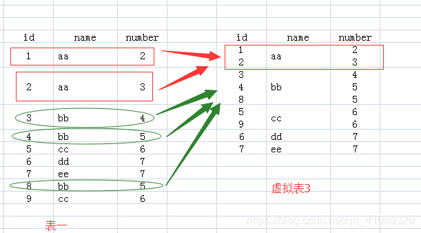
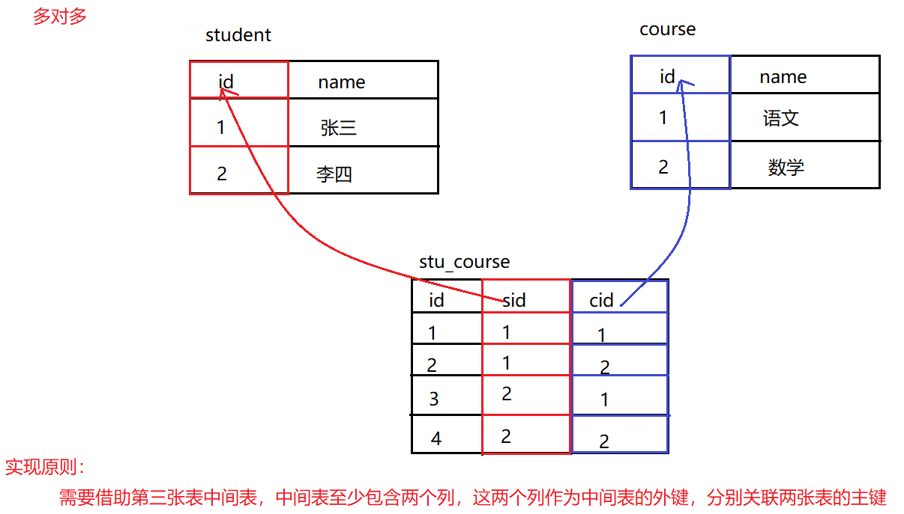
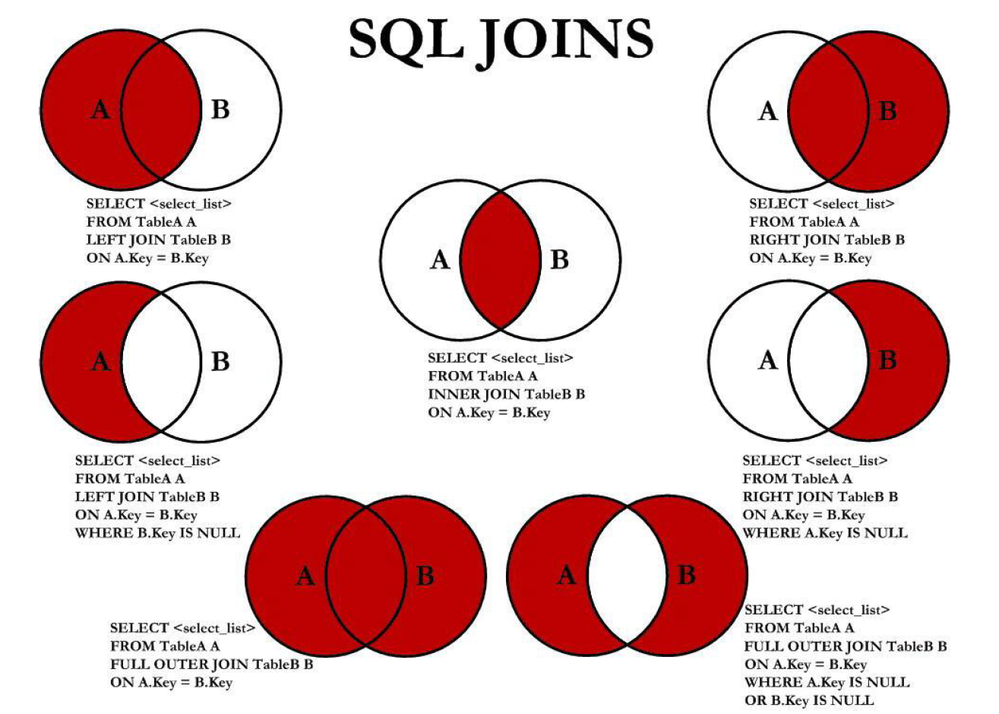
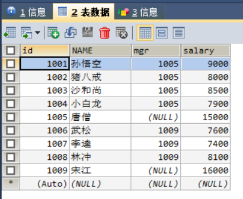
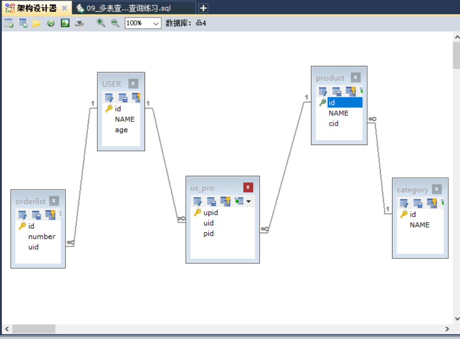

# SQL语言的分类

SQL语言共分为四大类：数据查询语言DQL，数据操纵语言DML，数据定义语言DDL，数据控制语言DCL。

## 1.数据查询语言DQL

数据查询语言DQL基本结构是由SELECT子句，FROM子句，WHERE
子句组成的查询块：
SELECT <字段名表>
FROM <表或视图名>
WHERE <查询条件>

## 2 .数据操纵语言DML

数据操纵语言DML主要有三种形式：
\1) 插入：INSERT
\2) 更新：UPDATE
\3) 删除：DELETE

## 3.数据定义语言DDL

数据定义语言DDL用来创建数据库中的各种对象-----表、视图、
索引、同义词、聚簇等如：
CREATE TABLE/VIEW/INDEX/SYN/CLUSTER
          |      |      |      |      |
         表   视图  索引  同义词  簇

DDL操作是隐性提交的！不能rollback 

## 4.数据控制语言DCL

数据控制语言DCL用来授予或回收访问数据库的某种特权，并控制
数据库操纵事务发生的时间及效果，对数据库实行监视等。

### 1) GRANT：授权。

### 2) ROLLBACK [WORK] TO [SAVEPOINT]：回退到某一点。

回滚---ROLLBACK
回滚命令使数据库状态回到上次最后提交的状态。其格式为：
SQL>ROLLBACK;

### 3) COMMIT [WORK]：提交。

在数据库的插入、删除和修改操作时，只有当事务在提交到数据
库时才算完成。在事务提交前，只有操作数据库的这个人才能有权看
到所做的事情，别人只有在最后提交完成后才可以看到。
提交数据有三种类型：显式提交、隐式提交及自动提交。下面分
别说明这三种类型。

#### (1) 显式提交

用COMMIT命令直接完成的提交为显式提交。其格式为：
SQL>COMMIT；

#### (2) 隐式提交

用SQL命令间接完成的提交为隐式提交。这些命令是：
ALTER，AUDIT，COMMENT，CONNECT，CREATE，DISCONNECT，DROP，
EXIT，GRANT，NOAUDIT，QUIT，REVOKE，RENAME。

#### (3) 自动提交

若把AUTOCOMMIT设置为ON，则在插入、修改、删除语句执行后，
系统将自动进行提交，这就是自动提交。其格式为：
SQL>SET AUTOCOMMIT ON

 

## 还有事务控制语句TCL：

SAVEPOINT：保存点

ROLLBACK：回退到某点

COMMIT：提交事务

# 单表操作

## DDL数据库对象

### 数据库

* R(Retrieve)：查询

  * 查询所有数据库：

    ```mysql
    SHOW DATABASES;
    ```

  * 查询某个数据库的创建语句

    ```sql
    SHOW CREATE DATABASE 数据库名称;  -- 标准语法
    
    SHOW CREATE DATABASE mysql;     -- 查看mysql数据库的创建格式
    ```

    

* C(Create)：创建

  * 创建数据库

    ```mysql
    CREATE DATABASE 数据库名称;-- 标准语法
    
    CREATE DATABASE db1;     -- 创建db1数据库
    ```

  * 创建数据库（判断，如果不存在则创建）

    ```mysql
    CREATE DATABASE IF NOT EXISTS 数据库名称;
    ```

  * 创建数据库，并指定字符集

    ```mysql
    CREATE DATABASE 数据库名称 CHARACTER SET 字符集名称;
    ```

  * 例如：创建db4数据库、如果不存在则创建，指定字符集为gbk

    ```mysql
    -- 创建db4数据库、如果不存在则创建，指定字符集为gbk
    CREATE DATABASE IF NOT EXISTS db4 CHARACTER SET gbk;
    
    -- 查看db4数据库的字符集
    SHOW CREATE DATABASE db4;
    ```

    

* U(Update)：修改

  * 修改数据库的字符集

    ```mysql
    ALTER DATABASE 数据库名称 CHARACTER SET 字符集名称;
    ```

  * 常用字符集：

    ```mysql
    --查询所有支持的字符集
    SHOW CHARSET;
    --查看所有支持的校对规则
    SHOW COLLATION;
    
    -- 字符集: utf8,latinI,GBK,,GBK是utf8的子集
    -- 校对规则: ci 大小定不敏感，cs或bin大小写敏感
    ```

    

* D(Delete)：删除

  * 删除数据库：

    ```mysql
    DROP DATABASE 数据库名称;
    ```

  * 删除数据库(判断，如果存在则删除)：

    ```mysql
    DROP DATABASE IF EXISTS 数据库名称;
    ```

    

* 使用数据库：

  * 查询当前正在使用的数据库名称

    ```mysql
    SELECT DATABASE();
    ```

  * 使用数据库

    ```mysql
    USE 数据库名称； -- 标准语法
    USE db4;	   -- 使用db4数据库
    ```


***


### 数据表

- R(Retrieve)：查询

  - 查询数据库中所有的数据表

    ```mysql
    USE mysql;-- 使用mysql数据库
    
    SHOW TABLES;-- 查询库中所有的表
    ```

  - 查询表结构

    ```mysql
    DESC 表名;
    ```

  - 查询表字符集

    ```mysql
    SHOW TABLE STATUS FROM 库名 LIKE '表名';
    ```

    

- C(Create)：创建

  - 创建数据表

    ```mysql
    CREATE TABLE 表名(
        列名1 数据类型1,
        列名2 数据类型2,
        ....
        列名n 数据类型n
    );
    -- 注意：最后一列，不需要加逗号
    ```

  - 复制表

    ```mysql
    CREATE TABLE 表名 LIKE 被复制的表名;  -- 标准语法
    
    CREATE TABLE product2 LIKE product; -- 复制product表到product2表
    ```

  - 数据类型

    | 数据类型  | 说明                                                         |
    | --------- | ------------------------------------------------------------ |
    | INT       | 整数类型                                                     |
    | DOUBLE    | 小数类型                                                     |
    | DATE      | 日期，只包含年月日：yyyy-MM-dd                               |
    | DATETIME  | 日期，包含年月日时分秒：yyyy-MM-dd HH:mm:ss                  |
    | TIMESTAMP | 时间戳类型，包含年月日时分秒：yyyy-MM-dd HH:mm:ss<br />如果不给这个字段赋值或赋值为 NULL，则默认使用当前的系统时间 |
    | CHAR      | 字符串，定长类型                                             |
    | VARCHAR   | 字符串，**变长类型**<br />name varchar(20) 代表姓名最大 20 个字符：zhangsan 8 个字符，张三 2 个字符 |

    `INT(n)`：n 代表位数

    * 3：int（9）显示结果为 000000010
    * 3：int（3）显示结果为 010

    `varchar(n)`：n 表示的是字符数

  - 例如：

    ```mysql
    -- 使用db3数据库
    USE db3;
    
    -- 创建一个product商品表
    CREATE TABLE product(
    	id INT,				-- 商品编号
    	NAME VARCHAR(30),	-- 商品名称
    	price DOUBLE,		-- 商品价格
    	stock INT,			-- 商品库存
    	insert_time DATE    -- 上架时间
    );
    ```

​    

- U(Update)：修改

  - 修改表名

    ```mysql
    ALTER TABLE 表名 RENAME TO 新的表名;
    ```

  - 修改表的字符集

    ```mysql
    ALTER TABLE 表名 CHARACTER SET 字符集名称;
    ```

  - 添加一列

    ```mysql
    ALTER TABLE 表名 ADD 列名 数据类型;
    ```

  - 修改列数据类型

    ```mysql
    ALTER TABLE 表名 MODIFY 列名 新数据类型;
    ```

  - 修改列名称和数据类型

    ```mysql
    ALTER TABLE 表名 CHANGE 列名 新列名 新数据类型;
    ```

  - 删除列

    ```mysql
    ALTER TABLE 表名 DROP 列名;
    ```

    

- D(Delete)：删除

  - 删除数据表

    ```mysql
    DROP TABLE 表名;
    ```

  - 删除数据表(判断，如果存在则删除)

    ```mysql
    DROP TABLE IF EXISTS 表名;
    ```

    


## DML增删改

### INSERT

* 新增表数据

  * 新增格式 1：给指定列添加数据

    ```mysql
    INSERT INTO 表名(列名1,列名2...) VALUES (值1,值2...);
    ```

  * 新增格式 2：默认给全部列添加数据

    ```mysql
    INSERT INTO 表名 VALUES (值1,值2,值3,...);
    ```

  * 新增格式 3：批量添加数据

    ```mysql
    -- 给指定列批量添加数据
    INSERT INTO 表名(列名1,列名2,...) VALUES (值1,值2,...),(值1,值2,...)...;
    
    -- 默认给所有列批量添加数据 
    INSERT INTO 表名 VALUES (值1,值2,值3,...),(值1,值2,值3,...)...;
    ```

* 字符串拼接

  ```mysql
  CONCAT(string1,string2,'',...)
  ```

  

* 注意事项

  - 列名和值的数量以及数据类型要对应
  - 除了数字类型，其他数据类型的数据都需要加引号(单引双引都可以，推荐单引)


***


### UPDATE

* 修改表数据语法

  * 标准语法

    ```mysql
    UPDATE 表名 SET 列名1 = 值1,列名2 = 值2,... [where 条件];
    ```

  * 修改电视的价格为1800、库存为36

    ```mysql
    UPDATE product SET price=1800,stock=36 WHERE NAME='电视';
    SELECT * FROM product;-- 查看所有商品信息
    ```

* 注意事项

  - 修改语句中必须加条件
  - 如果不加条件，则将所有数据都修改


***


### DELETE

* 删除表数据语法

  ```mysql
  DELETE FROM 表名 [WHERE 条件];
  ```

* 注意事项

  * 删除语句中必须加条件
  * 如果不加条件，则将所有数据删除


## DQL查

### 查询语法

数据库查询遵循条件在前的原则

```mysql
SELECT DISTINCT
	<select list>
FROM
	<left_table> <join_type>
JOIN
	<right_table> ON <join_condition>	-- 连接查询在多表查询部分详解
WHERE
	<where_condition>
GROUP BY
	<group_by_list>
HAVING
	<having_condition>
ORDER BY
	<order_by_condition>
LIMIT
	<limit_params>
```

执行顺序：

```mysql
FROM	<left_table>

ON 		<join_condition>

<join_type>		JOIN	<right_table>

WHERE		<where_condition>

GROUP BY 	<group_by_list>

HAVING		<having_condition>

SELECT DISTINCT		<select list>

ORDER BY	<order_by_condition>

LIMIT		<limit_params>
```


***


### 查询全部

* 查询全部的表数据

  ```mysql
  -- 标准语法
  SELECT * FROM 表名;
  
  -- 查询product表所有数据(常用)
  SELECT * FROM product;
  ```

* 查询指定字段的表数据

  ```mysql
  SELECT 列名1,列名2,... FROM 表名;
  ```

* **去除重复查询**：只有值选中输出的列全部相同的才可以去除，需要创建临时表辅助查询

  ```mysql
  SELECT DISTINCT 列名1,列名2,... FROM 表名;
  ```

* 计算列的值（四则运算）

  ```mysql
  SELECT 列名1 运算符(+ - * /) 列名2 FROM 表名;
  
  /*如果某一列值为null，可以进行替换
  	ifnull(表达式1,表达式2)
  	表达式1：想替换的列
  	表达式2：想替换的值*/
  ```

  例如：

  ```mysql
  -- 查询商品名称和库存，库存数量在原有基础上加10
  SELECT NAME,stock+10 FROM product;
  
  -- 查询商品名称和库存，库存数量在原有基础上加10。进行null值判断
  SELECT NAME,IFNULL(stock,0)+10 FROM product;
  ```

* **起别名**

  ```mysql
  SELECT 列名1,列名2,... AS 别名 FROM 表名;
  ```

  例如：

  ```mysql
  -- 查询商品名称和库存，库存数量在原有基础上加10。进行null值判断，起别名为getSum,AS可以省略。
  SELECT NAME,IFNULL(stock,0)+10 AS getsum FROM product;
  SELECT NAME,IFNULL(stock,0)+10 getsum FROM product;
  
  -- 列别名、表别名
  select  column_1  as  列1,column_2 as  列2   from  table  as  表1
  -- 上面的语句就可以解释为，选择 column_1  作为  列1,column_2 作为   列2  从 table  当成 表1
  ```


***


### 条件查询

* 条件查询语法

  ```mysql
  SELECT 列名 FROM 表名 WHERE 条件;
  ```

* 条件分类

  | 符号                | 功能                                                         |
  | ------------------- | ------------------------------------------------------------ |
  | >                   | 大于                                                         |
  | <                   | 小于                                                         |
  | >=                  | 大于等于                                                     |
  | <=                  | 小于等于                                                     |
  | =                   | 等于                                                         |
  | <> 或 !=            | 不等于                                                       |
  | BETWEEN ... AND ... | 在某个范围之内(都包含）【a,b】全封闭结构，即 大于等于a并小于等于b。 |
  | IN(...)             | 多选一                                                       |
  | LIKE                | **模糊查询**：_单个任意字符、%任意个字符、[] 匹配集合内的字符<br/>`LIKE '[^AB]%' `：不以 A 和 B 开头的任意文本 |
  | IS NULL             | 是NULL                                                       |
  | IS NOT NULL         | 不是NULL                                                     |
  | AND 或 &&           | 并且                                                         |
  | OR 或 \|\|          | 或者                                                         |
  | NOT 或 !            | 非，不是                                                     |
  | UNION               | 对两个结果集进行**并集操作并进行去重，同时进行默认规则的排序** |
  | UNION ALL           | 对两个结果集进行并集操作不进行去重，不进行排序               |

* 例如：

  ```mysql
  -- 查询库存大于20的商品信息
  SELECT * FROM product WHERE stock > 20;
  
  -- 查询品牌为华为的商品信息
  SELECT * FROM product WHERE brand='华为';
  
  -- 查询金额在4000 ~ 6000之间的商品信息
  SELECT * FROM product WHERE price >= 4000 AND price <= 6000;
  SELECT * FROM product WHERE price BETWEEN 4000 AND 6000;
  
  -- 查询库存为14、30、23的商品信息
  SELECT * FROM product WHERE stock=14 OR stock=30 OR stock=23;
  SELECT * FROM product WHERE stock IN(14,30,23);
  
  -- 查询库存为null的商品信息
  SELECT * FROM product WHERE stock IS NULL;
  -- 查询库存不为null的商品信息
  SELECT * FROM product WHERE stock IS NOT NULL;
  
  -- 查询名称以'小米'为开头的商品信息
  SELECT * FROM product WHERE NAME LIKE '小米%';
  
  -- 查询名称第二个字是'为'的商品信息
  SELECT * FROM product WHERE NAME LIKE '_为%';
  
  -- 查询名称为四个字符的商品信息 4个下划线
  SELECT * FROM product WHERE NAME LIKE '____';
  
  -- 查询名称中包含电脑的商品信息
  SELECT * FROM product WHERE NAME LIKE '%电脑%';
  ```

  


***


### 函数查询

#### 聚合函数

聚合函数：将一列数据作为一个整体，进行纵向的计算

* 聚合函数语法

  ```mysql
  SELECT 函数名(列名) FROM 表名 [WHERE 条件]
  ```

* 聚合函数分类

  | 函数名      | 功能                               |
  | ----------- | ---------------------------------- |
  | COUNT(列名) | 统计数量（一般选用不为 null 的列） |
  | MAX(列名)   | 最大值                             |
  | MIN(列名)   | 最小值                             |
  | SUM(列名)   | 求和                               |
  | AVG(列名)   | 平均值（会忽略 null 行）           |

* 例如

  ```mysql
  -- 计算product表中总记录条数 7
  SELECT COUNT(*) FROM product;
  
  -- 获取最高价格
  SELECT MAX(price) FROM product;
  -- 获取最高价格的商品名称
  SELECT NAME,price FROM product WHERE price = (SELECT MAX(price) FROM product);
  
  -- 获取最低库存
  SELECT MIN(stock) FROM product;
  -- 获取最低库存的商品名称
  SELECT NAME,stock FROM product WHERE stock = (SELECT MIN(stock) FROM product);
  
  -- 获取总库存数量
  SELECT SUM(stock) FROM product;
  -- 获取品牌为小米的平均商品价格
  SELECT AVG(price) FROM product WHERE brand='小米';
  ```


***


#### 文本函数

CONCAT()：用于连接两个字段

```sql
SELECT CONCAT(TRIM(col1), '(', TRIM(col2), ')') AS concat_col FROM mytable
-- 许多数据库会使用空格把一个值填充为列宽，连接的结果出现一些不必要的空格，使用TRIM()可以去除首尾空格
```

| 函数名称  | 作 用                                                        |
| --------- | ------------------------------------------------------------ |
| LENGTH    | 计算字符串长度函数，返回字符串的字节长度                     |
| CONCAT    | 合并字符串函数，返回结果为连接参数产生的字符串，参数可以使一个或多个 |
| INSERT    | 替换字符串函数                                               |
| LOWER     | 将字符串中的字母转换为小写                                   |
| UPPER     | 将字符串中的字母转换为大写                                   |
| LEFT      | 从左侧字截取符串，返回字符串左边的若干个字符                 |
| RIGHT     | 从右侧字截取符串，返回字符串右边的若干个字符                 |
| TRIM      | 删除字符串左右两侧的空格                                     |
| REPLACE   | 字符串替换函数，返回替换后的新字符串                         |
| SUBSTRING | 截取字符串，返回从指定位置开始的指定长度的字符换             |
| REVERSE   | 字符串反转（逆序）函数，返回与原始字符串顺序相反的字符串     |


***


#### 数字函数

| 函数名称        | 作 用                                                      |
| --------------- | ---------------------------------------------------------- |
| ABS             | 求绝对值                                                   |
| SQRT            | 求二次方根                                                 |
| MOD             | 求余数                                                     |
| CEIL 和 CEILING | 两个函数功能相同，都是返回不小于参数的最小整数，即向上取整 |
| FLOOR           | 向下取整，返回值转化为一个BIGINT                           |
| RAND            | 生成一个0~1之间的随机数，传入整数参数是，用来产生重复序列  |
| ROUND           | 对所传参数进行四舍五入                                     |
| SIGN            | 返回参数的符号                                             |
| POW 和 POWER    | 两个函数的功能相同，都是所传参数的次方的结果值             |
| SIN             | 求正弦值                                                   |
| ASIN            | 求反正弦值，与函数 SIN 互为反函数                          |
| COS             | 求余弦值                                                   |
| ACOS            | 求反余弦值，与函数 COS 互为反函数                          |
| TAN             | 求正切值                                                   |
| ATAN            | 求反正切值，与函数 TAN 互为反函数                          |
| COT             | 求余切值                                                   |


***


#### 日期函数

| 函数名称                | 作 用                                                        |
| ----------------------- | ------------------------------------------------------------ |
| CURDATE 和 CURRENT_DATE | 两个函数作用相同，返回当前系统的日期值                       |
| CURTIME 和 CURRENT_TIME | 两个函数作用相同，返回当前系统的时间值                       |
| NOW 和  SYSDATE         | 两个函数作用相同，返回当前系统的日期和时间值                 |
| MONTH                   | 获取指定日期中的月份                                         |
| MONTHNAME               | 获取指定日期中的月份英文名称                                 |
| DAYNAME                 | 获取指定曰期对应的星期几的英文名称                           |
| DAYOFWEEK               | 获取指定日期对应的一周的索引位置值                           |
| WEEK                    | 获取指定日期是一年中的第几周，返回值的范围是否为 0〜52 或 1〜53 |
| DAYOFYEAR               | 获取指定曰期是一年中的第几天，返回值范围是1~366              |
| DAYOFMONTH              | 获取指定日期是一个月中是第几天，返回值范围是1~31             |
| YEAR                    | 获取年份，返回值范围是 1970〜2069                            |
| TIME_TO_SEC             | 将时间参数转换为秒数                                         |
| SEC_TO_TIME             | 将秒数转换为时间，与TIME_TO_SEC 互为反函数                   |
| DATE_ADD 和 ADDDATE     | 两个函数功能相同，都是向日期添加指定的时间间隔               |
| DATE_SUB 和 SUBDATE     | 两个函数功能相同，都是向日期减去指定的时间间隔               |
| ADDTIME                 | 时间加法运算，在原始时间上添加指定的时间                     |
| SUBTIME                 | 时间减法运算，在原始时间上减去指定的时间                     |
| DATEDIFF                | 获取两个日期之间间隔，返回参数 1 减去参数 2 的值             |
| DATE_FORMAT             | 格式化指定的日期，根据参数返回指定格式的值                   |
| WEEKDAY                 | 获取指定日期在一周内的对应的工作日索引                       |


****


### 正则查询

正则表达式（Regular Expression）是指一个用来描述或者匹配一系列符合某个句法规则的字符串的单个字符串

```mysql
SELECT * FROM emp WHERE name REGEXP '^T';	-- 匹配以T开头的name值
SELECT * FROM emp WHERE name REGEXP '2$';	-- 匹配以2结尾的name值
SELECT * FROM emp WHERE name REGEXP '[uvw]';-- 匹配包含 uvw 的name值
```

| 符号   | 含义                          |
| ------ | ----------------------------- |
| ^      | 在字符串开始处进行匹配        |
| $      | 在字符串末尾处进行匹配        |
| .      | 匹配任意单个字符, 包括换行符  |
| [...]  | 匹配出括号内的任意字符        |
| [^...] | 匹配不出括号内的任意字符      |
| a*     | 匹配零个或者多个a(包括空串)   |
| a+     | 匹配一个或者多个a(不包括空串) |
| a?     | 匹配零个或者一个a             |
| a1\|a2 | 匹配a1或a2                    |
| a(m)   | 匹配m个a                      |
| a(m,)  | 至少匹配m个a                  |
| a(m,n) | 匹配m个a 到 n个a              |
| a(,n)  | 匹配0到n个a                   |
| (...)  | 将模式元素组成单一元素        |


***


### 排序查询

* 排序查询语法

  ```mysql
  SELECT 列名 FROM 表名 [WHERE 条件] ORDER BY 列名1 排序方式1,列名2 排序方式2;
  ```

* 排序方式

  ```mysql
  ASC:升序
  DESC:降序
  ```

  注意：多个排序条件，当前边的条件值一样时，才会判断第二条件

* 例如

  ```mysql
  -- 按照库存升序排序
  SELECT * FROM product ORDER BY stock ASC;
  
  -- 查询名称中包含手机的商品信息。按照金额降序排序
  SELECT * FROM product WHERE NAME LIKE '%手机%' ORDER BY price DESC;
  
  -- 按照金额升序排序，如果金额相同，按照库存降序排列
  SELECT * FROM product ORDER BY price ASC,stock DESC;
  ```

  

***


### 分组查询

分组查询可以看作为每个组重新建了一张表，可以在里面进行统计，再输出一行组成结果表

* 分组查询语法

  ````mysql
  SELECT 列名 FROM 表名 [WHERE 条件] GROUP BY 分组列名 [HAVING 分组后条件过滤] [ORDER BY 排序列名 排序方式];
  ````

  WHERE 过滤行，HAVING 过滤分组，行过滤应当先于分组过滤

  分组规定：

  * GROUP BY 子句出现在 WHERE 子句之后，ORDER BY 子句之前
  * NULL 的行会单独分为一组
  * 大多数 SQL 实现不支持 GROUP BY 列具有可变长度的数据类型

* 例如

  ```mysql
  -- 按照品牌分组，获取每组商品的总金额
  SELECT brand,SUM(price) FROM product GROUP BY brand;
  
  -- 对金额大于4000元的商品，按照品牌分组,获取每组商品的总金额
  SELECT brand,SUM(price) FROM product WHERE price > 4000 GROUP BY brand;
  
  -- 对金额大于4000元的商品，按照品牌分组，获取每组商品的总金额，只显示总金额大于7000元的
  SELECT brand,SUM(price) AS getSum FROM product WHERE price > 4000 GROUP BY brand HAVING getSum > 7000;
  
  -- 对金额大于4000元的商品，按照品牌分组，获取每组商品的总金额，只显示总金额大于7000元的、并按照总金额的降序排列
  SELECT brand,SUM(price) AS getSum FROM product WHERE price > 4000 GROUP BY brand HAVING getSum > 7000 ORDER BY getSum DESC;
  ```




***


### 分页查询

* 分页查询语法

  ```mysql
  SELECT 列名 FROM 表名 [WHERE 条件] GROUP BY 分组列名 [HAVING 分组后条件过滤] [ORDER BY 排序列名 排序方式] LIMIT 开始索引,查询条数;
  ```

* 公式：开始索引 = (当前页码-1) * 每页显示的条数

* 例如

  ```mysql
  SELECT * FROM product LIMIT 0,2;  -- 第一页 开始索引=(1-1) * 2
  SELECT * FROM product LIMIT 2,2;  -- 第二页 开始索引=(2-1) * 2
  SELECT * FROM product LIMIT 4,2;  -- 第三页 开始索引=(3-1) * 2
  SELECT * FROM product LIMIT 6,2;  -- 第四页 开始索引=(4-1) * 2
  ```

  


***

# 多表操作

## 约束分类

### 约束介绍

约束：对表中的数据进行限定，保证数据的正确性、有效性、完整性！

约束的分类：

| 约束                          | 说明           |
| ----------------------------- | -------------- |
| PRIMARY KEY                   | 主键约束       |
| PRIMARY KEY AUTO_INCREMENT    | 主键、自动增长 |
| UNIQUE                        | 唯一约束       |
| NOT NULL                      | 非空约束       |
| FOREIGN KEY                   | 外键约束       |
| FOREIGN KEY ON UPDATE CASCADE | 外键级联更新   |
| FOREIGN KEY ON DELETE CASCADE | 外键级联删除   |


***


### 主键约束

* 主键约束特点：

  * 主键约束默认包含**非空和唯一**两个功能
  * 一张表只能有一个主键
  * 主键一般用于表中数据的唯一标识

* 建表时添加主键约束

  ```mysql
  CREATE TABLE 表名(
  	列名 数据类型 PRIMARY KEY,
      列名 数据类型,
      ...
  );
  ```

* 删除主键约束

  ```mysql
  ALTER TABLE 表名 DROP PRIMARY KEY;
  ```

* 建表后单独添加主键约束

  ```mysql
  ALTER TABLE 表名 MODIFY 列名 数据类型 PRIMARY KEY;
  ```

* 例如

  ```mysql
  -- 创建student表
  CREATE TABLE student(
  	id INT PRIMARY KEY  -- 给id添加主键约束
  );
  
  -- 添加数据
  INSERT INTO student VALUES (1),(2);
  -- 主键默认唯一，添加重复数据，会报错
  INSERT INTO student VALUES (2);
  -- 主键默认非空，不能添加null的数据
  INSERT INTO student VALUES (NULL);
  ```


***


### 主键自增

主键自增约束可以为空，并自动增长。删除某条数据不影响自增的下一个数值，依然按照前一个值自增。

* 建表时添加主键自增约束

  ```mysql
  CREATE TABLE 表名(
  	列名 数据类型 PRIMARY KEY AUTO_INCREMENT,
      列名 数据类型,
      ...
  );
  ```

* 删除主键自增约束

  ```mysql
  ALTER TABLE 表名 MODIFY 列名 数据类型;
  ```

* 建表后单独添加主键自增约束

  ```mysql
  ALTER TABLE 表名 MODIFY 列名 数据类型 AUTO_INCREMENT;
  ```

* 例如

  ```mysql
  -- 创建student2表
  CREATE TABLE student2(
  	id INT PRIMARY KEY AUTO_INCREMENT    -- 给id添加主键自增约束
  );
  
  -- 添加数据
  INSERT INTO student2 VALUES (1),(2);
  -- 添加null值，会自动增长
  INSERT INTO student2 VALUES (NULL),(NULL);-- 3，4
  ```


***


### 唯一约束

唯一约束：约束不能有重复的数据

* 建表时添加唯一约束

  ```mysql
  CREATE TABLE 表名(
  	列名 数据类型 UNIQUE,
      列名 数据类型,
      ...
  );
  ```

* 删除唯一约束

  ```mysql
  ALTER TABLE 表名 DROP INDEX 列名;
  ```

* 建表后单独添加唯一约束

  ```mysql
  ALTER TABLE 表名 MODIFY 列名 数据类型 UNIQUE;
  ```

  

***


### 非空约束

* 建表时添加非空约束

  ```mysql
  CREATE TABLE 表名(
  	列名 数据类型 NOT NULL,
      列名 数据类型,
      ...
  );
  ```

* 删除非空约束

  ```mysql
  ALTER TABLE 表名 MODIFY 列名 数据类型;
  ```

* 建表后单独添加非空约束

  ```mysql
  ALTER TABLE 表名 MODIFY 列名 数据类型 NOT NULL;
  ```

 

***


### 外键约束

  外键约束：让表和表之间产生关系，从而保证数据的准确性

* 建表时添加外键约束

  ```mysql
  CREATE TABLE 表名(
  	列名 数据类型 约束,
      ...
      CONSTRAINT 外键名 FOREIGN KEY (本表外键列名) REFERENCES 主表名(主表主键列名)
  );
  ```

* 删除外键约束

  ```mysql
  ALTER TABLE 表名 DROP FOREIGN KEY 外键名;
  ```

* 建表后单独添加外键约束

  ```mysql
  ALTER TABLE 表名 ADD CONSTRAINT 外键名 FOREIGN KEY (本表外键列名) REFERENCES 主表名(主表主键列名);
  ```

* 例如

  ```mysql
  -- 创建user用户表
  CREATE TABLE USER(
  	id INT PRIMARY KEY AUTO_INCREMENT,    -- id
  	name VARCHAR(20) NOT NULL             -- 姓名
  );
  -- 添加用户数据
  INSERT INTO USER VALUES (NULL,'张三'),(NULL,'李四'),(NULL,'王五');
  
  -- 创建orderlist订单表
  CREATE TABLE orderlist(
  	id INT PRIMARY KEY AUTO_INCREMENT,    -- id
  	number VARCHAR(20) NOT NULL,          -- 订单编号
  	uid INT,                              -- 订单所属用户
  	CONSTRAINT ou_fk1 FOREIGN KEY (uid) REFERENCES USER(id)   -- 添加外键约束
  );
  -- 添加订单数据
  INSERT INTO orderlist VALUES (NULL,'hm001',1),(NULL,'hm002',1),
  (NULL,'hm003',2),(NULL,'hm004',2),
  (NULL,'hm005',3),(NULL,'hm006',3);
  
  -- 添加一个订单，但是没有所属用户。无法添加
  INSERT INTO orderlist VALUES (NULL,'hm007',8);
  -- 删除王五这个用户，但是订单表中王五还有很多个订单呢。无法删除
  DELETE FROM USER WHERE NAME='王五';
  ```


***


### 外键级联

级联操作：当把主表中的数据进行删除或更新时，从表中有关联的数据的相应操作，包括 RESTRICT、CASCADE、SET NULL 和 NO ACTION

* RESTRICT 和 NO ACTION相同， 是指限制在子表有关联记录的情况下， 父表不能更新

* CASCADE 表示父表在更新或者删除时，更新或者删除子表对应的记录

* SET NULL 则表示父表在更新或者删除的时候，子表的对应字段被SET NULL

级联操作：

* 添加级联更新

  ```mysql
  ALTER TABLE 表名 ADD CONSTRAINT 外键名 FOREIGN KEY (本表外键列名) REFERENCES 主表名(主表主键列名) ON UPDATE [CASCADE | RESTRICT | SET NULL];
  ```

* 添加级联删除

  ```mysql
  ALTER TABLE 表名 ADD CONSTRAINT 外键名 FOREIGN KEY (本表外键列名) REFERENCES 主表名(主表主键列名) ON DELETE CASCADE;
  ```

* 同时添加级联更新和级联删除

  ```mysql
  ALTER TABLE 表名 ADD CONSTRAINT 外键名 FOREIGN KEY (本表外键列名) REFERENCES 主表名(主表主键列名) ON UPDATE CASCADE ON DELETE CASCADE;
  ```


***


## 多表设计

### 一对一

多表：有多张数据表，而表与表之间有一定的关联关系，通过外键约束实现，分为一对一、一对多、多对多三类

举例：人和身份证

实现原则：在任意一个表建立外键，去关联另外一个表的主键

```mysql
-- 创建person表
CREATE TABLE person(
	id INT PRIMARY KEY AUTO_INCREMENT,	-- 主键id
	NAME VARCHAR(20)                        -- 姓名
);
-- 添加数据
INSERT INTO person VALUES (NULL,'张三'),(NULL,'李四');

-- 创建card表
CREATE TABLE card(
	id INT PRIMARY KEY AUTO_INCREMENT,	-- 主键id
	number VARCHAR(20) UNIQUE NOT NULL,	-- 身份证号
	pid INT UNIQUE,                         -- 外键列
	CONSTRAINT cp_fk1 FOREIGN KEY (pid) REFERENCES person(id)
);
-- 添加数据
INSERT INTO card VALUES (NULL,'12345',1),(NULL,'56789',2);
```


***


### 一对多

举例：用户和订单、商品分类和商品

实现原则：在多的一方，建立外键约束，来关联一的一方主键

```mysql
-- 创建user表
CREATE TABLE USER(
	id INT PRIMARY KEY AUTO_INCREMENT,	-- 主键id
	NAME VARCHAR(20)                        -- 姓名
);
-- 添加数据
INSERT INTO USER VALUES (NULL,'张三'),(NULL,'李四');

-- 创建orderlist表
CREATE TABLE orderlist(
	id INT PRIMARY KEY AUTO_INCREMENT,	-- 主键id
	number VARCHAR(20),                     -- 订单编号
	uid INT,				-- 外键列
	CONSTRAINT ou_fk1 FOREIGN KEY (uid) REFERENCES USER(id)
);
-- 添加数据
INSERT INTO orderlist VALUES (NULL,'hm001',1),(NULL,'hm002',1),(NULL,'hm003',2),(NULL,'hm004',2);
```


***


### 多对多

举例：学生和课程。一个学生可以选择多个课程，一个课程也可以被多个学生选择

实现原则：借助第三张表中间表，中间表至少包含两个列，这两个列作为中间表的外键，分别关联两张表的主键

```mysql
-- 创建student表
CREATE TABLE student(
	id INT PRIMARY KEY AUTO_INCREMENT,	-- 主键id
	NAME VARCHAR(20)			-- 学生姓名
);
-- 添加数据
INSERT INTO student VALUES (NULL,'张三'),(NULL,'李四');

-- 创建course表
CREATE TABLE course(
	id INT PRIMARY KEY AUTO_INCREMENT,	-- 主键id
	NAME VARCHAR(10)			-- 课程名称
);
-- 添加数据
INSERT INTO course VALUES (NULL,'语文'),(NULL,'数学');

-- 创建中间表
CREATE TABLE stu_course(
	id INT PRIMARY KEY AUTO_INCREMENT,	-- 主键id
	sid INT,  -- 用于和student表中的id进行外键关联
	cid INT,  -- 用于和course表中的id进行外键关联
	CONSTRAINT sc_fk1 FOREIGN KEY (sid) REFERENCES student(id), -- 添加外键约束
	CONSTRAINT sc_fk2 FOREIGN KEY (cid) REFERENCES course(id)   -- 添加外键约束
);
-- 添加数据
INSERT INTO stu_course VALUES (NULL,1,1),(NULL,1,2),(NULL,2,1),(NULL,2,2);
```




***


## 连接查询

### 内外连接

#### 内连接

连接查询的是两张表有交集的部分数据，两张表分为**驱动表和被驱动表**，如果结果集中的每条记录都是两个表相互匹配的组合，则称这样的结果集为笛卡尔积

内连接查询，若驱动表中的记录在被驱动表中找不到匹配的记录时，则该记录不会加到最后的结果集

* 显式内连接：

  ```mysql
  SELECT 列名 FROM 表名1 [INNER] JOIN 表名2 ON 条件;
  ```

* 隐式内连接：内连接中 WHERE 子句和 ON 子句是等价的

  ```mysql
  SELECT 列名 FROM 表名1,表名2 WHERE 条件;
  ```

STRAIGHT_JOIN与 JOIN 类似，只不过左表始终在右表之前读取，只适用于内连接


***


#### 外连接

外连接查询，若驱动表中的记录在被驱动表中找不到匹配的记录时，则该记录也会加到最后的结果集，只是对于被驱动表中**不匹配过滤条件**的记录，各个字段使用 NULL 填充

应用实例：查学生成绩，也想展示出缺考的人的成绩

* 左外连接：选择左侧的表为驱动表，查询左表的全部数据，和左右两张表有交集部分的数据

  ```mysql
  SELECT 列名 FROM 表名1 LEFT [OUTER] JOIN 表名2 ON 条件;
  ```

* 右外连接：选择右侧的表为驱动表，查询右表的全部数据，和左右两张表有交集部分的数据

  ```mysql
  SELECT 列名 FROM 表名1 RIGHT [OUTER] JOIN 表名2 ON 条件;
  ```




***


### 关联查询

自关联查询：同一张表中有数据关联，可以多次查询这同一个表

* 数据准备

  ```mysql
  -- 创建员工表
  CREATE TABLE employee(
  	id INT PRIMARY KEY AUTO_INCREMENT,	-- 员工编号
  	NAME VARCHAR(20),					-- 员工姓名
  	mgr INT,							-- 上级编号
  	salary DOUBLE						-- 员工工资
  );
  -- 添加数据
  INSERT INTO employee VALUES (1001,'孙悟空',1005,9000.00),
  (1002,'猪八戒',1005,8000.00),
  (1003,'沙和尚',1005,8500.00),
  (1004,'小白龙',1005,7900.00),
  (1005,'唐僧',NULL,15000.00),
  (1006,'武松',1009,7600.00),
  (1007,'李逵',1009,7400.00),
  (1008,'林冲',1009,8100.00),
  (1009,'宋江',NULL,16000.00);
  ```

  

* 数据查询

  ```mysql
  -- 查询所有员工的姓名及其直接上级的姓名，没有上级的员工也需要查询
  /*
  分析
  	员工信息 employee表
  	条件：employee.mgr = employee.id
  	查询左表的全部数据，和左右两张表有交集部分数据，左外连接
  */
  SELECT
  	e1.id,
  	e1.name,
  	e1.mgr,
  	e2.id,
  	e2.name
  FROM
  	employee e1
  LEFT OUTER JOIN
  	employee e2
  ON
  	e1.mgr = e2.id;	
  ```

* 查询结果

  ```
  id		name	mgr	   id	  name
  1001	孙悟空	  1005	1005	唐僧
  1002	猪八戒	  1005	1005	唐僧
  1003	沙和尚	  1005	1005	唐僧
  1004	小白龙	  1005	1005	唐僧
  1005	唐僧	   NULL	 NULL	 NULL
  1006	武松	   1009	 1009	 宋江
  1007	李逵	   1009	 1009	 宋江
  1008	林冲	   1009	 1009	 宋江
  1009	宋江	   NULL	 NULL	 NULL
  ```


***


### 连接原理

Index Nested-Loop Join 算法：查询驱动表得到**数据集**，然后根据数据集中的每一条记录的**关联字段再分别**到被驱动表中查找匹配（**走索引**），所以驱动表只需要访问一次，被驱动表要访问多次

MySQL 将查询驱动表后得到的记录成为驱动表的扇出，连接查询的成本：单次访问驱动表的成本 + 扇出值 * 单次访问被驱动表的成本，优化器会选择成本最小的表连接顺序（确定谁是驱动表，谁是被驱动表）生成执行计划，进行连接查询，优化方式：

* 减少驱动表的扇出（让数据量小的表来做驱动表）
* 降低访问被驱动表的成本

说明：STRAIGHT_JOIN 是查一条驱动表，然后根据关联字段去查被驱动表，要访问多次驱动表，所以需要优化为 INL 算法

Block Nested-Loop Join 算法：一种**空间换时间**的优化方式，基于块的循环连接，执行连接查询前申请一块固定大小的内存作为连接缓冲区 Join Buffer，先把若干条驱动表中的扇出暂存在缓冲区，每一条被驱动表中的记录一次性的与 Buffer 中多条记录进行匹配（扫描全部数据，一条一条的匹配），因为是在内存中完成，所以速度快，并且降低了 I/O 成本

Join Buffer 可以通过参数 `join_buffer_size` 进行配置，默认大小是 256 KB

在成本分析时，对于很多张表的连接查询，连接顺序有非常多，MySQL 如果挨着进行遍历计算成本，会消耗很多资源

* 提前结束某种连接顺序的成本评估：维护一个全局变量记录当前成本最小的连接方式，如果一种顺序只计算了一部分就已经超过了最小成本，可以提前结束计算
* 系统变量 optimizer_search_depth：如果连接表的个数小于该变量，就继续穷举分析每一种连接数量，反之只对数量与 depth 值相同的表进行分析，该值越大成本分析的越精确

* 系统变量 optimizer_prune_level：控制启发式规则的启用，这些规则就是根据以往经验指定的，不满足规则的连接顺序不分析成本


***


### 连接优化

#### BKA

Batched Key Access 算法是对 NLJ 算法的优化，在读取被驱动表的记录时使用顺序 IO，Extra 信息中会有 Batched Key Access 信息

使用 BKA 的表的 JOIN 过程如下：

* 连接驱动表将满足条件的记录放入 Join Buffer，并将两表连接的字段放入一个 DYNAMIC_ARRAY ranges 中
* 在进行表的过接过程中，会将 ranges 相关的信息传入 Buffer 中，进行被驱动表主建的查找及排序操作
* 调用步骤 2 中产生的有序主建，**顺序读取被驱动表的数据**
* 当缓冲区的数据被读完后，会重复进行步骤 2、3，直到记录被读取完

使用 BKA 优化需要设进行设置：

```mysql
SET optimizer_switch='mrr=on,mrr_cost_based=off,batched_key_access=on';
```

说明：前两个参数的作用是启用 MRR，因为 BKA 算法的优化要依赖于 MRR（系统优化 → 内存优化 → Read 详解）


***


#### BNL

##### 问题

BNL 即 Block Nested-Loop Join 算法，由于要访问多次被驱动表，会产生两个问题：

* Join 语句多次扫描一个冷表，并且语句执行时间小于 1 秒，就会在再次扫描冷表时，把冷表的数据页移到 LRU 链表头部，导致热数据被淘汰，影响业务的正常运行

  这种情况冷表的数据量要小于整个 Buffer Pool 的 old 区域，能够完全放入 old 区，才会再次被读时加到 young，否则读取下一段时就已经把上一段淘汰

* Join 语句在循环读磁盘和淘汰内存页，进入 old 区域的数据页很可能在 1 秒之内就被淘汰，就会导致 MySQL 实例的 Buffer Pool 在这段时间内 young 区域的数据页没有被合理地淘汰

大表 Join 操作虽然对 IO 有影响，但是在语句执行结束后对 IO 的影响随之结束。但是对 Buffer Pool 的影响就是持续性的，需要依靠后续的查询请求慢慢恢复内存命中率


##### 优化

将 BNL 算法转成 BKA 算法，优化方向：

* 在被驱动表上建索引，这样就可以根据索引进行顺序 IO
* 使用临时表，**在临时表上建立索引**，将被驱动表和临时表进行连接查询

驱动表 t1，被驱动表 t2，使用临时表的工作流程：

* 把表 t1 中满足条件的数据放在临时表 tmp_t 中
* 给临时表 tmp_t 的关联字段加上索引，使用 BKA 算法
* 让表 t2 和 tmp_t 做 Join 操作（临时表是被驱动表）

补充：MySQL 8.0 支持 hash join，join_buffer 维护的不再是一个无序数组，而是一个哈希表，查询效率更高，执行效率比临时表更高


***


## 嵌套查询

#### 查询分类

查询语句中嵌套了查询语句，**将嵌套查询称为子查询**，FROM 子句后面的子查询的结果集称为派生表

根据结果分类：

* 结果是单行单列：可以将查询的结果作为另一条语句的查询条件，使用运算符判断

  ```mysql
  SELECT 列名 FROM 表名 WHERE 列名=(SELECT 列名/聚合函数(列名) FROM 表名 [WHERE 条件]);
  ```

* 结果是多行单列：可以作为条件，使用运算符 IN 或 NOT IN 进行判断

  ```mysql
  SELECT 列名 FROM 表名 WHERE 列名 [NOT] IN (SELECT 列名 FROM 表名 [WHERE 条件]); 
  ```

* 结果是多行多列：查询的结果可以作为一张虚拟表参与查询

  ```mysql
  SELECT 列名 FROM 表名 [别名],(SELECT 列名 FROM 表名 [WHERE 条件]) [别名] [WHERE 条件];
  
  -- 查询订单表orderlist中id大于4的订单信息和所属用户USER信息
  SELECT 
  	* 
  FROM 
  	USER u,
  	(SELECT * FROM orderlist WHERE id>4) o 
  WHERE 
  	u.id=o.uid;
  ```

相关性分类：

* 不相关子查询：子查询不依赖外层查询的值，可以单独运行出结果
* 相关子查询：子查询的执行需要依赖外层查询的值


****


#### 查询优化

不相关子查询的结果集会被写入一个临时表，并且在写入时**去重**，该过程称为**物化**，存储结果集的临时表称为物化表

系统变量 tmp_table_size 或者 max_heap_table_size 为表的最值

* 小于系统变量时，内存中可以保存，会为建立**基于内存**的 MEMORY 存储引擎的临时表，并建立哈希索引
* 大于任意一个系统变量时，物化表会使用**基于磁盘**的 InnoDB 存储引擎来保存结果集中的记录，索引类型为 B+ 树

物化后，嵌套查询就相当于外层查询的表和物化表进行内连接查询，然后经过优化器选择成本最小的表连接顺序执行查询

子查询物化会产生建立临时表的成本，但是将子查询转化为连接查询可以充分发挥优化器的作用，所以引入：半连接

* t1 和 t2 表进行半连接，对于 t1 表中的某条记录，只需要关心在 s2 表中是否存在，而不需要关心有多少条记录与之匹配，最终结果集只保留 t1 的记录
* 半连接只是执行子查询的一种方式，MySQL 并没有提供面向用户的半连接语法


参考书籍：https://book.douban.com/subject/35231266/


***


#### 联合查询

UNION 是取这两个子查询结果的并集，并进行去重，同时进行默认规则的排序（union 是行加起来，join 是列加起来）

UNION ALL 是对两个结果集进行并集操作不进行去重，不进行排序

```mysql
(select 1000 as f) union (select id from t1 order by id desc limit 2); #t1表中包含id 为 1-1000 的数据
```

语句的执行流程：

* 创建一个内存临时表，这个临时表只有一个整型字段 f，并且 f 是主键字段
* 执行第一个子查询，得到 1000 这个值，并存入临时表中
* 执行第二个子查询，拿到第一行 id=1000，试图插入临时表中，但由于 1000 这个值已经存在于临时表了，违反了唯一性约束，所以插入失败，然后继续执行
* 取到第二行 id=999，插入临时表成功
* 从临时表中按行取出数据，返回结果并删除临时表，结果中包含两行数据分别是 1000 和 999


****


## 查询练习

数据准备：

```mysql
-- 创建db4数据库
CREATE DATABASE db4;
-- 使用db4数据库
USE db4;

-- 创建user表
CREATE TABLE USER(
	id INT PRIMARY KEY AUTO_INCREMENT,	-- 用户id
	NAME VARCHAR(20),					-- 用户姓名
	age INT                             -- 用户年龄
);

-- 订单表
CREATE TABLE orderlist(
	id INT PRIMARY KEY AUTO_INCREMENT,	-- 订单id
	number VARCHAR(30),					-- 订单编号
	uid INT,   							-- 外键字段
	CONSTRAINT ou_fk1 FOREIGN KEY (uid) REFERENCES USER(id)
);

-- 商品分类表
CREATE TABLE category(
	id INT PRIMARY KEY AUTO_INCREMENT,  -- 商品分类id
	NAME VARCHAR(10)                    -- 商品分类名称
);

-- 商品表
CREATE TABLE product(
	id INT PRIMARY KEY AUTO_INCREMENT,   -- 商品id
	NAME VARCHAR(30),                    -- 商品名称
	cid INT, -- 外键字段
	CONSTRAINT cp_fk1 FOREIGN KEY (cid) REFERENCES category(id)
);

-- 中间表
CREATE TABLE us_pro(
	upid INT PRIMARY KEY AUTO_INCREMENT,  -- 中间表id
	uid INT, 							  -- 外键字段。需要和用户表的主键产生关联
	pid INT,							  -- 外键字段。需要和商品表的主键产生关联
	CONSTRAINT up_fk1 FOREIGN KEY (uid) REFERENCES USER(id),
	CONSTRAINT up_fk2 FOREIGN KEY (pid) REFERENCES product(id)
);
```




**数据查询：**

1. 查询用户的编号、姓名、年龄、订单编号

   数据：用户的编号、姓名、年龄在 user 表，订单编号在 orderlist 表

   条件：user.id = orderlist.uid

   ```mysql
   SELECT
   	u.*,
   	o.number
   FROM
   	USER u,
   	orderlist o
   WHERE
   	u.id = o.uid;
   ```

2. 查询所有的用户，显示用户的编号、姓名、年龄、订单编号。

   ```mysql
   SELECT
   	u.*,
   	o.number
   FROM
   	USER u
   LEFT OUTER JOIN
   	orderlist o
   ON
   	u.id = o.uid;
   ```

3. 查询用户年龄大于 23 岁的信息，显示用户的编号、姓名、年龄、订单编号

   ```mysql
   SELECT
   	u.*,
   	o.number
   FROM
   	USER u,
   	orderlist o
   WHERE
   	u.id = o.uid
   	AND
   	u.age > 23;
   ```

   ```mysql
   SELECT
   	u.*,
   	o.number
   FROM
   	(SELECT * FROM USER WHERE age > 23) u,-- 嵌套查询
   	orderlist o
   WHERE
   	u.id = o.uid;
   ```

4. 查询张三和李四用户的信息，显示用户的编号、姓名、年龄、订单编号。

   ````mysql
   SELECT
   	u.*,
   	o.number
   FROM
   	USER u,
   	orderlist o
   WHERE
   	u.id=o.uid
   	AND
   	u.name IN ('张三','李四');
   ````

5. 查询所有的用户和该用户能查看的所有的商品，显示用户的编号、姓名、年龄、商品名称

   数据：用户的编号、姓名、年龄在 user 表，商品名称在 product 表，中间表 us_pro

   条件：us_pro.uid = user.id AND us_pro.pid = product.id

   ```mysql
   SELECT
   	u.id,
   	u.name,
   	u.age,
   	p.name
   FROM
   	USER u,
   	product p,
   	us_pro up
   WHERE
   	up.uid = u.id
   	AND
   	up.pid=p.id;
   ```

6. 查询张三和李四这两个用户可以看到的商品，显示用户的编号、姓名、年龄、商品名称。

   ```mysql
   SELECT
   	u.id,
   	u.name,
   	u.age,
   	p.name
   FROM
   	USER u,
   	product p,
   	us_pro up
   WHERE
   	up.uid=u.id
   	AND
   	up.pid=p.id
   	AND
   	u.name IN ('张三','李四');
   ```


# ——底部——