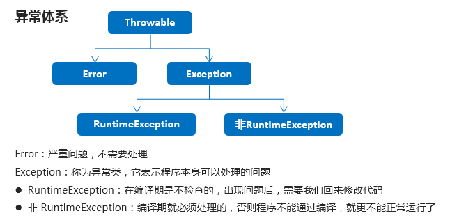
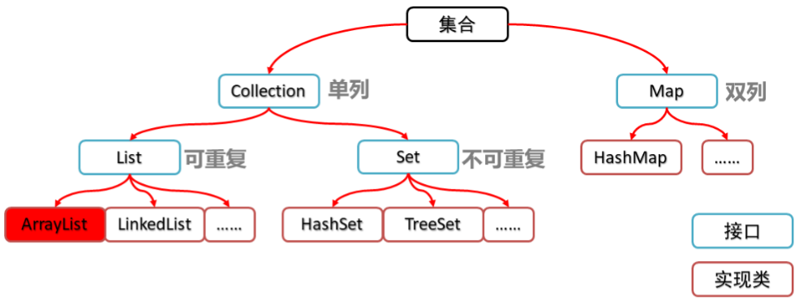
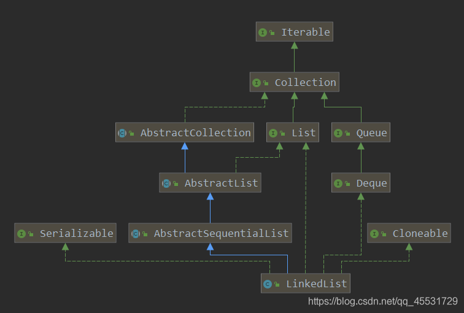
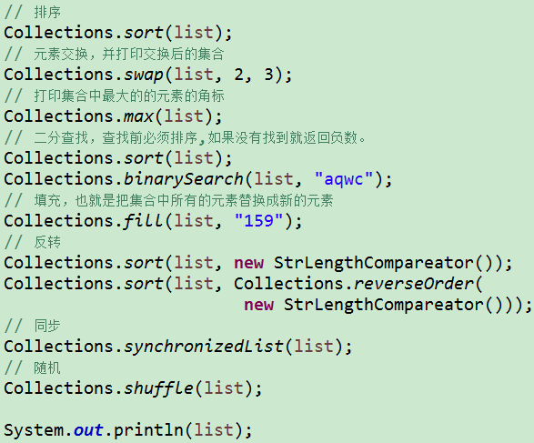
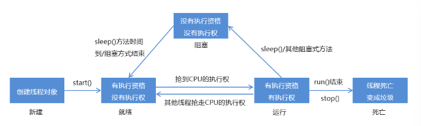
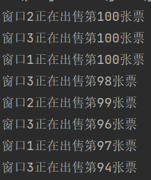

# 快捷键

1.psvm+回车 可以打出
2.sout+回车 可以打出
3.fori+回车 可以打出
4.Ctrl+Alt+V补全代码
5.alt + insert get set
6.Ctrl+Alt+L 整理格式


# 基础 语法基础

## 变量

```java
byte b = 10;
System.out.println(b);

//定义short类型的变量
short s = 100;
System.out.println(s);

//定义int类型的变量
int i = 10000;
System.out.println(i);

//定义double类型的变量
double d = 13.14;
System.out.println(d);

//定义char类型的变量
char c = 'a';
System.out.println(c);

//定义boolean类型的变量
//boolean b = true;
//System.out.println(b);
boolean bb = true;
System.out.println(bb);
System.out.println("--------");

//定义long类型的变量
long l = 10000000000L;
System.out.println(l);
System.out.println("--------");

//定义float类型的变量
float f = 13.14F;
System.out.println(f);
```


## 输出sout

```java
system.out.println("HelloWorld")；
```

## 三元运算符

```java
boolean b = weight1 == weight2 ? true : false;
int tempHeight = height1 > height2 ? height1 : height2;
int max = a > b ? a : b;
```

## 输入

```java
import java.util.Scanner;

Scanner sc = new Scanner(System.in);	

//读一个整数： 
int n = sc.nextInt();

//读一个字符串：
String s = sc.next();

//读一个浮点数：
double t = sc.nextDouble();

//读一整行：
String s = sc.nextLine();

//判断是否有下一个输入可以用
//sc.hasNext() 或 sc.hasNextInt() 或 sc.hasNextDouble()

```

## if

```java
if(week == 1) {
    System.out.println("星期一");
} else if(week == 2) {
    System.out.println("星期二");
} else if(week == 3) {
    System.out.println("星期三");
} else if(week == 4) {
    System.out.println("星期四");
} else if(week == 5) {
    System.out.println("星期五");
} else if(week == 6) {
    System.out.println("星期六");
} else {
    System.out.println("星期日");
}
```

1

```java
if(score>100 || score<0) {
    System.out.println("你输入的分数有误");
} else if(score>=95 && score<=100) {
    System.out.println("山地自行车一辆");
} else if(score>=90 && score<=94) {
    System.out.println("游乐场玩一次");
} else if(score>=80 && score<=89) {
    System.out.println("变形金刚玩具一个");
} else {
    System.out.println("胖揍一顿");
}
```

## switch

```java
switch(week) {
    case 1:
        System.out.println("星期一");
        break;
    case 2:
        System.out.println("星期二");
        break;
    case 3:
        System.out.println("星期三");
        break;
    case 4:
        System.out.println("星期四");
        break;
    case 5:
        System.out.println("星期五");
        break;
    case 6:
        System.out.println("星期六");
        break;
    case 7:
        System.out.println("星期日");
        break;
    default:
        System.out.println("你输入的星期数有误");
        break;
}
```

1

```java
switch(month) {
    case 1:
    case 2:
    case 12:
        System.out.println("冬季");
        break;
    case 3:
    case 4:
    case 5:
        System.out.println("春季");
        break;
    case 6:
    case 7:
    case 8:
        System.out.println("夏季");
        break;
    case 9:
    case 10:
    case 11:
        System.out.println("秋季");
        break;
    default:
        System.out.println("你输入的月份有误");
}
```

## 循环

```java
int j = 1;
do {
	System.out.println("HelloWorld");
	j++;
}while(j<=5);
```

1

```java
//输出所有的水仙花数必然要使用到循环，遍历所有的三位数，三位数从100开始，到999结束
for(int i=100; i<1000; i++) {
    //在计算之前获取三位数中每个位上的值
    int ge = i%10;
    int shi = i/10%10;
    int bai = i/10/10%10;

    //在判定水仙花数的过程中，满足条件不再输出，更改为修改count的值，使count+1
    if(ge*ge*ge + shi*shi*shi + bai*bai*bai == i) {
        count++;
    }
}
```


```java
int j = 1;
while(j<=5) {
    System.out.println("HelloWorld");
    j++;
}
```

1

```java
for(int hour=0; hour<24; hour++) {
    for(int minute=0; minute<60; minute++) {
        System.out.println(hour + "时" + minute + "分");
    }
    System.out.println("--------");
}
```

1

```java
for(int i = 1; i<=5; i++) {
    if(i%2 == 0) {
        //continue;
        break;
    }
```

## Random

```java
Random r = new Random();

//用循环获取10个随机数
for(int i=0; i<10; i++) {
    //获取随机数
    int number = r.nextInt(10);
    System.out.println("number:" + number);
}
```

1

## 数组array

```java
int[] arr = new int[3];
int[] arr = {11, 22, 33, 44, 55};
/*
左边：
int:说明数组中的元素类型是int类型
[]:说明这是一个数组
arr:这是数组的名称
右边：
new:为数组申请内存空间
int:说明数组中的元素类型是int类型
[]:说明这是一个数组
3:数组长度，其实就是数组中的元素个数
*/

//输出数组名
System.out.println(arr); //[I@880ec60

//输出数组中的元素
System.out.println(arr[0]);
System.out.println(arr[1]);
System.out.println(arr[2]);
```


```java
int[] arr = new int[2];
int[] arr2 = new int[3];

//分别输出数组名及元素
System.out.println(arr);
System.out.println(arr[0]);
System.out.println(arr[1]);

System.out.println(arr2);
System.out.println(arr2[0]);
System.out.println(arr2[2]);

//然后分别给数组中的元素赋值
arr[1] = 100;
arr2[0] = 200;
arr2[2] = 300;

//分别再次输出数组名及元素
System.out.println(arr);
System.out.println(arr[0]);
System.out.println(arr[1]);

System.out.println(arr2);
System.out.println(arr2[0]);
System.out.println(arr2[2]);

输出
[I@58ceff1
0
0
[I@7c30a502
0
0
[I@58ceff1
0
100
[I@7c30a502
200
300
```


##  标准类

快捷键Alt+Ins

```java
public class Student {
    //成员变量
    private String name;
    private int age;

    //构造方法
    public Student() {
    }

    public Student(String name, int age) {
        this.name = name;
        this.age = age;
    }

    //成员方法
    public void setName(String name) {
        this.name = name;
    }

    public String getName() {
        return name;
    }

    public void setAge(int age) {
        this.age = age;
    }

    public int getAge() {
        return age;
    }

    public void show() {
        System.out.println(name + "," + age);
    }
}
```


# 基础2 面向对象

## 字符串String

### 初始化

构造方法的方式得到对象

```java
//构造方法的方式得到对象
char[] chs = {'a', 'b', 'c'};
String s1 = new String(chs);
```

直接赋值的方式得到对象

```java
//直接赋值的方式得到对象
String s3 = "abc";
String s4 = "abc";
```

源码

```java
public String(char value[]) {
    this(value, 0, value.length, null);
}

String(char[] value, int off, int len, Void sig) {
    if (len == 0) {
        this.value = "".value;
        this.coder = "".coder;
        return;
    }
    if (COMPACT_STRINGS) {
        byte[] val = StringUTF16.compress(value, off, len);
        if (val != null) {
            this.value = val;
            this.coder = LATIN1;
            return;
        }
    }
    this.coder = UTF16;
    this.value = StringUTF16.toBytes(value, off, len);
}
```

### 赋值

键盘录入一个字符串，用 Scanner 实现

```java
//创建对象
Scanner sc = new Scanner(System.in);

//接收数据
System.out.println("请输入一个字符串数据：");
//String line = sc.nextLine();
//Ctrl+Alt+V 赋值快捷键
String line = sc.nextLine();
```

### 比较

比较字符串内容是否相同.equals()

```java
//比较字符串内容是否相同
System.out.println(s1.equals(s2));
System.out.println(s1.equals(s3));
System.out.println(s3.equals(s4));
```

### 方法

#### 长度.length()

```java
int len = site.length();
```

#### 连接字符串

```java
// 第一种 string1.concat(string2);
"我的名字是 ".concat("Runoob");
// 第二种 “+”
String string1 = "菜鸟教程网址：";     
System.out.println("1、" + string1 + "www.runoob.com");
// 1、菜鸟教程网址：www.runoob.com
```

#### 格式化字符串

```java
String fs;
fs = String.format("浮点型变量的值为 " +
                   "%f, 整型变量的值为 " +
                   " %d, 字符串变量的值为 " +
                   " %s", floatVar, intVar, stringVar);
```

#### 返回指定索引处的 char 值。charAt() 截取一个字符

```java
char charAt(int index)
```

#### replace() 替换

```java
//它有两种形式，第一种形式用一个字符在调用字符串中所有出现某个字符的地方进行替换，形式如下：

String replace(char original,char replacement)

//例如：
String s="Hello".replace('l','w');

//第二种形式是用一个字符序列替换另一个字符序列，形式如下：

String replace(CharSequence original,CharSequence replacement)

```

####  getChars() 截取多个字符

void getChars(int sourceStart,int sourceEnd,char target[],int targetStart)

sourceStart指定了子串开始字符的下标，sourceEnd指定了子串结束后的下一个字符的下标。因此， 子串包含从sourceStart到sourceEnd-1的字符。接收字符的数组由target指定，target中开始复制子串的下标值是targetStart。

```java
String s="this is a demo of the getChars method.";

char buf[]=new char[20];

s.getChars(10,14,buf,0);
```


#### trim() 去掉起始和结尾的空格

#### valueOf() 转换为字符串

#### toLowerCase() 转换为小写

#### toUpperCase() 转换为大写

#### indexOf()和lastIndexOf()

indexOf() 查找字符或者子串第一次出现的地方。

lastIndexOf() 查找字符或者子串是后一次出现的地方。

#### toCharArray() 方法将字符串转换为字符数组。

```java
String Str = new String("www.runoob.com");
//System.out.println(Str[0]); 出错

System.out.print("返回值 :" );
System.out.println( Str.toCharArray()[0] );
//输出w
```


## 字符串StringBuilder（可改）

```java
/*
StringBuilder构造方法：
public StringBuilder()：创建一个空白可变字符串对象，不含有任何内容
public StringBuilder(String str)：根据字符串的内容，来创建可变字符串对象
 */
//public StringBuilder()：创建一个空白可变字符串对象，不含有任何内容
StringBuilder sb = new StringBuilder();
System.out.println("sb:" + sb);
System.out.println("sb.length():" + sb.length());

//public StringBuilder(String str)：根据字符串的内容，来创建可变字符串对象
StringBuilder sb2 = new StringBuilder("hello");
System.out.println("sb2:" + sb2);
System.out.println("sb2.length():" + sb2.length());

```

### 方法

#### .append()

```java
sb.append("hello").append("world").append("java");

```

#### String转换.toString()

```java
StringBuilder sb = new StringBuilder();
sb.append("hello");
//public String toString()：通过 toString() 就可以实现把 StringBuilder 转换为 String
String s = sb.toString();
System.out.println(s);
```

```java
//StringBuilder sb = s; //这个是错误的做法

//public StringBuilder(String s)：通过构造方法就可以实现把 String 转换为 StringBuilder
StringBuilder sb = new StringBuilder(s);

```

#### .reverse()反转


#### delete(int start, int end)移除

移除此序列的子字符串中的字符

```java
sb.delete(5,8);
//移除[5,8)索引的字符
```

#### insert(int offset, String str)插入

将 `str` 参数的字符串插入此序列中。

```java
sb.insert(8, "Java");
//插入到8索引开始的地方
//Runoob..!
//Runoob..Java!
```

insert(int offset, int i)
将 `int` 参数的字符串表示形式插入此序列中。

#### replace(int start, int end, String str)

使用给定 `String` 中的字符替换此序列的子字符串中的字符。

```java

```

## 工具Arrays

Array 的工具类 Arrays

常用API：

* `public static String toString(int[] a)`：返回指定数组的内容的字符串表示形式
* `public static void sort(int[] a)`：按照数字顺序排列指定的数组
* `public static int binarySearch(int[] a, int key)`：利用二分查找返回指定元素的索引
* `public static <T> List<T> asList(T... a)`：返回由指定数组支持的列表

```java
public class MyArraysDemo {
      public static void main(String[] args) {
		//按照数字顺序排列指定的数组
        int [] arr = {3,2,4,6,7};
        Arrays.sort(arr);
        System.out.println(Arrays.toString(arr));
		
        int [] arr = {1,2,3,4,5,6,7,8,9,10};
        int index = Arrays.binarySearch(arr, 0);
        System.out.println(index);
        //1,数组必须有序
        //2.如果要查找的元素存在,那么返回的是这个元素实际的索引
        //3.如果要查找的元素不存在,那么返回的是 (-插入点-1)
            //插入点:如果这个元素在数组中,他应该在哪个索引上.
      }
  }
```

## ArrayList

可以添加对象

```java
 ArrayList<Student> array = new ArrayList<Student>();
```


### 增

```java
//创建集合
ArrayList<String> array = new ArrayList<String>();

//添加元素
array.add("hello");
array.add("world");
array.add("java");
//public void add(int index,E element)：在此集合中的指定位置插入指定的元素
array.add(1,"javase");
```

### 删

```java
//public boolean remove(Object o)：删除指定的元素，返回删除是否成功
System.out.println(array.remove("world")); // true
System.out.println(array.remove("javaee")); // false
```

```java
//public E remove(int index)：删除指定索引处的元素，返回被删除的元素
System.out.println(array.remove(1));
```

### 改

```java
//public E set(int index,E element)：修改指定索引处的元素，返回被修改的元素
System.out.println(array.set(1,"javaee"));
```

### 查

```java
System.out.println(array.get(0));
System.out.println(array.get(1));
```

### size

```java
//public int size()：返回集合中的元素的个数
System.out.println(array.size());
```

### 输出

```java
//输出集合
System.out.println("array:" + array);
```

## @Override

 修饰重写，检测是否成功

## 多态

```java
//多态
Animal a = new Cat(); //向上转型
a.eat();
//        a.playGame();


//创建Cat类的对象
Cat c = new Cat();
c.eat();
c.playGame();


//向下转型
Cat c = (Cat)a;
c.eat();
c.playGame();
```


## 抽象

```java
public abstract class Animal {
    private String name;
    private int age;

    public Animal() {
    }

    public Animal(String name, int age) {
        this.name = name;
        this.age = age;
    }

    public String getName() {
        return name;
    }

    public void setName(String name) {
        this.name = name;
    }

    public int getAge() {
        return age;
    }

    public void setAge(int age) {
        this.age = age;
    }

    public abstract void eat();
}
```


```java
public class Cat extends Animal {

    public Cat() {
    }

    public Cat(String name, int age) {
        super(name, age);
    }

    @Override
    public void eat() {
        System.out.println("猫吃鱼");
    }
}
```

## 接口

接口中的属性的默认是public [static](https://so.csdn.net/so/search?q=static&spm=1001.2101.3001.7020) final 、方法是public abstract

```java
//说英语的接口
public interface SpeakEnglish {
    public abstract void speak();
}
```

```java
public abstract class Person {
    private String name;
    private int age;

    public Person() {
    }

    public Person(String name, int age) {
        this.name = name;
        this.age = age;
    }

    public String getName() {
        return name;
    }

    public void setName(String name) {
        this.name = name;
    }

    public int getAge() {
        return age;
    }

    public void setAge(int age) {
        this.age = age;
    }

    public abstract void eat();
}

```

```java
//抽象运动员类
public abstract class Player extends Person {
    public Player() {
    }

    public Player(String name, int age) {
        super(name, age);
    }

    public abstract void study();
}
```

1

```java
public class PingPangPlayer extends Player implements SpeakEnglish {

    public PingPangPlayer() {
    }

    public PingPangPlayer(String name, int age) {
        super(name, age);
    }

    @Override
    public void study() {
        System.out.println("乒乓球运动员学习如何发球和接球");
    }

    @Override
    public void eat() {
        System.out.println("乒乓球运动员吃大白菜，喝小米粥");
    }

    @Override
    public void speak() {
        System.out.println("乒乓球运动员说英语");
    }
}

```


## 匿名内部类

为了不添加新类，临时重写出来一个对象来使用。

是一个对象，是子类重写后的对象，可以用多态赋值

```java
Animal a = new Animal(){
    @Override
    public void run() {
        System.out.println("猫跑的贼溜~~");
    }
};
```

a这个匿名内部类就是Animal经过重写的子类对象，Animal那个位置也可以是接口。


```java
/*
    跳高接口
 */
public interface Jumpping {

    void jump();

}
```

```java
public class JumppingDemo {
    public static void main(String[] args) {
        //需求：创建接口操作类的对象，调用method方法
        JumppingOperator jo = new JumppingOperator();
        Jumpping j = new Cat();
        jo.method(j);

        Jumpping j2 = new Dog();
        jo.method(j2);
        System.out.println("--------");

        jo.method(new Jumpping() {
            @Override
            public void jump() {
                System.out.println("猫可以跳高了");
            }
        });

        jo.method(new Jumpping() {
            @Override
            public void jump() {
                System.out.println("狗可以跳高了");
            }
        });

    }
}
```

## Arrays静态方法类

```java
import java.util.Arrays
```

### Arrays.sort(nums);

对数组按照升序排序

```java
int[] nums = {2,5,0,4,6,-10};
Arrays.sort(nums);
for(int i :nums)
    System.out.print(i+" ");
/* 之前:2 5 0 4 6 -10 
* 结果:-10 0 2 4 5 6 
*/
```

反向排序， Reverse-order sort


### .toString(Object[] array)

功能：返回数组的字符串形式

### Arrays.fill(Object[] array,Object object)

功能：可以为数组元素填充相同的值


## Math

abs(int a)：返回参数的绝对值

ceil(double a)：返回大于或等于参数的最小double值，等于一个整数

floor(double a)：返回小于或等于参数的最大double值，等于一个整数

round(float a)：按照四舍五入返回最接近参数的int

max(int a,int b)：返回两个int值中的较大值

min(int a,int b)：返回两个int值中的较小值(自学)

public static double pow(double a,double b)：返回a的b次幂的值

public static double random()：返回值为double的正值，[0.0,1.0)

```java
public class MathDemo {
    public static void main(String[] args) {
        //public static int abs​(int a)：返回参数的绝对值
        System.out.println(Math.abs(88));
        System.out.println(Math.abs(-88));
        System.out.println("--------");

        //public static double ceil​(double a)：返回大于或等于参数的最小double值，等于一个整数
        System.out.println(Math.ceil(12.34));
        System.out.println(Math.ceil(12.56));
        System.out.println("--------");

        //public static double floor​(double a)：返回小于或等于参数的最大double值，等于一个整数
        System.out.println(Math.floor(12.34));
        System.out.println(Math.floor(12.56));
        System.out.println("--------");

        //public static int round​(float a)：按照四舍五入返回最接近参数的int
        System.out.println(Math.round(12.34F));
        System.out.println(Math.round(12.56F));
        System.out.println("--------");

        //public static int max​(int a,int b)：返回两个int值中的较大值
        System.out.println(Math.max(66,88));
        System.out.println("--------");

        //public static int min​(int a,int b)：返回两个int值中的较小值

        //public static double pow​(double a,double b)：返回a的b次幂的值
        System.out.println(Math.pow(2.0,3.0));
        System.out.println("--------");

        //public static double random​()：返回值为double的正值，[0.0,1.0)
//        System.out.println(Math.random());
        System.out.println((int)(Math.random()*100) + 1);
    }
}
```


## System

### System.exit(0);

```java
System.out.println("开始");
//public static void exit(int status)：终止当前运行的 Java 虚拟机，非零表示异常终止
System.exit(0);
System.out.println("结束");
```

### currentTimeMillis()：返回当前时间(毫秒)

```java
//public static long currentTimeMillis()：返回当前时间(以毫秒为单位)
System.out.println(System.currentTimeMillis());
```


```java
long start = System.currentTimeMillis();
for (int i = 0; i < 10000; i++) {
    System.out.println(i);
}
long end = System.currentTimeMillis();
System.out.println("共耗时：" + (end - start) + "毫秒");
```


## Object

自带两个方法toString()和equals(Object o)，分别可以重写

### toString()

```java
@Override
public String toString() {
    return "Student{" +
        "name='" + name + '\'' +
        ", age=" + age +
        '}';
}
```

### equals(Object o)

```java
@Override
public boolean equals(Object o) {
    //this -- s1
    //o -- s2
    if (this == o) return true;
    if (o == null || getClass() != o.getClass()) return false;

    Student student = (Student) o; //student -- s2

    if (age != student.age) return false;
    return name != null ? name.equals(student.name) : student.name == null;
}
```


## Integer

intValue()变int

### 最大最小

```java
System.out.println(Integer.MIN_VALUE);
System.out.println(Integer.MAX_VALUE);
```

### 构造方法valueOf()

```java
//public static Integer valueOf​(int i)：返回表示指定的 int 值的 Integer 实例
Integer i3 = Integer.valueOf(100);
System.out.println(i3);

//public static Integer valueOf​(String s)：返回一个保存指定值的 Integer 对象 String
Integer i4 = Integer.valueOf("100");
System.out.println(i4);
```


### int --- String

```java
//int --- String
int number = 100;
//方式1
String s1 = number + "";
System.out.println(s1);
//方式2
//public static String valueOf​(int i)
String s2 = String.valueOf(number);
System.out.println(s2);
System.out.println("--------");
```

### String --- int

```java
//String --- int
String s = "100";
//方式1：String --- Integer --- int
Integer i = Integer.valueOf(s);
//public int intValue​()
int x = i.intValue();
System.out.println(x);
//方式2
//public static int parseInt​(String s)
int y = Integer.parseInt(s);
System.out.println(y);
```

1

```java
public class IntegerTest {
    public static void main(String[] args) {
        //定义一个字符串
        String s = "91 27 46 38 50";

        //把字符串中的数字数据存储到一个int类型的数组中
        String[] strArray = s.split(" ");
//        for(int i=0; i<strArray.length; i++) {
//            System.out.println(strArray[i]);
//        }

        //定义一个int数组，把 String[] 数组中的每一个元素存储到 int 数组中
        int[] arr = new int[strArray.length];
        for(int i=0; i<arr.length; i++) {
            arr[i] = Integer.parseInt(strArray[i]);
        }

        //对 int 数组进行排序
        Arrays.sort(arr);

        //把排序后的int数组中的元素进行拼接得到一个字符串，这里拼接采用StringBuilder来实现
        StringBuilder sb = new StringBuilder();
        for(int i=0; i<arr.length; i++) {
            if(i == arr.length - 1) {
                sb.append(arr[i]);
            } else {
                sb.append(arr[i]).append(" ");
            }
        }
        String result = sb.toString();

        //输出结果
        System.out.println(result);
    }
}
```

### 自动装箱拆箱

```java
//装箱：把基本数据类型转换为对应的包装类类型
        Integer i = Integer.valueOf(100);
        Integer ii = 100; //Integer.valueOf(100);

        //ii += 200;
        // ii = ii + 200;
        // ii = ii.intValue() + 200;
        // ii = 300;
        ii += 200;
        System.out.println(ii);

        Integer iii = null;
//        iii += 100; //NullPointerException
        if(iii != null) {
            iii += 100;
        }
```

## 日期类

### Date

#### 构造方法

```java
public class DateDemo01 {
    public static void main(String[] args) {
        //public Date()：分配一个 Date对象，并初始化，以便它代表它被分配的时间，精确到毫秒
        Date d1 = new Date();
        System.out.println(d1);

        //public Date(long date)：分配一个 Date对象，并将其初始化为表示从标准基准时间起指定的毫秒数
        long date = 1000*60*60;
        Date d2 = new Date(date);
        System.out.println(d2);
    }
}
```

#### 常用方法

```java
public class DateDemo02 {
    public static void main(String[] args) {
        //创建日期对象
        Date d = new Date();

        //public long getTime():获取的是日期对象从1970年1月1日 00:00:00到现在的毫秒值
//        System.out.println(d.getTime());
//        System.out.println(d.getTime() * 1.0 / 1000 / 60 / 60 / 24 / 365 + "年");

        //public void setTime(long time):设置时间，给的是毫秒值
//        long time = 1000*60*60;
        long time = System.currentTimeMillis();
        d.setTime(time);

        System.out.println(d);
    }
}
```

### SimpleDateFormat格式化

SimpleDateFormat是一个具体的类，用于以区域设置敏感的方式格式化和解析日期。

#### 构造方法

构造一个SimpleDateFormat，使用默认模式和日期格式

```java
SimpleDateFormat sdf = new SimpleDateFormat();
```

构造一个SimpleDateFormat使用给定的模式和默认的日期格式

```java
SimpleDateFormat sdf = new SimpleDateFormat("yyyy年MM月dd日 HH:mm:ss");
```

#### 常用方法

- 格式化(从Date到String)
  - public final String format(Date date)：将日期格式化成日期/时间字符串
- 解析(从String到Date)
  - public Date parse(String source)：**从给定字符串的开始解析文本以生成日期**

```java
public class SimpleDateFormatDemo {
    public static void main(String[] args) throws ParseException {
        //格式化：从 Date 到 String
        Date d = new Date();
//        SimpleDateFormat sdf = new SimpleDateFormat();//默认2022/3/15 下午11:16
        SimpleDateFormat sdf = new SimpleDateFormat("yyyy年MM月dd日 HH:mm:ss");
        String s = sdf.format(d);
        System.out.println(s);
        System.out.println("--------");

        //从 String 到 Date
        String ss = "2048-08-09 11:11:11";
        //ParseException
        SimpleDateFormat sdf2 = new SimpleDateFormat("yyyy-MM-dd HH:mm:ss");
        Date dd = sdf2.parse(ss);
        System.out.println(dd);
    }
}
```

### Calendar日历类

Calendar 为特定瞬间与一组日历字段之间的转换提供了一些方法，并为操作日历字段提供了一些方法

注意月份是从零开始的

```java

```

| 方法名                                             | 说明                                                   |
| -------------------------------------------------- | ------------------------------------------------------ |
| public int   get(int field)                        | 返回给定日历字段的值                                   |
| public abstract void add(int   field, int amount)  | 根据日历的规则，将指定的时间量添加或减去给定的日历字段 |
| public final void set(int year,int month,int date) | 设置当前日历的年月日                                   |

```java
public class CalendarDemo {
    public static void main(String[] args) {
        //获取日历类对象
        Calendar c = Calendar.getInstance();

        //public int get(int field):返回给定日历字段的值
        int year = c.get(Calendar.YEAR);
        int month = c.get(Calendar.MONTH) + 1;
        int date = c.get(Calendar.DATE);
        System.out.println(year + "年" + month + "月" + date + "日");

        //public abstract void add(int field, int amount):根据日历的规则，将指定的时间量添加或减去给定的日历字段
        //需求1:3年前的今天
//        c.add(Calendar.YEAR,-3);
//        year = c.get(Calendar.YEAR);
//        month = c.get(Calendar.MONTH) + 1;
//        date = c.get(Calendar.DATE);
//        System.out.println(year + "年" + month + "月" + date + "日");

        //需求2:10年后的10天前
//        c.add(Calendar.YEAR,10);
//        c.add(Calendar.DATE,-10);
//        year = c.get(Calendar.YEAR);
//        month = c.get(Calendar.MONTH) + 1;
//        date = c.get(Calendar.DATE);
//        System.out.println(year + "年" + month + "月" + date + "日");

        //public final void set(int year,int month,int date):设置当前日历的年月日
        c.set(2050,10,10);
        year = c.get(Calendar.YEAR);
        month = c.get(Calendar.MONTH) + 1;
        date = c.get(Calendar.DATE);
        System.out.println(year + "年" + month + "月" + date + "日");

    }
}
```

二月天

```java
public class CalendarTest {
    public static void main(String[] args) {
        //键盘录入任意的年份
        Scanner sc = new Scanner(System.in);
        System.out.println("请输入年：");
        int year = sc.nextInt();

        //设置日历对象的年、月、日
        Calendar c = Calendar.getInstance();
        c.set(year, 2, 1);

        //3月1日往前推一天，就是2月的最后一天
        c.add(Calendar.DATE, -1);

        //获取这一天输出即可
        int date = c.get(Calendar.DATE);
        System.out.println(year + "年的2月份有" + date + "天");
    }
}
```

## 计算时间差

```java
//记录开始时间
long startTime = System.currentTimeMillis();

//操作

//记录结束时间
long endTime = System.currentTimeMillis();
System.out.println("共耗时：" + (endTime - startTime) + "毫秒");
```


## 异常

异常的体系结构




### try-catch方式处理异常

```java
try {
	可能出现异常的代码;
} catch(异常类名 变量名) {
	异常的处理代码;
}
```

1

```java
try {
    int[] arr = {1, 2, 3};
    System.out.println(arr[3]);
    System.out.println("这里能够访问到吗");
} catch (ArrayIndexOutOfBoundsException e) {
    //System.out.println("你访问的数组索引不存在，请回去修改为正确的索引");
    e.printStackTrace();
}
```

常用方法

| 方法名                        | 说明                              |
| ----------------------------- | --------------------------------- |
| public String getMessage()    | 返回此 throwable 的详细消息字符串 |
| public String toString()      | 返回此可抛出的简短描述            |
| public void printStackTrace() | 把异常的错误信息输出在控制台      |

```java
try {
    int[] arr = {1, 2, 3};
    System.out.println(arr[3]); //new ArrayIndexOutOfBoundsException();
    System.out.println("这里能够访问到吗");
} catch (ArrayIndexOutOfBoundsException e) { //new ArrayIndexOutOfBoundsException();
    //            e.printStackTrace();

    //public String getMessage():返回此 throwable 的详细消息字符串
    //            System.out.println(e.getMessage());
    //Index 3 out of bounds for length 3

    //public String toString():返回此可抛出的简短描述
    //            System.out.println(e.toString());
    //java.lang.ArrayIndexOutOfBoundsException: Index 3 out of bounds for length 3

    //public void printStackTrace():把异常的错误信息输出在控制台
    e.printStackTrace();
    //            java.lang.ArrayIndexOutOfBoundsException: Index 3 out of bounds for length 3
    //            at com.itheima_02.ExceptionDemo02.method(ExceptionDemo02.java:18)
    //            at com.itheima_02.ExceptionDemo02.main(ExceptionDemo02.java:11)

}
```

### throws方式处理异常

```java
public void 方法() throws 异常类名 {
    
}
```

1

```java

```

**Exception是异常最高类型可以抛出一切异常**

```java
public static void main(String[] args) throws Exception {
    System.out.println("程序开始。。。。");
    String s = "2013-03-23 10:19:23";
    SimpleDateFormat sdf = new SimpleDateFormat("yyyy-MM-dd HH:mm:ss");
    Date date = sdf.parse(s);
    System.out.println("程序结束。。。。。");
}
```

**throw和throws的区别？**

throw和throws都是在异常处理中使用的关键字，区别如下：

- throw：指的是在方法中人为抛出一个异常对象（这个异常对象可能是自己实例化或者抛出已存在的）；
- throws：在方法的声明上使用，表示此方法在调用时必须处理异常。

```java

```

### 自定义异常throw

- 自定义异常类

  ```java
  public class ScoreException extends Exception {
  
      public ScoreException() {}
  
      public ScoreException(String message) {
          super(message);
      }
  
  }
  ```

- 老师类

  ```java
  public class Teacher {
      public void checkScore(int score) throws ScoreException {
          if(score<0 || score>100) {
  //            throw new ScoreException();
              throw new ScoreException("你给的分数有误，分数应该在0-100之间");
          } else {
              System.out.println("成绩正常");
          }
      }
  }
  ```

- 测试类

  ```java
  public class Demo {
      public static void main(String[] args) {
          Scanner sc = new Scanner(System.in);
          System.out.println("请输入分数：");
          int score = sc.nextInt();
  
          Teacher t = new Teacher();
          try {
          	t.checkScore(score);
          } catch (ScoreException e) {
          	e.printStackTrace();
          }
      }
  }
  ```
  

### 规范做法

在出现异常的地方把异常一层一层的抛出给最外层调用者，最外层调用者集中捕获处理

```java
public class ExceptionDemo{
	public static void main(String[] args){
        System.out.println("程序开始。。。。");
        try {
            parseDate("2013-03-23 10:19:23");
        }catch (Exception e){
            e.printStackTrace();
        }
        System.out.println("程序结束。。。。");
    }
    public static void parseDate(String time) throws Exception{...}
}
```


# 基础3 Collection集合




| 方法名                     | 说明                               |
| -------------------------- | ---------------------------------- |
| boolean add(E e)           | 添加元素                           |
| boolean remove(Object o)   | 从集合中移除指定的元素             |
| void   clear()             | 清空集合中的元素                   |
| boolean contains(Object o) | 判断集合中是否存在指定的元素       |
| boolean isEmpty()          | 判断集合是否为空                   |
| int   size()               | 集合的长度，也就是集合中元素的个数 |


## 迭代器

以正确的顺序返回该列表中的元素的迭代器。

- 迭代器的介绍
  - 迭代器，集合的专用遍历方式
  - Iterator<E> iterator()：返回此集合中元素的迭代器，通过集合的iterator()方法得到
  - 迭代器是通过集合的iterator()方法得到的，所以我们说它是依赖于集合而存在的
- Collection集合的遍历

迭代器 it 的两个基本操作是 next 、hasNext 和 remove。

调用 it.next() 会返回迭代器的下一个元素，并且更新迭代器的状态。

调用 it.hasNext() 用于检测集合中是否还有元素。

调用 it.remove() 将迭代器返回的元素删除。

Iterator 类位于 java.util 包中

```java
public class IteratorDemo {
    public static void main(String[] args) {
        //创建集合对象
        Collection<String> c = new ArrayList<>();

        //添加元素
        c.add("hello");
        c.add("world");
        c.add("java");
        c.add("javaee");

        //Iterator<E> iterator()：返回此集合中元素的迭代器，通过集合的iterator()方法得到
        Iterator<String> it = c.iterator();

        //用while循环改进元素的判断和获取
        while (it.hasNext()) {
            String s = it.next();
            System.out.println(s);
        }
    }
}
```

### 并发修改异常

迭代器不允许在迭代过程中改变元素

- 出现的原因

  ​	迭代器遍历的过程中，通过集合对象修改了集合中的元素，造成了迭代器获取元素中判断预期修改值和实际修改值不一致，则会出现：ConcurrentModificationException

- 解决的方案

  ​	用for循环遍历，然后用集合对象做对应的操作即可

### 增强for循环

内部原理是一个Iterator迭代器，也不允许修改

- 定义格式

  ```java
  for(元素数据类型 变量名 : 数组/集合对象名) {
      循环体;
  }
  ```


## List集合(可重复)

可重复所以添加的返回值一直是true

List是一个接口，并且实现了Collection接口，所以List接口拥有Collection接口提供的所有常用方法，而

| 方法名                          | 描述                                   |
| ------------------------------- | -------------------------------------- |
| void add(int index,E   element) | 在此集合中的指定位置插入指定的元素     |
| E remove(int   index)           | 删除指定索引处的元素，返回被删除的元素 |
| E set(int index,E   element)    | 修改指定索引处的元素，返回被修改的元素 |
| E get(int   index)              | 返回指定索引处的元素                   |

- ArrayList集合

  ​	底层是数组结构实现，查询快、增删慢

- LinkedList集合

  ​	底层是链表结构实现，查询慢、增删快

### ArrayList

ArrayList是实现了Collection和List接口的动态数组。

ArrayList.add()永远是true

```java

```


```java

```

11

```java

```

### LinkedList

| 方法名                    | 说明                             |
| ------------------------- | -------------------------------- |
| public void addFirst(E e) | 在该列表开头插入指定的元素       |
| public void addLast(E e)  | 将指定的元素追加到此列表的末尾   |
| public E getFirst()       | 返回此列表中的第一个元素         |
| public   E getLast()      | 返回此列表中的最后一个元素       |
| public E removeFirst()    | 从此列表中删除并返回第一个元素   |
| public   E removeLast()   | 从此列表中删除并返回最后一个元素 |

```java

```

### Deque

LinkedList经常用来给双向队列Deque实例化



```java
Deque deque = new LinkedList<>(); 
```

|            | 队列  |             | 栈   |                            |
| ---------- | ----- | ----------- | ---- | -------------------------- |
| 增         | offer | addLast     | push | addFirst                   |
| 弹出头元素 | poll  | pollFirst() | pop  | removeFirst()，pollFirst() |
| 显示头元素 | peek  | peekFirst() | peek | peekFirst()                |

队和栈只在元素加入时不一样，其他都是对头进行操作，不影响，以后习惯加First和Last

## Set（不可重复）

```java

```

### HashSet

- HashSet集合的特点

  - 底层数据结构是哈希表
  - 对集合的迭代顺序不作任何保证，也就是说不保证存储和取出的元素顺序一致
  - 没有带索引的方法，所以不能使用普通for循环遍历
  - 由于是Set集合，所以是不包含重复元素的集合


#### 源码

```java
//创建集合对象
HashSet<String> hs = new HashSet<String>();

//添加元素
hs.add("hello");
hs.add("world");
hs.add("java");
----------------------------------------------
```


```java
public boolean add(E e) {
    return map.put(e, PRESENT)==null;
}

static final int hash(Object key) {
    int h;
    return (key == null) ? 0 : (h = key.hashCode()) ^ (h >>> 16);
}

public V put(K key, V value) {
    return putVal(hash(key), key, value, false, true);
}

//hash值和元素的hashCode()方法相关
final V putVal(int hash, K key, V value, boolean onlyIfAbsent,
                   boolean evict) {
    Node<K,V>[] tab; Node<K,V> p; int n, i;

    //如果哈希表未初始化，就对其进行初始化
    if ((tab = table) == null || (n = tab.length) == 0)
        n = (tab = resize()).length;

    //根据对象的哈希值计算对象的存储位置，如果该位置没有元素，就存储元素
    if ((p = tab[i = (n - 1) & hash]) == null)
        tab[i] = newNode(hash, key, value, null);
    else {
        Node<K,V> e; K k;
        /*
            存入的元素和以前的元素比较哈希值
                如果哈希值不同，会继续向下执行，把元素添加到集合
                如果哈希值相同，会调用对象的equals()方法比较
                    如果返回false，会继续向下执行，把元素添加到集合
                    如果返回true，说明元素重复，不存储
        */
        if (p.hash == hash &&
            ((k = p.key) == key || (key != null && key.equals(k))))
            e = p;
        else if (p instanceof TreeNode)
            e = ((TreeNode<K,V>)p).putTreeVal(this, tab, hash, key, value);
        else {
            for (int binCount = 0; ; ++binCount) {
                if ((e = p.next) == null) {
                    p.next = newNode(hash, key, value, null);
                    if (binCount >= TREEIFY_THRESHOLD - 1) // -1 for 1st
                        treeifyBin(tab, hash);
                    break;
                }
                if (e.hash == hash &&
                    ((k = e.key) == key || (key != null && key.equals(k))))
                    break;
                p = e;
            }
        }
        if (e != null) { // existing mapping for key
            V oldValue = e.value;
            if (!onlyIfAbsent || oldValue == null)
                e.value = value;
            afterNodeAccess(e);
            return oldValue;
        }
    }
    ++modCount;
    if (++size > threshold)
        resize();
    afterNodeInsertion(evict);
    return null;
}
```


#### equals方法和HasCode方法

alt + insert自动添加

```java
@Override
public boolean equals(Object o) {
    if (this == o) return true;
    if (o == null || getClass() != o.getClass()) return false;
    Student student = (Student) o;
    return age == student.age && Objects.equals(name, student.name);
}

@Override
public int hashCode() {
    return Objects.hash(name, age);
}
```

```java
@Override
public boolean equals(Object o) {
    //如果加进来的是同一个对象（同一个地址）则直接相同
    if (this == o) return true;
    
    //如果加进来的是空或者不是同一个类则直接不同
    if (o == null || getClass() != o.getClass()) return false;
	//实例化
    Student student = (Student) o;
	//先比较年龄
    if (age != student.age) return false;
    //再比较姓名
    return name != null ? name.equals(student.name) : student.name == null;
}
```


**1.java类中HashSet添加对象时，为什么一定要重写equals方法和HasCode方法？**

- 总思路：hashCode不同时，则必为不同对象。hashCode相同时，根据equlas()方法判断是否为同一对象。
- 在HashSet，HashMap，HashTable中都存在该问题。


**2.为什么重写Equals方法必须重写HashCode方法？**

答：1、将要传入的数据根据系统的hash算法得到一个hash值；

　　2、根据hash值可以得出该数据在hash表中的位置；

　　3、判断该位置上是否有值，没有值则把数据插入进来；如果有值则再次判断传入的值与原值是否地址或equals相同，如果相同则不存，否则通过链表的方式 存储到该位置。

如果两个对象equals，但是没有重写hashcode，就会导致集合中可能存储多个相等的对象！所以必须重写！


#### HashSet集合存储学生对象并遍历【应用】

- 案例需求

  - 创建一个存储学生对象的集合，存储多个学生对象，使用程序实现在控制台遍历该集合
  - 要求：学生对象的成员变量值相同，我们就认为是同一个对象

- 代码实现

  - 学生类

    ```java
    public class Student {
        private String name;
        private int age;
    
        public Student() {
        }
    
        public Student(String name, int age) {
            this.name = name;
            this.age = age;
        }
    
        public String getName() {
            return name;
        }
    
        public void setName(String name) {
            this.name = name;
        }
    
        public int getAge() {
            return age;
        }
    
        public void setAge(int age) {
            this.age = age;
        }
    
        @Override
        public boolean equals(Object o) {
            if (this == o) return true;
            if (o == null || getClass() != o.getClass()) return false;
    
            Student student = (Student) o;
    
            if (age != student.age) return false;
            return name != null ? name.equals(student.name) : student.name == null;
        }
    
        @Override
        public int hashCode() {
            int result = name != null ? name.hashCode() : 0;
            result = 31 * result + age;
            return result;
        }
    }
    ```

  - 测试类

    ```java
    public class HashSetDemo02 {
        public static void main(String[] args) {
            //创建HashSet集合对象
            HashSet<Student> hs = new HashSet<Student>();
    
            //创建学生对象
            Student s1 = new Student("林青霞", 30);
            Student s2 = new Student("张曼玉", 35);
            Student s3 = new Student("王祖贤", 33);
    
            Student s4 = new Student("王祖贤", 33);
    
            //把学生添加到集合
            hs.add(s1);
            hs.add(s2);
            hs.add(s3);
            hs.add(s4);
    
            //遍历集合(增强for)
            for (Student s : hs) {
                System.out.println(s.getName() + "," + s.getAge());
            }
        }
    }
    ```


```java

```

1

```java

```

### LinkedHashSet（有序）

- LinkedHashSet集合特点

  - 哈希表和链表实现的Set接口，具有可预测的迭代次序
  - 由链表保证元素有序，也就是说元素的存储和取出顺序是一致的
  - 由哈希表保证元素唯一，也就是说没有重复的元素

- LinkedHashSet集合基本使用

  ```java
  public class LinkedHashSetDemo {
      public static void main(String[] args) {
          //创建集合对象
          LinkedHashSet<String> linkedHashSet = new LinkedHashSet<String>();
  
          //添加元素
          linkedHashSet.add("hello");
          linkedHashSet.add("world");
          linkedHashSet.add("java");
  
          linkedHashSet.add("world");
  
          //遍历集合
          for(String s : linkedHashSet) {
              System.out.println(s);
          }
      }
  }
  ```


### TreeSet自排序

- TreeSet集合概述

  - 元素有序，可以按照一定的规则进行排序，具体排序方式取决于构造方法
    - TreeSet()：根据其元素的自然排序进行排序
    - TreeSet(Comparator comparator) ：根据指定的比较器进行排序
  - 没有带索引的方法，所以不能使用普通for循环遍历
  - 由于是Set集合，所以不包含重复元素的集合

- TreeSet集合基本使用

  ```java
  public class TreeSetDemo01 {
      public static void main(String[] args) {
          //创建集合对象
          TreeSet<Integer> ts = new TreeSet<Integer>();
  
          //添加元素
          ts.add(10);
          ts.add(40);
          ts.add(30);
          ts.add(50);
          ts.add(20);
  
          ts.add(30);
  
          //遍历集合
          for(Integer i : ts) {
              System.out.println(i);
          }
      }
  }
  ```

#### compareTo重写


return 0代表相同

return 小于0 代表往左放（树）

return 大于0 往右放

```java
@Override
    public int compareTo(Student s) {
//        return 0;
//        return 1;
//        return -1;
```

源码

```java
do {
    parent = t;
    cmp = k.compareTo(t.key);
    if (cmp < 0)
        t = t.left;
    else if (cmp > 0)
        t = t.right;
    else
        return t.setValue(value);
} while (t != null);
```

多次判断直到放在合适的位置，或者相同

this代表的是add添加的元素，s是用来比较的元素（很有可能是第一个添加的元素）

this减s是升序

s减this是降序

```java
public class Student implements Comparable<Student> {
    private String name;
    private int age;

    public Student() {
    }

    public Student(String name, int age) {
        this.name = name;
        this.age = age;
    }

    public String getName() {
        return name;
    }

    public void setName(String name) {
        this.name = name;
    }

    public int getAge() {
        return age;
    }

    public void setAge(int age) {
        this.age = age;
    }

    @Override
    public int compareTo(Student s) {
//        return 0;
//        return 1;
//        return -1;
        //按照年龄从小到大排序
       int num = this.age - s.age;
//        int num = s.age - this.age;
        //年龄相同时，按照姓名的字母顺序排序
       int num2 = num==0?this.name.compareTo(s.name):num;
        return num2;
    }
}
```


#### 比较器 Comparator 对象

```java
//创建集合对象
TreeSet<Student> ts = new TreeSet<Student>(new Comparator<Student>() {
    @Override
    public int compare(Student s1, Student s2) {
        //this.age - s.age
        //s1,s2
        int num = s1.getAge() - s2.getAge();
        int num2 = num == 0 ? s1.getName().compareTo(s2.getName()) : num;
        return num2;
    }
});
```

使用

```java
//创建TreeSet集合对象，通过比较器排序进行排序
TreeSet<Student> ts = new TreeSet<Student>(new Comparator<Student>() {
    @Override
    public int compare(Student s1, Student s2) {
        //int num = (s2.getChinese() + s2.getMath())-(s1.getChinese() + s1.getMath());
        //主要条件
        int num = s2.getSum() - s1.getSum();
        //次要条件
        int num2 = num == 0 ? s1.getChinese() - s2.getChinese() : num;
        int num3 = num2 == 0 ? s1.getName().compareTo(s2.getName()) : num2;
        return num3;
    }
});
```


## 泛型

### 类

```java
修饰符 class 类名<类型> {  }
```


```java
public class Generic<T> {
    private T t;

    public T getT() {
        return t;
    }

    public void setT(T t) {
        this.t = t;
    }
}
```

测试类

```java
public class GenericDemo {
    public static void main(String[] args) {
        Generic<String> g1 = new Generic<String>();
        g1.setT("林青霞");
        System.out.println(g1.getT());

        Generic<Integer> g2 = new Generic<Integer>();
        g2.setT(30);
        System.out.println(g2.getT());

        Generic<Boolean> g3 = new Generic<Boolean>();
        g3.setT(true);
        System.out.println(g3.getT());
    }
}
```

### 方法

```java
修饰符 <类型> 返回值类型 方法名(类型 变量名) {  }
```

带有泛型方法的类

```java
public class Generic {
    public <T> void show(T t) {
        System.out.println(t);
    }
}
```

1

```java
public class GenericDemo {
    public static void main(String[] args) {
		Generic g = new Generic();
        g.show("林青霞");
        g.show(30);
        g.show(true);
        g.show(12.34);
    }
}
```

### 接口

```java
修饰符 interface 接口名<类型> {  }
```

1

```java
public interface Generic<T> {
    void show(T t);
}
```

泛型接口实现类

```java
public class GenericImpl<T> implements Generic<T> {
    @Override
    public void show(T t) {
        System.out.println(t);
    }
}
```

测试类

```java
public class GenericDemo {
    public static void main(String[] args) {
        Generic<String> g1 = new GenericImpl<String>();
        g1.show("林青霞");

        Generic<Integer> g2 = new GenericImpl<Integer>();
        g2.show(30);
    }
}
```

### 类型通配符

- 类型通配符的作用

  ​	为了表示各种泛型List的父类，可以使用类型通配符	

- 类型通配符的分类

  - 类型通配符：<?>
    - List<?>：表示元素类型未知的List，它的元素可以匹配任何的类型
    - 这种带通配符的List仅表示它是各种泛型List的父类，并不能把元素添加到其中
  - 类型通配符上限：<? extends 类型>
    - List<? extends Number>：它表示的类型是Number或者其子类型
  - 类型通配符下限：<? super 类型>
    - List<? super Number>：它表示的类型是Number或者其父类型

```java
public class GenericDemo {
    public static void main(String[] args) {
        //类型通配符：<?>
        List<?> list1 = new ArrayList<Object>();
        List<?> list2 = new ArrayList<Number>();
        List<?> list3 = new ArrayList<Integer>();
        System.out.println("--------");

        //类型通配符上限：<? extends 类型>
//        List<? extends Number> list4 = new ArrayList<Object>();
        List<? extends Number> list5 = new ArrayList<Number>();
        List<? extends Number> list6 = new ArrayList<Integer>();
        System.out.println("--------");

        //类型通配符下限：<? super 类型>
        List<? super Number> list7 = new ArrayList<Object>();
        List<? super Number> list8 = new ArrayList<Number>();
//        List<? super Number> list9 = new ArrayList<Integer>();

    }
}
```

为什么要使用通配符而不是简单的泛型呢？通配符其实在声明局部变量时是没有什么意义的，但是当你为一个方法声明一个参数时，它是非常重要的。

```java
static int countLegs (List<? extends Animal > animals ) {
    int retVal = 0;
    for ( Animal animal : animals )
    {
        retVal += animal.countLegs();
    }
    return retVal;
}

static int countLegs1 (List< Animal > animals ){
    int retVal = 0;
    for ( Animal animal : animals )
    {
        retVal += animal.countLegs();
    }
    return retVal;
}

public static void main(String[] args) {
    List<Dog> dogs = new ArrayList<>();
     // 不会报错
    countLegs( dogs );
    // 报错
    countLegs1(dogs);
}
```


## Map

Collection 是单值集合体系，Map集合是一种双列集合，每个元素包含两个值。

Map集合的每个元素的格式：key=value（键值对元素），Map集合也被称为键值对集合

Map集合的完整格式：`{key1=value1, key2=value2, key3=value3, ...}`

```
Map集合的体系：
        Map<K , V>(接口,Map集合的祖宗类)
       /                      \
      TreeMap<K , V>           HashMap<K , V>(实现类,经典的，用的最多)
                                 \
                                  LinkedHashMap<K, V>(实现类)
```

Map集合的特点：

1. Map 集合的特点都是由键决定的
2. Map 集合的键是无序，不重复的，无索引的（Set）
3. Map 集合的值无要求（List）
4. Map 集合的键值对都可以为 null
5. Map 集合后面重复的键对应元素会覆盖前面的元素

HashMap：元素按照键是无序，不重复，无索引，值不做要求

LinkedHashMap：元素按照键是有序，不重复，无索引，值不做要求

### 常用API

方法介绍

| 方法名                              | 说明                                 |
| ----------------------------------- | ------------------------------------ |
| V   put(K key,V   value)            | 添加元素                             |
| V   remove(Object key)              | 根据键删除键值对元素                 |
| void   clear()                      | 移除所有的键值对元素                 |
| boolean containsKey(Object key)     | 判断集合是否包含指定的键             |
| boolean containsValue(Object value) | 判断集合是否包含指定的值             |
| boolean isEmpty()                   | 判断集合是否为空                     |
| int size()                          | 集合的长度，也就是集合中键值对的个数 |
| V   get(Object key)                 | 根据键获取值                         |
| Set<K>   keySet()                   | 获取所有键的集合                     |
| Collection<V>   values()            | 获取所有值的集合                     |
| Set<Map.Entry<K,V>>   entrySet()    | 获取所有键值对对象的集合             |

Map 集合的常用 API

- `public V put(K key, V value)`：把指定的键与值添加到 Map 集合中，**重复的键会覆盖前面的值元素**
- `public V remove(Object key)`：把指定的键对应的键值对元素在集合中删除，返回被删除元素的值
- `public V get(Object key)`：根据指定的键，在 Map 集合中获取对应的值
- `public Set<K> keySet()`：获取 Map 集合中所有的键，存储到 **Set 集合**中
- `public Collection<V> values()`：获取全部值的集合，存储到 **Collection 集合**
- `public Set<Map.Entry<K,V>> entrySet()`：获取Map集合中所有的键值对对象的集合
- `public boolean containsKey(Object key)`：判断该集合中是否有此键

```java
public class MapDemo {
    public static void main(String[] args) {
        Map<String , Integer> maps = new HashMap<>();
        maps.put(.....);
        System.out.println(maps.isEmpty());//false
        Integer value = maps.get("....");//返回键值对象
        Set<String> keys = maps.keySet();//获取Map集合中所有的键，
        //Map集合的键是无序不重复的，所以返回的是一个Set集合
        Collection<Integer> values = maps.values();
        //Map集合的值是不做要求的，可能重复，所以值要用Collection集合接收!
    }
}
```

### 遍历方式

Map集合的遍历方式有：3种。

1. “键找值”的方式遍历：先获取 Map 集合全部的键，再根据遍历键找值。
2. “键值对”的方式遍历：难度较大，采用增强 for 或者迭代器
3. JDK 1.8 开始之后的新技术：foreach，采用 Lambda 表达式

集合可以直接输出内容，因为底层重写了 toString() 方法

```java
public static void main(String[] args){
    Map<String , Integer> maps = new HashMap<>();
	//(1)键找值
    Set<String> keys = maps.keySet();
    for(String key : keys) {
        System.out.println(key + "=" + maps.get(key));
    }
    //Iterator<String> iterator = hm.keySet().iterator();
    
    //(2)键值对
    //(2.1)普通方式
    Set<Map.Entry<String,Integer>> entries = maps.entrySet();
    for (Map.Entry<String, Integer> entry : entries) {
             System.out.println(entry.getKey() + "=>" + entry.getValue());
    }
    //(2.2)迭代器方式
    Iterator<Map.Entry<String, Integer>> iterator = maps.entrySet().iterator();
    while (iterator.hasNext()) {
        Map.Entry<String, Integer> entry = iterator.next();
        System.out.println(entry.getKey() + "=" + entry.getValue());

    }
    //(3) Lamda
    maps.forEach((k,v) -> {
        System.out.println(k + "==>" + v);
    })
}
```


### HashMap

HashMap 基于哈希表的 Map 接口实现，是以 key-value 存储形式存在，主要用来存放键值对

特点：

- HashMap 的实现不是同步的，这意味着它不是线程安全的
- key 是唯一不重复的，底层的哈希表结构，依赖 hashCode 方法和 equals 方法保证键的唯一
- key、value 都可以为null，但是 key 位置只能是一个null
- HashMap 中的映射不是有序的，即存取是无序的
- **key 要存储的是自定义对象，需要重写 hashCode 和 equals 方法，防止出现地址不同内容相同的 key**

```java

```

### LinkedMap

LinkedHashMap 是 HashMap 的子类

- 优点：添加的元素按照键有序不重复的，有序的原因是底层维护了一个双向链表
- 缺点：会占用一些内存空间

```java

```

1

```java

```

### TreeMap

TreeMap 实现了 SotredMap 接口，是有序不可重复的键值对集合，基于红黑树（Red-Black tree）实现，每个 key-value 都作为一个红黑树的节点，如果构造 TreeMap 没有指定比较器，则根据 key 执行自然排序（默认升序），如果指定了比较器则按照比较器来进行排序

TreeMap 集合指定大小规则有 2 种方式：

- 直接为对象的类实现比较器规则接口 Comparable，重写比较方法
- 直接为集合设置比较器 Comparator 对象，重写比较方法

说明：TreeSet 集合的底层是基于 TreeMap，只是键的附属值为空对象而已

```java

```

1

```java

```

### WeakMap

WeakHashMap 是基于弱引用的

内部的 Entry 继承 WeakReference，被弱引用关联的对象在**下一次垃圾回收时会被回收**，并且构造方法传入引用队列，用来在清理对象完成以后清理引用

```java

```

1

```java

```

## Collections集合工具类

Collections类常用方法

| 方法名                                   | 说明                               |
| ---------------------------------------- | ---------------------------------- |
| public static void sort(List<T> list)    | 将指定的列表按升序排序             |
| public static void reverse(List<?> list) | 反转指定列表中元素的顺序           |
| public static void shuffle(List<?> list) | 使用默认的随机源随机排列指定的列表 |

```java
public class CollectionsDemo01 {
    public static void main(String[] args) {
        //创建集合对象
        List<Integer> list = new ArrayList<Integer>();

        //添加元素
        list.add(30);
        list.add(20);
        list.add(50);
        list.add(10);
        list.add(40);

        //public static <T extends Comparable<? super T>> void sort(List<T> list)：将指定的列表按升序排序
//        Collections.sort(list);

        //public static void reverse(List<?> list)：反转指定列表中元素的顺序
//        Collections.reverse(list);

        //public static void shuffle(List<?> list)：使用默认的随机源随机排列指定的列表
        Collections.shuffle(list);

        System.out.println(list);
    }
}
```




# 基础4 I/O

输入流: 程序可以从中读取数据的流。
输出流: 程序能向其中写入数据的流。


| 字节流               |                      |
| -------------------- | -------------------- |
| 字节流输出（写）     | FileOutputStream     |
| 字节流输入（读）     | FileInputStream      |
| 字节缓冲流输出（写） | BufferedOutputStream |
| 字节缓冲流输入（读） | BufferedInputStream  |


| 字符流               |                    |
| -------------------- | ------------------ |
| 字符流输出（写）     | OutputStreamWriter |
| 字符流输入（读）     | InputStreamReader  |
| 字符缓冲流输出（写） | BufferedWriter     |
| 字符缓冲流输入（读） | BufferedReader     |


## File类

### File类的构造方法

| 方法名                              | 说明                                                        |
| ----------------------------------- | ----------------------------------------------------------- |
| File(String   pathname)             | 通过将给定的路径名字符串转换为抽象路径名来创建新的 File实例 |
| File(String   parent, String child) | 从父路径名字符串和子路径名字符串创建新的   File实例         |
| File(File   parent, String child)   | 从父抽象路径名和子路径名字符串创建新的   File实例           |

```java
public class FileDemo01 {
    public static void main(String[] args) {
        //File(String pathname)：通过将给定的路径名字符串转换为抽象路径名来创建新的 File实例。
        File f1 = new File("E:\\itcast\\java.txt");
        System.out.println(f1);

        //File(String parent, String child)：从父路径名字符串和子路径名字符串创建新的 File实例。
        File f2 = new File("E:\\itcast","java.txt");
        System.out.println(f2);

        //File(File parent, String child)：从父抽象路径名和子路径名字符串创建新的 File实例。
        File f3 = new File("E:\\itcast");
        File f4 = new File(f3,"java.txt");
        System.out.println(f4);
    }
}
```

### File类创建功能【应用】

- 方法分类

  已经存在就false
  
  | 方法名                         | 说明                                                         |
  | ------------------------------ | ------------------------------------------------------------ |
  | public boolean createNewFile() | 当具有该名称的文件不存在时，创建一个由该抽象路径名命名的新空文件 |
  | public boolean mkdir()         | 创建由此抽象路径名命名的目录                                 |
  | public boolean mkdirs()        | 创建由此抽象路径名命名的目录，包括任何必需但不存在的父目录   |

```java
public class FileDemo02 {
    public static void main(String[] args) throws IOException {
        //需求1：我要在E:\\itcast目录下创建一个文件java.txt
        //目录必须存在
        File f1 = new File("E:\\itcast\\java.txt");
        System.out.println(f1.createNewFile());
        System.out.println("--------");

        //需求2：我要在E:\\itcast目录下创建一个目录JavaSE
        File f2 = new File("E:\\itcast\\JavaSE");
        System.out.println(f2.mkdir());
        System.out.println("--------");

        //需求3：我要在E:\\itcast目录下创建一个多级目录JavaWEB\\HTML
        File f3 = new File("E:\\itcast\\JavaWEB\\HTML");
//        System.out.println(f3.mkdir());
        System.out.println(f3.mkdirs());
        System.out.println("--------");

        //需求4：我要在E:\\itcast目录下创建一个文件javase.txt
        File f4 = new File("E:\\itcast\\javase.txt");
//        System.out.println(f4.mkdir());
        System.out.println(f4.createNewFile());
    }
}
```

### File类判断和获取功能【应用】

- 判断功能

  | 方法名                         | 说明                                 |
  | ------------------------------ | ------------------------------------ |
  | public   boolean isDirectory() | 测试此抽象路径名表示的File是否为目录 |
  | public   boolean isFile()      | 测试此抽象路径名表示的File是否为文件 |
  | public   boolean   exists()    | 测试此抽象路径名表示的File是否存在   |

- 获取功能

  | 方法名                            | 说明                                                     |
  | --------------------------------- | -------------------------------------------------------- |
  | public   String getAbsolutePath() | 返回此抽象路径名的绝对路径名字符串                       |
  | public   String getPath()         | 将此抽象路径名转换为路径名字符串                         |
  | public   String getName()         | 返回由此抽象路径名表示的文件或目录的名称                 |
  | public   String[] list()          | 返回此抽象路径名表示的目录中的文件和目录的名称字符串数组 |
  | public   File[] listFiles()       | 返回此抽象路径名表示的目录中的文件和目录的File对象数组   |

- 示例代码

  ```java
  public class FileDemo04 {
      public static void main(String[] args) {
          //创建一个File对象
          File f = new File("myFile\\java.txt");
  
  //        public boolean isDirectory()：测试此抽象路径名表示的File是否为目录
  //        public boolean isFile()：测试此抽象路径名表示的File是否为文件
  //        public boolean exists()：测试此抽象路径名表示的File是否存在
          System.out.println(f.isDirectory());
          System.out.println(f.isFile());
          System.out.println(f.exists());
  
  //        public String getAbsolutePath()：返回此抽象路径名的绝对路径名字符串
  //        public String getPath()：将此抽象路径名转换为路径名字符串
  //        public String getName()：返回由此抽象路径名表示的文件或目录的名称
          System.out.println(f.getAbsolutePath());
          System.out.println(f.getPath());
          System.out.println(f.getName());
          System.out.println("--------");
  
  //        public String[] list()：返回此抽象路径名表示的目录中的文件和目录的名称字符串数组
  //        public File[] listFiles()：返回此抽象路径名表示的目录中的文件和目录的File对象数组
          File f2 = new File("E:\\itcast");
  
          String[] strArray = f2.list();
          for(String str : strArray) {
              System.out.println(str);
          }
          System.out.println("--------");
  
          File[] fileArray = f2.listFiles();
          for(File file : fileArray) {
  //            System.out.println(file);//getPath()
  //            System.out.println(file.getName());
              if(file.isFile()) {
                  System.out.println(file.getName());
              }
          }
      }
  }
  ```

### File类删除功能【应用】

- 方法分类

  | 方法名                    | 说明                               |
  | ------------------------- | ---------------------------------- |
  | public boolean   delete() | 删除由此抽象路径名表示的文件或目录 |

- 示例代码

  ```java
  public class FileDemo03 {
      public static void main(String[] args) throws IOException {
  //        File f1 = new File("E:\\itcast\\java.txt");
          //需求1：在当前模块目录下创建java.txt文件
          File f1 = new File("myFile\\java.txt");
  //        System.out.println(f1.createNewFile());
  
          //需求2：删除当前模块目录下的java.txt文件
          System.out.println(f1.delete());
          System.out.println("--------");
  
          //需求3：在当前模块目录下创建itcast目录
          File f2 = new File("myFile\\itcast");
  //        System.out.println(f2.mkdir());
  
          //需求4：删除当前模块目录下的itcast目录
          System.out.println(f2.delete());
          System.out.println("--------");
  
          //需求5：在当前模块下创建一个目录itcast,然后在该目录下创建一个文件java.txt
          File f3 = new File("myFile\\itcast");
  //        System.out.println(f3.mkdir());
          File f4 = new File("myFile\\itcast\\java.txt");
  //        System.out.println(f4.createNewFile());
  
          //需求6：删除当前模块下的目录itcast
          System.out.println(f4.delete());
          System.out.println(f3.delete());
      }
  }
  ```

- 绝对路径和相对路径的区别

  - 绝对路径：完整的路径名，不需要任何其他信息就可以定位它所表示的文件。例如：E:\itcast\java.txt
  - 相对路径：必须使用取自其他路径名的信息进行解释。例如：myFile\\java.txt


## 字节流

|                      |                      |
| -------------------- | -------------------- |
| 字节流输出（读）     | FileOutputStream     |
| 字节流输入（写）     | FileInputStream      |
| 字节缓冲流输出（读） | BufferedOutputStream |
| 字节缓冲流输入（写） | BufferedInputStream  |


### 写

```java
public class FileOutputStreamDemo01 {
    public static void main(String[] args) throws IOException {
        //创建字节输出流对象
        //FileOutputStream(String name)：创建文件输出流以指定的名称写入文件
        FileOutputStream fos = new FileOutputStream("myByteStream\\fos.txt");
        /*
            做了三件事情：
                A:调用系统功能创建了文件
                B:创建了字节输出流对象
                C:让字节输出流对象指向创建好的文件
         */

        //void write(int b)：将指定的字节写入此文件输出流
        fos.write(97);
//        fos.write(57);
//        fos.write(55);

        //最后都要释放资源
        //void close()：关闭此文件输出流并释放与此流相关联的任何系统资源。
        fos.close();
    }
}
```

#### 字节流写数据的三种方式

写数据的方法分类

| 方法名                                      | 说明                                                         |
| ------------------------------------------- | ------------------------------------------------------------ |
| void   write(int b)                         | 将指定的字节写入此文件输出流   一次写一个字节数据            |
| void   write(byte[] b)                      | 将 b.length字节从指定的字节数组写入此文件输出流   一次写一个字节数组数据 |
| void   write(byte[] b, int off, int length) | 将 len字节从指定的字节数组开始，从偏移量off开始写入此文件输出流   一次写一个字节数组的部分数据 |

```java
public class FileOutputStreamDemo02 {
    public static void main(String[] args) throws IOException {
        //FileOutputStream(String name)：创建文件输出流以指定的名称写入文件
        FileOutputStream fos = new FileOutputStream("myByteStream\\fos.txt");
        //new File(name)
//        FileOutputStream fos = new FileOutputStream(new File("myByteStream\\fos.txt"));

        //FileOutputStream(File file)：创建文件输出流以写入由指定的 File对象表示的文件
//        File file = new File("myByteStream\\fos.txt");
//        FileOutputStream fos2 = new FileOutputStream(file);
//        FileOutputStream fos2 = new FileOutputStream(new File("myByteStream\\fos.txt"));

        //void write(int b)：将指定的字节写入此文件输出流
//        fos.write(97);
//        fos.write(98);
//        fos.write(99);
//        fos.write(100);
//        fos.write(101);

//        void write(byte[] b)：将 b.length字节从指定的字节数组写入此文件输出流
//        byte[] bys = {97, 98, 99, 100, 101};
        //byte[] getBytes()：返回字符串对应的字节数组
        byte[] bys = "abcde".getBytes();
//        fos.write(bys);

        //void write(byte[] b, int off, int len)：将 len字节从指定的字节数组开始，从偏移量off开始写入此文件输出流
//        fos.write(bys,0,bys.length);
        fos.write(bys,1,3);

        //释放资源
        fos.close();
    }
}
```

#### 字节流写数据的两个小问题【应用】

- 字节流写数据如何实现换行
  - windows:\r\n
  - linux:\n
  - mac:\r
- 字节流写数据如何实现追加写入
  - public FileOutputStream(String name,boolean append)
  - 创建文件输出流以指定的名称写入文件。如果第二个参数为true ，则字节将写入文件的末尾而不是开头


```java
public class FileOutputStreamDemo03 {
    public static void main(String[] args) throws IOException {
        //创建字节输出流对象
//        FileOutputStream fos = new FileOutputStream("myByteStream\\fos.txt");
        FileOutputStream fos = new FileOutputStream("myByteStream\\fos.txt",true);

        //写数据
        for (int i = 0; i < 10; i++) {
            fos.write("hello".getBytes());
            fos.write("\r\n".getBytes());
        }

        //释放资源
        fos.close();
    }
}
```

#### 异常处理【应用】

- 异常处理格式

  - try-catch-finally

    ```java
    try{
    	可能出现异常的代码;
    }catch(异常类名 变量名){
    	异常的处理代码;
    }finally{
    	执行所有清除操作;
    }
    ```

  - finally特点

    - 被finally控制的语句一定会执行，除非JVM退出

```java
public class FileOutputStreamDemo04 {
    public static void main(String[] args) {
        //加入finally来实现释放资源
        FileOutputStream fos = null;
        try {
            fos = new FileOutputStream("myByteStream\\fos.txt");
            fos.write("hello".getBytes());
        } catch (IOException e) {
            e.printStackTrace();
        } finally {
            if(fos != null) {
                try {
                    fos.close();
                } catch (IOException e) {
                    e.printStackTrace();
                }
            }
        }
    }
}
```


### 读

#### 一次读一个字节

- 字节输入流
  - FileInputStream(String name)：通过打开与实际文件的连接来创建一个FileInputStream ，该文件由文件系统中的路径名name命名
- 字节输入流读取数据的步骤
  - 创建字节输入流对象
  - 调用字节输入流对象的读数据方法
  - 释放资源

```java
public class FileInputStreamDemo01 {
    public static void main(String[] args) throws IOException {
        //创建字节输入流对象
        //FileInputStream(String name)
        FileInputStream fis = new FileInputStream("myByteStream\\fos.txt");

        int by;
        /*
            fis.read()：读数据
            by=fis.read()：把读取到的数据赋值给by
            by != -1：判断读取到的数据是否是-1
         */
        while ((by=fis.read())!=-1) {
            System.out.print((char)by);
        }

        //释放资源
        fis.close();
    }
}
```

#### 字节流复制文本文件

```java
public class CopyTxtDemo {
    public static void main(String[] args) throws IOException {
        //根据数据源创建字节输入流对象
        FileInputStream fis = new FileInputStream("E:\\itcast\\窗里窗外.txt");
        //根据目的地创建字节输出流对象
        FileOutputStream fos = new FileOutputStream("myByteStream\\窗里窗外.txt");

        //读写数据，复制文本文件(一次读取一个字节，一次写入一个字节)
        int by;
        while ((by=fis.read())!=-1) {
            fos.write(by);
        }

        //释放资源
        fos.close();
        fis.close();
    }
}

```


#### 一次读一个字节数组数据

- 一次读一个字节数组的方法
  - public int read(byte[] b)：从输入流读取最多b.length个字节的数据
  - 返回的是读入缓冲区的总字节数,也就是实际的读取字节个数

```java
public class FileInputStreamDemo02 {
    public static void main(String[] args) throws IOException {
        //创建字节输入流对象
        FileInputStream fis = new FileInputStream("myByteStream\\fos.txt");

        /*
            hello\r\n
            world\r\n

            第一次：hello
            第二次：\r\nwor
            第三次：ld\r\nr

         */

        byte[] bys = new byte[1024]; //1024及其整数倍
        int len;
        while ((len=fis.read(bys))!=-1) {
            System.out.print(new String(bys,0,len));
        }

        //释放资源
        fis.close();
    }
}
```

#### 字节流复制图片【应用】

- 案例需求

  ​	把“E:\\itcast\\mn.jpg”复制到模块目录下的“mn.jpg”

- 实现步骤

  - 根据数据源创建字节输入流对象
  - 根据目的地创建字节输出流对象
  - 读写数据，复制图片(一次读取一个字节数组，一次写入一个字节数组)
  - 释放资源

```java
public class CopyJpgDemo {
    public static void main(String[] args) throws IOException {
        //根据数据源创建字节输入流对象
        FileInputStream fis = new FileInputStream("E:\\itcast\\mn.jpg");
        //根据目的地创建字节输出流对象
        FileOutputStream fos = new FileOutputStream("myByteStream\\mn.jpg");

        //读写数据，复制图片(一次读取一个字节数组，一次写入一个字节数组)
        byte[] bys = new byte[1024];
        int len;
        while ((len=fis.read(bys))!=-1) {
            fos.write(bys,0,len);
        }

        //释放资源
        fos.close();
        fis.close();
    }
}
```


### 字节缓冲流

#### 字节缓冲流构造方法

- 字节缓冲流介绍

  - lBufferOutputStream：该类实现缓冲输出流。 通过设置这样的输出流，应用程序可以向底层输出流写入字节，而不必为写入的每个字节导致底层系统的调用
  - lBufferedInputStream：创建BufferedInputStream将创建一个内部缓冲区数组。 当从流中读取或跳过字节时，内部缓冲区将根据需要从所包含的输入流中重新填充，一次很多字节

- 构造方法：

  | 方法名                                 | 说明                   |
  | -------------------------------------- | ---------------------- |
  | BufferedOutputStream(OutputStream out) | 创建字节缓冲输出流对象 |
  | BufferedInputStream(InputStream in)    | 创建字节缓冲输入流对象 |

```java
public class BufferStreamDemo {
    public static void main(String[] args) throws IOException {
        //字节缓冲输出流：BufferedOutputStream(OutputStream out)
 
        BufferedOutputStream bos = new BufferedOutputStream(new 				                                       FileOutputStream("myByteStream\\bos.txt"));
        //写数据
        bos.write("hello\r\n".getBytes());
        bos.write("world\r\n".getBytes());
        //释放资源
        bos.close();
    

        //字节缓冲输入流：BufferedInputStream(InputStream in)
        BufferedInputStream bis = new BufferedInputStream(new                                                          FileInputStream("myByteStream\\bos.txt"));

        //一次读取一个字节数据
//        int by;
//        while ((by=bis.read())!=-1) {
//            System.out.print((char)by);
//        }

        //一次读取一个字节数组数据
        byte[] bys = new byte[1024];
        int len;
        while ((len=bis.read(bys))!=-1) {
            System.out.print(new String(bys,0,len));
        }

        //释放资源
        bis.close();
    }
}
```

#### 字节流复制视频【应用】

- 案例需求

  把“E:\\itcast\\字节流复制图片.avi”复制到模块目录下的“字节流复制图片.avi”

- 实现步骤

  - 根据数据源创建字节输入流对象
  - 根据目的地创建字节输出流对象
  - 读写数据，复制视频
  - 释放资源

```java
public class CopyAviDemo {
    public static void main(String[] args) throws IOException {
        //记录开始时间
        long startTime = System.currentTimeMillis();

        //复制视频
//        method1();
//        method2();
//        method3();
        method4();

        //记录结束时间
        long endTime = System.currentTimeMillis();
        System.out.println("共耗时：" + (endTime - startTime) + "毫秒");
    }

    //字节缓冲流一次读写一个字节数组
    public static void method4() throws IOException {
        BufferedInputStream bis = new BufferedInputStream(new FileInputStream("E:\\itcast\\字节流复制图片.avi"));
        BufferedOutputStream bos = new BufferedOutputStream(new FileOutputStream("myByteStream\\字节流复制图片.avi"));

        byte[] bys = new byte[1024];
        int len;
        while ((len=bis.read(bys))!=-1) {
            bos.write(bys,0,len);
        }

        bos.close();
        bis.close();
    }

    //字节缓冲流一次读写一个字节
    public static void method3() throws IOException {
        BufferedInputStream bis = new BufferedInputStream(new FileInputStream("E:\\itcast\\字节流复制图片.avi"));
        BufferedOutputStream bos = new BufferedOutputStream(new FileOutputStream("myByteStream\\字节流复制图片.avi"));

        int by;
        while ((by=bis.read())!=-1) {
            bos.write(by);
        }

        bos.close();
        bis.close();
    }


    //基本字节流一次读写一个字节数组
    public static void method2() throws IOException {
        //E:\\itcast\\字节流复制图片.avi
        //模块目录下的 字节流复制图片.avi
        FileInputStream fis = new FileInputStream("E:\\itcast\\字节流复制图片.avi");
        FileOutputStream fos = new FileOutputStream("myByteStream\\字节流复制图片.avi");

        byte[] bys = new byte[1024];
        int len;
        while ((len=fis.read(bys))!=-1) {
            fos.write(bys,0,len);
        }

        fos.close();
        fis.close();
    }

    //基本字节流一次读写一个字节
    public static void method1() throws IOException {
        //E:\\itcast\\字节流复制图片.avi
        //模块目录下的 字节流复制图片.avi
        FileInputStream fis = new FileInputStream("E:\\itcast\\字节流复制图片.avi");
        FileOutputStream fos = new FileOutputStream("myByteStream\\字节流复制图片.avi");

        int by;
        while ((by=fis.read())!=-1) {
            fos.write(by);
        }

        fos.close();
        fis.close();
    }
}
```


## 字符流

### 字符串编码解码

相关方法

| 方法名                                   | 说明                                               |
| ---------------------------------------- | -------------------------------------------------- |
| byte[] getBytes()                        | 使用平台的默认字符集将该 String编码为一系列字节    |
| byte[] getBytes(String charsetName)      | 使用指定的字符集将该 String编码为一系列字节        |
| String(byte[] bytes)                     | 使用平台的默认字符集解码指定的字节数组来创建字符串 |
| String(byte[] bytes, String charsetName) | 通过指定的字符集解码指定的字节数组来创建字符串     |

```java
public class StringDemo {
    public static void main(String[] args) throws UnsupportedEncodingException {
        //定义一个字符串
        String s = "中国";

        //byte[] bys = s.getBytes(); //[-28, -72, -83, -27, -101, -67]
        //byte[] bys = s.getBytes("UTF-8"); //[-28, -72, -83, -27, -101, -67]
        byte[] bys = s.getBytes("GBK"); //[-42, -48, -71, -6]
        System.out.println(Arrays.toString(bys));

        //String ss = new String(bys);
        //String ss = new String(bys,"UTF-8");
        String ss = new String(bys,"GBK");
        System.out.println(ss);
    }
}
```

### 字符流中的编码解码问题

- 构造方法

  | 方法名                                              | 说明                                         |
  | --------------------------------------------------- | -------------------------------------------- |
  | InputStreamReader(InputStream in)                   | 使用默认字符编码创建InputStreamReader对象    |
  | InputStreamReader(InputStream in,String chatset)    | 使用指定的字符编码创建InputStreamReader对象  |
  | OutputStreamWriter(OutputStream out)                | 使用默认字符编码创建OutputStreamWriter对象   |
  | OutputStreamWriter(OutputStream out,String charset) | 使用指定的字符编码创建OutputStreamWriter对象 |

```java
public class ConversionStreamDemo {
    public static void main(String[] args) throws IOException {
        //OutputStreamWriter osw = new OutputStreamWriter(new                                             FileOutputStream("myCharStream\\osw.txt"));
        OutputStreamWriter osw = new OutputStreamWriter(new                                              FileOutputStream("myCharStream\\osw.txt"),"GBK");
        osw.write("中国");
        osw.close();

        //InputStreamReader isr = new InputStreamReader(new 	                                         FileInputStream("myCharStream\\osw.txt"));
        InputStreamReader isr = new InputStreamReader(new                                                 FileInputStream("myCharStream\\osw.txt"),"GBK");
        //一次读取一个字符数据
        int ch;
        while ((ch=isr.read())!=-1) {
            System.out.print((char)ch);
        }
        isr.close();
    }
}
```

### 写

- 方法介绍

  | 方法名                                    | 说明                 |
  | ----------------------------------------- | -------------------- |
  | void   write(int c)                       | 写一个字符           |
  | void   write(char[] cbuf)                 | 写入一个字符数组     |
  | void write(char[] cbuf, int off, int len) | 写入字符数组的一部分 |
  | void write(String str)                    | 写一个字符串         |
  | void write(String str, int off, int len)  | 写一个字符串的一部分 |

- 刷新和关闭的方法

  | 方法名  | 说明                                                         |
  | ------- | ------------------------------------------------------------ |
  | flush() | 刷新流，之后还可以继续写数据                                 |
  | close() | 关闭流，释放资源，但是在关闭之前会先刷新流。一旦关闭，就不能再写数据 |

```java
public class OutputStreamWriterDemo {
    public static void main(String[] args) throws IOException {
        OutputStreamWriter osw = new OutputStreamWriter(new FileOutputStream("myCharStream\\osw.txt"));

        //void write(int c)：写一个字符
//        osw.write(97);
//        osw.write(98);
//        osw.write(99);

        //void writ(char[] cbuf)：写入一个字符数组
        char[] chs = {'a', 'b', 'c', 'd', 'e'};
//        osw.write(chs);

        //void write(char[] cbuf, int off, int len)：写入字符数组的一部分
//        osw.write(chs, 0, chs.length);
//        osw.write(chs, 1, 3);

        //void write(String str)：写一个字符串
//        osw.write("abcde");

        //void write(String str, int off, int len)：写一个字符串的一部分
//        osw.write("abcde", 0, "abcde".length());
        osw.write("abcde", 1, 3);

        //释放资源
        osw.close();
    }
}
```

### 读

方法介绍

| 方法名                | 说明                   |
| --------------------- | ---------------------- |
| int read()            | 一次读一个字符数据     |
| int read(char[] cbuf) | 一次读一个字符数组数据 |

```java
public class InputStreamReaderDemo {
    public static void main(String[] args) throws IOException {
   
        InputStreamReader isr = new InputStreamReader(new FileInputStream("myCharStream\\ConversionStreamDemo.java"));

        //int read()：一次读一个字符数据
//        int ch;
//        while ((ch=isr.read())!=-1) {
//            System.out.print((char)ch);
//        }

        //int read(char[] cbuf)：一次读一个字符数组数据
        char[] chs = new char[1024];
        int len;
        while ((len = isr.read(chs)) != -1) {
            System.out.print(new String(chs, 0, len));
        }

        //释放资源
        isr.close();
    }
}
```

### 字符缓冲流

- 字符缓冲流介绍

  - BufferedWriter：将文本写入字符输出流，缓冲字符，以提供单个字符，数组和字符串的高效写入，可以指定缓冲区大小，或者可以接受默认大小。默认值足够大，可用于大多数用途
  - BufferedReader：从字符输入流读取文本，缓冲字符，以提供字符，数组和行的高效读取，可以指定缓冲区大小，或者可以使用默认大小。 默认值足够大，可用于大多数用途

- 构造方法

  | 方法名                     | 说明                   |
  | -------------------------- | ---------------------- |
  | BufferedWriter(Writer out) | 创建字符缓冲输出流对象 |
  | BufferedReader(Reader in)  | 创建字符缓冲输入流对象 |

```java
public class BufferedStreamDemo01 {
    public static void main(String[] args) throws IOException {
        //BufferedWriter(Writer out)
        BufferedWriter bw = new BufferedWriter(new                                                            FileWriter("myCharStream\\bw.txt"));
        bw.write("hello\r\n");
        bw.write("world\r\n");
        bw.close();

        //BufferedReader(Reader in)
        BufferedReader br = new BufferedReader(new                                                           FileReader("myCharStream\\bw.txt"));

        //一次读取一个字符数据
//        int ch;
//        while ((ch=br.read())!=-1) {
//            System.out.print((char)ch);
//        }

        //一次读取一个字符数组数据
        char[] chs = new char[1024];
        int len;
        while ((len=br.read(chs))!=-1) {
            System.out.print(new String(chs,0,len));
        }

        br.close();
    }
}
```

### 字符缓冲流特有功能

- 方法介绍

  BufferedWriter：

  | 方法名         | 说明                                         |
  | -------------- | -------------------------------------------- |
  | void newLine() | 写一行行分隔符，行分隔符字符串由系统属性定义 |

  BufferedReader:

  | 方法名            | 说明                                                         |
  | ----------------- | ------------------------------------------------------------ |
  | String readLine() | 读一行文字。 结果包含行的内容的字符串，不包括任何行终止字符如果流的结尾已经到达，则为null |

```java
public class BufferedStreamDemo02 {
    public static void main(String[] args) throws IOException {

        //创建字符缓冲输出流
        BufferedWriter bw = new BufferedWriter(new                                                          FileWriter("myCharStream\\bw.txt"));

        //写数据
        for (int i = 0; i < 10; i++) {
            bw.write("hello" + i);
            //bw.write("\r\n");
            bw.newLine();
            bw.flush();
        }

        //释放资源
        bw.close();

        //创建字符缓冲输入流
        BufferedReader br = new BufferedReader(new                                                          FileReader("myCharStream\\bw.txt"));

        String line;
        while ((line=br.readLine())!=null) {
            System.out.println(line);
        }

        br.close();
    }
}
```

复制Java文件

```java
public class CopyJavaDemo02 {
    public static void main(String[] args) throws IOException {
        //根据数据源创建字符缓冲输入流对象
        BufferedReader br = new BufferedReader(new FileReader("myCharStream\\ConversionStreamDemo.java"));
        //根据目的地创建字符缓冲输出流对象
        BufferedWriter bw = new BufferedWriter(new FileWriter("myCharStream\\Copy.java"));

        //读写数据，复制文件
        //使用字符缓冲流特有功能实现
        String line;
        while ((line=br.readLine())!=null) {
            bw.write(line);
            bw.newLine();
            bw.flush();
        }

        //释放资源
        bw.close();
        br.close();
    }
}
```

## IO流案例

### 集合到文件数据排序改进版

练习

TreeSet的Comparator类写法

StringBuilder字符串拼接

BufferedWriter字符缓冲流

```java
public class TreeSetToFileDemo {
    public static void main(String[] args) throws IOException {
        //创建TreeSet集合，通过比较器排序进行排序
        TreeSet<Student> ts = new TreeSet<Student>(new Comparator<Student>() {
            @Override
            public int compare(Student s1, Student s2) {
                //成绩总分从高到低
                int num = s2.getSum() - s1.getSum();
                //次要条件
                int num2 = num == 0 ? s1.getChinese() - s2.getChinese() : num;
                int num3 = num2 == 0 ? s1.getMath() - s2.getMath() : num2;
                int num4 = num3 == 0 ? s1.getName().compareTo(s2.getName()) : num3;
                return num4;
            }
        });

        //键盘录入学生数据
        for (int i = 0; i < 5; i++) {
            Scanner sc = new Scanner(System.in);
            System.out.println("请录入第" + (i + 1) + "个学生信息：");
            System.out.println("姓名：");
            String name = sc.nextLine();
            System.out.println("语文成绩：");
            int chinese = sc.nextInt();
            System.out.println("数学成绩：");
            int math = sc.nextInt();
            System.out.println("英语成绩：");
            int english = sc.nextInt();

            //创建学生对象，把键盘录入的数据对应赋值给学生对象的成员变量
            Student s = new Student();
            s.setName(name);
            s.setChinese(chinese);
            s.setMath(math);
            s.setEnglish(english);

            //把学生对象添加到TreeSet集合
            ts.add(s);
        }

        //创建字符缓冲输出流对象
        BufferedWriter bw = new BufferedWriter(new FileWriter("myCharStream\\ts.txt"));

        //遍历集合，得到每一个学生对象
        for (Student s : ts) {
            //把学生对象的数据拼接成指定格式的字符串
            //格式：姓名,语文成绩,数学成绩,英语成绩
            StringBuilder sb = new StringBuilder();
            sb.append(s.getName()).append(",").append(s.getChinese()).append(",").append(s.getMath()).append(",").append(s.getEnglish()).append(",").append(s.getSum());

//            调用字符缓冲输出流对象的方法写数据
            bw.write(sb.toString());
            bw.newLine();
            bw.flush();
        }

        //释放资源
        bw.close();
    }
}
```

### 复制单级文件夹

练习

File的getName读取名称、创建、.exists()存在、.listFiles()目录下所有文件

字节缓冲流BufferedInputStream、BufferedOutputStream

```java
public class CopyFolderDemo {
    public static void main(String[] args) throws IOException {
        //创建数据源目录File对象，路径是E:\\itcast
        File srcFolder = new File("E:\\itcast");

        //获取数据源目录File对象的名称(itcast)
        String srcFolderName = srcFolder.getName();

        //创建目的地目录File对象，路径名是模块名+itcast组成(myCharStream\\itcast)
        File destFolder = new File("myCharStream",srcFolderName);

        //判断目的地目录对应的File是否存在，如果不存在，就创建
        if(!destFolder.exists()) {
            destFolder.mkdir();
        }

        //获取数据源目录下所有文件的File数组
        File[] listFiles = srcFolder.listFiles();

        //遍历File数组，得到每一个File对象，该File对象，其实就是数据源文件
        for(File srcFile : listFiles) {
            //数据源文件：E:\\itcast\\mn.jpg
            //获取数据源文件File对象的名称(mn.jpg)
            String srcFileName = srcFile.getName();
            //创建目的地文件File对象，路径名是目的地目录+mn.jpg组成(myCharStream\\itcast\\mn.jpg)
            File destFile = new File(destFolder,srcFileName);
            //复制文件
            copyFile(srcFile,destFile);
        }
    }

    private static void copyFile(File srcFile, File destFile) throws IOException {
        BufferedInputStream bis = new BufferedInputStream(new FileInputStream(srcFile));
        BufferedOutputStream bos = new BufferedOutputStream(new FileOutputStream(destFile));

        byte[] bys = new byte[1024];
        int len;
        while ((len=bis.read(bys))!=-1) {
            bos.write(bys,0,len);
        }

        bos.close();
        bis.close();
    }
}
```

### 复制多级文件夹

多一个是否是文件夹判断.isDirectory()

```java
public class CopyFoldersDemo {
    public static void main(String[] args) throws IOException {
        //创建数据源File对象，路径是E:\\itcast
        File srcFile = new File("E:\\itcast");
        //创建目的地File对象，路径是F:\\
        File destFile = new File("F:\\");

        //写方法实现文件夹的复制，参数为数据源File对象和目的地File对象
        copyFolder(srcFile,destFile);
    }

    //复制文件夹
    private static void copyFolder(File srcFile, File destFile) throws IOException {
        //判断数据源File是否是目录
        if(srcFile.isDirectory()) {
            //在目的地下创建和数据源File名称一样的目录
            String srcFileName = srcFile.getName();
            File newFolder = new File(destFile,srcFileName); //F:\\itcast
            if(!newFolder.exists()) {
                newFolder.mkdir();
            }

            //获取数据源File下所有文件或者目录的File数组
            File[] fileArray = srcFile.listFiles();

            //遍历该File数组，得到每一个File对象
            for(File file : fileArray) {
                //把该File作为数据源File对象，递归调用复制文件夹的方法
                copyFolder(file,newFolder);
            }
        } else {
            //说明是文件，直接复制，用字节流
            File newFile = new File(destFile,srcFile.getName());
            copyFile(srcFile,newFile);
        }
    }

    //字节缓冲流复制文件
    private static void copyFile(File srcFile, File destFile) throws IOException {
        BufferedInputStream bis = new BufferedInputStream(new FileInputStream(srcFile));
        BufferedOutputStream bos = new BufferedOutputStream(new FileOutputStream(destFile));

        byte[] bys = new byte[1024];
        int len;
        while ((len = bis.read(bys)) != -1) {
            bos.write(bys, 0, len);
        }

        bos.close();
        bis.close();
    }
}
```

### 复制文件的异常处理

#### 基本做法

```java
public class CopyFileDemo {
    public static void main(String[] args) {

    }

    //try...catch...finally
    private static void method2() {
        FileReader fr = null;
        FileWriter fw = null;
        try {
            fr = new FileReader("fr.txt");
            fw = new FileWriter("fw.txt");

            char[] chs = new char[1024];
            int len;
            while ((len = fr.read()) != -1) {
                fw.write(chs, 0, len);
            }
        } catch (IOException e) {
            e.printStackTrace();
        } finally {
            if(fw!=null) {
                try {
                    fw.close();
                } catch (IOException e) {
                    e.printStackTrace();
                }
            }
            if(fr!=null) {
                try {
                    fr.close();
                } catch (IOException e) {
                    e.printStackTrace();
                }
            }
        }
    }

    //抛出处理
    private static void method1() throws IOException {
        FileReader fr = new FileReader("fr.txt");
        FileWriter fw = new FileWriter("fw.txt");

        char[] chs = new char[1024];
        int len;
        while ((len = fr.read()) != -1) {
            fw.write(chs, 0, len);
        }

        fw.close();
        fr.close();
    }
}
```

#### JDK7版本改进

```java
public class CopyFileDemo {
    public static void main(String[] args) {

    }

    //JDK7的改进方案
    private static void method3() {
        try(FileReader fr = new FileReader("fr.txt");
            FileWriter fw = new FileWriter("fw.txt");){
            char[] chs = new char[1024];
            int len;
            while ((len = fr.read()) != -1) {
                fw.write(chs, 0, len);
            }
        } catch (IOException e) {
            e.printStackTrace();
        }
    }
}
```

#### JDK9版本改进

```java
public class CopyFileDemo {
    public static void main(String[] args) {

    }

    //JDK9的改进方案
    private static void method4() throws IOException {
        FileReader fr = new FileReader("fr.txt");
        FileWriter fw = new FileWriter("fw.txt");
        try(fr;fw){
            char[] chs = new char[1024];
            int len;
            while ((len = fr.read()) != -1) {
                fw.write(chs, 0, len);
            }
        } catch (IOException e) {
            e.printStackTrace();
        }
    }
}
```

## IO特殊操作流

### 标准输入流Scannecanner(System.in);

System类中有两个静态的成员变量

- public static final InputStream in：标准输入流。通常该流对应于键盘输入或由主机环境或用户指定的另一个输入源
- public static final PrintStream out：标准输出流。通常该流对应于显示输出或由主机环境或用户指定的另一个输出目标

```java
public class SystemInDemo {
    public static void main(String[] args) throws IOException {
        //public static final InputStream in：标准输入流
//        InputStream is = System.in;

//        int by;
//        while ((by=is.read())!=-1) {
//            System.out.print((char)by);
//        }

        //如何把字节流转换为字符流？用转换流
//        InputStreamReader isr = new InputStreamReader(is);
//        //使用字符流能不能够实现一次读取一行数据呢？可以
//        //但是，一次读取一行数据的方法是字符缓冲输入流的特有方法
//        BufferedReader br = new BufferedReader(isr);

        BufferedReader br = new BufferedReader(new InputStreamReader(System.in));

        System.out.println("请输入一个字符串：");
        String line = br.readLine();
        System.out.println("你输入的字符串是：" + line);

        System.out.println("请输入一个整数：");
        int i = Integer.parseInt(br.readLine());
        System.out.println("你输入的整数是：" + i);

        //自己实现键盘录入数据太麻烦了，所以Java就提供了一个类供我们使用
        Scannecanner(System.in);
    }
}
```

### 标准输出流System.out.println();

- System类中有两个静态的成员变量
  - public static final InputStream in：标准输入流。通常该流对应于键盘输入或由主机环境或用户指定的另一个输入源
  - public static final PrintStream out：标准输出流。通常该流对应于显示输出或由主机环境或用户指定的另一个输出目标
- 输出语句的本质：是一个标准的输出流
  - PrintStream ps = System.out;
  - PrintStream类有的方法，System.out都可以使用

```java
public class SystemOutDemo {
    public static void main(String[] args) {
        //public static final PrintStream out：标准输出流
        PrintStream ps = System.out;

        //能够方便地打印各种数据值
//        ps.print("hello");
//        ps.print(100);

//        ps.println("hello");
//        ps.println(100);

        //System.out的本质是一个字节输出流
        System.out.println("hello");
        System.out.println(100);

        System.out.println();
//        System.out.print();
    }
}
```

### 字节打印流

- 打印流分类

  - 字节打印流：PrintStream
  - 字符打印流：PrintWriter

- 打印流的特点

  - 只负责输出数据，不负责读取数据
  - 永远不会抛出IOException
  - 有自己的特有方法

- 字节打印流

  - PrintStream(String fileName)：使用指定的文件名创建新的打印流

  - 使用继承父类的方法写数据，查看的时候会转码；使用自己的特有方法写数据，查看的数据原样输出

  - 可以改变输出语句的目的地

    ​	public static void setOut(PrintStream out)：重新分配“标准”输出流

```java
public class PrintStreamDemo {
    public static void main(String[] args) throws IOException {
        //PrintStream(String fileName)：使用指定的文件名创建新的打印流
        PrintStream ps = new PrintStream("myOtherStream\\ps.txt");

        //写数据
        //字节输出流有的方法
//        ps.write(97);

        //使用特有方法写数据
//        ps.print(97);
//        ps.println();
//        ps.print(98);
        ps.println(97);
        ps.println(98);
        
        //释放资源
        ps.close();
    }
}
```

### 字符打印流

- 字符打印流构造房方法

  | 方法名                                       | 说明                                                         |
  | -------------------------------------------- | ------------------------------------------------------------ |
  | PrintWriter(String   fileName)               | 使用指定的文件名创建一个新的PrintWriter，而不需要自动执行刷新 |
  | PrintWriter(Writer   out, boolean autoFlush) | 创建一个新的PrintWriter    out：字符输出流    autoFlush： 一个布尔值，如果为真，则println ， printf ，或format方法将刷新输出缓冲区 |

```java
public class PrintWriterDemo {
    public static void main(String[] args) throws IOException {
        //PrintWriter(String fileName) ：使用指定的文件名创建一个新的PrintWriter，而不需要自动执行行刷新
//        PrintWriter pw = new PrintWriter("myOtherStream\\pw.txt");

//        pw.write("hello");
//        pw.write("\r\n");
//        pw.flush();
//        pw.write("world");
//        pw.write("\r\n");
//        pw.flush();

//        pw.println("hello");
        /*
            pw.write("hello");
            pw.write("\r\n");
         */
//        pw.flush();
//        pw.println("world");
//        pw.flush();

        //PrintWriter(Writer out, boolean autoFlush)：创建一个新的PrintWriter
        PrintWriter pw = new PrintWriter(new FileWriter("myOtherStream\\pw.txt"),true);
//        PrintWriter pw = new PrintWriter(new FileWriter("myOtherStream\\pw.txt"),false);

        pw.println("hello");
        /*
            pw.write("hello");
            pw.write("\r\n");
            pw.flush();
         */
        pw.println("world");

        pw.close();
    }
}
```

### 复制Java文件打印流改进版

- 案例需求
  - 把模块目录下的PrintStreamDemo.java 复制到模块目录下的 Copy.java
- 分析步骤
  - 根据数据源创建字符输入流对象
  - 根据目的地创建字符输出流对象
  - 读写数据，复制文件
  - 释放资源

```java
public class CopyJavaDemo {
    public static void main(String[] args) throws IOException {
        /*
        //根据数据源创建字符输入流对象
        BufferedReader br = new BufferedReader(new FileReader("myOtherStream\\PrintStreamDemo.java"));
        //根据目的地创建字符输出流对象
        BufferedWriter bw = new BufferedWriter(new FileWriter("myOtherStream\\Copy.java"));

        //读写数据，复制文件
        String line;
        while ((line=br.readLine())!=null) {
            bw.write(line);
            bw.newLine();
            bw.flush();
        }

        //释放资源
        bw.close();
        br.close();
        */

        //根据数据源创建字符输入流对象
        BufferedReader br = new BufferedReader(new FileReader("myOtherStream\\PrintStreamDemo.java"));
        //根据目的地创建字符输出流对象
        PrintWriter pw = new PrintWriter(new FileWriter("myOtherStream\\Copy.java"),true);

        //读写数据，复制文件
        String line;
        while ((line=br.readLine())!=null) {
            pw.println(line);
        }

        //释放资源
        pw.close();
        br.close();
    }
}
```

### 对象序列化流

- 对象序列化介绍

  - 对象序列化：就是将对象保存到磁盘中，或者在网络中传输对象
  - 这种机制就是使用一个字节序列表示一个对象，该字节序列包含：对象的类型、对象的数据和对象中存储的属性等信息
  - 字节序列写到文件之后，相当于文件中持久保存了一个对象的信息
  - 反之，该字节序列还可以从文件中读取回来，重构对象，对它进行反序列化

- 对象序列化流： ObjectOutputStream

  - 将Java对象的原始数据类型和图形写入OutputStream。 可以使用ObjectInputStream读取（重构）对象。 可以通过使用流的文件来实现对象的持久存储。 如果流是网络套接字流，则可以在另一个主机上或另一个进程中重构对象 

- 构造方法

  | 方法名                               | 说明                                               |
  | ------------------------------------ | -------------------------------------------------- |
  | ObjectOutputStream(OutputStream out) | 创建一个写入指定的OutputStream的ObjectOutputStream |

- 序列化对象的方法

  | 方法名                       | 说明                               |
  | ---------------------------- | ---------------------------------- |
  | void writeObject(Object obj) | 将指定的对象写入ObjectOutputStream |

```java
public class Student implements Serializable {
    private String name;
    private int age;

    public Student() {
    }

    public Student(String name, int age) {
        this.name = name;
        this.age = age;
    }

    public String getName() {
        return name;
    }

    public void setName(String name) {
        this.name = name;
    }

    public int getAge() {
        return age;
    }

    public void setAge(int age) {
        this.age = age;
    }

    @Override
    public String toString() {
        return "Student{" +
                "name='" + name + '\'' +
                ", age=" + age +
                '}';
    }
}
```


```java
public class ObjectOutputStreamDemo {
    public static void main(String[] args) throws IOException {
        //ObjectOutputStream(OutputStream out)：创建一个写入指定的OutputStream的ObjectOutputStream
        ObjectOutputStream oos = new ObjectOutputStream(new FileOutputStream("myOtherStream\\oos.txt"));

        //创建对象
        Student s = new Student("林青霞",30);

        //void writeObject(Object obj)：将指定的对象写入ObjectOutputStream
        oos.writeObject(s);

        //释放资源
        oos.close();
    }
}
```

注意事项

- 一个对象要想被序列化，该对象所属的类必须必须实现Serializable 接口
- Serializable是一个标记接口，实现该接口，不需要重写任何方法


### 对象反序列化流【应用】

- 对象反序列化流： ObjectInputStream

  - ObjectInputStream反序列化先前使用ObjectOutputStream编写的原始数据和对象

- 构造方法

  | 方法名                            | 说明                                           |
  | --------------------------------- | ---------------------------------------------- |
  | ObjectInputStream(InputStream in) | 创建从指定的InputStream读取的ObjectInputStream |

- 反序列化对象的方法

  | 方法名              | 说明                            |
  | ------------------- | ------------------------------- |
  | Object readObject() | 从ObjectInputStream读取一个对象 |

```java
public class ObjectInputStreamDemo {
    public static void main(String[] args) throws IOException, ClassNotFoundException {
        //ObjectInputStream(InputStream in)：创建从指定的InputStream读取的ObjectInputStream
        ObjectInputStream ois = new ObjectInputStream(new FileInputStream("myOtherStream\\oos.txt"));

        //Object readObject()：从ObjectInputStream读取一个对象
        Object obj = ois.readObject();

        Student s = (Student) obj;
        System.out.println(s.getName() + "," + s.getAge());

        ois.close();
    }
}
```

### serialVersionUID&transient

- serialVersionUID
  - 用对象序列化流序列化了一个对象后，假如我们修改了对象所属的类文件，读取数据会不会出问题呢？
    - 会出问题，会抛出InvalidClassException异常
  - 如果出问题了，如何解决呢？
    - 重新序列化
    - 给对象所属的类加一个serialVersionUID 
      - private static final long serialVersionUID = 42L;
- transient
  - 如果一个对象中的某个成员变量的值不想被序列化，又该如何实现呢？
    - 给该成员变量加transient关键字修饰，该关键字标记的成员变量不参与序列化过程

```java
public class Student implements Serializable {
    private static final long serialVersionUID = 42L;
    private String name;
//    private int age;
    private transient int age;

    public Student() {
    }

    public Student(String name, int age) {
        this.name = name;
        this.age = age;
    }

    public String getName() {
        return name;
    }

    public void setName(String name) {
        this.name = name;
    }

    public int getAge() {
        return age;
    }

    public void setAge(int age) {
        this.age = age;
    }

//    @Override
//    public String toString() {
//        return "Student{" +
//                "name='" + name + '\'' +
//                ", age=" + age +
//                '}';
//    }
}
```

1

```java
public class ObjectStreamDemo {
    public static void main(String[] args) throws IOException, ClassNotFoundException {
//        write();
        read();
    }

    //反序列化
    private static void read() throws IOException, ClassNotFoundException {
        ObjectInputStream ois = new ObjectInputStream(new FileInputStream("myOtherStream\\oos.txt"));
        Object obj = ois.readObject();
        Student s = (Student) obj;
        System.out.println(s.getName() + "," + s.getAge());
        ois.close();
    }

    //序列化
    private static void write() throws IOException {
        ObjectOutputStream oos = new ObjectOutputStream(new FileOutputStream("myOtherStream\\oos.txt"));
        Student s = new Student("林青霞", 30);
        oos.writeObject(s);
        oos.close();
    }
}
```


## Properties

### Properties作为Map集合的使用

- Properties介绍
  - 是一个Map体系的集合类
  - Properties可以保存到流中或从流中加载
  - 属性列表中的每个键及其对应的值都是一个字符串

```java
public class PropertiesDemo01 {
    public static void main(String[] args) {
        //创建集合对象
//        Properties<String,String> prop = new Properties<String,String>(); //错误
        Properties prop = new Properties();

        //存储元素
        prop.put("itheima001", "林青霞");
        prop.put("itheima002", "张曼玉");
        prop.put("itheima003", "王祖贤");

        //遍历集合
        Set<Object> keySet = prop.keySet();
        for (Object key : keySet) {
            Object value = prop.get(key);
            System.out.println(key + "," + value);
        }
    }
}
```

### Properties作为Map集合的特有方法

- 特有方法

  | 方法名                                         | 说明                                                         |
  | ---------------------------------------------- | ------------------------------------------------------------ |
  | Object   setProperty(String key, String value) | 设置集合的键和值，都是String类型，底层调用   Hashtable方法 put |
  | String   getProperty(String key)               | 使用此属性列表中指定的键搜索属性                             |
  | Set<String>   stringPropertyNames()            | 从该属性列表中返回一个不可修改的键集，其中键及其对应的值是字符串 |

```java
public class PropertiesDemo02 {
    public static void main(String[] args) {
        //创建集合对象
        Properties prop = new Properties();

        //Object setProperty(String key, String value)：设置集合的键和值，都是String类型，底层调用Hashtable方法put
        prop.setProperty("itheima001", "林青霞");
        /*
            Object setProperty(String key, String value) {
                return put(key, value);
            }

            Object put(Object key, Object value) {
                return map.put(key, value);
            }
         */
        prop.setProperty("itheima002", "张曼玉");
        prop.setProperty("itheima003", "王祖贤");

        //String getProperty(String key)：使用此属性列表中指定的键搜索属性
//        System.out.println(prop.getProperty("itheima001"));
//        System.out.println(prop.getProperty("itheima0011"));

//        System.out.println(prop);

        //Set<String> stringPropertyNames()：从该属性列表中返回一个不可修改的键集，其中键及其对应的值是字符串
        Set<String> names = prop.stringPropertyNames();
        for (String key : names) {
//            System.out.println(key);
            String value = prop.getProperty(key);
            System.out.println(key + "," + value);
        }
    }
}
```

### Properties和IO流相结合的方法【应用】

- 和IO流结合的方法

  | 方法名                                          | 说明                                                         |
  | ----------------------------------------------- | ------------------------------------------------------------ |
  | void   load(InputStream inStream)               | 从输入字节流读取属性列表（键和元素对）                       |
  | void   load(Reader reader)                      | 从输入字符流读取属性列表（键和元素对）                       |
  | void   store(OutputStream out, String comments) | 将此属性列表（键和元素对）写入此   Properties表中，以适合于使用   load(InputStream)方法的格式写入输出字节流 |
  | void   store(Writer writer, String comments)    | 将此属性列表（键和元素对）写入此   Properties表中，以适合使用   load(Reader)方法的格式写入输出字符流 |

```java
public class PropertiesDemo03 {
    public static void main(String[] args) throws IOException {
        //把集合中的数据保存到文件
//        myStore();

        //把文件中的数据加载到集合
        myLoad();

    }

    private static void myLoad() throws IOException {
        Properties prop = new Properties();

        //void load(Reader reader)：
        FileReader fr = new FileReader("myOtherStream\\fw.txt");
        prop.load(fr);
        fr.close();

        System.out.println(prop);
    }

    private static void myStore() throws IOException {
        Properties prop = new Properties();

        prop.setProperty("itheima001","林青霞");
        prop.setProperty("itheima002","张曼玉");
        prop.setProperty("itheima003","王祖贤");

        //void store(Writer writer, String comments)：
        FileWriter fw = new FileWriter("myOtherStream\\fw.txt");
        prop.store(fw,null);
        fw.close();
    }
}
```

### 游戏次数案例【应用】

- 案例需求

  - 实现猜数字小游戏只能试玩3次，如果还想玩，提示：游戏试玩已结束，想玩请充值(www.itcast.cn)

- 分析步骤

  1. 写一个游戏类，里面有一个猜数字的小游戏

  2. 写一个测试类，测试类中有main()方法，main()方法中写如下代码：

     ​	从文件中读取数据到Properties集合，用load()方法实现

       		文件已经存在：game.txt

       		里面有一个数据值：count=0

     ​	通过Properties集合获取到玩游戏的次数

     ​	判断次数是否到到3次了

       		如果到了，给出提示：游戏试玩已结束，想玩请充值(www.itcast.cn)

       		如果不到3次：

       			次数+1，重新写回文件，用Properties的store()方法实现玩游戏

```java
public class PropertiesTest {
    public static void main(String[] args) throws IOException {
        //从文件中读取数据到Properties集合，用load()方法实现
        Properties prop = new Properties();

        FileReader fr = new FileReader("myOtherStream\\game.txt");
        prop.load(fr);
        fr.close();

        //通过Properties集合获取到玩游戏的次数
        String count = prop.getProperty("count");
        int number = Integer.parseInt(count);

        //判断次数是否到到3次了
        if(number >= 3) {
            //如果到了，给出提示：游戏试玩已结束，想玩请充值(www.itcast.cn)
            System.out.println("游戏试玩已结束，想玩请充值(www.itcast.cn)");
        } else {
            //玩游戏
            GuessNumber.start();

            //次数+1，重新写回文件，用Properties的store()方法实现
            number++;
            prop.setProperty("count",String.valueOf(number));
            FileWriter fw = new FileWriter("myOtherStream\\game.txt");
            prop.store(fw,null);
            fw.close();
        }
    }
}
```


```java

```

# 多线程

## 实现多线程

- 进程：是正在运行的程序

  ​	是系统进行资源分配和调用的独立单位

  ​	每一个进程都有它自己的内存空间和系统资源

- 线程：是进程中的单个顺序控制流，是一条执行路径

  ​	单线程：一个进程如果只有一条执行路径，则称为单线程程序

  ​	多线程：一个进程如果有多条执行路径，则称为多线程程序

### 实现多线程——继承Thread类

- 方法介绍

  | 方法名       | 说明                                        |
  | ------------ | ------------------------------------------- |
  | void run()   | 在线程开启后，此方法将被调用执行            |
  | void start() | 使此线程开始执行，Java虚拟机会调用run方法() |

- 实现步骤

  - 定义一个类MyThread继承Thread类
  - 在MyThread类中重写run()方法
  - 创建MyThread类的对象
  - 启动线程

```java
public class MyThread extends Thread {
    @Override
    public void run() {
        for(int i=0; i<100; i++) {
            System.out.println(i);
        }
    }
}
public class MyThreadDemo {
    public static void main(String[] args) {
        MyThread my1 = new MyThread();
        MyThread my2 = new MyThread();

//        my1.run();
//        my2.run();

        //void start() 导致此线程开始执行; Java虚拟机调用此线程的run方法
        my1.start();
        my2.start();
    }
}
```

两个小问题

- 为什么要重写run()方法？

  因为run()是用来封装被线程执行的代码

- run()方法和start()方法的区别？

  run()：封装线程执行的代码，直接调用，相当于普通方法的调用

  start()：启动线程；然后由JVM调用此线程的run()方法


### 设置和获取线程名称

方法介绍

| 方法名                     | 说明                               |
| -------------------------- | ---------------------------------- |
| void  setName(String name) | 将此线程的名称更改为等于参数name   |
| String  getName()          | 返回此线程的名称                   |
| Thread  currentThread()    | 返回对当前正在执行的线程对象的引用 |

```java
public class MyThread extends Thread {
    public MyThread() {}
    public MyThread(String name) {
        super(name);
    }

    @Override
    public void run() {
        for (int i = 0; i < 100; i++) {
            System.out.println(getName()+":"+i);
        }
    }
}
public class MyThreadDemo {
    public static void main(String[] args) {
        MyThread my1 = new MyThread();
        MyThread my2 = new MyThread();

        //void setName(String name)：将此线程的名称更改为等于参数 name
        my1.setName("高铁");
        my2.setName("飞机");
//第二种直接赋值
        //Thread(String name)
        //MyThread my1 = new MyThread("高铁");
        //MyThread my2 = new MyThread("飞机");

        my1.start();
        my2.start();

        //static Thread currentThread() 返回对当前正在执行的线程对象的引用
        System.out.println(Thread.currentThread().getName());
        //这里输出名字叫main的线程
    }
}

```

```java
飞机:0
高铁:0
飞机:1
高铁:1
飞机:2
高铁:2
飞机:3
。。。
```

### 线程优先级【应用】

- 线程调度

  - 两种调度方式

    - 分时调度模型：所有线程轮流使用 CPU 的使用权，平均分配每个线程占用 CPU 的时间片
    - 抢占式调度模型：优先让优先级高的线程使用 CPU，如果线程的优先级相同，那么会随机选择一个，优先级高的线程获取的 CPU 时间片相对多一些

  - Java使用的是抢占式调度模型

  - 随机性

    假如计算机只有一个 CPU，那么 CPU 在某一个时刻只能执行一条指令，线程只有得到CPU时间片，也就是使用权，才可以执行指令。所以说多线程程序的执行是有随机性，因为谁抢到CPU的使用权是不一定的

- 优先级相关方法

  | 方法名                                  | 说明                                                         |
  | --------------------------------------- | ------------------------------------------------------------ |
  | final int getPriority()                 | 返回此线程的优先级                                           |
  | final void setPriority(int newPriority) | 更改此线程的优先级                                                                                         线程默认优先级是5；线程优先级的范围是：1-10 |

```java
public class ThreadPriority extends Thread {
    @Override
    public void run() {
        for (int i = 0; i < 100; i++) {
            System.out.println(getName() + ":" + i);
        }
    }
}
public class ThreadPriorityDemo {
    public static void main(String[] args) {
        ThreadPriority tp1 = new ThreadPriority();
        ThreadPriority tp2 = new ThreadPriority();
        ThreadPriority tp3 = new ThreadPriority();

        tp1.setName("高铁");
        tp2.setName("飞机");
        tp3.setName("汽车");

        //public final int getPriority()：返回此线程的优先级
        System.out.println(tp1.getPriority()); //5
        System.out.println(tp2.getPriority()); //5
        System.out.println(tp3.getPriority()); //5

        //public final void setPriority(int newPriority)：更改此线程的优先级
//        tp1.setPriority(10000); //IllegalArgumentException
        System.out.println(Thread.MAX_PRIORITY); //10
        System.out.println(Thread.MIN_PRIORITY); //1
        System.out.println(Thread.NORM_PRIORITY); //5

        //设置正确的优先级
        tp1.setPriority(5);
        tp2.setPriority(10);
        tp3.setPriority(1);

        tp1.start();
        tp2.start();
        tp3.start();
    }
}
```

### 线程控制【应用】

- 相关方法

  | 方法名                         | 说明                                                         |
  | ------------------------------ | ------------------------------------------------------------ |
  | static void sleep(long millis) | 使当前正在执行的线程停留（暂停执行）指定的毫秒数             |
  | void join()                    | 等待这个线程死亡                                             |
  | void setDaemon(boolean on)     | 将此线程标记为守护线程，当运行的线程都是守护线程时，Java虚拟机将退出 |

#### sleep：

```java

public class ThreadSleep extends Thread {
    @Override
    public void run() {
        for (int i = 0; i < 100; i++) {
            System.out.println(getName() + ":" + i);
            try {
                Thread.sleep(1000);
            } catch (InterruptedException e) {
                e.printStackTrace();
            }
        }
    }
}
public class ThreadSleepDemo {
    public static void main(String[] args) {
        ThreadSleep ts1 = new ThreadSleep();
        ThreadSleep ts2 = new ThreadSleep();
        ThreadSleep ts3 = new ThreadSleep();

        ts1.setName("曹操");
        ts2.setName("刘备");
        ts3.setName("孙权");

        ts1.start();
        ts2.start();
        ts3.start();
    }
}
```

#### Join等待结束

```java
public class ThreadJoin extends Thread {
    @Override
    public void run() {
        for (int i = 0; i < 100; i++) {
            System.out.println(getName() + ":" + i);
        }
    }
}
public class ThreadJoinDemo {
    public static void main(String[] args) {
        ThreadJoin tj1 = new ThreadJoin();
        ThreadJoin tj2 = new ThreadJoin();
        ThreadJoin tj3 = new ThreadJoin();

        tj1.setName("康熙");
        tj2.setName("四阿哥");
        tj3.setName("八阿哥");

        tj1.start();
        try {
            tj1.join();
        } catch (InterruptedException e) {
            e.printStackTrace();
        }
        tj2.start();
        tj3.start();
    }
}
```

#### Daemon守护线程

当运行的线程都是守护线程时，Java虚拟机将退出

所以只要普通线程结束了，就直接结束

```java
public class ThreadDaemon extends Thread {
    @Override
    public void run() {
        for (int i = 0; i < 100; i++) {
            System.out.println(getName() + ":" + i);
        }
    }
}
public class ThreadDaemonDemo {
    public static void main(String[] args) {
        ThreadDaemon td1 = new ThreadDaemon();
        ThreadDaemon td2 = new ThreadDaemon();

        td1.setName("关羽");
        td2.setName("张飞");

        //设置主线程为刘备
        Thread.currentThread().setName("刘备");

        //设置守护线程
        td1.setDaemon(true);
        td2.setDaemon(true);

        td1.start();
        td2.start();

        for(int i=0; i<10; i++) {
            System.out.println(Thread.currentThread().getName()+":"+i);
        }
    }
}
```

### 线程的生命周期【操作系统】

线程一共有五种状态，线程在各种状态之间转换。




### 实现多线程——实现Runnable接口

- Thread构造方法

  | 方法名                               | 说明                   |
  | ------------------------------------ | ---------------------- |
  | Thread(Runnable target)              | 分配一个新的Thread对象 |
  | Thread(Runnable target, String name) | 分配一个新的Thread对象 |

- 实现步骤

  - 定义一个类MyRunnable实现Runnable接口
  - 在MyRunnable类中重写run()方法
  - 创建MyRunnable类的对象
  - 创建Thread类的对象，把MyRunnable对象作为构造方法的参数
  - 启动线程

```java
public class MyRunnable implements Runnable {
    @Override
    public void run() {
        for(int i=0; i<100; i++) {
            System.out.println(Thread.currentThread().getName()+":"+i);
        }
    }
}
public class MyRunnableDemo {
    public static void main(String[] args) {
        //创建MyRunnable类的对象
        MyRunnable my = new MyRunnable();

        //创建Thread类的对象，把MyRunnable对象作为构造方法的参数
        //Thread(Runnable target)
//        Thread t1 = new Thread(my);
//        Thread t2 = new Thread(my);
        //Thread(Runnable target, String name)
        Thread t1 = new Thread(my,"高铁");
        Thread t2 = new Thread(my,"飞机");

        //启动线程
        t1.start();
        t2.start();
    }
}
```

- 多线程的实现方案有两种
  - 继承Thread类
  - 实现Runnable接口
- 相比继承Thread类，实现Runnable接口的好处
  - 避免了Java单继承的局限性
  - 适合多个相同程序的代码去处理同一个资源的情况，把线程和程序的代码、数据有效分离，较好的体现了面向对象的设计思想


## 线程同步

### 卖票

- 案例需求

  某电影院目前正在上映国产大片，共有100张票，而它有3个窗口卖票，请设计一个程序模拟该电影院卖票

- 实现步骤

  - 定义一个类SellTicket实现Runnable接口，里面定义一个成员变量：private int tickets = 100;
  - 在SellTicket类中重写run()方法实现卖票，代码步骤如下
  - 判断票数大于0，就卖票，并告知是哪个窗口卖的
  - 卖了票之后，总票数要减1
  - 票没有了，也可能有人来问，所以这里用死循环让卖票的动作一直执行
  - 定义一个测试类SellTicketDemo，里面有main方法，代码步骤如下
  - 创建SellTicket类的对象
  - 创建三个Thread类的对象，把SellTicket对象作为构造方法的参数，并给出对应的窗口名称
  - 启动线程

```java
public class SellTicket implements Runnable {
    private int tickets = 100;
    //在SellTicket类中重写run()方法实现卖票，代码步骤如下
    @Override
    public void run() {
        while (true) {
            if (tickets > 0) {
                System.out.println(Thread.currentThread().getName() + "正在出售第" + tickets + "张票");
                tickets--;
            }
        }
    }
}
public class SellTicketDemo {
    public static void main(String[] args) {
        //创建SellTicket类的对象
        SellTicket st = new SellTicket();

        //创建三个Thread类的对象，把SellTicket对象作为构造方法的参数，并给出对应的窗口名称
        Thread t1 = new Thread(st,"窗口1");
        Thread t2 = new Thread(st,"窗口2");
        Thread t3 = new Thread(st,"窗口3");

        //启动线程
        t1.start();
        t2.start();
        t3.start();
    }
}
```



调用的其实是同一个对象，所以不用把成员变量静态化

### 卖票案例出现的问题

- 卖票出现了问题

  - 相同的票出现了多次
  - 出现了负数的票

- 问题产生原因

  线程执行的随机性导致的

```java
public class SellTicket implements Runnable {
    private int tickets = 100;

    @Override
    public void run() {
        //相同的票出现了多次
//        while (true) {
//            //tickets = 100;
//            //t1,t2,t3
//            //假设t1线程抢到CPU的执行权
//            if (tickets > 0) {
//                //通过sleep()方法来模拟出票时间
//                try {
//                    Thread.sleep(100);
//                    //t1线程休息100毫秒
//                    //t2线程抢到了CPU的执行权，t2线程就开始执行，执行到这里的时候，t2线程休息100毫秒
//                    //t3线程抢到了CPU的执行权，t3线程就开始执行，执行到这里的时候，t3线程休息100毫秒
//                } catch (InterruptedException e) {
//                    e.printStackTrace();
//                }
//                //假设线程按照顺序醒过来
//                //t1抢到CPU的执行权，在控制台输出：窗口1正在出售第100张票
//                System.out.println(Thread.currentThread().getName() + "正在出售第" + tickets + "张票");
//                //t2抢到CPU的执行权，在控制台输出：窗口2正在出售第100张票
//                //t3抢到CPU的执行权，在控制台输出：窗口3正在出售第100张票
//                tickets--;
//                //如果这三个线程还是按照顺序来，这里就执行了3次--的操作，最终票就变成了97
//            }
//        }

        //出现了负数的票
        while (true) {
            //tickets = 1;
            //t1,t2,t3
            //假设t1线程抢到CPU的执行权
            if (tickets > 0) {
                //通过sleep()方法来模拟出票时间
                try {
                    Thread.sleep(100);
                    //t1线程休息100毫秒
                    //t2线程抢到了CPU的执行权，t2线程就开始执行，执行到这里的时候，t2线程休息100毫秒
                    //t3线程抢到了CPU的执行权，t3线程就开始执行，执行到这里的时候，t3线程休息100毫秒
                } catch (InterruptedException e) {
                    e.printStackTrace();
                }
                //假设线程按照顺序醒过来
                //t1抢到了CPU的执行权，在控制台输出：窗口1正在出售第1张票
                //假设t1继续拥有CPU的执行权，就会执行tickets--;操作，tickets = 0;
                //t2抢到了CPU的执行权，在控制台输出：窗口1正在出售第0张票
                //假设t2继续拥有CPU的执行权，就会执行tickets--;操作，tickets = -1;
                //t3抢到了CPU的执行权，在控制台输出：窗口3正在出售第-1张票
                //假设t2继续拥有CPU的执行权，就会执行tickets--;操作，tickets = -2;
                System.out.println(Thread.currentThread().getName() + "正在出售第" + tickets + "张票");
                tickets--;
            }
        }
    }
}
```

上面用注释分别模拟了头尾出错所发生的问题

### 同步代码块解决数据安全问题

- 安全问题出现的条件

  - 是多线程环境
  - 有共享数据
  - 有多条语句操作共享数据

- 如何解决多线程安全问题呢?

  - 基本思想：让程序没有安全问题的环境

- 怎么实现呢?

  - 把多条语句操作共享数据的代码给锁起来，让任意时刻只能有一个线程执行即可
  - Java提供了同步代码块的方式来解决

- 同步代码块格式：

  ```java
  synchronized(任意对象) { 
  	多条语句操作共享数据的代码 
  }
  ```

  synchronized(任意对象)：就相当于给代码加锁了，任意对象就可以看成是一把锁

- 同步的好处和弊端  

  - 好处：解决了多线程的数据安全问题
  - 弊端：当线程很多时，因为每个线程都会去判断同步上的锁，这是很耗费资源的，无形中会降低程序的运行效率

```java
public class SellTicket implements Runnable {
    private int tickets = 100;
    private Object obj = new Object();

    @Override
    public void run() {
        while (true) {
            //tickets = 100;
            //t1,t2,t3
            //假设t1抢到了CPU的执行权
            //假设t2抢到了CPU的执行权
            synchronized (obj) {
                //t1进来后，就会把这段代码给锁起来
                if (tickets > 0) {
                    try {
                        Thread.sleep(100);
                        //t1休息100毫秒
                    } catch (InterruptedException e) {
                        e.printStackTrace();
                    }
                    //窗口1正在出售第100张票
                    System.out.println(Thread.currentThread().getName() + "正在出售第" + tickets + "张票");
                    tickets--; //tickets = 99;
                }
            }
            //t1出来了，这段代码的锁就被释放了
        }
    }
}

public class SellTicketDemo {
    public static void main(String[] args) {
        SellTicket st = new SellTicket();

        Thread t1 = new Thread(st, "窗口1");
        Thread t2 = new Thread(st, "窗口2");
        Thread t3 = new Thread(st, "窗口3");

        t1.start();
        t2.start();
        t3.start();
    }
}
```

### 同步方法解决数据安全问题【应用】

- 同步方法的格式

  同步方法：就是把synchronized关键字加到方法上

  ```java
  修饰符 synchronized 返回值类型 方法名(方法参数) { 
  	方法体；
  }
  ```

  同步方法的锁对象是什么呢?

  ​	this

- 静态同步方法

  同步静态方法：就是把synchronized关键字加到静态方法上

  ```java
  修饰符 static synchronized 返回值类型 方法名(方法参数) { 
  	方法体；
  }
  ```

  同步静态方法的锁对象是什么呢?

  ​	类名.class

```java
public class SellTicket implements Runnable {
    private static int tickets = 100;
    private int x = 0;

    @Override
    public void run() {
        while (true) {
			sellTicket()；
    	}
    }
//    同步方法
//    private synchronized void sellTicket() {
//        if (tickets > 0) {
//            try {
//                Thread.sleep(100);
//            } catch (InterruptedException e) {
//                e.printStackTrace();
//            }
//            System.out.println(Thread.currentThread().getName() + "正在出售第" + tickets + "张票");
//            tickets--;
//        }
//    }
    
//  静态同步方法
    private static synchronized void sellTicket() {
        if (tickets > 0) {
            try {
                Thread.sleep(100);
            } catch (InterruptedException e) {
                e.printStackTrace();
            }
            System.out.println(Thread.currentThread().getName() + "正在出售第" + tickets + "张票");
            tickets--;
        }
    }
}

public class SellTicketDemo {
    public static void main(String[] args) {
        SellTicket st = new SellTicket();

        Thread t1 = new Thread(st, "窗口1");
        Thread t2 = new Thread(st, "窗口2");
        Thread t3 = new Thread(st, "窗口3");

        t1.start();
        t2.start();
        t3.start();
    }
}
```

### 线程安全的类【理解】

- StringBuffer
  - 线程安全，可变的字符序列
  - 从版本JDK 5开始，被StringBuilder 替代。 通常应该使用StringBuilder类，因为它支持所有相同的操作，但它更快，因为它不执行同步
- Vector
  - 从Java 2平台v1.2开始，该类改进了List接口，使其成为Java Collections Framework的成员。 与新的集合实现不同， Vector被同步。 如果不需要线程安全的实现，建议使用ArrayList代替Vector
- Hashtable
  - 该类实现了一个哈希表，它将键映射到值。 任何非null对象都可以用作键或者值
  - 从Java 2平台v1.2开始，该类进行了改进，实现了Map接口，使其成为Java Collections Framework的成员。 与新的集合实现不同， Hashtable被同步。 如果不需要线程安全的实现，建议使用HashMap代替Hashtable

### Lock锁【应用】

虽然我们可以理解同步代码块和同步方法的锁对象问题，但是我们并没有直接看到在哪里加上了锁，在哪里释放了锁，为了更清晰的表达如何加锁和释放锁，JDK5以后提供了一个新的锁对象Lock

Lock是接口不能直接实例化，这里采用它的实现类ReentrantLock来实例化

- ReentrantLock构造方法

  | 方法名          | 说明                        |
  | --------------- | --------------------------- |
  | ReentrantLock() | 创建一个ReentrantLock的实例 |

- 加锁解锁方法

  | 方法名        | 说明   |
  | ------------- | ------ |
  | void lock()   | 获得锁 |
  | void unlock() | 释放锁 |

```java
public class SellTicket implements Runnable {
    private int tickets = 100;
    private Lock lock = new ReentrantLock();

    @Override
    public void run() {
        while (true) {
            try {
                lock.lock();
                if (tickets > 0) {
                    try {
                        Thread.sleep(100);
                    } catch (InterruptedException e) {
                        e.printStackTrace();
                    }
                    System.out.println(Thread.currentThread().getName() + "正在出售第" + tickets + "张票");
                    tickets--;
                }
            } finally {
                lock.unlock();
            }
        }
    }
}
public class SellTicketDemo {
    public static void main(String[] args) {
        SellTicket st = new SellTicket();

        Thread t1 = new Thread(st, "窗口1");
        Thread t2 = new Thread(st, "窗口2");
        Thread t3 = new Thread(st, "窗口3");

        t1.start();
        t2.start();
        t3.start();
    }
}
```

## 生产者消费者

### 3.1生产者和消费者模式概述【应用】

- 概述

  生产者消费者模式是一个十分经典的多线程协作的模式，弄懂生产者消费者问题能够让我们对多线程编程的理解更加深刻。

  所谓生产者消费者问题，实际上主要是包含了两类线程：

  ​	一类是生产者线程用于生产数据

  ​	一类是消费者线程用于消费数据

  为了解耦生产者和消费者的关系，通常会采用共享的数据区域，就像是一个仓库

  生产者生产数据之后直接放置在共享数据区中，并不需要关心消费者的行为

  消费者只需要从共享数据区中去获取数据，并不需要关心生产者的行为

  

- Object类的等待和唤醒方法

  | 方法名           | 说明                                                         |
  | ---------------- | ------------------------------------------------------------ |
  | void wait()      | 导致当前线程等待，直到另一个线程调用该对象的 notify()方法或 notifyAll()方法 |
  | void notify()    | 唤醒正在等待对象监视器的单个线程                             |
  | void notifyAll() | 唤醒正在等待对象监视器的所有线程                             |

### 3.2生产者和消费者案例【应用】

- 案例需求

  生产者消费者案例中包含的类：

  奶箱类(Box)：定义一个成员变量，表示第x瓶奶，提供存储牛奶和获取牛奶的操作

  生产者类(Producer)：实现Runnable接口，重写run()方法，调用存储牛奶的操作

  消费者类(Customer)：实现Runnable接口，重写run()方法，调用获取牛奶的操作

  测试类(BoxDemo)：里面有main方法，main方法中的代码步骤如下

  ①创建奶箱对象，这是共享数据区域

  ②创建消费者创建生产者对象，把奶箱对象作为构造方法参数传递，因为在这个类中要调用存储牛奶的操作

  ③对象，把奶箱对象作为构造方法参数传递，因为在这个类中要调用获取牛奶的操作

  ④创建2个线程对象，分别把生产者对象和消费者对象作为构造方法参数传递

  ⑤启动线程

```java
public class Box {
    //定义一个成员变量，表示第x瓶奶
    private int milk;
    //定义一个成员变量，表示奶箱的状态
    private boolean state = false;

    //提供存储牛奶和获取牛奶的操作
    public synchronized void put(int milk) {
        //如果有牛奶，等待消费
        if(state) {
            try {
                wait();
            } catch (InterruptedException e) {
                e.printStackTrace();
            }
        }

        //如果没有牛奶，就生产牛奶
        this.milk = milk;
        System.out.println("送奶工将第" + this.milk + "瓶奶放入奶箱");

        //生产完毕之后，修改奶箱状态
        state = true;

        //唤醒其他等待的线程
        notifyAll();
    }

    public synchronized void get() {
        //如果没有牛奶，等待生产
        if(!state) {
            try {
                wait();
            } catch (InterruptedException e) {
                e.printStackTrace();
            }
        }

        //如果有牛奶，就消费牛奶
        System.out.println("用户拿到第" + this.milk + "瓶奶");

        //消费完毕之后，修改奶箱状态
        state = false;

        //唤醒其他等待的线程
        notifyAll();
    }
}

public class Producer implements Runnable {
    private Box b;

    public Producer(Box b) {
        this.b = b;
    }

    @Override
    public void run() {
        for(int i=1; i<=30; i++) {
            b.put(i);
        }
    }
}

public class Customer implements Runnable {
    private Box b;

    public Customer(Box b) {
        this.b = b;
    }

    @Override
    public void run() {
        while (true) {
            b.get();
        }
    }
}

public class BoxDemo {
    public static void main(String[] args) {
        //创建奶箱对象，这是共享数据区域
        Box b = new Box();

        //创建生产者对象，把奶箱对象作为构造方法参数传递，因为在这个类中要调用存储牛奶的操作
        Producer p = new Producer(b);
        //创建消费者对象，把奶箱对象作为构造方法参数传递，因为在这个类中要调用获取牛奶的操作
        Customer c = new Customer(b);

        //创建2个线程对象，分别把生产者对象和消费者对象作为构造方法参数传递
        Thread t1 = new Thread(p);
        Thread t2 = new Thread(c);

        //启动线程
        t1.start();
        t2.start();
    }
}
```

+ 等待消费wait
+ 生产完毕之后，修改状态
+ 唤醒其他等待的线程

```java
//如果有牛奶，等待消费
if(state) {
    try {
        wait();
    } catch (InterruptedException e) {
        e.printStackTrace();
    }
}

//如果没有牛奶，就生产牛奶
this.milk = milk;
System.out.println("送奶工将第" + this.milk + "瓶奶放入奶箱");

//生产完毕之后，修改奶箱状态
state = true;

//唤醒其他等待的线程，这里只是为了方便
notifyAll();
```


# 网络编程

## InetAddress

InetAddress：此类表示Internet协议（IP）地址

- 相关方法

  | 方法名                                    | 说明                                                         |
  | ----------------------------------------- | ------------------------------------------------------------ |
  | static InetAddress getByName(String host) | 确定主机名称的IP地址。主机名称可以是机器名称，也可以是IP地址 |
  | String getHostName()                      | 获取此IP地址的主机名                                         |
  | String getHostAddress()                   | 返回文本显示中的IP地址字符串                                 |

```java
public class InetAddressDemo {
    public static void main(String[] args) throws UnknownHostException {
		//InetAddress address = InetAddress.getByName("itheima");
        InetAddress address = InetAddress.getByName("192.168.1.66");

        //public String getHostName()：获取此IP地址的主机名
        String name = address.getHostName();
        //public String getHostAddress()：返回文本显示中的IP地址字符串
        String ip = address.getHostAddress();

        System.out.println("主机名：" + name);
        System.out.println("IP地址：" + ip);
    }
}
```

## UDP通信程序

### UDP发送数据【应用】

- Java中的UDP通信

  - UDP协议是一种不可靠的网络协议，它在通信的两端各建立一个Socket对象，但是这两个Socket只是发送，接收数据的对象，因此对于基于UDP协议的通信双方而言，没有所谓的客户端和服务器的概念
  - Java提供了DatagramSocket类作为基于UDP协议的Socket

- 构造方法

  | 方法名                                                      | 说明                                                 |
  | ----------------------------------------------------------- | ---------------------------------------------------- |
  | DatagramSocket()                                            | 创建数据报套接字并将其绑定到本机地址上的任何可用端口 |
  | DatagramPacket(byte[] buf,int len,InetAddress add,int port) | 创建数据包,发送长度为len的数据包到指定主机的指定端口 |

- 相关方法

  | 方法名                         | 说明                   |
  | ------------------------------ | ---------------------- |
  | void send(DatagramPacket p)    | 发送数据报包           |
  | void close()                   | 关闭数据报套接字       |
  | void receive(DatagramPacket p) | 从此套接字接受数据报包 |

- 发送数据的步骤

  - 创建发送端的Socket对象(DatagramSocket)
  - 创建数据，并把数据打包
  - 调用DatagramSocket对象的方法发送数据
  - 关闭发送端

```java
public class SendDemo {
    public static void main(String[] args) throws IOException {
        //创建发送端的Socket对象(DatagramSocket)
        // DatagramSocket() 构造数据报套接字并将其绑定到本地主机上的任何可用端口
        DatagramSocket ds = new DatagramSocket();

        //创建数据，并把数据打包
        //DatagramPacket(byte[] buf, int length, InetAddress address, int port)
        //构造一个数据包，发送长度为 length的数据包到指定主机上的指定端口号。
        byte[] bys = "hello,udp,我来了".getBytes();

        DatagramPacket dp = new DatagramPacket(bys,bys.length,InetAddress.getByName("192.168.1.66"),10086);

        //调用DatagramSocket对象的方法发送数据
        //void send(DatagramPacket p) 从此套接字发送数据报包
        ds.send(dp);

        //关闭发送端
        //void close() 关闭此数据报套接字
        ds.close();
    }
}
```

### UDP接收数据【应用】

- 接收数据的步骤

  - 创建接收端的Socket对象(DatagramSocket)
  - 创建一个数据包，用于接收数据
  - 调用DatagramSocket对象的方法接收数据
  - 解析数据包，并把数据在控制台显示
  - 关闭接收端

- 构造方法

  | 方法名                              | 说明                                            |
  | ----------------------------------- | ----------------------------------------------- |
  | DatagramPacket(byte[] buf, int len) | 创建一个DatagramPacket用于接收长度为len的数据包 |

- 相关方法

  | 方法名            | 说明                                     |
  | ----------------- | ---------------------------------------- |
  | byte[]  getData() | 返回数据缓冲区                           |
  | int  getLength()  | 返回要发送的数据的长度或接收的数据的长度 |

```java
public class ReceiveDemo {
    public static void main(String[] args) throws IOException {
        //创建接收端的Socket对象(DatagramSocket)
        DatagramSocket ds = new DatagramSocket(12345);

        while (true) {
            //创建一个数据包，用于接收数据
            byte[] bys = new byte[1024];
            DatagramPacket dp = new DatagramPacket(bys, bys.length);

            //调用DatagramSocket对象的方法接收数据
            ds.receive(dp);

            //解析数据包，并把数据在控制台显示
            System.out.println("数据是：" + new String(dp.getData(), 0,                                             dp.getLength()));
        }
    }
}
```

### UDP通信程序练习【应用】

- 案例需求

  UDP发送数据：数据来自于键盘录入，直到输入的数据是886，发送数据结束

  UDP接收数据：因为接收端不知道发送端什么时候停止发送，故采用死循环接收

```java
/*
    UDP发送数据：
        数据来自于键盘录入，直到输入的数据是886，发送数据结束
 */
public class SendDemo {
    public static void main(String[] args) throws IOException {
        //创建发送端的Socket对象(DatagramSocket)
        DatagramSocket ds = new DatagramSocket();
        //自己封装键盘录入数据
        BufferedReader br = new BufferedReader(new InputStreamReader(System.in));
        String line;
        while ((line = br.readLine()) != null) {
            //输入的数据是886，发送数据结束
            if ("886".equals(line)) {
                break;
            }
            //创建数据，并把数据打包
            byte[] bys = line.getBytes();
            DatagramPacket dp = new DatagramPacket(bys, bys.length, InetAddress.getByName("192.168.1.66"), 12345);

            //调用DatagramSocket对象的方法发送数据
            ds.send(dp);
        }
        //关闭发送端
        ds.close();
    }
}

/*
    UDP接收数据：
        因为接收端不知道发送端什么时候停止发送，故采用死循环接收
 */
public class ReceiveDemo {
    public static void main(String[] args) throws IOException {
        //创建接收端的Socket对象(DatagramSocket)
        DatagramSocket ds = new DatagramSocket(12345);
        while (true) {
            //创建一个数据包，用于接收数据
            byte[] bys = new byte[1024];
            DatagramPacket dp = new DatagramPacket(bys, bys.length);
            //调用DatagramSocket对象的方法接收数据
            ds.receive(dp);
            //解析数据包，并把数据在控制台显示
            System.out.println("数据是：" + new String(dp.getData(), 0, dp.getLength()));
        }
        //关闭接收端
//        ds.close();
    }
}
```

## TCP通信程序

### TCP发送数据

- Java中的TCP通信

  - Java对基于TCP协议的的网络提供了良好的封装，使用Socket对象来代表两端的通信端口，并通过Socket产生IO流来进行网络通信。
  - Java为客户端提供了Socket类，为服务器端提供了ServerSocket类

- 构造方法

  | 方法名                               | 说明                                           |
  | ------------------------------------ | ---------------------------------------------- |
  | Socket(InetAddress address,int port) | 创建流套接字并将其连接到指定IP指定端口号       |
  | Socket(String host, int port)        | 创建流套接字并将其连接到指定主机上的指定端口号 |

- 相关方法

  | 方法名                         | 说明                 |
  | ------------------------------ | -------------------- |
  | InputStream  getInputStream()  | 返回此套接字的输入流 |
  | OutputStream getOutputStream() | 返回此套接字的输出流 |

```java
public class ClientDemo {
    public static void main(String[] args) throws IOException {
        //创建客户端的Socket对象(Socket)
        //Socket(String host, int port) 创建流套接字并将其连接到指定主机上的指定端口号
        Socket s = new Socket("192.168.1.66",10000);

        //获取输出流，写数据
        //OutputStream getOutputStream() 返回此套接字的输出流
        OutputStream os = s.getOutputStream();
        os.write("hello,tcp,我来了".getBytes());

        //释放资源
        s.close();
    }
}
```

### TCP接收数据

- 构造方法

  | 方法名                  | 说明                             |
  | ----------------------- | -------------------------------- |
  | ServletSocket(int port) | 创建绑定到指定端口的服务器套接字 |

- 相关方法

  | 方法名          | 说明                           |
  | --------------- | ------------------------------ |
  | Socket accept() | 监听要连接到此的套接字并接受它 |

```java
public class ServerDemo {
    public static void main(String[] args) throws IOException {
        //创建服务器端的Socket对象(ServerSocket)
        //ServerSocket(int port) 创建绑定到指定端口的服务器套接字
        ServerSocket ss = new ServerSocket(10000);

        //Socket accept() 侦听要连接到此套接字并接受它
        Socket s = ss.accept();

        //获取输入流，读数据，并把数据显示在控制台
        InputStream is = s.getInputStream();
        byte[] bys = new byte[1024];
        int len = is.read(bys);
        String data = new String(bys,0,len);
        System.out.println("数据是：" + data);

        //释放资源
        s.close();
        ss.close();
    }
}
```

### TCP通信程序练习1

- 案例需求

  客户端：发送数据，接受服务器反馈

  服务器：收到消息后给出反馈

- 案例分析

  - 客户端创建对象，使用输出流输出数据
  - 服务端创建对象，使用输入流接受数据
  - 服务端使用输出流给出反馈数据
  - 客户端使用输入流接受反馈数据

```java
public class ServerDemo {
    public static void main(String[] args) throws IOException {
        //创建服务器端的Socket对象(ServerSocket)
        ServerSocket ss = new ServerSocket(10000);

        //监听客户端连接，返回一个Socket对象
        Socket s = ss.accept();

        //获取输入流，读数据，并把数据显示在控制台
        InputStream is = s.getInputStream();
        byte[] bys = new byte[1024];
        int len = is.read(bys);
        String data = new String(bys, 0, len);
        System.out.println("服务器：" + data);

        //给出反馈
        OutputStream os = s.getOutputStream();
        os.write("数据已经收到".getBytes());

        //释放资源
//        s.close();
        ss.close();
    }
}

public class ClientDemo {
    public static void main(String[] args) throws IOException {
        //创建客户端的Socket对象(Socket)
        Socket s = new Socket("192.168.1.66", 10000);

        //获取输出流，写数据
        OutputStream os = s.getOutputStream();
        os.write("hello,tcp,我来了".getBytes());

        //接收服务器反馈
        InputStream is = s.getInputStream();
        byte[] bys = new byte[1024];
        int len = is.read(bys);
        String data = new String(bys, 0, len);
        System.out.println("客户端：" + data);

        //释放资源
//        is.close();
//        os.close();
        s.close();
    }
}
```

### TCP通信程序练习2

- 案例需求

  客户端：数据来自于键盘录入, 直到输入的数据是886，发送数据结束

  服务端：接收到数据在控制台输出

- 案例分析

  - 客户端创建对象，使用键盘录入循环接受数据，接受一行发送一行，直到键盘录入886为止
  - 服务端创建对象，使用输入流按行循环接受数据，直到接受到null为止

```java
public class ClientDemo {
    public static void main(String[] args) throws IOException {
        //创建客户端Socket对象
        Socket s = new Socket("192.168.1.66",10000);

        //数据来自于键盘录入，直到输入的数据是886，发送数据结束
        BufferedReader br = new BufferedReader(new InputStreamReader(System.in));
        //封装输出流对象
        BufferedWriter bw = new BufferedWriter(new OutputStreamWriter(s.getOutputStream()));
        String line;
        while ((line=br.readLine())!=null) {
            if("886".equals(line)) {
                break;
            }

            //获取输出流对象
            bw.write(line);
            bw.newLine();
            bw.flush();
        }

        //释放资源
        s.close();
    }
}

public class ServerDemo {
    public static void main(String[] args) throws IOException {
        //创建服务器Socket对象
        ServerSocket ss = new ServerSocket(10000);

        //监听客户端的连接，返回一个对应的Socket对象
        Socket s = ss.accept();

        //获取输入流
        BufferedReader br = new BufferedReader(new InputStreamReader(s.getInputStream()));
        String line;
        while ((line = br.readLine()) != null) {
            System.out.println(line);
        }

        //释放资源
        ss.close();
    }
}
```

### TCP通信程序练习3

- 案例需求

  客户端：数据来自于键盘录入，直到输入的数据是886,发送数据结束

  服务端：接受到的数据写入文本文件中

- 案例分析

  - 客户端创建对象，使用键盘录入循环接受数据，接受一行发送一行，直到键盘录入886为止
  - 服务端创建对象，创建输出流对象指向文件，每接受一行数据后使用输出流输出到文件中，直到接受到null为止

```java
public class ClientDemo {
    public static void main(String[] args) throws IOException {
        //创建客户端Socket对象
        Socket s = new Socket("192.168.1.66",10000);
        //数据来自于键盘录入，直到输入的数据是886，发送数据结束
        BufferedReader br = new BufferedReader(new InputStreamReader(System.in));
        //封装输出流对象
        BufferedWriter bw = new BufferedWriter(new OutputStreamWriter(s.getOutputStream()));
        String line;
        while ((line=br.readLine())!=null) {
            if("886".equals(line)) {
                break;
            }
            bw.write(line);
            bw.newLine();
            bw.flush();
        }
        //释放资源
        s.close();
    }
}

public class ServerDemo {
    public static void main(String[] args) throws IOException {
        //创建服务器Socket对象
        ServerSocket ss = new ServerSocket(10000);
        //监听客户端连接，返回一个对应的Socket对象
        Socket s = ss.accept();
        //接收数据
        BufferedReader br = new BufferedReader(new InputStreamReader(s.getInputStream()));
        //把数据写入文本文件
        BufferedWriter bw = new BufferedWriter(new FileWriter("myNet\\s.txt"));

        String line;
        while ((line=br.readLine())!=null) {
            bw.write(line);
            bw.newLine();
            bw.flush();
        }

        //释放资源
        bw.close();
        ss.close();
    }
}
```

### TCP通信程序练习4

- 案例需求

  客户端：数据来自于文本文件

  服务器：接收到的数据写入文本文件

- 案例分析

  - 创建客户端，创建输入流对象指向文件，从文件循环读取数据，每读取一行就使用输出流给服务器输出一行
  - 创建服务端，创建输出流对象指向文件，从客户端接受数据，每接受一行就给文件中输出一行

```java
public class ClientDemo {
    public static void main(String[] args) throws IOException {
        //创建客户端Socket对象
        Socket s = new Socket("192.168.1.66",10000);

        //封装文本文件的数据
        BufferedReader br = new BufferedReader(new FileReader("myNet\\InetAddressDemo.java"));
        //封装输出流写数据
        BufferedWriter bw = new BufferedWriter(new OutputStreamWriter(s.getOutputStream()));

        String line;
        while ((line=br.readLine())!=null) {
            bw.write(line);
            bw.newLine();
            bw.flush();
        }

        //释放资源
        br.close();
        s.close();
    }
}

public class ServerDemo {
    public static void main(String[] args) throws IOException {
        //创建服务器Socket对象
        ServerSocket ss = new ServerSocket(10000);

        //监听客户端连接，返回一个对应的Socket对象
        Socket s = ss.accept();

        //接收数据
        BufferedReader br = new BufferedReader(new InputStreamReader(s.getInputStream()));
        //把数据写入文本文件
        BufferedWriter bw = new BufferedWriter(new FileWriter("myNet\\Copy.java"));

        String line;
        while ((line=br.readLine())!=null) {
            bw.write(line);
            bw.newLine();
            bw.flush();
        }

        //释放资源
        bw.close();
        ss.close();
    }
}
```

### TCP通信程序练习5

- 案例需求

  客户端：数据来自于文本文件，接收服务器反馈

  服务器：接收到的数据写入文本文件，给出反馈

- 案例分析

  - 创建客户端对象，创建输入流对象指向文件，每读入一行数据就给服务器输出一行数据，输出结束后使用shutdownOutput()方法告知服务端传输结束
  - 创建服务器对象，创建输出流对象指向文件，每接受一行数据就使用输出流输出到文件中，传输结束后。使用输出流给客户端反馈信息
  - 客户端接受服务端的回馈信息

- 相关方法

  | 方法名                | 说明                               |
  | --------------------- | ---------------------------------- |
  | void shutdownInput()  | 将此套接字的输入流放置在“流的末尾” |
  | void shutdownOutput() | 禁止用此套接字的输出流             |

```java
public class ClientDemo {
    public static void main(String[] args) throws IOException {
        //创建客户端Socket对象
        Socket s = new Socket("192.168.1.66",10000);

        //封装文本文件的数据
        BufferedReader br = new BufferedReader(new FileReader("myNet\\InetAddressDemo.java"));
        //封装输出流写数据
        BufferedWriter bw = new BufferedWriter(new OutputStreamWriter(s.getOutputStream()));

        String line;
        while ((line=br.readLine())!=null) {
            bw.write(line);
            bw.newLine();
            bw.flush();
        }

        //public void shutdownOutput()
        s.shutdownOutput();

        //接收反馈
        BufferedReader brClient = new BufferedReader(new InputStreamReader(s.getInputStream()));
        String data = brClient.readLine(); //等待读取数据
        System.out.println("服务器的反馈：" + data);

        //释放资源
        br.close();
        s.close();
    }
}

public class ServerDemo {
    public static void main(String[] args) throws IOException {
        //创建服务器Socket对象
        ServerSocket ss = new ServerSocket(10000);

        //监听客户端连接，返回一个对应的Socket对象
        Socket s = ss.accept();

        //接收数据
        BufferedReader br = new BufferedReader(new InputStreamReader(s.getInputStream()));
        //把数据写入文本文件
        BufferedWriter bw = new BufferedWriter(new FileWriter("myNet\\Copy.java"));

        String line;
        while ((line=br.readLine())!=null) { //等待读取数据
            bw.write(line);
            bw.newLine();
            bw.flush();
        }
        //给出反馈
        BufferedWriter bwServer = new BufferedWriter(new OutputStreamWriter(s.getOutputStream()));
        bwServer.write("文件上传成功");
        bwServer.newLine();
        bwServer.flush();

        //释放资源
        bw.close();
        ss.close();
    }
}

```

### TCP通信程序练习6

- 案例需求

  客户端：数据来自于文本文件，接收服务器反馈

  服务器：接收到的数据写入文本文件，给出反馈，代码用线程进行封装，为每一个客户端开启一个线程

- 案例分析

  - 创建客户端对象，创建输入流对象指向文件，每读入一行数据就给服务器输出一行数据，输出结束后使用shutdownOutput()方法告知服务端传输结束
  - 创建多线程类，在run()方法中读取客户端发送的数据，为了防止文件重名，使用计数器给文件名编号，接受结束后使用输出流给客户端发送反馈信息。
  - 创建服务端对象，每监听到一个客户端则开启一个新的线程接受数据。
  - 客户端接受服务端的回馈信息

```java
public class ClientDemo {
    public static void main(String[] args) throws IOException {
        //创建客户端Socket对象
        Socket s = new Socket("192.168.1.66",10000);

        //封装文本文件的数据
        BufferedReader br = new BufferedReader(new FileReader("myNet\\InetAddressDemo.java"));
        //封装输出流写数据
        BufferedWriter bw = new BufferedWriter(new OutputStreamWriter(s.getOutputStream()));

        String line;
        while ((line=br.readLine())!=null) {
            bw.write(line);
            bw.newLine();
            bw.flush();
        }

        s.shutdownOutput();

        //接收反馈
        BufferedReader brClient = new BufferedReader(new InputStreamReader(s.getInputStream()));
        String data = brClient.readLine(); //等待读取数据
        System.out.println("服务器的反馈：" + data);

        //释放资源
        br.close();
        s.close();
    }
}

public class ServerThread implements Runnable {
    private Socket s;

    public ServerThread(Socket s) {
        this.s = s;
    }

    @Override
    public void run() {
        try {
            //接收数据写到文本文件
            BufferedReader br = new BufferedReader(new InputStreamReader(s.getInputStream()));
            //解决名称冲突问题
            int count = 0;
            File file = new File("myNet\\Copy["+count+"].java");
            while (file.exists()) {
                count++;
                file = new File("myNet\\Copy["+count+"].java");
            }
            BufferedWriter bw = new BufferedWriter(new FileWriter(file));

            String line;
            while ((line=br.readLine())!=null) {
                bw.write(line);
                bw.newLine();
                bw.flush();
            }

            //给出反馈
            BufferedWriter bwServer = new BufferedWriter(new OutputStreamWriter(s.getOutputStream()));
            bwServer.write("文件上传成功");
            bwServer.newLine();
            bwServer.flush();

            //释放资源
            s.close();
        } catch (IOException e) {
            e.printStackTrace();
        }
    }
}

public class ServerDemo {
    public static void main(String[] args) throws IOException {
        //创建服务器Socket对象
        ServerSocket ss = new ServerSocket(10000);

        while (true) {
            //监听客户端连接，返回一个对应的Socket对象
            Socket s = ss.accept();
            //为每一个客户端开启一个线程
            new Thread(new ServerThread(s)).start();
        }

    }
}
```


# 基础5 JDK新特性

## Lambda

面对需要以多态方式传入接口的地方（代替接口实现类），可以用匿名内部类来解决，也可以使用Lambda

接口里只能有一个方法

### 体验Lambda表达式

- 案例需求

  启动一个线程，在控制台输出一句话：多线程程序启动了

- 实现方式一

  - 实现步骤
    - 定义一个类MyRunnable实现Runnable接口，重写run()方法
    - 创建MyRunnable类的对象
    - 创建Thread类的对象，把MyRunnable的对象作为构造参数传递
    - 启动线程

- 实现方式二

  - 匿名内部类的方式改进

- 实现方式三

  - Lambda表达式的方式改进

```java
//方式一的线程类
public class MyRunnable implements Runnable {

    @Override
    public void run() {
        System.out.println("多线程程序启动了");
    }
}

public class LambdaDemo {
    public static void main(String[] args) {
        //方式一
//        MyRunnable my = new MyRunnable();
//        Thread t = new Thread(my);
//        t.start();

        //方式二
//        new Thread(new Runnable() {
//            @Override
//            public void run() {
//                System.out.println("多线程程序启动了");
//            }
//        }).start();

        //方式三
        new Thread( () -> {
            System.out.println("多线程程序启动了");
        } ).start();
    }
}
```

函数式编程思想概述

函数式思想则尽量忽略面向对象的复杂语法：“强调做什么，而不是以什么形式去做”

而我们要学习的Lambda表达式就是函数式思想的体现

### Lambda表达式的标准格式【理解】

- 格式：

  ​	(形式参数) -> {代码块}

  - 形式参数：如果有多个参数，参数之间用逗号隔开；如果没有参数，留空即可
  - ->：由英文中画线和大于符号组成，固定写法。代表指向动作
  - 代码块：是我们具体要做的事情，也就是以前我们写的方法体内容

- 组成Lambda表达式的三要素：

  - 形式参数，箭头，代码块


### Lambda表达式练习1（无参）

- Lambda表达式的使用前提

  - 有一个接口
  - 接口中有且仅有一个抽象方法

- 练习描述

  ​	无参无返回值抽象方法的练习

- 操作步骤

  - 定义一个接口(Eatable)，里面定义一个抽象方法：void eat();
  - 定义一个测试类(EatableDemo)，在测试类中提供两个方法
    - 一个方法是：useEatable(Eatable e)
    - 一个方法是主方法，在主方法中调用useEatable方法

```java
//接口
public interface Eatable {
    void eat();
}
//实现类
public class EatableImpl implements Eatable {
    @Override
    public void eat() {
        System.out.println("一天一苹果，医生远离我");
    }
}
//测试类
public class EatableDemo {
    public static void main(String[] args) {
        //在主方法中调用useEatable方法
        Eatable e = new EatableImpl();
        useEatable(e);

        //匿名内部类
        useEatable(new Eatable() {
            @Override
            public void eat() {
                System.out.println("一天一苹果，医生远离我");
            }
        });

        //Lambda表达式
        useEatable(() -> {
            System.out.println("一天一苹果，医生远离我");
        });
    }

    private static void useEatable(Eatable e) {
        e.eat();
    }
}
```

### Lambda表达式练习2（有参）

- 练习描述

  有参无返回值抽象方法的练习

- 操作步骤

  - 定义一个接口(Flyable)，里面定义一个抽象方法：void fly(String s);
  - 定义一个测试类(FlyableDemo)，在测试类中提供两个方法
    - 一个方法是：useFlyable(Flyable f)
    - 一个方法是主方法，在主方法中调用useFlyable方法

```java
public interface Flyable {
    void fly(String s);
}

public class FlyableDemo {
    public static void main(String[] args) {
        //在主方法中调用useFlyable方法
        //匿名内部类
        useFlyable(new Flyable() {
            @Override
            public void fly(String s) {
                System.out.println(s);
                System.out.println("飞机自驾游");
            }
        });
        System.out.println("--------");

        //Lambda
        useFlyable((String s) -> {
            System.out.println(s);
            System.out.println("飞机自驾游");
        });

    }

    private static void useFlyable(Flyable f) {
        f.fly("风和日丽，晴空万里");
    }
}
```

### Lambda表达式练习3（多个参）

- 练习描述

  有参有返回值抽象方法的练习

- 操作步骤

  - 定义一个接口(Addable)，里面定义一个抽象方法：int add(int x,int y);
  - 定义一个测试类(AddableDemo)，在测试类中提供两个方法
    - 一个方法是：useAddable(Addable a)
    - 一个方法是主方法，在主方法中调用useAddable方法

```java
public interface Addable {
    int add(int x,int y);
}

public class AddableDemo {
    public static void main(String[] args) {
        //在主方法中调用useAddable方法
        useAddable((int x,int y) -> {
            return x + y;
        });

    }

    private static void useAddable(Addable a) {
        int sum = a.add(10, 20);
        System.out.println(sum);
    }
}
```

### 省略模式

- 省略的规则
  - 参数类型可以省略。但是有多个参数的情况下，不能只省略一个
  - 如果参数有且仅有一个，那么小括号可以省略
  - 如果代码块的语句只有一条，可以省略大括号和分号，和return关键字

```java
public interface Addable {
    int add(int x, int y);
}

public interface Flyable {
    void fly(String s);
}

public class LambdaDemo {
    public static void main(String[] args) {
//        useAddable((int x,int y) -> {
//            return x + y;
//        });
        //参数的类型可以省略
        useAddable((x, y) -> {
            return x + y;
        });

//        useFlyable((String s) -> {
//            System.out.println(s);
//        });
        //如果参数有且仅有一个，那么小括号可以省略
//        useFlyable(s -> {
//            System.out.println(s);
//        });

        //如果代码块的语句只有一条，可以省略大括号和分号
        useFlyable(s -> System.out.println(s));

        //如果代码块的语句只有一条，可以省略大括号和分号，如果有return，return也要省略掉
        useAddable((x, y) -> x + y);
    }

    private static void useFlyable(Flyable f) {
        f.fly("风和日丽，晴空万里");
    }

    private static void useAddable(Addable a) {
        int sum = a.add(10, 20);
        System.out.println(sum);
    }
}
```

### 注意事项

- 使用Lambda必须要有接口，并且要求接口中有且仅有一个抽象方法

- 必须有上下文环境，才能推导出Lambda对应的接口

  - 根据局部变量的赋值得知Lambda对应的接口

    ​	Runnable r = () -> System.out.println("Lambda表达式");

  - 根据调用方法的参数得知Lambda对应的接口

    ​	new Thread(() -> System.out.println("Lambda表达式")).start();

### Lambda表达式和匿名内部类的区别

- 所需类型不同
  - 匿名内部类：可以是接口，也可以是抽象类，还可以是具体类
  - Lambda表达式：只能是接口
- 使用限制不同
  - 如果接口中有且仅有一个抽象方法，可以使用Lambda表达式，也可以使用匿名内部类
  - 如果接口中多于一个抽象方法，只能使用匿名内部类，而不能使用Lambda表达式
- 实现原理不同
  - 匿名内部类：编译之后，产生一个单独的.class字节码文件
  - Lambda表达式：编译之后，没有一个单独的.class字节码文件。对应的字节码会在运行的时候动态生成


## 接口组成更新

### 接口组成更新概述789

- 常量

  public static final

- 抽象方法

  public abstract

- 默认方法(Java 8)

- 静态方法(Java 8)

- 私有方法(Java 9)

### 接口中默认方法

- 格式

  public default 返回值类型 方法名(参数列表) {   }

- 范例

  ```java
  public default void show3() { 
  }
  ```

- 注意事项

  - 默认方法不是抽象方法，所以不强制被重写。但是可以被重写，重写的时候去掉default关键字
  - public可以省略，default不能省略

### 接口中静态方法

- 格式

  public static 返回值类型 方法名(参数列表) {   }

- 范例

  ```java
  public static void show() {
  }
  ```

- 注意事项

  - 静态方法只能通过接口名调用，不能通过实现类名或者对象名调用
  - public可以省略，static不能省略

### 接口中私有方法【应用】

- 私有方法产生原因

  Java 9中新增了带方法体的私有方法，这其实在Java 8中就埋下了伏笔：Java 8允许在接口中定义带方法体的默认方法和静态方法。这样可能就会引发一个问题：当两个默认方法或者静态方法中包含一段相同的代码实现时，程序必然考虑将这段实现代码抽取成一个共性方法，而这个共性方法是不需要让别人使用的，因此用私有给隐藏起来，这就是Java 9增加私有方法的必然性

- 定义格式

  - 格式1

    private 返回值类型 方法名(参数列表) {   }

  - 范例1

    ```java
    private void show() {  
    }
    ```

  - 格式2

    private static 返回值类型 方法名(参数列表) {   }

  - 范例2

    ```java
    private static void method() {  
    }
    ```

- 注意事项

  - 默认方法可以调用私有的静态方法和非静态方法
  - 静态方法只能调用私有的静态方法


## 引用类

我的理解：直接把引用的方法的方法体，补给没有方法体的抽象方法

### 体验方法引用

- 方法引用的出现原因

  在使用Lambda表达式的时候，我们实际上传递进去的代码就是一种解决方案：拿参数做操作

  那么考虑一种情况：如果我们在Lambda中所指定的操作方案，已经有地方存在相同方案，那是否还有必要再写重复逻辑呢？答案肯定是没有必要

  那我们又是如何使用已经存在的方案的呢？

  这就是我们要讲解的方法引用，我们是通过方法引用来使用已经存在的方案

```java
public interface Printable {
    void printString(String s);
}

public class PrintableDemo {
    public static void main(String[] args) {
        //在主方法中调用usePrintable方法
//        usePrintable((String s) -> {
//            System.out.println(s);
//        });
	    //Lambda简化写法
        usePrintable(s -> System.out.println(s));

        //方法引用
        usePrintable(System.out::println);

    }

    private static void usePrintable(Printable p) {
        p.printString("爱生活爱Java");
    }
}
```

### 方法引用符

- 方法引用符

  ::  该符号为引用运算符，而它所在的表达式被称为方法引用

- 推导与省略

  - 如果使用Lambda，那么根据“可推导就是可省略”的原则，无需指定参数类型，也无需指定的重载形式，它们都将被自动推导
  - 如果使用方法引用，也是同样可以根据上下文进行推导
  - 方法引用是Lambda的孪生兄弟


### 引用类方法(静态)

​	引用类方法，其实就是引用类的静态方法

- 格式

  类名::静态方法

- 范例

  Integer::parseInt

  Integer类的方法：public static int parseInt(String s) 将此String转换为int类型数据

- 练习描述

  - 定义一个接口(Converter)，里面定义一个抽象方法 int convert(String s);
  - 定义一个测试类(ConverterDemo)，在测试类中提供两个方法
    - 一个方法是：useConverter(Converter c)
    - 一个方法是主方法，在主方法中调用useConverter方法

```java
public interface Converter {
    int convert(String s);
}

public class ConverterDemo {
    public static void main(String[] args) {

		//Lambda写法
        useConverter(s -> Integer.parseInt(s));

        //引用类方法
        useConverter(Integer::parseInt);

    }

    private static void useConverter(Converter c) {
        int number = c.convert("666");
        System.out.println(number);
    }
}
```

### 引用对象的实例方法

​	引用对象的实例方法，其实就引用类中的成员方法

- 格式

  对象::成员方法

- 范例

  "HelloWorld"::toUpperCase

    String类中的方法：public String toUpperCase() 将此String所有字符转换为大写

- 练习描述

  - 定义一个类(PrintString)，里面定义一个方法

    public void printUpper(String s)：把字符串参数变成大写的数据，然后在控制台输出

  - 定义一个接口(Printer)，里面定义一个抽象方法

    void printUpperCase(String s)

  - 定义一个测试类(PrinterDemo)，在测试类中提供两个方法

    - 一个方法是：usePrinter(Printer p)
    - 一个方法是主方法，在主方法中调用usePrinter方法

  ```java
  public class PrintString {
    //把字符串参数变成大写的数据，然后在控制台输出
    public void printUpper(String s) {
        String result = s.toUpperCase();
        System.out.println(result);
    }
  }
  ```

public interface Printer {
    void printUpperCase(String s);
}

public class PrinterDemo {
    public static void main(String[] args) {

		//Lambda简化写法
	    usePrinter(s -> System.out.println(s.toUpperCase()));
	
	    //引用对象的实例方法
	    PrintString ps = new PrintString();
	    usePrinter(ps::printUpper);
	
	}
	
	private static void usePrinter(Printer p) {
	    p.printUpperCase("HelloWorld");
	}
}

  ```

使用说明

Lambda表达式被类方法替代的时候，它的形式参数全部传递给静态方法作为参数

### 引用类的实例方法

引用类的实例方法，其实就是引用类中的成员方法

- 格式

  类名::成员方法

- 范例

  String::substring

  public String substring(int beginIndex,int endIndex) 

  从beginIndex开始到endIndex结束，截取字符串。返回一个子串，子串的长度为endIndex-beginIndex

- 练习描述

  - 定义一个接口(MyString)，里面定义一个抽象方法：

    String mySubString(String s,int x,int y);

  - 定义一个测试类(MyStringDemo)，在测试类中提供两个方法

    - 一个方法是：useMyString(MyString my)
    - 一个方法是主方法，在主方法中调用useMyString方法

​```java
public interface MyString {
    String mySubString(String s,int x,int y);
}

public class MyStringDemo {
    public static void main(String[] args) {
		//Lambda简化写法
        useMyString((s,x,y) -> s.substring(x,y));

        //引用类的实例方法
        useMyString(String::substring);

    }

    private static void useMyString(MyString my) {
        String s = my.mySubString("HelloWorld", 2, 5);
        System.out.println(s);
    }
}
  ```

使用说明

Lambda表达式被类的实例方法替代的时候
第一个参数作为调用者
后面的参数全部传递给该方法作为参数

### 引用构造器

引用构造器，其实就是引用构造方法

- l格式

  类名::new

- 范例

  Student::new

- 练习描述

  - 定义一个类(Student)，里面有两个成员变量(name,age)

    并提供无参构造方法和带参构造方法，以及成员变量对应的get和set方法

  - 定义一个接口(StudentBuilder)，里面定义一个抽象方法

    Student build(String name,int age);

  - 定义一个测试类(StudentDemo)，在测试类中提供两个方法

    - 一个方法是：useStudentBuilder(StudentBuilder s)
    - 一个方法是主方法，在主方法中调用useStudentBuilder方法

```java
public class Student {
    private String name;
    private int age;

    public Student() {
    }

    public Student(String name, int age) {
        this.name = name;
        this.age = age;
    }

    public String getName() {
        return name;
    }

    public void setName(String name) {
        this.name = name;
    }

    public int getAge() {
        return age;
    }

    public void setAge(int age) {
        this.age = age;
    }
}

public interface StudentBuilder {
    Student build(String name,int age);
}

public class StudentDemo {
    public static void main(String[] args) {

		//Lambda简化写法
        useStudentBuilder((name,age) -> new Student(name,age));

        //引用构造器
        useStudentBuilder(Student::new);

    }

    private static void useStudentBuilder(StudentBuilder sb) {
        Student s = sb.build("林青霞", 30);
        System.out.println(s.getName() + "," + s.getAge());
    }
}
```

使用说明

Lambda表达式被构造器替代的时候，它的形式参数全部传递给构造器作为参数


## 函数式接口

### 函数式接口概述【理解】

- 概念

  有且仅有一个抽象方法的接口

- 如何检测一个接口是不是函数式接口

  @FunctionalInterface

  放在接口定义的上方：如果接口是函数式接口，编译通过；如果不是，编译失败

- 注意事项

  我们自己定义函数式接口的时候，@FunctionalInterface是可选的，就算我不写这个注解，只要保证满足函数式接口定义的条件，也照样是函数式接口。但是，建议加上该注解

### 常用总结

#### Runnable 无输入输出

```java
new Thread(r).start();
```


#### Supplier<T> 生产者，无输入，有输出T类型

```java
sup.get();
```


#### Consumer<T> 消费者，有输入T类型，无输出，可以链式消费

```java
con1.andThen(con2).accept(name);
```


#### Predicate<T> 判断，有输入T类型，有输出类型boolean型，可以链式添加与或非

```java
pre1.and(pre2).test(s);
pre1.or(pre2).test(s);
pre.negate().test(s);
```


#### Function<T,R>  函数，有输入T类型，有输出R类型，，可以链式添加函数

```java
private static void convert(String s, Function<String, String> fun1, Function<String, Integer> fun2, Function<Integer, Integer> fun3) {
        int i = fun1.andThen(fun2).andThen(fun3).apply(s);
        System.out.println(i);
    }
```


### 函数式接口作为方法的参数

- 需求描述

  定义一个类(RunnableDemo)，在类中提供两个方法

  一个方法是：startThread(Runnable r)   方法参数Runnable是一个函数式接口

  一个方法是主方法，在主方法中调用startThread方法

```java
public class RunnableDemo {
    public static void main(String[] args) {
        //在主方法中调用startThread方法

        //匿名内部类的方式
        startThread(new Runnable() {
            @Override
            public void run() {
                System.out.println(Thread.currentThread().getName() + "线程启动了");
            }
        });
        
		//Lambda方式
        startThread(() -> System.out.println(Thread.currentThread().getName() + "线程启动了"));

    }

    private static void startThread(Runnable r) {
        new Thread(r).start();
    }
}
```

### 函数式接口作为方法的返回值【应用】

- 需求描述

  定义一个类(ComparatorDemo)，在类中提供两个方法

  一个方法是：Comparator<String> getComparator()   方法返回值Comparator是一个函数式接口

  一个方法是主方法，在主方法中调用getComparator方法

```java
public class ComparatorDemo {
    public static void main(String[] args) {
        //定义集合，存储字符串元素
        ArrayList<String> array = new ArrayList<String>();

        array.add("cccc");
        array.add("aa");
        array.add("b");
        array.add("ddd");

        System.out.println("排序前：" + array);

        Collections.sort(array, getComparator());

        System.out.println("排序后：" + array);

    }

    private static Comparator<String> getComparator() {
        //匿名内部类的方式实现
//        return new Comparator<String>() {
//            @Override
//            public int compare(String s1, String s2) {
//                return s1.length()-s2.length();
//            }
//        };
        
		//Lambda方式实现
        return (s1, s2) -> s1.length() - s2.length();
    }
}
```

### Supplier生产者

- Supplier接口

  Supplier<T>接口也被称为生产型接口，如果我们指定了接口的泛型是什么类型，那么接口中的get方法就会生产什么类型的数据供我们使用。

- 常用方法

  只有一个无参的方法

  | 方法名  |                       说明                       |
  | ------- | :----------------------------------------------: |
  | T get() | 按照某种实现逻辑(由Lambda表达式实现)返回一个数据 |

```java
public class SupplierDemo {
    public static void main(String[] args) {

        String s = getString(() -> "林青霞");
        System.out.println(s);
        
        Integer i = getInteger(() -> 30);
        System.out.println(i);
    }

    //定义一个方法，返回一个整数数据
    private static Integer getInteger(Supplier<Integer> sup) {
        return sup.get();
    }

    //定义一个方法，返回一个字符串数据
    private static String getString(Supplier<String> sup) {
        return sup.get();
    }

}
```

### Supplier接口练习之获取最大值

- 案例需求

  定义一个类(SupplierTest)，在类中提供两个方法

  一个方法是：int getMax(Supplier<Integer> sup)   用于返回一个int数组中的最大值

  一个方法是主方法，在主方法中调用getMax方法

```java
public class SupplierTest {
    public static void main(String[] args) {
        //定义一个int数组
        int[] arr = {19, 50, 28, 37, 46};

        int maxValue = getMax(()-> {
           int max = arr[0];

           for(int i=1; i<arr.length; i++) {
               if(arr[i] > max) {
                   max = arr[i];
               }
           }

           return max;
        });

        System.out.println(maxValue);

    }

    //返回一个int数组中的最大值
    private static int getMax(Supplier<Integer> sup) {
        return sup.get();
    }
}
```

### Consumer消费者

- Consumer接口

  Consumer<T>接口也被称为消费型接口，它消费的数据的数据类型由泛型指定

- 常用方法

  Consumer<T>：包含两个方法

  | 方法名                                               | 说明                                                       |
  | ---------------------------------------------------- | ---------------------------------------------------------- |
  | void  accept(T t)                                    | 对给定的参数执行此操作                                     |
  | default Consumer<T>          andThen(Consumer after) | 返回一个组合的Consumer，依次执行此操作，然后执行 after操作 |

```java
public class ConsumerDemo {
    public static void main(String[] args) {
		//操作一
        operatorString("林青霞", s -> System.out.println(s));
		//操作二
        operatorString("林青霞", s -> System.out.println(new StringBuilder(s).reverse().toString()));
        
        System.out.println("--------");
		//传入两个操作使用andThen完成
        operatorString("林青霞", s -> System.out.println(s), s -> System.out.println(new StringBuilder(s).reverse().toString()));
    }

    //定义一个方法，用不同的方式消费同一个字符串数据两次
    private static void operatorString(String name, Consumer<String> con1, Consumer<String> con2) {
//        con1.accept(name);
//        con2.accept(name);
        con1.andThen(con2).accept(name);
    }

    //定义一个方法，消费一个字符串数据
    private static void operatorString(String name, Consumer<String> con) {
        con.accept(name);
    }
}
```

### Consumer接口练习之按要求打印信息

- 案例需求

  String[] strArray = {"林青霞,30", "张曼玉,35", "王祖贤,33"};

  字符串数组中有多条信息，请按照格式：“姓名：XX,年龄：XX"的格式将信息打印出来

  要求：

  把打印姓名的动作作为第一个Consumer接口的Lambda实例

  把打印年龄的动作作为第二个Consumer接口的Lambda实例

  将两个Consumer接口按照顺序组合到一起使用

- 示例代码

  ```java
  public class ConsumerTest {
      public static void main(String[] args) {
          String[] strArray = {"林青霞,30", "张曼玉,35", "王祖贤,33"};
  
          printInfo(strArray, str -> System.out.print("姓名：" + str.split(",")[0]),
                  str -> System.out.println(",年龄：" + Integer.parseInt(str.split(",")[1])));
      }
  
      private static void printInfo(String[] strArray, Consumer<String> con1, Consumer<String> con2) {
          for (String str : strArray) {
              con1.andThen(con2).accept(str);
          }
      }
  }
  ```

### Predicate判断

- Predicate接口

  Predicate<T>接口通常用于判断参数是否满足指定的条件

- 常用方法

  | 方法名                                    | 说明                                                         |
  | ----------------------------------------- | ------------------------------------------------------------ |
  | boolean test(T t)                         | 对给定的参数进行判断(判断逻辑由Lambda表达式实现)，返回一个布尔值 |
  | default Predicate<T> negate()             | 返回一个逻辑的否定，对应逻辑非                               |
  | default Predicate<T> and(Predicate other) | 返回一个组合判断，对应短路与                                 |
  | default Predicate<T> or(Predicate other)  | 返回一个组合判断，对应短路或                                 |

- 代码演示

  ```java
  public class PredicateDemo01 {
      public static void main(String[] args) {
          boolean b1 = checkString("hello", s -> s.length() > 8);
          System.out.println(b1);
  
          boolean b2 = checkString("helloworld",s -> s.length() > 8);
          System.out.println(b2);
  
      }
  
      //判断给定的字符串是否满足要求
      private static boolean checkString(String s, Predicate<String> pre) {
  //        return !pre.test(s);
          return pre.negate().test(s);
      }
  }
  
  public class PredicateDemo02 {
      public static void main(String[] args) {
          boolean b1 = checkString("hello", s -> s.length() > 8);
          System.out.println(b1);
          boolean b2 = checkString("helloworld", s -> s.length() > 8);
          System.out.println(b2);
  
          boolean b3 = checkString("hello",s -> s.length() > 8, s -> s.length() < 15);
          System.out.println(b3);
  
          boolean b4 = checkString("helloworld",s -> s.length() > 8, s -> s.length() < 15);
          System.out.println(b4);
      }
  
      //同一个字符串给出两个不同的判断条件，最后把这两个判断的结果做逻辑与运算的结果作为最终的结果
      private static boolean checkString(String s, Predicate<String> pre1, Predicate<String> pre2) {
          return pre1.or(pre2).test(s);
      }
  
      //判断给定的字符串是否满足要求
      private static boolean checkString(String s, Predicate<String> pre) {
          return pre.test(s);
      }
  }
  ```

### Predicate接口练习之筛选满足条件数据

- 练习描述

  - String[] strArray = {"林青霞,30", "柳岩,34", "张曼玉,35", "貂蝉,31", "王祖贤,33"};
  - 字符串数组中有多条信息，请通过Predicate接口的拼装将符合要求的字符串筛选到集合ArrayList中，并遍历ArrayList集合
  - 同时满足如下要求：姓名长度大于2；年龄大于33

- 分析

  - 有两个判断条件,所以需要使用两个Predicate接口,对条件进行判断
  - 必须同时满足两个条件,所以可以使用and方法连接两个判断条件

- 示例代码

  ```java
  public class PredicateTest {
      public static void main(String[] args) {
          String[] strArray = {"林青霞,30", "柳岩,34", "张曼玉,35", "貂蝉,31", "王祖贤,33"};
  
          ArrayList<String> array = myFilter(strArray, s -> s.split(",")[0].length() > 2,
                  s -> Integer.parseInt(s.split(",")[1]) > 33);
  
          for (String str : array) {
              System.out.println(str);
          }
      }
  
      //通过Predicate接口的拼装将符合要求的字符串筛选到集合ArrayList中
      private static ArrayList<String> myFilter(String[] strArray, Predicate<String> pre1, Predicate<String> pre2) {
          //定义一个集合
          ArrayList<String> array = new ArrayList<String>();
  
          //遍历数组
          for (String str : strArray) {
              if (pre1.and(pre2).test(str)) {
                  array.add(str);
              }
          }
  
          return array;
      }
  }
  ```

### Function函数

- Function接口

  Function<T,R>接口通常用于对参数进行处理，转换(处理逻辑由Lambda表达式实现)，然后返回一个新的值

- 常用方法

  | 方法名                                       | 说明                                                         |
  | -------------------------------------------- | ------------------------------------------------------------ |
  | R  apply(T t)                                | 将此函数应用于给定的参数                                     |
  | default <V> Function andThen(Function after) | 返回一个组合函数，首先将该函数应用于输入，然后将after函数应用于结果 |

- 代码演示

  ```java
  public class FunctionDemo {
      public static void main(String[] args) {
  		//操作一
          convert("100",s -> Integer.parseInt(s));
  		//操作二
          convert(100,i -> String.valueOf(i + 566));
  		
          //使用andThen的方式连续执行两个操作
          convert("100", s -> Integer.parseInt(s), i -> String.valueOf(i + 566));
      }
  
      //定义一个方法，把一个字符串转换int类型，在控制台输出
      private static void convert(String s, Function<String,Integer> fun) {
  //        Integer i = fun.apply(s);
          int i = fun.apply(s);
          System.out.println(i);
      }
  
  
      //定义一个方法，把一个int类型的数据加上一个整数之后，转为字符串在控制台输出
      private static void convert(int i, Function<Integer,String> fun) {
          String s = fun.apply(i);
          System.out.println(s);
      }
  
  
      //定义一个方法，把一个字符串转换int类型，把int类型的数据加上一个整数之后，转为字符串在控制台输出
      private static void convert(String s, Function<String,Integer> fun1, Function<Integer,String> fun2) {
  
          String ss = fun1.andThen(fun2).apply(s);
          System.out.println(ss);
      }
  
  }
  ```

### Function接口练习之按照指定要求操作数据

- 练习描述

  - String s = "林青霞,30";

  - 请按照我指定的要求进行操作：

    1:将字符串截取得到数字年龄部分   

    2:将上一步的年龄字符串转换成为int类型的数据

    3:将上一步的int数据加70，得到一个int结果，在控制台输出

  - 请通过Function接口来实现函数拼接

- 示例代码

  ```java
  public class FunctionTest {
      public static void main(String[] args) {
          String s = "林青霞,30";
          convert(s, ss -> ss.split(",")[1], Integer::parseInt, i -> i + 70);
      }
  
      private static void convert(String s, Function<String, String> fun1, Function<String, Integer> fun2, Function<Integer, Integer> fun3) {
          int i = fun1.andThen(fun2).andThen(fun3).apply(s);
          System.out.println(i);
      }
  }
  ```


### 函数式接口真正应用

这是我看到的一个非常标准的lambdas使用

把返回值不同的方法，通过lambdas统一

链接：https://cloud.tencent.com/developer/ask/201421

如下：

```javascript
public String getTag(String name, String info) {
    System.out.println("getTag - Nome da Tag: " + name);
    Tag aux;
    int i = 0;
    do {
        aux = Tags.get(i);
        i++;
    } while (!aux.TagName.equals(name) && i < Tags.size());
    if (aux.TagName.equals(name)) {
        if (aux.TagInfoTipo.equals("String")) {
            return aux.TagInfo;
        } else if (!aux.TagInfoTipo.equals("String")) 
            return null;//add throw exception

    }


public int getTag(String name, int info) {
    System.out.println("getTag - Nome da Tag: " + name);
    Tag aux;
    int i = 0;
    do {
        aux = Tags.get(i);
        i++;
    } while (!aux.TagName.equals(name) && i < Tags.size());
    if (aux.TagName.equals(name)) {
        if (aux.TagInfoTipo.equals("Int")) {
            value = Integer.valueOf(aux.TagInfo);
            return value;
        } else if (!aux.TagInfoTipo.equals("Int")) {
            return null;//add throw exception
        }
```

我只是不知道这是否可以在Java中使用，所以在这个例子中n最终会得到一个值为1700的int。

因为`Java8`你可以使用lambdas：

**按名称查找标签实例：**

```javascript
private static final Function<String, Tag> GET_TAG_BY_NAME = name -> {
    for (int i = 0, size = Tags.size(); i < size; i++) {
        Tag tag = Tags.get(i);

        if (tag != null && tag.TagName.equals(name))
            return tag;
    }

    return null;
};
```

**定义如何提取所需类型：**


```javascript
public static final Function<Tag, String> STRING = tag -> tag != null && "String".equals(tag.TagInfoTipo) ? tag.TagInfo : null;
public static final Function<Tag, Integer> INTEGER = tag -> tag != null && "Int".equals(tag.TagInfoTipo) ? Integer.valueOf(tag.TagInfo) : null;
```

**getTag（）方法（一个用于所有可能的返回类型）：**

```javascript
public <T> T getTag(String name, Function<Tag, T> type) throws Exception {
    return Optional.ofNullable(GET_TAG_BY_NAME.andThen(type).apply(name))
                   .orElseThrow(() -> new Exception("Tag name '" + name + "' was not found"));
}
```

**客户代码：**

```javascript
String strTag = getTag("name", STRING);
Integer intTag = getTag("name", INTEGER);
```

```java

```


```java

```

## Stream流

### 体验Stream流【理解】

- 案例需求

  按照下面的要求完成集合的创建和遍历

  - 创建一个集合，存储多个字符串元素
  - 把集合中所有以"张"开头的元素存储到一个新的集合
  - 把"张"开头的集合中的长度为3的元素存储到一个新的集合
  - 遍历上一步得到的集合

```java
list.stream().filter(s -> s.startsWith("张")).filter(s -> s.length() == 3).forEach(System.out::println);
```

### Stream流的常见生成方式

- 生成Stream流的方式

  - Collection体系集合

    使用默认方法stream()生成流， default Stream<E> stream()

  - Map体系集合

    把Map转成Set集合，间接的生成流

  - 数组

    通过Stream接口的静态方法of(T... values)生成流

```java
//Collection体系的集合可以使用默认方法stream()生成流
List<String> list = new ArrayList<String>();
Stream<String> listStream = list.stream();

Set<String> set = new HashSet<String>();
Stream<String> setStream = set.stream();
```

map间接生成

```java
//Map体系的集合间接的生成流
Map<String,Integer> map = new HashMap<String, Integer>();
Stream<String> keyStream = map.keySet().stream();
Stream<Integer> valueStream = map.values().stream();
Stream<Map.Entry<String, Integer>> entryStream = map.entrySet().stream();
```

数组，通过Stream接口的静态方法of(T... values)生成流

```java
//数组可以通过Stream接口的静态方法of(T... values)生成流
String[] strArray = {"hello","world","java"};
Stream<String> strArrayStream = Stream.of(strArray);
Stream<String> strArrayStream2 = Stream.of("hello", "world", "java");
Stream<Integer> intStream = Stream.of(10, 20, 30);
```

### Stream流中间操作方法【应用】

- 概念

  中间操作的意思是，执行完此方法之后，Stream流依然可以继续执行其他操作。

- 常见方法

  | 方法名                                          | 说明                                                       |
  | ----------------------------------------------- | ---------------------------------------------------------- |
  | Stream<T> filter(Predicate predicate)           | 用于对流中的数据进行过滤                                   |
  | Stream<T> limit(long maxSize)                   | 返回此流中的元素组成的流，截取前指定参数个数的数据         |
  | Stream<T> skip(long n)                          | 跳过指定参数个数的数据，返回由该流的剩余元素组成的流       |
  | static <T> Stream<T> concat(Stream a, Stream b) | 合并a和b两个流为一个流                                     |
  | Stream<T> distinct()                            | 返回由该流的不同元素（根据Object.equals(Object) ）组成的流 |
  | Stream<T> sorted()                              | 返回由此流的元素组成的流，根据自然顺序排序                 |
  | Stream<T> sorted(Comparator comparator)         | 返回由该流的元素组成的流，根据提供的Comparator进行排序     |
  | <R> Stream<R> map(Function mapper)              | 返回由给定函数应用于此流的元素的结果组成的流               |
  | IntStream mapToInt(ToIntFunction mapper)        | 返回一个IntStream其中包含将给定函数应用于此流的元素的结果  |


#### filter代码演示

```java
public class StreamDemo01 {
    public static void main(String[] args) {
        //创建一个集合，存储多个字符串元素
        ArrayList<String> list = new ArrayList<String>();

        list.add("林青霞");
        list.add("张曼玉");
        list.add("王祖贤");
        list.add("柳岩");
        list.add("张敏");
        list.add("张无忌");

        //需求1：把list集合中以张开头的元素在控制台输出
        list.stream().filter(s -> s.startsWith("张")).forEach(System.out::println);
        System.out.println("--------");

        //需求2：把list集合中长度为3的元素在控制台输出
        list.stream().filter(s -> s.length() == 3).forEach(System.out::println);
        System.out.println("--------");

        //需求3：把list集合中以张开头的，长度为3的元素在控制台输出
        list.stream().filter(s -> s.startsWith("张")).filter(s -> s.length() == 3).forEach(System.out::println);
    }
}
```


#### limit&skip代码演示

```java
public class StreamDemo02 {
    public static void main(String[] args) {
        //创建一个集合，存储多个字符串元素
        ArrayList<String> list = new ArrayList<String>();

        list.add("林青霞");
        list.add("张曼玉");
        list.add("王祖贤");
        list.add("柳岩");
        list.add("张敏");
        list.add("张无忌");

        //需求1：取前3个数据在控制台输出
        list.stream().limit(3).forEach(System.out::println);
        System.out.println("--------");

        //需求2：跳过3个元素，把剩下的元素在控制台输出
        list.stream().skip(3).forEach(System.out::println);
        System.out.println("--------");

        //需求3：跳过2个元素，把剩下的元素中前2个在控制台输出
        list.stream().skip(2).limit(2).forEach(System.out::println);
    }
}
```


#### concat&distinct代码演示

```java
public class StreamDemo03 {
    public static void main(String[] args) {
        //创建一个集合，存储多个字符串元素
        ArrayList<String> list = new ArrayList<String>();

        list.add("林青霞");
        list.add("张曼玉");
        list.add("王祖贤");
        list.add("柳岩");
        list.add("张敏");
        list.add("张无忌");

        //需求1：取前4个数据组成一个流
        Stream<String> s1 = list.stream().limit(4);

        //需求2：跳过2个数据组成一个流
        Stream<String> s2 = list.stream().skip(2);

        //需求3：合并需求1和需求2得到的流，并把结果在控制台输出
//        Stream.concat(s1,s2).forEach(System.out::println);

        //需求4：合并需求1和需求2得到的流，并把结果在控制台输出，要求字符串元素不能重复
        Stream.concat(s1,s2).distinct().forEach(System.out::println);
    }
}
```


#### sorted代码演示

```java
public class StreamDemo04 {
    public static void main(String[] args) {
        //创建一个集合，存储多个字符串元素
        ArrayList<String> list = new ArrayList<String>();

        list.add("linqingxia");
        list.add("zhangmanyu");
        list.add("wangzuxian");
        list.add("liuyan");
        list.add("zhangmin");
        list.add("zhangwuji");

        //需求1：按照字母顺序把数据在控制台输出
//        list.stream().sorted().forEach(System.out::println);

        //需求2：按照字符串长度把数据在控制台输出
        list.stream().sorted((s1,s2) -> {
            int num = s1.length()-s2.length();
            int num2 = num==0?s1.compareTo(s2):num;
            return num2;
        }).forEach(System.out::println);
    }
}
```


#### map&mapToInt代码演示

```java
public class StreamDemo05 {
    public static void main(String[] args) {
        //创建一个集合，存储多个字符串元素
        ArrayList<String> list = new ArrayList<String>();

        list.add("10");
        list.add("20");
        list.add("30");
        list.add("40");
        list.add("50");

        //需求：将集合中的字符串数据转换为整数之后在控制台输出
//        list.stream().map(s -> Integer.parseInt(s)).forEach(System.out::println);
//        list.stream().map(Integer::parseInt).forEach(System.out::println);
//        list.stream().mapToInt(Integer::parseInt).forEach(System.out::println);

        //int sum() 返回此流中元素的总和
        int result = list.stream().mapToInt(Integer::parseInt).sum();
        System.out.println(result);
    }
}
```

### 

```java

```

11

```java

```

11

```java

```

11

```java

```

11

```java

```

11

```java

```

11

```java

```

1

```java

```

# 基础6

## 反射

```java

```

1

```java

```

1

```java

```

1

```java

```

1

```java

```

1

```java

```

11

```java

```

1

```java

```

1

```java

```

1

```java

```

1

```java

```

1

```java

```

1

```java

```

1

```java

```

1

```java

```

1

```java

```

1

```java

```

1

```java

```

1
