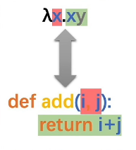
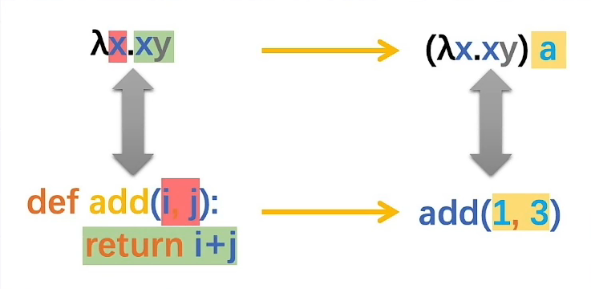

## 整体对Java的理解

编译型语言，有一个整体项目的概念，所有路径都是以根目录起始，不像python等脚本型语言，文件在哪哪就是根目录，虽然有框架会集队列下发各种看起来像一个项目，但还是按照框架根目录来执行。（从IO输出发现的）

编译型语言和解释型语言

静态语言动态语言


## 类型转换


## 面向对象

类和对象

private

this

封装（标准类）

构造方法

API

String（不可变，换地址）

StringBuilder（可变，不换地址）

ArrayList集合（python列表）

学生管理系统

方法

重载

继承

super

重写

package

import

权限修饰符

final

static


### 多态

你家有只猫和狗，你喂他们时，都可以用同一种方法来喂养（因为他们都是宠物），但是你却不能用这种方式让他们做动作，比如狗会摇尾巴，猫却不会。

喂养这个动作就可以使用多态，也就是动物父类来调用猫狗都存在的方法，不管是否存在重写。

猫吃饭、狗吃饭、猫爬树、狗摇尾巴这四个动作，使用多态就可以简化为：

动物吃饭（动物猫）、动物吃饭（动物狗）、猫爬树、狗摇尾巴

```java
AnimalEat(Animal c = new Cat());
AnimalEat(Animal c = new Dog());
Cat.climbTree();
Dog.wagTail();
```


### 抽象

可以包含非抽象方法

抽象类为其他子类固定了一个框架，不能被实例化，更直观看到最基础的特征，可以理解成“目录”、“提纲”、“模板”。

抽象类会提出子类会什么什么，但子类怎么实现它不管。

一个类继承抽象类，**必须重写抽象类的全部抽象方法**，否则这个类必须定义成抽象类，因为拥有抽象方法的类必须定义成抽象类

因为继承了父类所有的方法，并且只要有抽象方法就不能实例化

### 接口

更彻底的抽象，里面默认抽象方法

可以拥有，成员常量、抽象方法、默认方法、静态方法、私有方法

默认方法的存在是因为接口里所有的抽象方法必须被重写，但如果某个接口已经被广泛应用，就不能随便添加抽象方法，否则会导致很多类的错误，所以把**默认方法作为库、框架向前兼容的手段**。

Java是单继承，接口可以为其他的特征添加补丁，或者和形容词一样修饰类，并且一个类可以有很多形容词。主要的分类提取成父类，次要的提取成接口。

乒乓球运动员，乒乓球教练，篮球运动员，篮球教练 这四个对象，类可以是：

乒乓球运动员：运动员（子类）——人（父类）+ 乒乓球的（接口）


### 内部类


### 匿名内部类

为了不添加新类，临时重写出来一个对象来使用。

是一个对象，是子类重写后的对象，可以用多态赋值

```java
Animal a = new Animal(){
    @Override
    public void run() {
        System.out.println("猫跑的贼溜~~");
        //System.out.println(n);
    }
};
```

a这个匿名内部类就是Animal经过重写的子类对象，Animal那个位置也可以是接口。

Math

System

Object

冒泡排序

引用数据类型

### Arrays

是一个静态工具类，里面的方法都是静态


Integer

### Date

主要用来格式化输出

### Calendar

比Data更灵活，可以对年月日分别操作

### 异常

异常处理的流程总是首先（主动）抛出异常，然后才进行处理，程序会在throw语句后立即终止，执行相应的try和与其匹配的catch块

如果程序中存在嵌套的try-catch语句，如果异常已经被之前的catch语句捕捉，后面的catch语句不会继续捕捉

#### 关键词throws

如果一个方法可能出现可查的异常，应该使用关键字throws抛出，注意在方法旁边抛出相应的异常

#### Error与Exception的区别：

Error（错误）是系统中的错误，程序员是不能改变的和处理的，是在程序编译时出现的错误，只能通过修改程序才能修正。一般是指与虚拟机相关的问题，如系统崩溃，虚拟机错误，内存空间不足，方法调用栈溢等。对于这类错误的导致的应用程序中断，仅靠程序本身无法恢复和和预防，遇到这样的错误，建议让程序终止。

Exception（异常）表示程序可以处理的异常，可以捕获且可能恢复。遇到这类异常，应该尽可能处理异常，使程序恢复运行，而不应该随意终止异常。

#### 在catch捕获异常时，为什么不考虑使用Throwable类型，而只是使用Exception来进行接收？

Throwable表示的范围要比Exception大。实际上程序使用Throwable来进行处理，没有任何语法问题，但是却会存在逻辑问题。因为此时出现的（或者说用户能够处理的）只有Exception类型，而如果使用Throwable接收，还会表示可以处理Error的错误，而用户是处理不了Error错误的，所以在开发中用户可以处理的异常都要求以Exception类为主。

#### 异常是一起处理好还是分开处理好？

根据实际的开发要求是否严格来决定。在实际的项目开发项目工作中，所有的异常是统一使用Exception处理还是分开处理，完全根据开发者的项目开发标准来决定。如果项目开发环境严谨，基本上要求针对每一种异常分别进行处理，并且要详细记录下异常产生的时间以及产生的位置，这样可以方便程序维护人员进行代码的维护。再次注意：处理多个异常时，捕获范围小的异常要放在捕获范围大的异常之前处理。

#### throw和throws的区别？

throw和throws都是在异常处理中使用的关键字，区别如下：

throw：指的是在方法中人为抛出一个异常对象（这个异常对象可能是自己实例化或者抛出已存在的）；
throws：在方法的声明上使用，表示此方法在调用时必须处理异常。

#### 检查型异常（Checked Exception）与非检查型异常（Unchecked Exception）区别？

所有的检查性异常都继承自java.lang.Exception；所有的非检查性异常都继承自java.lang.RuntimeEx ception。
检查性异常和非检查性异常最主要的区别在于其处理异常的方式：检查性异常必须使用try catch或者throws等关键字进行处理，否则编译器会报错;非检查性异常一般是程序代码写的不够严谨而导致的问题，可以通过修改代码来规避。
常见的运行时异常：空指针异常(NullPointerException)、除零异常(ArithmeticException)、数组越界异常(ArrayIndexOutOfBoundsException)等;
常见的检查性异常：输入输出异常(IOException)、文件不存在异常(FileNotFoundException)、SQL语句异常(SQLException)等。

## 基础3 Collection集合

List集合

Set集合

泛型

Map

HashMap

### TreeSet

两种方法

重写和匿名内部类


### 泛型

https://www.cnblogs.com/minikobe/p/11547220.html

泛型带来的好处

在没有泛型的情况的下，通过对类型 Object 的引用来实现参数的“任意化”，“任意化”带来的缺点是要做显式的强制类型转换，而这种转换是要求开发者对实际参数类型可以预知的情况下进行的。对于强制类型转换错误的情况，编译器可能不提示错误，在运行的时候才出现异常，这是本身就是一个安全隐患。

那么泛型的好处就是在编译的时候能够检查类型安全，并且所有的强制转换都是自动和隐式的。

### 类型通配符

为什么要使用通配符而不是简单的泛型呢？通配符其实在声明局部变量时是没有什么意义的，但是当你为一个方法声明一个参数时，它是非常重要的。

对于不确定或者不关心实际要操作的类型，可以使用无限制通配符（尖括号里一个问号，即 ），表示可以持有任何类型。

上界通配符 < ? extends E>

下界通配符 < ? super E>

泛型T用来做一致性（代码里出现很多T都是一种类型）

通配符？用来代表不确定性（很多个？不保证是同一个类型）


## 基础4 I/O

### I/O

流：是一种抽象概念，是对数据传输的总称。也就是说数据在设备间的传输称为流，流的本质是数据传输

Stream 流其实就是一根传送带，元素在上面可以被 Stream 流操作

- 可以解决已有集合类库或者数组 API 的弊端
- Stream 流简化集合和数组的操作
- 链式编程

IO流的分类

- 按照数据的流向
  - 输入流: 程序可以从中读取数据的流。
  - 输出流: 程序能向其中写入数据的流。
- 按照数据类型来分
  - 字节流
    - 字节输入流
    - 字节输出流
  - 字符流
    - 字符输入流
    - 字符输出流

IO流的使用场景

- 如果操作的是纯文本文件，优先使用字符流
- 如果操作的是图片、视频、音频等二进制文件。优先使用字节流
- 如果不确定文件类型，优先使用字节流。字节流是万能的流

### Properties

Properties可以保存到流中或从流中加载

好像是用来制作配置文件用的东西

如果我不实习，真的不知道有这么牛逼的东西


## 多线程


## 网络编程


## 基础5 JDK新特性

### Lambda

普通思想：先有数据和指令，后有函数

lambda：先有函数，后有数据和指令





x是形参

a是实参


面对需要以多态方式传入接口的地方（代替接口实现类），可以用匿名内部类来解决，也可以使用Lambda

接口里只能有一个方法

lambdas相当于一个没有名字的方法体，用的时候赋给你输入变量类型

重载（改输入变量），重写（返回值和输入变量都不能变）、泛型（通过使用赋给输入变量类型，返回值变量可以改变但不太方便）

lambdas相当于一个没有名字的方法体，所以可以随便改输出

好像是为了少写输入变量（把功能放到一个函数是为了多次使用，但里还要写形参，用的时候还要传参），用Lambda不仅可以直接用里面的变量，还兼顾多次使用的功能，还可以套函数式编程提供的半成品函数。

### 接口组成更新

为了在更新接口功能时，不损害之前代码的运行


### 引用类

我的理解：直接把引用的方法的方法体，补给没有方法体的抽象方法

比Lambda更简单一点


#### 引用类的实例方法（不太懂）

引用类的实例方法，其实就是引用类中的成员方法

### 函数式接口

优点是省略了传参？直接使用所需要的参数

就是给接口里唯一的函数，提供一个匿名函数或lambda表达式，等于给接口里的函数提供函数体。

#### 常用函数式接口

##### Supplier

Supplier<T>接口也被称为生产型接口，如果我们指定了接口的泛型是什么类型，那么接口中的get方法就会生产什么类型的数据供我们使用。


##### Consumer

Consumer<T>接口也被称为消费型接口，它消费的数据的数据类型由泛型指定


##### Predicate

Predicate<T>接口通常用于判断参数是否满足指定的条件

优点：可以随便改变筛选器，也就是说先实现函数（为传入的筛选器提供各种与或非组合，我不管怎么筛选，筛选什么），再实现功能（你根据你自己的需要，传入筛选器，传入数据，获得筛选过的数据），不同的功能进来，都可以用


##### Function

Function<T,R>接口通常用于对参数进行处理，转换(处理逻辑由Lambda表达式实现)，然后返回一个新的值

和上面差不多，与或非的组合其实也是一种函数，只是规定输出boolean型，这个比上面有更多的自由度，所以需要自己规定输入输出的类型

##### 总结

Supplier<T> 生产者，无输入，有输出T类型

Consumer<T> 消费者，有输入T类型，无输出，可以链式消费

Predicate<T> 判断，有输入T类型，有输出类型boolean型，可以链式添加与或非

Function<T,R>  函数，有输入T类型，有输出R类型，，可以链式添加函数


### lambda和引用区别

lambda还要写参数输入输出

引用如果找到一个输入输出完全一致的方法体，直接把那个函数引用过来，什么都不需要加

## 基础6 类加载器&反射&注解

### 反射

感觉反射也是为了实现库、框架向前兼容而存在

动态性

是指在运行时去获取一个类的变量和方法信息。然后通过获取到的信息来创建对象，调用方法的一种机制。由于这种动态性，可以极大的增强程序的灵活性，程序不用在编译期就完成确定，在运行期仍然可以扩展

### 注解

#### 概念

注解：类的组成部分，可以给类携带一些额外的信息，提供一种安全的类似注释标记的机制，用来将任何信息或元数据（metadata）与程序元素（类、方法、成员变量等）进行关联

* 注解是给编译器或 JVM 看的，编译器或 JVM 可以根据注解来完成对应的功能
* 注解类似修饰符，应用于包、类型、构造方法、方法、成员变量、参数及本地变量的声明语句中
* **父类中的注解是不能被子类继承的**

注解作用：

* 标记
* 框架技术多半都是在使用注解和反射，都是属于框架的底层基础技术
* 在编译时进行格式检查，比如方法重写约束 @Override、函数式接口约束 @FunctionalInterface.

#### 内置注解

@Override 重写注解，一定要重写父类的方法，代表返回值，方法名，参数类型，参数数量要和父类相同

@Deprecated  定义在java.lang.Deprecated ，此注释可以用于修饰方法，属性，类，表示不推荐程序员使用，但是可以使用，或者存在更好的方式

@SuppressWarning("all") 镇压警告，当前有警告的时候，使用这个注解，可以忽略警告信息 “unchecked”，“UnusedDeclaration”

#### 元注解

@Target  用于描述所修饰的对象范围，既被描述的注解可以用在什么地方 

@Retention 表示需要在什么级别保存注解信息，用于描述注解运行状态，SOURCE<CLASS<RUNTIME

@Documented  说明该注解将被包含在Javadoc中 表示是否将我们的注解生成在JAVADoc中

@Inherited  说明子类可以继承父类中的注解

