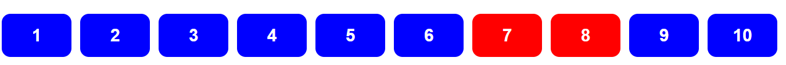
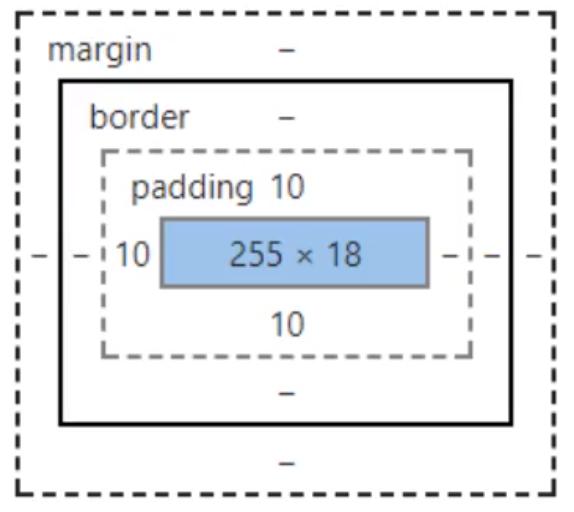
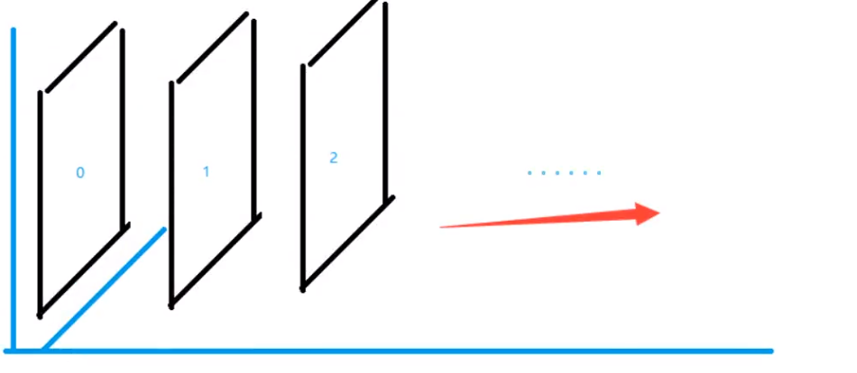
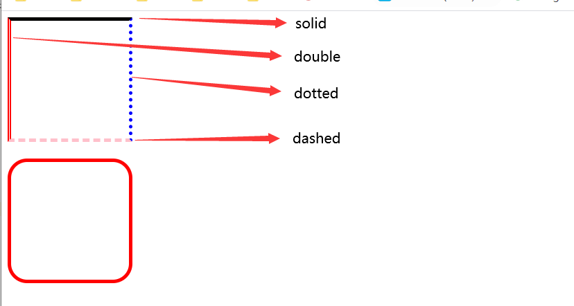
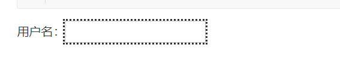
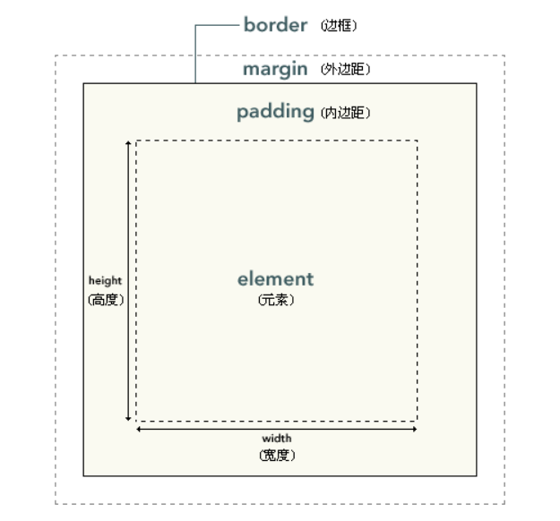
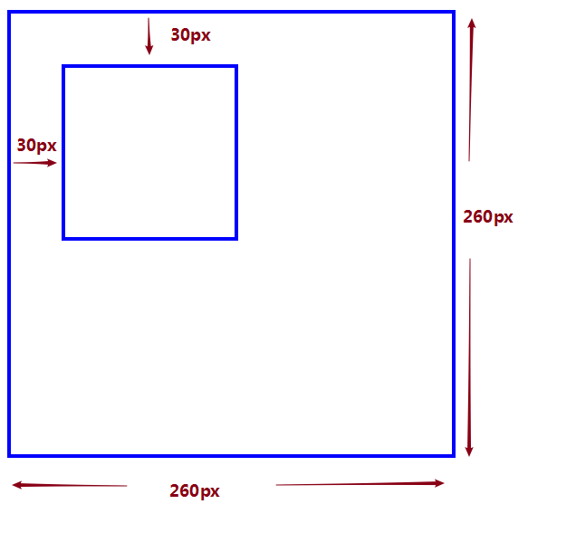
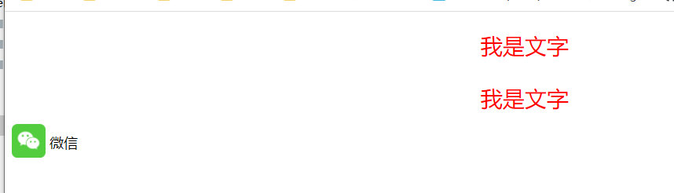
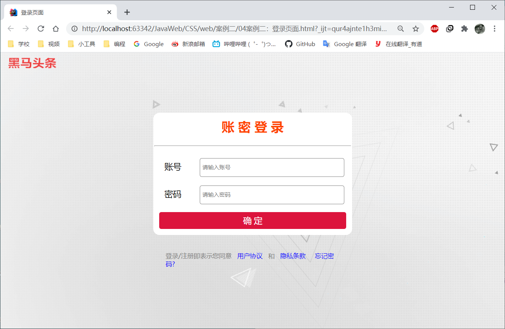

# CSS狂神

## 1. 什么是CSS


1.CSS是什么？

2.CSS怎么用(快速入门)？

3.CSS有哪些版本，最近是什么版本？

4.CSS选择器有哪些(重点+难点)？

5.如何美化一个网页(文字、阴影、超链接、列表、渐变.....)？

6.盒子模型是什么？有哪些属性

7.掌握清楚浮动、定位及网页动画特效

推荐两个网站  https://www.w3school.com    https://www.runoob.com


###  什么是CSS


CSS  Cascading Style Sheet  层叠级联样式表，美化网页，含字体、颜色、边距、高度、宽度、背景图片、浮动、定位


CSS	

从版本1.0开始，到目前已经是3.0

CSS1.0	只能化一些基本的页面

CSS2.0	DIV(块)+CSS	提出了HTML与CSS结构分离的思想

CSS2.1	浮动 定位

CSS3.0	圆角 阴影	动画...	浏览器兼容性~


### 快速入门


```html
<html lang="en">
<head>
    <meta charset="UTF-8">

    <title>Title</title>
    <!--规范 <style> 可以编写css的代码, 每一个声明，最好使用分号结尾
        语法:
            选择器{
                声明 1;
                声明 2;
                声明 3;
            }
    -->
    <style>
        h1{
            color: red;
        }
    </style>
</head>
<body>
    <h1>我是标题</h1>
</body>
</html>
```

CSS的优势

​	1.内容和表现分离；

	2. 网页结构表现统一，可以实现复用；
	3. 样式十分的丰富；
	4. 建议使用独立于html的css文件
	5. 利于SEO，容易被搜索引擎收录!  Vue 不容易被搜索引擎收录

## 2.css的三种导入方式

### **方式1.行内样式**

在标签元素中，编写一个Style属性，编写样式即可

示例代码：

```html
<html lang="en">
<head>
    <meta charset="UTF-8">
    <title>Title</title>
</head>
<body>
    <h1 style="color: red"></h1>
</body>
</html>
```

缺点： 不符合结构化架构层、表现层、行为层分离，代码较乱

### **方法二. 内部样式表 style标签**

在head区，可以添加内部样式表，<style> </style>

示例代码如下：

```html
<style>
    /*这是层叠样式表*/
    h1{
        color: green;
    }
</style>
```


### **方法三：外部样式表**

在head区，使用link连接符，<link></link> 

示例代码如下

```html
<!DOCTYPE html>
<html lang="en">
<head>
    <meta charset="UTF-8">
    <title>Title</title>
    <link rel="stylesheet" href="css/style.css">
</head>
<body>
    <h1 style="color: red"></h1>
</body>
</html>
```

拓展：外部样式的两种写法

```html
	1 连接式	<link rel="stylesheet" href="css/style.css">
	2 导入式 	<style>@import url("css/sytle.css")	</style>	
	
	区别:
	连接式是html标签，导入式是2.1引入的新功能，作为css样式功能，必须放在 <style></style>中
```


**同一个元素，在行内样式、内部样式表、外部样式表 都有描述，那么就会采用就近原则，谁离元素最近就使用谁**


## 3.选择器(重要)

### 3.1 基础选择器

作用 选择页面上的某一个或者某一类元素 有三种选择器

基本选择器

**1、标签选择器**

​	标签选择器，会选择页面上所有这个标签的元素

```html
<style>
    h1 {
        color: #a2f2a2;
        background-color: green;
        border-radius: 24px;
    }
    p{
        font-size: 80px;
    }
</style>

弊端：只想第一个h1变色，第二个h1不变色，用标签选择器做不到
```


**2、类选择器 class**

​	类选择器格式 .class的名称{}

​	好处，可以多个标签同类，可以复用，同一个class可以被多个标签复用

​	示例代码

```html
<head>
    <meta charset="UTF-8">
    <title>Title</title>
    <style>
        .kuangshen {
            color: #a2f2a2;
            background-color: green;
            border-radius: 24px;
        }
        .qinjiang{
            color: purple;
        }
        p{
            font-size: 80px;
        }
    </style>
</head>
<body>
    <h1 class="qinjiang">学JAVA</h1>
    <h1 class="kuangshen">学JAVA</h1>
    <p>听狂神说</p>
</body>
```

3、id选择器	

​	#id 名称 {}	：id必须保证全局唯一，不能重复

​	示例代码

```html
        #demo1{
            color: antiquewhite;
        }
        #demo2{
            color: brown;
        }
    </style>
</head>
<body>
    <h1 id="qinjiang" class="qinjiang">学JAVA</h1>
    <h1 class="kuangshen">学JAVA</h1>
    <p id="demo1">听狂神说</p>
    <p id="demo2">听狂神说</p>
    <p id="demo3">听狂神说</p>
    <p  id="demo4">听狂神说</p>
</body>
</html>
```

​	**不遵循就近原则，是一个固定的优先级	id选择器>class选择器>标签选择器**


### 3.2.层次选择器

1. **后代选择器**

   在某个元素的后面， 例如：祖爷爷   爷爷	爸爸	你

   ```css
   /*    后代选择器*/
       body p{
           background-color: red;
       }
   ```

2. **子选择器**

   只有一代	例如 祖爷爷 爷爷；

   ```css
   body>p{
       background-color: yellowgreen;
   }
   ```

3. **相邻兄弟选择器**

   同辈，对下不对上，相邻的下面只有一个元素被选中，其他元素不会选中，哥哥姐姐

   ```css
   /*    兄弟选择器*/
   .active + p{
       background-color: purple;
   }
   ```

4. **通用选择器**

   当前选中元素的向下的所有兄弟元素被选中

   ```css
   /*    通用选择器*/
   .active~p{
       background-color: darkorange;
   }
   ```


### 3.3 结构伪类选择器

通过使用:来使用伪类选择器 ,伪类相当于加了一些条件判断 ,这个叫做伪类

比如链接 有 a:hover, 

```css
    <style>
        /*ul的第一个子元素*/
        ul li:first-child{
            background-color: red;
            color: white;
        }
        /*ul的最后一个元素*/
        ul li:last-child{
            background-color: red;
            color: white;
        }
        /*选中p1:定位到父元素，选择当前的第一个元素
            选中当前p元素的父级元素，选中父级元素的第一个元素，并且是当前元素的一个标签才生效
            如果第一个不是p标签，就不能生效
        */
        p:nth-child(1){
            background-color: #a2f2a2;
        }
        /*选中当前元素的父级元素下的p元素的第二个*/
        p:nth-of-type(2){
            background: yellow;
        }
    </style>


<body>
    <p>p1</p>
    <p>p2</p>
    <p>p3</p>
    <ul class="active">
        <li>li1</li>
        <li>li2</li>
        <li>li3</li>
    </ul>
    <ul>
        <li>li4</li>
    </ul>
</body>
```

### 3.4 属性选择器（常用）


示例代码

```html
<!DOCTYPE html>
<html lang="en">
<head>
    <meta charset="UTF-8">
    <title>Title</title>
    <style>
        .demo a{
            float: left;
            display: block;
            height: 50px;
            width: 80px;
            border-radius: 10px;
            background: blue;
            text-align: center;
            text-decoration: none;
            margin-right: 10px;
            color: white;
            font: bold 20px/50px Arial;
        }
        /*属性名，  属性名=属性值 这个值是可以用正则表达式*/
        /*存在id属性的元素选中  a[id]{} 选中a标签带有id属性的元素*/
        /*a[id]{*/
        /*    background: red;*/
        /*}*/
        /*选中id属性为first的元素  a[id=first]{} */
        /*a[id=first]{*/
        /*    background: red;*/
        /*}*/
        /*标签a中 class属性含有Links的元素   a[class*=links]*/
        /*a[class*="links"]{*/
        /*    background: red;*/
        /*}*/
        /*选择a标签中 属性href中以 http开头的元素  a[href^="http"]*/
        /*a[href^="http"]{*/
        /*    background: red;*/
        /*}*/
        /*择a标签中 属性href中以pdf结尾的元素  a[href$="pdf"]*/
        /*在属性选择框中， = 是绝对等于，*= 是包含的意思 ^= 是以什么开头，$= 是以什么结束*/
        a[href$="pdf"]{
            background: red;
        }
    </style>
</head>
<body>
    <p class="demo">
        <a href="http://www.baidu.com" class="links item first" id="first">1</a>
        <a href="http://aigoo.top" class="links item active" target="_blank" title="test2">2</a>
        <a href="images/123.html" class="links item">3</a>
        <a href="images/123.png" class="links item">4</a>
        <a href="images/123.jpg" class="links item">5</a>
        <a href="abc" class="links item">6</a>
        <a href="/a.pdf" class="links item">7</a>
        <a href="/a.pdf" class="links item">8</a>
        <a href="/a.doc" class="links item">9</a>
        <a href="abc.doc" class="item last">10</a>
    </p>
</body>
</html>
```



小结:

​	属性选择器，支持正则表达式，支持 属性名，  属性名=属性值

​	div:nth-of-type(1)  选择当前层级第一个div标签

## 4.美化网页元素

美化网页元素，能够有效的传递页面的信息；美化网页，吸引用户的注意；同时能够凸显页面的主题；


4.1 span 标签：

重点要突出的字，一般使用span标签套住

4.2 字体样式 

​	> 颜色 : 

​		方法一：color: red;

​		方法二：RGB  color: #0000ff;  前面两位是 R,red, 中间是G green  最后两位是Blue 蓝色；

​		方法三:	color: rgba(200,10,232,0.9);   前面是 R,red, 中间是G green  接着是 是Blue 蓝色 最后是A，透明度 0~1之间；

​	> **对齐方式:  居中 居左，居右 	text-align: center;**

​	> **首行缩进:		text-indent: 2em;	2em代表两个字母**

​	> **行高:	行高 height line-height，如果行高等于块高，单行文字上下居中，那这个时候文章就会居中**

```css
>.p3{
>    background: yellowgreen;
>    height: 300px;
>    text-indent: 2em;
>    line-height: 300px;
>}
```


​	> 装饰: 下划线 	text-decoration: underline;  text-decoration: line-through; 中划线text-decoration: overline;下划线

​	> 文字图片居中：vertical-align: middle;

示例代码

```html
<html lang="en">
<head>
    <meta charset="UTF-8">
    <title>Title</title>
    <style>
        h1 {
            color: rgba(200, 10, 232, 0.9);
            text-align: center;
            text-indent: 2em;
            line-height: 30px;
            text-decoration: overline;

        }

        .p3 {
            background: yellowgreen;
            height: 300px;
            text-indent: 2em;
            line-height: 300px;
        }
        img,span{
            vertical-align: middle;
        }
    </style>
</head>
<body>
<h1>故事会</h1>
<p>
    
    <span>asfdkjflkjfksdf</span>
</p>

<p>
    《小人bai鱼》内容简介du：小人鱼为了能和自己所zhi爱的陆地上dao的王子在一版起，
    用自己美妙权的嗓音和生命的三百年换来了巫婆的药酒，于是，她有了一双美丽的脚，每
    走一步就像走在碎玻璃上一样疼痛。眼看着王子和别人结婚，她宁可牺牲自己的生命，也
    要为王子祝福。小人鱼的行为让我们见证了什么才是真正的爱情、什么是纯洁的爱情、什么
    是美丽的爱情。
</p>
<p>
    《丑小鸭》内容简介：丑小鸭历经千辛万苦、重重磨难之后变成了白天鹅，那是因为它心中
    有着梦想，梦想支撑着它。命运其实没有轨迹，关键在于对美好境界、美好理想的追求。人
    生中的挫折和痛苦是不可避免的，要学会把它们踩在脚下，每个孩子都会有一份属于自己的
    梦想，只要他们学会树立生活目标，在自信、自强、自立中成长，通过拼搏他们会真正的认
    识到自己原来也可以变成“白天鹅”，也可以像丑小鸭一样实现心中的梦想。
</p>
<p class="p3">
    《丑小鸭》内容简介：丑小鸭历经千辛万苦、重重磨难之后变成了白天鹅，那是因为它心中
    有着梦想，梦想支撑着它。命运其实没有轨迹，关键在于对美好境界、美好理想的追求。人
    生中的挫折和痛苦是不可避免的，要学会把它们踩在脚下，每个孩子都会有一份属于自己的
    梦想，只要他们学会树立生活目标，在自信、自强、自立中成长，通过拼搏他们会真正的认
    识到自己原来也可以变成“白天鹅”，也可以像丑小鸭一样实现心中的梦想。
</p>
</body>
</html>
```


4.3 超链接伪类

```
<style>
    /*默认颜色*/
    a{
        text-decoration: none;

    }
    /*鼠标悬浮状态*/
    a:hover{

        color: orange;
    }
    /*鼠标按住啊未释放*/
    a:active{
        color: green;
    }
    a:link{
        color: gray;
    }
    /*text-shadow 阴影颜色 水平偏移 垂直偏移 阴影半径*/
    #price{
        text-shadow: darkorange 10px -10px 10px;
    }
</style>
```

**4.4 列表**

示例代码

```css
.nav{
    width: 280px;
    background-color: gray;
}
h2{
    background-color: red;
    text-indent: 2em;
    font-size: 20px;
    line-height: 35px;
}

ul li{
    height: 30px;
    list-style: none;
    text-indent: 0.4em;
}
a{
    text-decoration: none;
    color: black;
    margin-right: 10px;
}
a:hover{
    color: orange;
}
```

4.5 背景


## 5. 盒子模型及使用


什么是盒子

、

margin: 外边距

border： 边框	属性含 粗细	样式	颜色	

padding：内边距


外边距妙用 居中  margin:0 auto	但首先外围要是一个块元素，并且块元素要有一个固定的宽度

**4.2 边框**


**4.3 内外边距**

padding	内边距

margin  外边距

**4.4 圆角边框**

```css
<style>
    div{
        width: 50px;
        height: 100px;
        border: 10px solid red;
        border-radius: 50px 50px 0px 0px;
    }
</style>
```

顺时针旋转，分别是 左上 右上 右下 左下, 一般用来做头像的圆角头像

**4.5 阴影**

```css
<style>
    div {
        width: 100px;
        height: 100px;
        border: 10px solid red;
        box-shadow:1px 1px 20px green;
    }
</style>
```

这个可以做一个头像闪亮，头像发光

box-shadow:1px 1px 20px green;    水平阴影的位置，垂直阴影的位置 模糊的距离 阴影的颜色 


## 6. 浮动和定位

**6.1  浮动的基本概念**

块级元素 独占一行

> h1-h6  p  div li ....

行内元素	不独占一行

> ​	span a img storg 

行内元素可以被包含在块级元素中，但是块级元素不能被包含在行内元素中

**6.2 display  &&  float**

```css
display: inline-block; 是块元素，但是可以内联在一行	
display: block;  块元素
display: inline;	行内元素
display: none;	不可见


示例代码
<head>
    <meta charset="UTF-8">
    <title>Title</title>
    <style>
        div{
            width: 100px;
            height: 100px;
            border: 1px solid red;
            display: inline-block;
        }

        span{
            width: 100px;
            height: 100px;
            border: 1px solid red;
            display: inline-block;
        }
    </style>
</head>
<body>
    <div>div块内元素</div>
    <span>span行内元素</span>
</body>
</html>
```


**6.4 父级边框塌陷**


解决父级元素塌陷的办法

​	1.增加父级元素的高度	优点是简单，但是如果有了固定的高度，就会被限制

	2. 在父级元素下面增加一个<div class='clear'></div> 清除浮动 .class{clear:both; margin:0; padding:0}	优点是简单，缺点是在Html中生成一个空div
	3. overflow   overflow:scorall  ，但是一些下拉的一些场景应该避免使用

> 在父级元素 中增加overflow:hidden，这样就可以清除父级边框塌陷

	4. 在父类上增加一个伪类，大家比较认可的，避免方法二添加一个空div的解决方案

> #father:after{
>
> ​	content:''l
>
> ​	display:block
>
> ​	clear:both
>
> }

## 7.定位

### 7.1 相对定位


相对定位:position:relative

相当于原来的位置，进行指定的偏移，相对定位的话，它仍然在标准文档流中，原来的位置会被保留

> position:relative
>
> top:-20px
>
> left:20px
>
> bottom:-10px
>
> right:20px


### 7.2 绝对定位

定位  基于xxx定位，上下左右

> position：absolute
>
> right:30px
>
> left:20px
>
> 

说明

​	1.没有父级元素定位的前提下，绝对定位是相对于浏览器的绝对定位

​	2.假设父级元素存在定位，我们通常会相对于父级元素进行偏移定位，我们在实际开发都是相对于父级元素

​	3.在父级元素范围内进行定位

​	相对于父级或者浏览器的位置进行指定的便宜，绝对定位后，他不在文档标准流中，原来的位置不会保留

>#father{
>
>​	border:1px solid #66;
>
>​	padding:0px
>
>​	position:relative
>
>}
>
>#son{
>
>​	background-color:#233233
>
>​	border:1px dashed #233233;
>
>​	position:absolute;
>
>​	right:30px
>
>​	top:-10px
>
>​	lefg:20px
>
>​	bottom:30px
>
>}
>
><div id="father">
><div id="first">第一个盒子</div>
><div id="second">第二个盒子</div>
><div id="third">第三个盒子</div>
></div>
>
>


### 7.3 固定定位

说明：固定定位，相对于浏览器的初始位置的固定定位

>fiv:nth-of-type(2){
>
>​	position:fixed /*固定定位*/
>
>​	right:0
>
>​	bottom:0
>
>}

示例代码：

```html
<html lang="en">
<head>
    <meta charset="UTF-8">
    <title>Title</title>
    <style>
        body{
            height: 1000px;
            margin: 0;
            padding: 0;
        }
        div:nth-of-type(1){
            width: 100px;
            height: 100px;
            border: 1px solid red;
            background: red;
            position: absolute;
            right: 0;
            bottom: 0;
        }
        div:nth-of-type(2){
            width: 200px;
            height: 50px;
            border: 1px solid blue;
            background: blue;
            position: fixed;
            right: 0;
            bottom: 0;
        }
    </style>
</head>
<body>
    <div>div1</div>
    <div>div2</div>
</body>
</html>
```

### 7.4.z-index

层级概念，提升不同层级排序



z-index  最低为0，最高不限制

opacity: 0-1 设置透明度

示例代码：

```css
body{
    margin: 0;
    padding: 0;
}
#content{
    width: 400px;
    margin: 0;
    padding: 0;
    border: 1px solid red;
    font-size: 12px;
    line-height: 25px;
    overflow: hidden;
}
ul,li{
    padding: 0px;
    margin: 0px;
    list-style: none;
}
ul{
    position: relative;
}

.tiptext,.tibBg{
    position: absolute;
    width: 400px;
    height: 25px;
    top: 246px;
}

.tibBg{
    background: #000;
}
.tiptext{
    color: white;
    z-index: 1;
}
```


对应的html

```html
<html lang="en">
<head>
    <meta charset="UTF-8">
    <title>Title</title>
    <link rel="stylesheet" href="css/style.css">
</head>
<body>
    <div id="content">
        <ul>
            <li></li>
            <li class="tiptext">学习微服务，找狂神</li>
            <li class="tibBg"></li>
            <li>时间:2099-01-01</li>
            <li>地点:月球1号基地</li>
        </ul>
    </div>
</body>
</html>
```


> ```
> /*opacity: 0.5; 背景透明度*/
> ```


# CSS黑马

## CSS入门

### 概述

CSS (层叠样式表——Cascading Style Sheets，缩写为 **CSS**），简单的说，它是用于设置和布局网页的计算机语言。会告知浏览器如何渲染页面元素。例如，调整内容的字体，颜色，大小等样式，设置边框的样式，调整模块的间距等。

层叠：是指样式表允许以多种方式规定样式信息。可以规定在单个元素中，可以在页面头元素中，也可以在另一个CSS文件中，规定的方式会有次序的差别。

样式：是指丰富的样式外观。拿边框距离来说，允许任何设置边框，允许设置边框与框内元素的距离，允许设置边框与边框的距离等等。


***


### 组成

CSS是一门基于规则的语言—你能定义用于你的网页中**特定元素**的一组**样式规则**。这里面提到了两个概念，一是特定元素，二是样式规则。对应CSS的语法，也就是**选择器（*selects*）**和**声明（*eclarations*）**。

* 选择器：指定要添加样式的 HTML元素的方式。可以使用标签名，class值，id值等多种方式。
* 声明：形式为**属性(property):值(value)**，用于设置特定元素的属性信息。
  * 属性：指示文体特征，例如`font-size`，`width`，`background-color`。
  * 值：每个指定的属性都有一个值，该值指示您如何更改这些样式。

格式：

```css
选择器 {
    属性名:属性值;
    属性名:属性值;
    属性名:属性值;
}
```


***


### 实现

<!DOCTYPE html>
<html>
  <head>
    <meta charset="utf-8">
    <title>页面标题</title>
	<style>
        h1{
            font-size:40px; /* 设置字体大小为100像素*/
        }
    </style>
  </head>
  <body>
      <h1>今天开始学CSS</h1>
  </body>
</html>


***


## CSS语法

### 注释方式

CSS中的注释以`/*`和开头`*/`。

```css
/* 设置h1的样式 */
h1 {
  color: blue;
  background-color: yellow;
  border: 1px solid black;
}
```


***


### 引入方式

#### 内联样式

内联样式是CSS声明在元素的`style`属性中，仅影响一个元素：

* 格式：

  ```html
  <标签 style="属性名:属性值; 属性名:属性值;">内容</标签>
  ```

* 例如：

  ```html
  <h1 style="color: blue;background-color: yellow;border: 1px solid black;">
      Hello World!
  </h1>
  ```

* 效果：

  <h1 style="color: blue;background-color: yellow;border: 1px solid black;">
      Hello World!
  </h1>

* 特点：格式简单，但是样式作用无法复用到多个元素上，不利于维护


#### 内部样式表

内部样式表是将CSS样式放在[style](https://developer.mozilla.org/zh-CN/docs/Web/HTML/Element/style)标签中，通常style标签编写在HTML 的[head](https://developer.mozilla.org/zh-CN/docs/Web/HTML/Element/head)标签内部。

* 格式：

  ```html
  <head>
      <style>
          选择器 {
              属性名: 属性值;
              属性名: 属性值;
          }
      </style>
  </head>
  ```

* 例如：

  ```html
   <head>
      <style>
        h1 {
          color: blue;
          background-color: yellow;
          border: 1px solid black;
        }
      </style>
    </head>
  ```

* 特点：内部样式只能作用在当前页面上，如果是多个页面，就无法复用了


#### 外部样式表

外部样式表是CSS附加到文档中的最常见和最有用的方法，因为您可以将CSS文件链接到多个页面，从而允许您使用相同的样式表设置所有页面的样式。

外部样式表是指将CSS编写在扩展名为`.css` 的单独文件中，并从HTML`<link>` 元素引用它，通常link标签`编写在HTML 的[head]标签内部。

* 格式

  ```html
  <link rel="stylesheet" href="css文件">
  ```

  * rel：表示“关系 (relationship) ”，属性值指链接方式与包含它的文档之间的关系，引入css文件固定值为stylesheet。
  * href：属性需要引用某文件系统中的一个文件。

* 举例

  * 创建styles.css文件

    ```html
    h1 {
      color: blue;
      background-color: yellow;
      border: 1px solid black;
    }
    ```

  * link标签引入文件

    ```html
    <!DOCTYPE html>
    <html>
      <head>
        <meta charset="utf-8">
        <link rel="stylesheet" href="styles.css">
      </head>
      <body>
        <h1>Hello World!</h1>
      </body>
    </html>
    ```

    效果同上

* 为了CSS文件的管理，在项目中创建一个`css文件夹`，专门保存样式文件，并调整指定的路径以匹配

  ```html
  <link rel="stylesheet" href="../css/styles.css">
  <!--..代表上一级 相对路径-->
  ```

  


#### 优先级

规则层叠于一个样式表中，其中数字 4 拥有最高的优先权，其他的按顺序覆盖：

1. 浏览器缺省设置
2. 外部样式表
3. 内部样式表（位于 <head> 标签内部）
4. 内联样式（在 HTML 元素内部）


***


### 选择器

#### 介绍选择器

为了样式化某些元素，我们会通过选择器来选中HTML文档中的这些元素，每个CSS规则都以一个选择器或一组选择器为开始，去告诉浏览器这些规则应该应用到哪些元素上。

选择器的分类：

| 分类       | 名称       | 符号   | 作用                                                         | 示例         |
| ---------- | ---------- | ------ | ------------------------------------------------------------ | ------------ |
| 基本选择器 | 元素选择器 | 标签名 | 基于标签名匹配元素                                           | div{ }       |
|            | 类选择器   | `.`    | 基于class属性值匹配元素                                      | .center{ }   |
|            | ID选择器   | `#`    | 基于id属性值匹配元素                                         | #username{ } |
|            | 通用选择器 | `*`    | 匹配文档中的所有内容                                         | *{ }         |
| 属性选择器 | 属性选择器 | `[]`   | 基于某属性匹配元素                                           | [type]{ }    |
| 伪类选择器 | 伪类选择器 | `:`    | 用于向某些选择器添加特殊的效果                               | a:hover{ }   |
| 组合选择器 | 分组选择器 | ,      | 使用 , 号结合两个选择器，匹配两个选择器的元素                | span,p{}     |
|            | 后代选择器 | 空格   | 使用空格符号结合两个选择器，基于<br />第一个选择器，匹配第二个选择器的所有后代元素 | .top li{ }   |


#### 基本选择器

* 页面元素：

  ```html
  <body>
      <div>div1</div>
  
      <div class="cls">div2</div>
      <div class="cls">div3</div>
  
      <div id="d1">div4</div>
      <div id="d2">div5</div>
  </body>
  ```

  

* 元素选择器

  ```css
  /*选择所有div标签,字体为蓝色*/
  div{
  	 color: red;
  }
  ```

* 类选择器

  ```css
  /*选择class为cls的,字体为蓝色*/
  .cls{
  	color: blue;
  }
  ```

* ID选择器

  ```css
  /*id选择器*/
  #d1{
      color: green;/*id为d1的字体变成绿色*/
  }
  
  #d2{
      color: pink;/*id为d2的字体变成粉色*/
  }/
  ```

* 通用选择器

  ```css
  /*所有标签 */
  *{
      background-color: aqua;
  }
  ```

  

***


#### 属性选择器

* 页面：

  ```html
  <body>
      用户名：<input type="text"/> <br/>
      密码：<input type="password"/> <br>
      邮箱：<input type="email"/> <br>
  </body>
  ```

* 选择器：

  ```css
  /*输入框中输入的字符是红色*/
  [type] {
      color: red;
  }
  /*输入框中输入的字符是蓝色*/
  [type=password] {
      color: blue;
  }
  ```


***


#### 伪类选择器

* 页面元素

  ```html
  <body>
      <a href="https://www.baidu.com" target="_blank">百度一下</a>
  </body>
  ```

* 伪类选择器

  ```css
  /*未访问的状态*/
  a:link{
  	color: black;
  }
  
  /*已访问的状态*/
  a:visited{
  	color: blue;
  }
  
  /*鼠标悬浮的状态*/
  a:hover{
  	color: red;
  }
  
  /*已选中的状态*/
  a:active{
  	color: yellow;
  }
  ```

* 注意：伪类顺序 link ，visited，hover，active，否则有可能失效。


***


#### 组合选择器

* 页面：

  ```html
  <body>
      <span>span</span> <br/>
      <p>段落</p>
      
      <div class="top">
          <ol>
              <li>aa</li>
              <li>bb</li>
          </ol>
      </div>
      <div class="center">
          <ol>
              <li>cc</li>
              <li>dd</li>
          </ol>
      </div>
  </body>
  ```

* 分组选择器

  ```css
  /*span p两个标签下的字体为蓝色*/
  span,p{
  	color: blue;
  }
  ```

* 后代选择器

  ```css
  /*class为top下的所有li标签字体颜色为红色*/
  .top li{
  	color: red;
  }
  ```


***


#### 优先级

选择器优先级

* ID选择器 > 类选择器 > 标签选择器 > 通用选择器
* 如果优先级相同，那么就满足就近原则


***


### 边框样式

#### 单个边框

* 单个边框
  border：边框
  border-top: 上边框
  border-left: 左边框
  border-bottom: 底边框
  border-right:  右边框

* 无边框，当border值为none时，可以让边框不显示

  ```css
  div {
  	width: 200px;
      height: 200px;
      border: none;
  }
  ```

* 圆角

  通过使用[`border-radius`]属性设置盒子的圆角，虽然能分别设置四个角，但是通常我们使用一个值，来设置整体效果

```css
#d1{
    /*设置所有边框*/
    /*border: 5px solid black;*/

    /*设置上边框*/
    border-top: 5px solid black;
    /*设置左边框*/
    border-left: 5px double red;
    /*设置右边框*/
    border-right: 5px dotted blue;
    /*设置下边框*/
    border-bottom: 5px dashed pink;

    width: 150px;
    height: 150px;
}

#d2{
    border: 5px solid red;
    /*设置边框的弧度*/
    border-radius: 25px;
    width: 150px;
    height: 150px;
}
```

```html
<body>
    <div id="d1"></div>
    <br/>
    <div id="d2"></div>
</body>
```




****


#### 边框轮廓

轮廓**outline**：是绘制于元素周围的一条线，位于边框边缘的外围，可起到突出元素的作用

* 属性值：double：双实线   dotted：圆点   dashed：虚线   none：无

```html
<!DOCTYPE html>
<html lang="en">
<head>
    <meta charset="UTF-8">
    <title>样式演示</title>
    <style>
        input{
            outline: dotted;
        }
    </style>
</head>
<body>
    用户名：<input type="text"/> <br/>
</body>
</html>
```



***


#### 盒子模型

##### 模型介绍

盒子模型是通过设置**元素框**与**元素内容**和**外部元素**的边距，而进行布局的方式。



- element : 元素。
- padding : 内边距，也有资料将其翻译为填充。
- border : 边框。
- margin : 外边距，也有资料将其翻译为空白或空白边。


##### 边距

内边距、边框和外边距都是可选的，默认值是零。在 CSS 中，width 和 height 指的是内容区域的宽度和高度。

* 外边距
  单独设置边框的外边距，设置上、右、下、左方向：

  ```css
  margin-top
  margin-right
  margin-bottom
  margin-left
  ```

  * ```css
    margin:  auto /*浏览器自动计算外边距，具有居中效果。*/
    ```

  * 一个值

    ```css
    /*  所有 4 个外边距都是 10px */
    margin:10px;
    ```

  * 两个值

    ```css
    margin:10px 5px;/* 上外边距和下外边距是 10px*/
    margin:10px auto;/*右外边距和左外边距是 5px */
    ```

  * 三个值

    ```css
    /* 上外边距是 10px，右外边距和左外边距是 5px，下外边距是 15px*/
    margin:10px 5px 15px;
    ```

  * 四个值

    ```css
    /*上外边距是 10px，右外边距是 5px，下外边距是 15px，左外边距是 20px*/
    /*上右下外*/
    margin:10px 5px 15px 20px;
    ```

    

* 内边距
  与外边距类似，单独设置边框的内边距，设置上、右、下、左方向：

  ```css
  padding-top
  padding-right
  padding-bottom
  padding-left
  ```

  

##### 布局

* 基本布局

  ```html
  <style>
         div{
             border: 2px solid blue;
         }
         .big{
             width: 200px;
             height: 200px;
         }
         .small{
             width: 100px;
             height: 100px;
             margin: 30px;/*  外边距 */
         }
  </style>
  
  <div class="big">
      <div class="small">
      </div>
  </div
  ```

  


* 增加内边距会增加元素框的总尺寸

  ```css
   <style>
  	div{
      	border: 2px solid blue;
  	}
  	.big{
      	width: 200px;
      	height: 200px;
      	padding: 30px;/*内边距 */
  	}
  	.small{
  		width: 100px;
      	height: 100px;
  	}
  </style>
  ```

  


***


### 文本样式

#### 基本属性

| 属性名          | 作用         | 属性取值                                                     |
| --------------- | ------------ | ------------------------------------------------------------ |
| width           | 宽度         |                                                              |
| height          | 高度         |                                                              |
| color           | 颜色         |                                                              |
| font-family     | 字体样式     | 宋体、楷体                                                   |
| font-size       | 字体大小     | px : 像素，文本高度像素绝对数值。<br />em : 1em等于当前元素的父元素设置的字体大小，是相对数值 |
| text-decoration | 下划线       | underline : 下划线  <br/>overline : 上划线 <br/>line-through : 删除线 <br/>none : 不要线条 |
| text-align      | 文本水平对齐 | lef : 左对齐文本<br />right : 右对齐文本<br />center : 使文本居中 <br />justify : 使文本散布，改变单词间的间距，使文本所有行具有相同宽度。 |
| line-height     | 行高，行间距 |                                                              |
| vertical-align  | 文本垂直对齐 | top：居上   bottom：居下  middle：居中   或者百分比          |
| display         | 元素如何显示 | 可以设置块级和行内元素的切换，也可以设置元素隐藏<br />inline：内联元素(无换行、无长宽)   <br />block：块级元素(有换行)  <br />inline-block：内联元素(有长宽)  <br />none：隐藏元素 |

```css
div{
    color: /*red*/ #ff0000;
    font-family: /*宋体*/ 微软雅黑;
    font-size: 25px;/
    text-decoration: none;
    text-align: center;
    line-height: 60px;
}

span{
    /*文字垂直对齐  top：居上   bottom：居下  middle：居中   百分比*/
    vertical-align: 50%;     /*居中对齐*/
}
```

```html
<div>
    我是文字
</div>
<div>
    我是文字
</div>


<span>微信</span>
```




***


#### 文本显示

* 元素显示

  ```css
  /*   把列表项显示为内联元素，无长宽*/
  li {
      display:inline;
  }
  /*   把span元素作为块元素，有换行*/
  span {
      display:block;
  }
  /*   行内块元素，结合的行内和块级的优点，既可以行内显示，又可以设置长宽，*/
  li {
      display:inline-block;
  }
  /*所有div在一行显示*/
  div{
      display: inline-block;
      width: 100px;
  }
  ```

  

* 元素隐藏

  当设置为none时，可以隐藏元素。


****


## CSS案例

```css
/*背景图片*/
body{
    background: url("../img/bg.png");
}

/*中间表单样式*/
.center{
    background: white;      /*背景色*/
    width: 40%;             /*宽度*/
    margin: auto;           /*水平居中外边距*/
    margin-top: 100px;      /*上外边距*/
    border-radius: 15px;    /*边框弧度*/
    text-align: center;     /*文本水平居中*/
}

/*表头样式*/
thead th{
    font-size: 30px;    /*字体大小*/
    color: orangered;   /*字体颜色*/
}

/*表体提示信息样式*/
tbody label{
    font-size: 20px;    /*字体大小*/
}

/*表体输入框样式*/
tbody input{
    border: 1px solid gray; /*边框*/
    border-radius: 5px;     /*边框弧度*/
    width: 90%;             /*输入框的宽度*/
    height: 40px;           /*输入框的高度*/
    outline: none;          /*取消轮廓的样式*/
}

/*表底确定按钮样式*/
tfoot button{
    border: 1px solid crimson;  /*边框*/
    border-radius: 5px;         /*边框弧度*/
    width: 95%;                 /*宽度*/
    height: 40px;               /*高度*/
    background: crimson;        /*背景色*/
    color: white;               /*文字的颜色*/
    font-size: 20px;            /*字体大小*/
}

/*表行高度*/
tr{
    line-height: 60px;  /*行高*/
}

/*底部页脚样式*/
.footer{
    width: 35%; /*宽度*/
    margin: auto;   /*水平居中外边距*/
    font-size: 15px;    /*字体大小*/
    color: gray;    /*字体颜色*/
}

/*超链接样式*/
a{
    text-decoration: none;  /*去除超链接的下划线*/
    color: blue;            /*超链接颜色*/
}
```

```html
<!DOCTYPE html>
<html lang="en">
<head>
    <meta charset="UTF-8">
    <title>登录页面</title>
    <link rel="stylesheet" href="../css/login.css"/>
</head>
<body>
    <!--顶部公司图标-->
    <div>
        
    </div>

    <!--中间表单-->
    <div class="center">
        <form action="#" method="get" autocomplete="off">
            <table width="100%">
                <thead>
                    <tr>
                        <th colspan="2">账&nbsp;密&nbsp;登&nbsp;录<hr/></th>
                    </tr>
                </thead>

                <tbody>
                    <tr>
                        <td>
                            <label for="username">账号</label>
                        </td>
                        <td>
                            <input type="text" id="username" name="username" placeholder=" 请输入账号" required/>
                        </td>
                    </tr>
                    <tr>
                        <td>
                            <label for="password">密码</label>
                        </td>
                        <td>
                            <input type="password" id="password" name="password" placeholder=" 请输入密码" required/>
                        </td>
                    </tr>
                </tbody>

                <tfoot>
                    <tr>
                        <td colspan="2">
                            <button type="submit">确&nbsp;定</button>
                        </td>
                    </tr>
                </tfoot>
            </table>
        </form>
    </div>

    <!--底部页脚-->
    <div class="footer">
        <br/><br/>
        登录/注册即表示您同意&nbsp;&nbsp;
        <a href="#" target="_blank">用户协议</a>&nbsp;&nbsp;
        和&nbsp;&nbsp;
        <a href="#" target="_blank">隐私条款</a>&nbsp;&nbsp;&nbsp;&nbsp;
        <a href="#" target="_blank">忘记密码?</a>
    </div>
</body>
</html>
```




***


