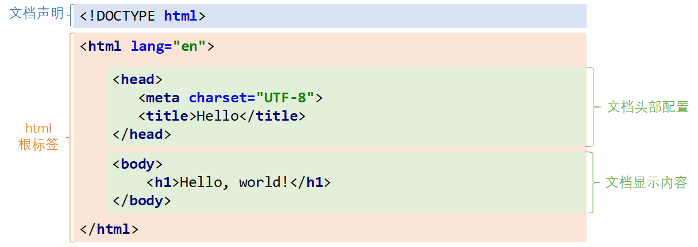
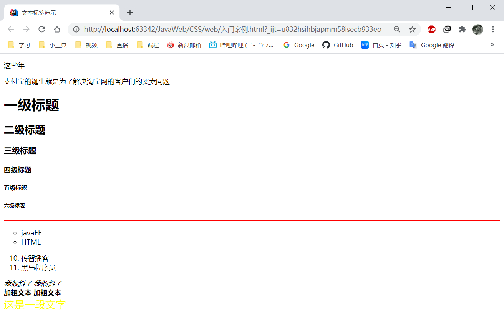
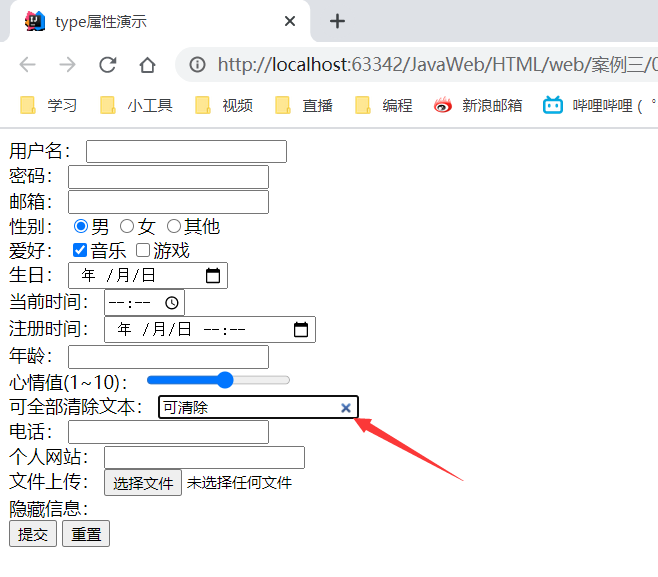
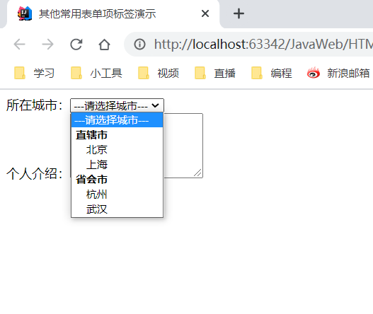
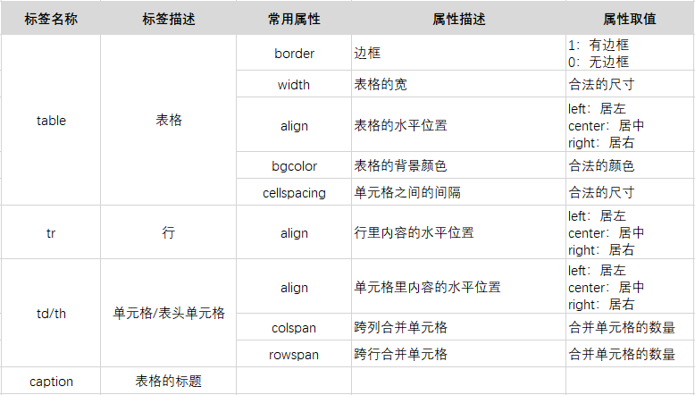
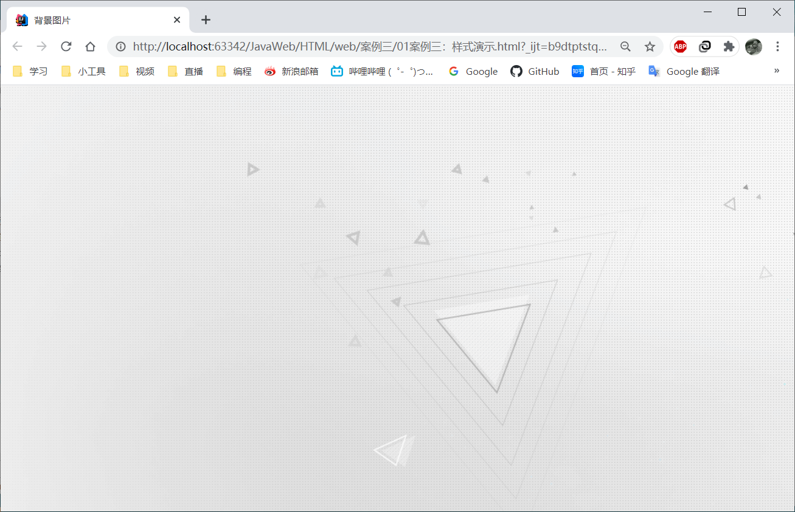
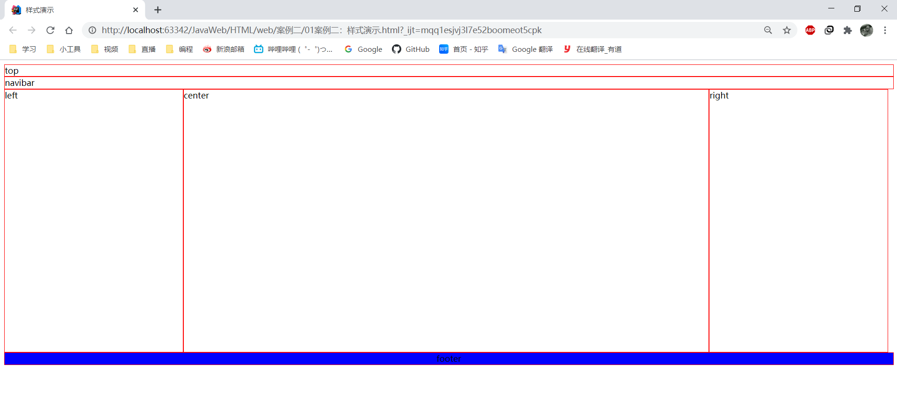
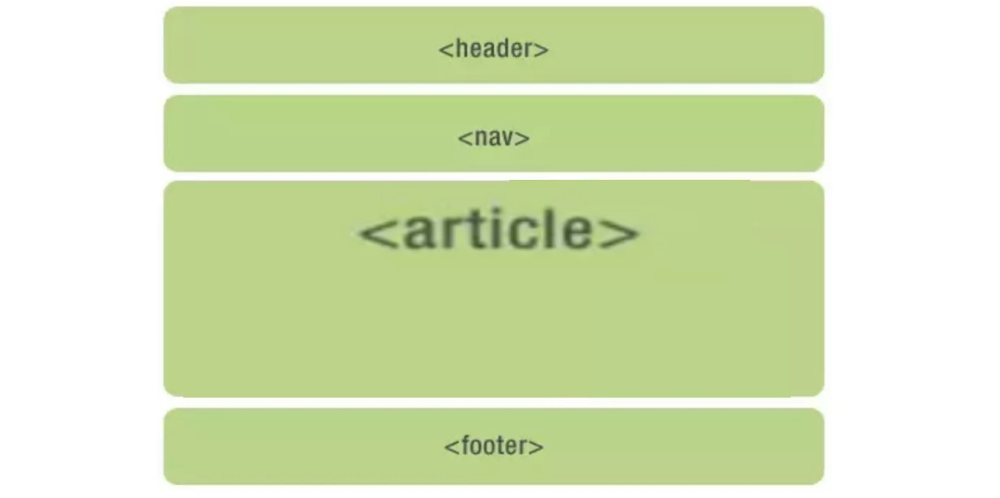
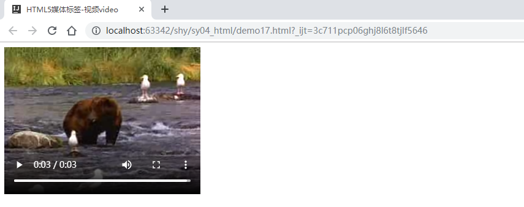

# HTML简单使用

## 网页基本标签

自闭和标签、开放标签  <meta charset="UTF-8">

闭合标签  <title>我的第一个页面</title>

注释

```
 <!--DOCTYPE  告诉浏览器，我们要使用什么规范-->
```

idea快捷注释 ctrl +//

示例代码注释

```html
<!--DOCTYPE  告诉浏览器，我们要使用什么规范-->
<!DOCTYPE html>
<!--html 这是一个总标签，所有页面内容要包含在这里-->
<html lang="en">
<!--head  代表网页的头部-->
<head>
    <!--meta 描述性标签，用于描述网站的一些信息，一般用来做seo使用-->
    <meta charset="UTF-8">
    <!--用于告诉搜索引擎，你网页的关键字。-->
    <meta name="keywords" , content="狂神说Java，西部开源">
    <!--用于告诉搜索引擎，你网站的主要内容。-->
    <meta name="description" , content="来这儿可以学习Java">

    <!-- title 网站的标题，在标签头部显示-->
    <title>我的第一个页面</title>
</head>
<!---->
<body>
    Hello,World！
</body>
</html>
```


<!DOCTYPE html>
<html lang="en">
<head>
    <meta charset="UTF-8">
    <meta name="keywords" , content="狂神说Java，西部开源">
    <meta name="description" , content="来这儿可以学习Java">
</head>
<body>
Hello,World！
</body>
</html>


标题标签 	 <title>标题标签</title> <h1>关闭标签</h1> <h2>关闭标签</h2> <h3>关闭标签</h3> <h4>关闭标签</h4> <h5>关闭标签</h5> <h6>关闭标签</h6>

段落标签	<p></p>  快捷键 p+tab键

换行标签（自闭和）	<br/>

水平线标签  <hr/>

字体样式标签  

```html
<strong>粗体: I love you！ </strong>
<em>斜体标签</em>
```

注释和特殊符号标签

 

```html
<!--特殊符号-->
    <!--特殊符号-->
    空&nbsp;格   &nbsp; 表示空格
    &gt; 大于号
    &lt;  小于号
    &copy; 版权所有狂神
    &female;&male;
    <br>
```

## 图像、超链接

```html
 <!--
	a标签
	href必填，表示要跳转到那个页面
	target： 表示窗口在哪儿打开
		_blank  在新标签打开页面
		_self  在自己网页中打开
	锚链接
		1. 需要一个标记
		2.使用 #name
	功能性连接：
		带有功能
-->

	<a href="https://www.baidu.com" target="_blank">点击我跳转新页面
        
	</a>


	<a href="#top" target="_blank">点击我跳转锚链接</a>
	功能连接
	QQ
	<a href="mailto:xxxx@xxx.com" target="_blank">点击我跳转锚链接</a>
	
```

## 块元素和块内元素

在HTML中有两种重要元素类别，块级元素和内联元素

- 块级元素：

  **独占一行**。块级元素（block）在页面中以块的形式展现。相对于其前面的内容它会出现在新的一行，其后的内容也会被挤到下一行展现。比如`<p>` ，`<hr>`，`<li>` ，`<div>`等。

- 行内元素

  **行内显示**。行内元素不会导致换行。通常出现在块级元素中并环绕文档内容的一小部分，而不是一整个段落或者一组内容。比如`<b>`，`<a>`，`<i>`，`<span>` 等。

注意：一个块级元素不会被嵌套进行内元素中，但**可以嵌套在其它块级元素中**。

常用的两个标签：（**重要**）

* `<div>` 是一个通用的内容容器，并没有任何特殊语义。它可以被用来对其它元素进行分组，一般用于样式化相关的需求。它是一个**块级元素**。
* 属性：id、style、class
* ` <span>` 是短语内容的通用行内容器，**并没有任何特殊语义**。它可以被用来编组元素以达到某种样式。它是一个**行内元素**


## 列表、表格、媒体元素

块元素，无论内容多少。该元素独占一行叫做块元素

行元素  能放在一行叫做行内元素

**列表**

无序列表	，一般用在导航上

```html
<ul> 导航用无序
    <li>java</li>
</ul>
```

**有序列表**

```html
<ol>
    <li>java</li>
</ol>
```

**自定义列表**  公司网站底部经常用自定义列表

```
<!--自定义标签-->
<dl>
    <dt>学科</dt>
    <dd>java</dd>
    <dd>python</dd>
    <dd>C</dd>
</dl>
```

**表格**，简单通用，应用广泛 ，基本单元格，行，列

```html
<table border="0.5px">
<!--clospan 跨列 rowspan跨列 -->
    <tr>
        <td colspan="4">1-1</td>
        <td rowspan="2">1-1</td>
        <td></td></tr>
    <tr><td>1-1</td><td></td><td></td></tr>
    <tr><td>1-3</td><td></td><td></td></tr>
    
</table>
```

**视频+音频**

```html
    <!--src  资源路径   controls    控制条  autoplay 自动播放-->
    <video src="../resourse/video/1.mp4" autoplay controls></video>
    <autio src="../resourse/video/1.mp3" autoplay controls></autio>
```

**页面的结构**

Header	页面头部

Footer	页面脚步

section	web页面中一块独立的区域

article	独立文章内容

aside	相关内容或者应用，常用语侧边栏

nav	导航类辅助内容


网页里面内嵌网页（内联）

Iframe

```html
<!--内联框架-->
<iframe src="path" name="mainFrame" frameborder="0"></iframe>
```


## 表单及表单应用(重点)

```html
<form action="result.html" method="post">
    <p>姓名: <input type="text" name="name"></p>
    <p>密码: <input type="password" name="pass"></p>
    <p>
        <input type="submit" name="Button" value="提交">
        <input type="reset" name="Reset" value="重填">
    </p>
</form>
```

action:     表单提交的位置，可以是网站，也可以是一个请求的地址

method： post，get提交方式  get方式提交可以在url中看到我们提交的信息，不安全但是高效    post 比较安全，并且可以传输大文件


type  指定元素类型，text,password,checkbox,radio,submit,reset,file,hidden,image,button ,

name	指定表单元素的名称

value  元素初始值，type为radio时，必须指定一个值 默认初始值

size	指定表单元素的初始宽度，设置输入框长度限制，文本框长度

maxlength ="8"  最长能写几个字符

checked  type为radio或者checkbox时，指定按钮是否被选中

**单选框**

```html
<p>
    <input type="radio" value="boy" name="sex">男
    <input type="radio" value="boy" name="sex">女
</p>
<!--注意 在type=radio时候，name是起到分组的作用， name需要一样-->
```

**多选框**

```html
<p>
    <input type="checkbox" value="sleep" name="hobby">睡觉
    <input type="checkbox" value="code" name="hobby" checked>敲代码
    <input type="checkbox" value="chat" name="hobby">聊天
    <input type="checkbox" value="game" name="hobby">游戏
</p>
<!--注意 在type=radio时候，name是起到分组的作用	name需要一样--> 默认选中checked
```

**下拉框**

```html
    <p>
        <select name="列表名称" id="">
            <option value="1">中国</option>
            <option value="2">瑞士</option>
            <option value="3">美国</option>
            <option value="4">英国</option>
            <option value="5" selected>日本</option>
        </select>
    </p>
```


**文本域**

```html
<p>
    <textarea name="textarea" id="1110" cols="30" rows="10">这是一个文本域</textarea>
</p>
```


**滑块**

```html
<!--滑块-->
<p>音量:
    <input type="range" name="voice" min="0" max="100" step="2">
</p>
```

**搜索框**

```html
<!--搜索框-->
<p>搜索:
    <input type="search" name="search">
</p>
```


disable  hidden	readonly	checked	


**增强鼠标可用性**

```html
<!--    增强鼠标的可用性-->
    <p>
        <label for="mark">你点我试试:</label>
        <input type="text" id="mark">
    </p>
```

## 表单初级验证(重点)


为什么需要表单验证？

​	减轻服务器压力并保证数据安全!


required 不能为空，必须要填写 可用在文本框中

placeholder	默认提示信息	可用在控件上

pattern	正则表达式，可以自定义一个正则表达式	

```html
<!--正则表达式去查找-->
<p>自定义邮箱:
    <input type="text" name="diyname" pattern="^\w+([-+.]\w+)*@\w+([-.]\w+)*\.\w+([-.]\w+)*$">
</p>
```


# HTML详解

## HTML入门

### 概述

HTML（超文本标记语言—HyperText Markup Language）是构成 Web 世界的基础，是一种用来告知浏览器如何组织页面的标记语言

* 超文本 Hypertext，是指连接单个或者多个网站间的网页的链接。通过链接，就能访问互联网中的内容

* 标记 Markup ，是用来注明文本，图片等内容，以便于在浏览器中显示，例如 `<head>`，`<body>` 等

**网页的构成**

* [HTML](https://developer.mozilla.org/zh-CN/docs/Web/HTML)：通常用来定义网页内容的含义和基本结构
* [CSS](https://developer.mozilla.org/zh-CN/docs/Web/CSS)：通常用来描述网页的表现与展示效果
* [JavaScript](https://developer.mozilla.org/zh-CN/docs/Web/JavaScript)：通常用来执行网页的功能与行为


### 组成

#### 标签

HTML 页面由一系列的**元素（elements）** 组成，而元素是使用**标签**创建的

一对标签（tags）可以设置一段文字样式，添加一张图片或者添加超链接等等

在 HTML 中，`<h1>` 标签表示**标题**，我们可以使用**开始标签**和**结束标签**包围文本内容，这样其中的内容就以标题的形式显示

```html
<h1>开始学习JavaWeb</h1>
<h2>二级标题</h2>
```


#### 属性

HTML 标签可以拥有属性

* 属性是属于标签的，修饰标签，让标签有更多的效果
* 属性一般定义在起始标签里面
* 属性一般以**属性=属性值**的形式出现
* 属性值一般用 `''` 或者 `""` 括起来。 不加引号也是可以的(不建议使用)。比如：name='value'

```html
<h1 align="center">开始学习JavaWeb</h1>
```

在 HTML 标签中，`align`  属性表示**水平对齐方式**，我们可以赋值为 `center`  表示 **居中** 。


***


### 结构



文档结构介绍：

* 文档声明：用于声明当前 HTML 的版本，这里的`<!DOCTYPE html>`是 HTML5 的声明
* html 根标签：除文档声明以外，其它内容全部要放在根标签 html 内部
* 文档头部配置：head 标签，是当前页面的配置信息，外部引入文件, 例如网页标签、字符集等
  * `<meta charset="utf-8">`：这个标签是页面的元数据信息，设置文档使用 utf-8 字符集编码
  * `<title>`：这个标签定义文档标题，位置出现在浏览器标签。在收藏页面时，它可用来描述页面
* 文档显示内容：body 标签，里边的内容会显示到浏览器页面上

## HTML语法

### 注释方式

将一段 HTML 中的内容置为注释，你需要将其用特殊的记号 <!----> 包括起来

```html
<p>我在注释外！</p>

<!-- <p>我在注释内！</p> -->
```


***


### 基本元素

#### 空元素

一些元素只有一个标签，叫做空元素。它是在开始标签中进行关闭的。

```html
第一行文档<br/> 
第二行文档<br/>
```


#### 嵌套元素

把元素放到其它元素之中——这被称作嵌套。

```html
<h2><u>二级标题</u></h2>
```


#### 块元素

在HTML中有两种重要元素类别，块级元素和内联元素

- 块级元素：

  **独占一行**。块级元素（block）在页面中以块的形式展现。相对于其前面的内容它会出现在新的一行，其后的内容也会被挤到下一行展现。比如`<p>` ，`<hr>`，`<li>` ，`<div>`等。

- 行内元素

  **行内显示**。行内元素不会导致换行。通常出现在块级元素中并环绕文档内容的一小部分，而不是一整个段落或者一组内容。比如`<b>`，`<a>`，`<i>`，`<span>` 等。

注意：一个块级元素不会被嵌套进行内元素中，但可以嵌套在其它块级元素中。

常用的两个标签：（**重要**）

* `<div>` 是一个通用的内容容器，并没有任何特殊语义。它可以被用来对其它元素进行分组，一般用于样式化相关的需求。它是一个**块级元素**。
* 属性：id、style、class
* ` <span>` 是短语内容的通用行内容器，并没有任何特殊语义。它可以被用来编组元素以达到某种样式。它是一个**行内元素**


***


### 基本属性

标签属性，主要用于拓展标签。属性包含元素的额外信息，这些信息不会出现在实际的内容中。但是可以改变标签的一些行为或者提供数据，属性总是以`name = value"`的格式展现。

* 属性名：同一个标签中，属性名不得重复。

* 大小写：属性和属性值对大小写不敏感。不过W3C标准中，推荐使用小写的属性/属性值。

* 引号：双引号是最常用的，不过使用单引号也没有问题。

* 常用属性：

  | 属性名 | 作用                                             |
  | ------ | ------------------------------------------------ |
  | class  | 定义元素类名，用来选择和访问特定的元素           |
  | id     | 定义元素**唯一**标识符，在整个文档中必须是唯一的 |
  | name   | 定义元素名称，可以用于提交服务器的表单字段       |
  | value  | 定义在元素内显示的默认值                         |
  | style  | 定义CSS样式，这些样式会覆盖之前设置的样式        |


***


### 特殊字符

在HTML中，字符 `<`, `>`,`"`,`'` 和 `&` 是特殊字符

| 原义字符 | 等价字符引用 |
| -------- | ------------ |
| <        | `&lt;`       |
| >        | `&gt;`       |
| "        | `&quot;`     |
| '        | `&apos;`     |
| &        | `&amp;`      |
| 空格     | `&nbsp;`     |


***


### 文本标签

使用文本内容标签设置文字基本样式

| 标签名 | 作用                                                         |
| ------ | ------------------------------------------------------------ |
| p      | 表示文本的一个段落                                           |
| h      | 表示文档标题，`<h1>–<h6>` ，呈现了六个不同的级别的标题，`<h1>` 级别最高，而 `<h6>` 级别最低 |
| hr     | 表示段落级元素之间的主题转换，一般显示为水平线               |
| li     | 表示列表里的条目。（常用在ul ol 中）                         |
| ul     | 表示一个无序列表，可含多个元素，无编号显示。                 |
| ol     | 表示一个有序列表，通常渲染为有带编号的列表                   |
| em     | 表示文本着重，一般用斜体显示                                 |
| strong | 表示文本重要，一般用粗体显示                                 |
| font   | 表示字体，可以设置样式（已过时）                             |
| i      | 表示斜体                                                     |
| b      | 表示加粗文本                                                 |

````html
<!DOCTYPE html>
<html lang="en">
<head>
    <meta charset="UTF-8">
    <title>文本标签演示</title>
</head>
<body>
    <!--段落标签：<p>-->
    <p>这些年</p>
    <p>支付宝的诞生就是为了解决淘宝网的客户们的买卖问题</p>
    
    <!-- 标题标签：<h1> ~ <h6> -->
    <h1>一级标题</h1>
    <h2>二级标题</h2>
    <h3>三级标题</h3>
    <h4>四级标题</h4>
    <h5>五级标题</h5>
    <h6>六级标题</h6>

    <!--水平线标签：<hr/>
        属性：
            size-大小
            color-颜色
	-->
    <hr size="4" color="red"/>

    <!--
        无序列表：<ul>
        属性：type-列表样式(disc实心圆、circle空心圆、square实心方块)
        列表项：<li>
    -->
    <ul type="circle">
        <li>javaEE</li>
        <li>HTML</li>
    </ul>

    <!--
        有序列表：<ol>
        属性：type-列表样式(1数字、A或a字母、I或i罗马字符)   start-起始位置
        列表项：<li>
    -->
    <ol type="1" start="10">
        <li>传智播客</li>
        <li>黑马程序员</li>
    </ol>

    <!--
        斜体标签：<i>    <em>
    -->
    <i>我倾斜了</i>
    <em>我倾斜了</em>
    <br/>

    <!--
        加粗标签：<strong>  <b>
    -->
    <strong>加粗文本</strong>
    <b>加粗文本</b>
    <br/>
    <!--
        文字标签：<font>
        属性：
            size-大小
            color-颜色
    -->
    <font size="5" color="yellow">这是一段文字</font>
</body>
</html>
````

**效果如下**：




***


### 图片标签

img标签中的img其实是英文image的缩写, img标签的作用, 就是告诉浏览器我们需要显示一张图片

```html

```

| 属性名     | 作用                               |
| ---------- | ---------------------------------- |
| **src**    | 图片路径                           |
| **title**  | 鼠标悬停（hover）时显示文本。      |
| **alt**    | 图片描述，图形不显示时的替换文本。 |
| **height** | 图像的高度。                       |
| **width**  | 图像的宽度。                       |


***


### 超链接

超链接标签的作用: 就是用于控制页面与页面(服务器资源)之间跳转的

```html
<a href="指定需要跳转的目标路径" target="打开的方式">需要展现给用户的内容</a>
target属性取值: 
	_blank：新起页面
	_self：当前页面（默认）
```

```html
<!DOCTYPE html>
<html lang="en">
<head>
    <meta charset="UTF-8">
    <title>超链接标签演示</title>
    <style>
        a{
            /*去掉超链接的下划线*/
            text-decoration: none;
            /*超链接的颜色*/
            color: black;
        }

        /*鼠标悬浮的样式控制*/
        a:hover{
            color: red;
        }
    </style>
</head>
<body>
    <!--
        超链接标签：<a>
        属性：
            href-跳转的地址
            target-跳转的方式(_self当前页面、_blank新标签页)
    -->
    <a href="01案例二：样式演示.html" target="_blank">点我跳转到样式演示</a>  <br/>
    <a href="http://www.itcast.cn" target="_blank">传智播客</a>  <br/>
    <a href="http://www.itheima.com" target="_self">黑马程序员</a>  <br/>
    <a href="http://www.itheima.com" target="_blank"></a>
</body>
</html>
```

效果图：


***


### 表单标签

#### 基本介绍

**form**  表示表单，是用来**收集用户输入信息并向 Web 服务器提交**的一个容器

```html
<form >
    //表单元素
</form>
```

| 属性名       | 作用                                                         |
| ------------ | ------------------------------------------------------------ |
| action       | 处理此表单信息的Web服务器的URL地址                           |
| method       | 提交此表单信息到Web服务器的方式，可能的值有get和post，默认为get |
| autocomplete | 自动补全，指示表单元素是否能够拥有一个默认值，配合input标签使用 |

get与post区别：

* post：指的是 HTTP [POST 方法](http://www.w3.org/Protocols/rfc2616/rfc2616-sec9.html#sec9.5)；表单数据会包含在表单体内然后发送给服务器。

* get：指的是 HTTP [GET 方法](http://www.w3.org/Protocols/rfc2616/rfc2616-sec9.html#sec9.3)；表单数据会附加在 `action` 属性的URI中，并以 '?' 作为分隔符，然后这样得到的 URI 再发送给服务器。

|      | 地址栏可见 | 数据安全 | 数据大小               |
| ---- | ---------- | -------- | ---------------------- |
| GET  | 可见       | 不安全   | 有限制（取决于浏览器） |
| POST | 不可见     | 相对安全 | 无限制                 |


#### 表单元素

| 标签名   | 作用                                               | 备注                            |
| -------- | -------------------------------------------------- | ------------------------------- |
| label    | 表单元素的说明，配合表单元素使用                   | for属性值为相关表单元素id属性值 |
| input    | 表单中输入控件，多种输入类型，用于接受来自用户数据 | type属性值决定输入类型          |
| button   | 页面中可点击的按钮，可以配合表单进行提交           | type属性值决定按钮类型          |
| select   | 表单的控件，下拉选项菜单                           | 与option配合实用                |
| optgroup | option的分组标签                                   | 与option配合实用                |
| option   | select的子标签，表示一个选项                       |                                 |
| textarea | 表示多行纯文本编辑控件                             |                                 |
| fieldset | 用来对表单中的控制元素进行分组(也包括 label 元素)  |                                 |
| legend   | 用于表示它的fieldset内容的标题。                   | fieldset 的子元素               |


#### 按键控件

button标签：表示按钮

* type属性：表示按钮类型，submit值为提交按钮。

| 属性值 | 作用                                             | 备注                         |
| ------ | ------------------------------------------------ | ---------------------------- |
| button | 无行为按钮，用于结合JavaScript实现自定义动态效果 | 同 `<input type="submit"/> ` |
| submit | 提交按钮，用于提交表单数据到服务器。             | 同 `<input type="submit"/> ` |
| reset  | 重置按钮，用于将表单中内容恢复为默认值。         | 同`<input type="reset"`/>    |


****


#### 输入控件

##### 基本介绍

* label标签：表单的说明。

  * for属性值：匹配input标签的id属性值

* input标签：输入控件。

  属性：

  * type：表示输入类型，text值为普通文本框
  * id：表示标签唯一标识
  * name：表示标签名称，提交服务器的标识
  * value：表示标签的默认数据值
  * placeholder：默认的提示信息，仅适用于当type 属性为text, search, tel, url or email时; 
  * required：是否必须为该元素填充值，当type属性是hidden,image或者button类型时不可使用
  * readonly：是否只读,可以让用户不修改这个输入框的值,就使用value属性设置默认值
  * disabled：是否可用,如果某个输入框有disabled那么它的数据不能提交到服务器通常是使用在有的页面中，让一些按钮不能点击
  * autocomplete：自动补全，规定表单或输入字段是否应该自动完成。当自动完成开启，浏览器会基于用户之前的输入值自动填写值。可以设置指定的字段为off，关闭自动补全

```html
<body>
    <form action="#" method="get" autocomplete="off">
        <label for="username">用户名：</label>
        <input type="text" id="username" name="username" value="" placeholder=" 请在此处输入用户名" required/>
        <button type="submit">提交</button>
        <button type="reset">重置</button>
        <button type="button">按钮</button>
    </form>
</body>
</html>
```

效果图：

<!DOCTYPE html>
<html lang="en">
<head>
    <meta charset="UTF-8">
    <title>表单项标签</title>
</head>
<body>
    <form action="#" method="get" autocomplete="off">
        <label for="username">用户名：</label>
        <input type="text" id="username" name="username" value="" placeholder=" 请在此处输入用户名" required/>
        <button type="submit">提交</button>
        <button type="reset">重置</button>
        <button type="button">按钮</button>
    </form>
</body>
</html>


##### n-v属性

| 属性名    | 作用                                                         |
| --------- | ------------------------------------------------------------ |
| **name**  | `<input>`的名字，在提交整个表单数据时，可以用于区分属于不同`<input>`的值 |
| **value** | 这个`<input>`元素当前的值，允许用户通过页面输入              |

使用方式：以name属性值作为键，value属性值作为值，构成键值对提交到服务器，多个键值对浏览器使用`&`进行分隔。


##### type属性

| 属性值         | 作用                                                         | 备注                                                         |
| -------------- | ------------------------------------------------------------ | ------------------------------------------------------------ |
| text           | 单行文本字段                                                 |                                                              |
| password       | 单行文本字段，值被遮盖                                       |                                                              |
| email          | 用于编辑 e-mail 的字段，可以对e-mail地址进行简单校验         |                                                              |
| radio          | 单选按钮。 1. 在同一个”单选按钮组“中，所有单选按钮的 name 属性使用同一个值；一个单选按钮组中是，同一时间只有一个单选按钮可以被选择。 2. 必须使用 value 属性定义此控件被提交时的值。 3. 使用checked 必须指示控件是否缺省被选择。 |                                                              |
| checkbox       | 复选框。 1. 必须使用 value 属性定义此控件被提交时的值。 2. 使用 checked 属性指示控件是否被选择。 3. 选中多个值时，所有的值会构成一个数组而提交到Web服务器 |                                                              |
| date           | HTML5 用于输入日期的控件                                     | 年，月，日，不包括时间                                       |
| time           | HTML5 用于输入时间的控件                                     | 不含时区                                                     |
| datetime-local | HTML5 用于输入日期时间的控件                                 | 不包含时区                                                   |
| number         | HTML5 用于输入浮点数的控件                                   |                                                              |
| range          | HTML5 用于输入不精确值控件                                   | max-规定最大值min-规定最小值 step-规定步进值 value-规定默认值 |
| search         | HTML5 用于输入搜索字符串的单行文本字段                       | 可以点击`x`清除内容                                          |
| tel            | HTML5 用于输入电话号码的控件                                 |                                                              |
| url            | HTML5 用于编辑URL的字段                                      | 可以校验URL地址格式                                          |
| file           | 此控件可以让用户选择文件，用于文件上传。                     | 使用 accept 属性可以定义控件可以选择的文件类型。             |
| hidden         | 此控件用户在页面上不可见，但它的值会被提交到服务器，用于传递隐藏值 |                                                              |

```html
<!DOCTYPE html>
<html lang="en">
<head>
    <meta charset="UTF-8">
    <title>type属性演示</title>
</head>
<body>
    <form action="#" method="get" autocomplete="off">
        <label for="username">用户名：</label>
        <input type="text" id="username" name="username"/>  <br/>

        <label for="password">密码：</label>
        <input type="password" id="password" name="password"/> <br/>

        <label for="email">邮箱：</label>
        <input type="email" id="email" name="email"/> <br/>

        <label for="gender">性别：</label>
        <input type="radio" id="gender" name="gender" value="men"/>男
        <input type="radio" name="gender" value="women"/>女
        <input type="radio" name="gender" value="other"/>其他<br/>

        <label for="hobby">爱好：</label>
        <input type="checkbox" id="hobby" name="hobby" value="music" checked/>音乐
        <input type="checkbox" name="hobby" value="game"/>游戏 <br/>

        <label for="birthday">生日：</label>
        <input type="date" id="birthday" name="birthday"/> <br/>

        <label for="time">当前时间：</label>
        <input type="time" id="time" name="time"/> <br/>

        <label for="insert">注册时间：</label>
        <input type="datetime-local" id="insert" name="insert"/> <br/>

        <label for="age">年龄：</label>
        <input type="number" id="age" name="age"/> <br/>

        <label for="range">心情值(1~10)：</label>
        <input type="range" id="range" name="range" min="1" max="10" step="1"/> <br/>

        <label for="search">可全部清除文本：</label>
        <input type="search" id="search" name="search"/> <br/>

        <label for="tel">电话：</label>
        <input type="tel" id="tel" name="tel"/> <br/>

        <label for="url">个人网站：</label>
        <input type="url" id="url" name="url"/> <br/>

        <label for="file">文件上传：</label>
        <input type="file" id="file" name="file"/> <br/>

        <label for="hidden">隐藏信息：</label>
        <input type="hidden" id="hidden" name="hidden" value="itheima"/> <br/>

        <button type="submit">提交</button>
        <button type="reset">重置</button>
    </form>
</body>
</html>
```




****


#### 选择控件

下拉列表标签<select>：

```html
<select name="">
	<option value="">显示的内容</option>
</select>
```

- option：选择菜单的选项

- optgroup：列表项分组标签
  属性：label设置分组名称

  

#### 文本域控件

```html
<textarea name="textarea" rows="10" cols="50">Write something here</textarea>
```

属性：

* name-标签名称

* rows-行数
* cols-列数

```html
<body>
    <form action="#" method="get" autocomplete="off">
        所在城市：<select name="city">
            <option>---请选择城市---</option>
            <optgroup label="直辖市">
                <option>北京</option>
                <option>上海</option>
            </optgroup>
        <optgroup label="省会市">
            <option>杭州</option>
            <option>武汉</option>
        </optgroup>
    </select>
        <br/>
        个人介绍：<textarea name="desc" rows="5" cols="20"></textarea>
    </form>
</body>
```



***


#### 分组控件

```html
<form action="#" method="post">
	<fieldset>
		<legend>是否同意</legend>
        <input type="radio" id="radio_y" name="agree" value="y"> 
      	<label for="radio_y">同意</label>
        <input type="radio" id="radio_n" name="agree" value="n"> 
      	<label for="radio_n">不同意</label>
	</fieldset>
</form>
```

<form action="#" method="post">
  <fieldset>
    	<legend>是否同意</legend>
        <input type="radio" id="radio_y" name="agree" value="y"> 
      	<label for="radio_y">同意</label>
        <input type="radio" id="radio_n" name="agree" value="n"> 
      	<label for="radio_n">不同意</label>
  </fieldset>
</form>


***


### 表格标签

#### 基本属性

`<table>` , 表示表格标签，表格是数据单元的行和列的两维表

* tr：table row，表示表中单元的行    
* td：table data，表示表中一个单元格    
* th：table header，表格单元格的表头，通常字体样式加粗居中
* 


代码展示：

```html
<table>
      <tr>
        <th>First name</th>
        <th>Last name</th>
      </tr>
      <tr>
        <td>John</td>
        <td>Doe</td>
      </tr>
      <tr>
        <td>Jane</td>
        <td>Doe</td>
      </tr>
</table>
```

效果图：

<table>
      <tr>
        <th>First name</th>
        <th>Last name</th>
      </tr>
      <tr>
        <td>John</td>
        <td>Doe</td>
      </tr>
      <tr>
        <td>Jane</td>
        <td>Doe</td>
      </tr>
</table>


****


#### 跨行跨列

```html
<table width="400px" border="1px" align="center">
    <thead>
        <tr>
            <th>姓名</th>
            <th>性别</th>
            <th>年龄</th>
            <th>数学</th>
            <th>语文</th>
        </tr>
    </thead>

    <tbody>
        <tr align="center">
            <td>张三</td>
            <td rowspan="2">男</td>
            <td>23</td>
            <td colspan="2">90</td>
            <!--<td>90</td>-->
        </tr>

        <tr align="center">
            <td>李四</td>
            <!--<td>男</td>-->
            <td>24</td>
            <td>95</td>
            <td>98</td>
        </tr>
    </tbody>

    <tfoot>
        <tr>
            <td colspan="4">总分数：</td>
            <td>373</td>
        </tr>
    </tfoot>
</table>
```

效果图：


***


#### 表格结构

| 标签名 | 作用                 | 备注                       |
| ------ | -------------------- | -------------------------- |
| thead  | 定义表格的列头的行   | 一个表格中仅有一个         |
| tbody  | 定义表格的主体       | 用来封装一组表行（tr元素） |
| tfoot  | 定义表格的各列汇总行 | 一个表格中仅有一个         |


****


### 样式布局

#### 基本格式

在head标签中，通过style标签加入样式。

基本格式：可以含有多个属性，一个属性名也可以含有多个值，同时设置多样式。

```html
<style>
    标签名{
        属性名1:属性值1;
        属性名2:属性值2;
        属性名:属性值1 属性值2 属性值3; 
    }
</style>
```


***


#### 背景格式

background属性用来设置背景相关的样式。

* 背景色
  [`background-color`]属性定义任何元素的背景色

  ```css
  body {
    background-color: #567895;
  }
  ```

* 背景图
  该[`background-image`]属性允许在元素的背景中显示图像。使用url函数指定图片路径

  ```html
  <!DOCTYPE html>
  <html lang="en">
  <head>
      <meta charset="UTF-8">
      <title>背景图片</title>
      <style>
          body{
              /*添加背景图片*/
              background: url("../img/bg.png");
          }
      </style>
  </head>
  <body>
  
  </body>
  </html>
  ```

  


* 背景重复

  [`background-repeat`]属性用于控制图像的平铺行为。可用值：

  * `no-repeat` -停止完全重复背景
  * `repeat-x` —水平重复
  * `repeat-y` —竖直重复
  * `repeat`—默认值；双向重复

  ```css
  body {
    background-image: url(star.png);
    background-repeat: repeat-x;/*水平重复*/
  }
  ```

  

***


#### div布局

* div简单布局：

  * broader：边界
  * solid：实线
  * blue：颜色

  ```html
  <style>
       div{ border: 1px solid blue;}
  </style>
  
  <div >left</div>
  <div >center</div>
  <div>right</div>
  ```

  


* class值
  可以设置宽度，浮动，背景

  ```html
  .class值{
      属性名:属性值;
  }
  
  <标签名 class="class值">  
   提示: class是自定义的值
  ```

  * 属性

    * background：背景颜色

    * width：宽度 (npx 或者 n%)

    * height：长度

    * text-align：文本对齐方式

    * background-image: url("../img/bg.png")：背景图

    * float：浮动

      指定一个元素应沿其容器的左侧或右侧放置，允许文本或者内联元素环绕它，该元素从网页的正常流动中移除，其他部分保持正常文档流顺序。

      ```html
      <!-- 加入浮动 -->
      float：none；不浮动
      float：left；左浮动
      float：right；右浮动
      
      <!-- 清除浮动 -->
      clear：both；清除两侧浮动，此元素不再收浮动元素布局影响。
      ```

      

* div基本布局

  ```html
  <!DOCTYPE html>
  <html lang="en">
  <head>
      <meta charset="UTF-8">
      <title>样式演示</title>
      <style>
          /*给div标签添加边框*/
          div{
              border: 1px solid red;
          }
  
          /*左侧图片的div样式*/
          .left{
              width: 20%;
              float: left;
              height: 500px;
          }
  
          /*中间正文的div样式*/
          .center{
              width: 59%;
              float: left;
              height: 500px;
          }
  
          /*右侧广告图片的div样式*/
          .right{
              width: 20%;
              float: left;
              height: 500px;
          }
  
          /*底部超链接的div样式*/
          .footer{
              /*清除浮动效果*/
              clear: both;
              /*文本对齐方式*/
              text-align: center;
              /*背景颜色*/
              background: blue;
          }
      </style>
  </head>
  <body>
      <!--顶部登陆注册-->
      <div>top</div>
  
      <!--导航条-->
      <div>navibar</div>
  
      <!--左侧图片-->
      <div class="left">left</div>
  
      <!--中间正文-->
      <div class="center">center</div>
  
      <!--右侧广告图片-->
      <div class="right">right</div>
  
      <!--底部页脚超链接-->
      <div class="footer">footer</div>
  </body>
  </html>
  ```

  


***


### 语义化标签

为了更好的组织文档，HTML5规范中设计了几个语义元素，可以将特殊含义传达给浏览器。

| 标签        | 名称     | 作用             | 备注                                                     |
| ----------- | -------- | ---------------- | -------------------------------------------------------- |
| **header**  | 标头元素 | 表示内容的介绍   | 块元素，文档中可以定义多个                               |
| **nav**     | 导航元素 | 表示导航链接     | 常见于网站的菜单，目录和索引等，可以嵌套在header中       |
| **article** | 文章元素 | 表示独立内容区域 | 标签定义的内容本身必须是有意义且必须独立于文档的其他部分 |
| **footer**  | 页脚元素 | 表示页面的底部   | 块元素，文档中可以定义多个                               |



```html
<div class='header'>...</div>
<div class='nav'>...</div>
<div class='footer'>...</div>
```

强调独立性

```html
<article>

   <header>

     <h1>标题处</h1>

   </header>

   <p>内容描述</p>

   <footer>脚部声明标注</footer>

</article>
```


***


## HTML拓展

### 音频标签

`<audio>`：用于播放声音，比如音乐或其他音频流，是 HTML 5 的新标签。

常用属性：

| 属性名   | 取值     | 描述                                                         |
| -------- | -------- | ------------------------------------------------------------ |
| src      | URL      | 音频资源的路径                                               |
| autoplay | autoplay | 音频准备就绪后自动播放                                       |
| controls | controls | 显示控件，比如播放按钮。                                     |
| loop     | loop     | 表示循环播放                                                 |
| preload  | preload  | 音频在页面加载时进行预加载。<br />如果使用 "autoplay"，则忽略该属性。 |

<!DOCTYPE html>
<html lang="en">
<head>
    <meta charset="UTF-8">
    <title>HTML5媒体标签-音频audio</title>
</head>
<body>
    <audio src="media/horse.ogg" controls>
        你的浏览器不支持 audio 标签。
    </audio>
</body>
</html>


***


### 视频标签

`<video>` 标签用于播放视频，比如电影片段或其他视频流，是 HTML 5 的新标签。

常用属性：

| 属性名   | 取值     | 描述                                                         |
| -------- | -------- | ------------------------------------------------------------ |
| src      | *URL*    | 要播放的视频的 URL。                                         |
| width    |          | 设置视频播放器的宽度。                                       |
| height   |          | 设置视频播放器的高度。                                       |
| autoplay | autoplay | 视频在就绪后自动播放。                                       |
| control  | controls | 显示控件，比如播放按钮。                                     |
| loop     | loop     | 如果出现该属性，则当媒介文件完成播放后再次开始播放。         |
| preload  | preload  | 视频在页面加载时进行加载。<br />如果使用 "autoplay"，则忽略该属性。 |
| mute     | muted    | 规定视频的音频输出应该被静音。                               |
| poste    | *URL*    | 视频下载时显示的图像，或者视频播放前显示的图像。             |

```html
<!DOCTYPE html>
<html lang="en">
<head>
    <meta charset="UTF-8">
    <title>HTML5媒体标签-视频video</title>
</head>
<body>

    <video src="media/movie.ogg" controls>
        你的浏览器不支持 video 标签
    </video>

</body>
</html>
```




***


### 回到顶部

在html里面锚点的作用: 通过a标签跳转到指定的位置.

```html
<a href="#aId">回到顶部</a>
```

<!DOCTYPE html>
<html lang="en">
    <a href="#aId">回到顶部</a>


### 详情概要

summary标签来描述概要信息, 利用details标签来描述详情信息. 默认情况下是折叠展示, 想看见详情必须点击

```html
<details>
    <summary>概要信息</summary>
        详情信息
</details>
```

<details>
    <summary>概要信息</summary>
    详情信息
</details>


