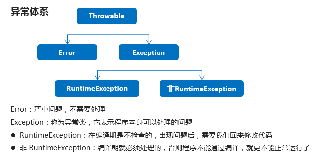
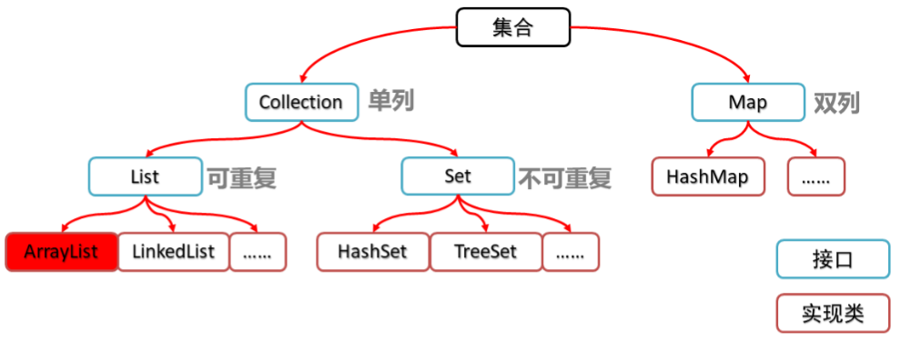
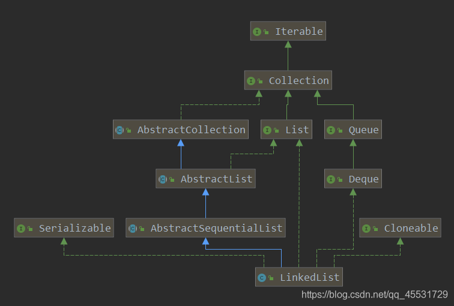
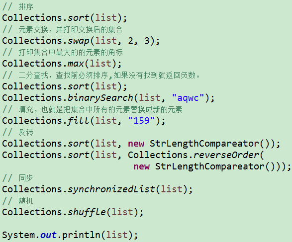

# 快捷键

1.psvm+回车 可以打出
2.sout+回车 可以打出
3.fori+回车 可以打出
4.Ctrl+Alt+V补全代码
5.alt + insert get set
6.Ctrl+Alt+L 整理格式


# 基础 语法基础

## 变量

```java
byte b = 10;
System.out.println(b);

//定义short类型的变量
short s = 100;
System.out.println(s);

//定义int类型的变量
int i = 10000;
System.out.println(i);

//定义double类型的变量
double d = 13.14;
System.out.println(d);

//定义char类型的变量
char c = 'a';
System.out.println(c);

//定义boolean类型的变量
//boolean b = true;
//System.out.println(b);
boolean bb = true;
System.out.println(bb);
System.out.println("--------");

//定义long类型的变量
long l = 10000000000L;
System.out.println(l);
System.out.println("--------");

//定义float类型的变量
float f = 13.14F;
System.out.println(f);
```


## 输出sout

```java
system.out.println("HelloWorld")；
```

## 三元运算符

```java
boolean b = weight1 == weight2 ? true : false;
int tempHeight = height1 > height2 ? height1 : height2;
int max = a > b ? a : b;
```

## 输入

```java
import java.util.Scanner;

Scanner sc = new Scanner(System.in);	

//读一个整数： 
int n = sc.nextInt();

//读一个字符串：
String s = sc.next();

//读一个浮点数：
double t = sc.nextDouble();

//读一整行：
String s = sc.nextLine();

//判断是否有下一个输入可以用
//sc.hasNext() 或 sc.hasNextInt() 或 sc.hasNextDouble()

```

## if

```java
if(week == 1) {
    System.out.println("星期一");
} else if(week == 2) {
    System.out.println("星期二");
} else if(week == 3) {
    System.out.println("星期三");
} else if(week == 4) {
    System.out.println("星期四");
} else if(week == 5) {
    System.out.println("星期五");
} else if(week == 6) {
    System.out.println("星期六");
} else {
    System.out.println("星期日");
}
```

1

```java
if(score>100 || score<0) {
    System.out.println("你输入的分数有误");
} else if(score>=95 && score<=100) {
    System.out.println("山地自行车一辆");
} else if(score>=90 && score<=94) {
    System.out.println("游乐场玩一次");
} else if(score>=80 && score<=89) {
    System.out.println("变形金刚玩具一个");
} else {
    System.out.println("胖揍一顿");
}
```

## switch

```java
switch(week) {
    case 1:
        System.out.println("星期一");
        break;
    case 2:
        System.out.println("星期二");
        break;
    case 3:
        System.out.println("星期三");
        break;
    case 4:
        System.out.println("星期四");
        break;
    case 5:
        System.out.println("星期五");
        break;
    case 6:
        System.out.println("星期六");
        break;
    case 7:
        System.out.println("星期日");
        break;
    default:
        System.out.println("你输入的星期数有误");
        break;
}
```

1

```java
switch(month) {
    case 1:
    case 2:
    case 12:
        System.out.println("冬季");
        break;
    case 3:
    case 4:
    case 5:
        System.out.println("春季");
        break;
    case 6:
    case 7:
    case 8:
        System.out.println("夏季");
        break;
    case 9:
    case 10:
    case 11:
        System.out.println("秋季");
        break;
    default:
        System.out.println("你输入的月份有误");
}
```

## 循环

```java
int j = 1;
do {
	System.out.println("HelloWorld");
	j++;
}while(j<=5);
```

1

```java
//输出所有的水仙花数必然要使用到循环，遍历所有的三位数，三位数从100开始，到999结束
for(int i=100; i<1000; i++) {
    //在计算之前获取三位数中每个位上的值
    int ge = i%10;
    int shi = i/10%10;
    int bai = i/10/10%10;

    //在判定水仙花数的过程中，满足条件不再输出，更改为修改count的值，使count+1
    if(ge*ge*ge + shi*shi*shi + bai*bai*bai == i) {
        count++;
    }
}
```


```java
int j = 1;
while(j<=5) {
    System.out.println("HelloWorld");
    j++;
}
```

1

```java
for(int hour=0; hour<24; hour++) {
    for(int minute=0; minute<60; minute++) {
        System.out.println(hour + "时" + minute + "分");
    }
    System.out.println("--------");
}
```

1

```java
for(int i = 1; i<=5; i++) {
    if(i%2 == 0) {
        //continue;
        break;
    }
```

## Random

```java
Random r = new Random();

//用循环获取10个随机数
for(int i=0; i<10; i++) {
    //获取随机数
    int number = r.nextInt(10);
    System.out.println("number:" + number);
}
```

1

## 数组array

```java
int[] arr = new int[3];
int[] arr = {11, 22, 33, 44, 55};
/*
左边：
int:说明数组中的元素类型是int类型
[]:说明这是一个数组
arr:这是数组的名称
右边：
new:为数组申请内存空间
int:说明数组中的元素类型是int类型
[]:说明这是一个数组
3:数组长度，其实就是数组中的元素个数
*/

//输出数组名
System.out.println(arr); //[I@880ec60

//输出数组中的元素
System.out.println(arr[0]);
System.out.println(arr[1]);
System.out.println(arr[2]);
```


```java
int[] arr = new int[2];
int[] arr2 = new int[3];

//分别输出数组名及元素
System.out.println(arr);
System.out.println(arr[0]);
System.out.println(arr[1]);

System.out.println(arr2);
System.out.println(arr2[0]);
System.out.println(arr2[2]);

//然后分别给数组中的元素赋值
arr[1] = 100;
arr2[0] = 200;
arr2[2] = 300;

//分别再次输出数组名及元素
System.out.println(arr);
System.out.println(arr[0]);
System.out.println(arr[1]);

System.out.println(arr2);
System.out.println(arr2[0]);
System.out.println(arr2[2]);

输出
[I@58ceff1
0
0
[I@7c30a502
0
0
[I@58ceff1
0
100
[I@7c30a502
200
300
```


##  标准类

快捷键Alt+Ins

```java
public class Student {
    //成员变量
    private String name;
    private int age;

    //构造方法
    public Student() {
    }

    public Student(String name, int age) {
        this.name = name;
        this.age = age;
    }

    //成员方法
    public void setName(String name) {
        this.name = name;
    }

    public String getName() {
        return name;
    }

    public void setAge(int age) {
        this.age = age;
    }

    public int getAge() {
        return age;
    }

    public void show() {
        System.out.println(name + "," + age);
    }
}
```


# 基础2 面向对象

## 字符串String

### 初始化

构造方法的方式得到对象

```java
//构造方法的方式得到对象
char[] chs = {'a', 'b', 'c'};
String s1 = new String(chs);
```

直接赋值的方式得到对象

```java
//直接赋值的方式得到对象
String s3 = "abc";
String s4 = "abc";
```

源码

```java
public String(char value[]) {
    this(value, 0, value.length, null);
}

String(char[] value, int off, int len, Void sig) {
    if (len == 0) {
        this.value = "".value;
        this.coder = "".coder;
        return;
    }
    if (COMPACT_STRINGS) {
        byte[] val = StringUTF16.compress(value, off, len);
        if (val != null) {
            this.value = val;
            this.coder = LATIN1;
            return;
        }
    }
    this.coder = UTF16;
    this.value = StringUTF16.toBytes(value, off, len);
}
```

### 赋值

键盘录入一个字符串，用 Scanner 实现

```java
//创建对象
Scanner sc = new Scanner(System.in);

//接收数据
System.out.println("请输入一个字符串数据：");
//String line = sc.nextLine();
//Ctrl+Alt+V 赋值快捷键
String line = sc.nextLine();
```

### 比较

比较字符串内容是否相同.equals()

```java
//比较字符串内容是否相同
System.out.println(s1.equals(s2));
System.out.println(s1.equals(s3));
System.out.println(s3.equals(s4));
```

### 方法

#### 长度.length()

```java
int len = site.length();
```

#### 连接字符串

```java
// 第一种 string1.concat(string2);
"我的名字是 ".concat("Runoob");
// 第二种 “+”
String string1 = "菜鸟教程网址：";     
System.out.println("1、" + string1 + "www.runoob.com");
// 1、菜鸟教程网址：www.runoob.com
```

#### 格式化字符串

```java
String fs;
fs = String.format("浮点型变量的值为 " +
                   "%f, 整型变量的值为 " +
                   " %d, 字符串变量的值为 " +
                   " %s", floatVar, intVar, stringVar);
```

#### 返回指定索引处的 char 值。charAt() 截取一个字符

```java
char charAt(int index)
```

#### replace() 替换

```java
//它有两种形式，第一种形式用一个字符在调用字符串中所有出现某个字符的地方进行替换，形式如下：

String replace(char original,char replacement)

//例如：
String s="Hello".replace('l','w');

//第二种形式是用一个字符序列替换另一个字符序列，形式如下：

String replace(CharSequence original,CharSequence replacement)

```

####  getChars() 截取多个字符

void getChars(int sourceStart,int sourceEnd,char target[],int targetStart)

sourceStart指定了子串开始字符的下标，sourceEnd指定了子串结束后的下一个字符的下标。因此， 子串包含从sourceStart到sourceEnd-1的字符。接收字符的数组由target指定，target中开始复制子串的下标值是targetStart。

```java
String s="this is a demo of the getChars method.";

char buf[]=new char[20];

s.getChars(10,14,buf,0);
```


#### trim() 去掉起始和结尾的空格

#### valueOf() 转换为字符串

#### toLowerCase() 转换为小写

#### toUpperCase() 转换为大写

#### indexOf()和lastIndexOf()

indexOf() 查找字符或者子串第一次出现的地方。

lastIndexOf() 查找字符或者子串是后一次出现的地方。

#### toCharArray() 方法将字符串转换为字符数组。

```java
String Str = new String("www.runoob.com");
//System.out.println(Str[0]); 出错

System.out.print("返回值 :" );
System.out.println( Str.toCharArray()[0] );
//输出w
```


## 字符串StringBuilder（可改）

```java
/*
StringBuilder构造方法：
public StringBuilder()：创建一个空白可变字符串对象，不含有任何内容
public StringBuilder(String str)：根据字符串的内容，来创建可变字符串对象
 */
//public StringBuilder()：创建一个空白可变字符串对象，不含有任何内容
StringBuilder sb = new StringBuilder();
System.out.println("sb:" + sb);
System.out.println("sb.length():" + sb.length());

//public StringBuilder(String str)：根据字符串的内容，来创建可变字符串对象
StringBuilder sb2 = new StringBuilder("hello");
System.out.println("sb2:" + sb2);
System.out.println("sb2.length():" + sb2.length());

```

### 方法

#### .append()

```java
sb.append("hello").append("world").append("java");

```

#### String转换.toString()

```java
StringBuilder sb = new StringBuilder();
sb.append("hello");
//public String toString()：通过 toString() 就可以实现把 StringBuilder 转换为 String
String s = sb.toString();
System.out.println(s);
```

```java
//StringBuilder sb = s; //这个是错误的做法

//public StringBuilder(String s)：通过构造方法就可以实现把 String 转换为 StringBuilder
StringBuilder sb = new StringBuilder(s);

```

#### .reverse()反转


#### delete(int start, int end)移除

移除此序列的子字符串中的字符

```java
sb.delete(5,8);
//移除[5,8)索引的字符
```

#### insert(int offset, String str)插入

将 `str` 参数的字符串插入此序列中。

```java
sb.insert(8, "Java");
//插入到8索引开始的地方
//Runoob..!
//Runoob..Java!
```

insert(int offset, int i)
将 `int` 参数的字符串表示形式插入此序列中。

#### replace(int start, int end, String str)

使用给定 `String` 中的字符替换此序列的子字符串中的字符。

```java

```

## 工具Arrays

Array 的工具类 Arrays

常用API：

* `public static String toString(int[] a)`：返回指定数组的内容的字符串表示形式
* `public static void sort(int[] a)`：按照数字顺序排列指定的数组
* `public static int binarySearch(int[] a, int key)`：利用二分查找返回指定元素的索引
* `public static <T> List<T> asList(T... a)`：返回由指定数组支持的列表

```java
public class MyArraysDemo {
      public static void main(String[] args) {
		//按照数字顺序排列指定的数组
        int [] arr = {3,2,4,6,7};
        Arrays.sort(arr);
        System.out.println(Arrays.toString(arr));
		
        int [] arr = {1,2,3,4,5,6,7,8,9,10};
        int index = Arrays.binarySearch(arr, 0);
        System.out.println(index);
        //1,数组必须有序
        //2.如果要查找的元素存在,那么返回的是这个元素实际的索引
        //3.如果要查找的元素不存在,那么返回的是 (-插入点-1)
            //插入点:如果这个元素在数组中,他应该在哪个索引上.
      }
  }
```

## ArrayList

可以添加对象

```java
 ArrayList<Student> array = new ArrayList<Student>();
```


### 增

```java
//创建集合
ArrayList<String> array = new ArrayList<String>();

//添加元素
array.add("hello");
array.add("world");
array.add("java");
//public void add(int index,E element)：在此集合中的指定位置插入指定的元素
array.add(1,"javase");
```

### 删

```java
//public boolean remove(Object o)：删除指定的元素，返回删除是否成功
System.out.println(array.remove("world")); // true
System.out.println(array.remove("javaee")); // false
```

```java
//public E remove(int index)：删除指定索引处的元素，返回被删除的元素
System.out.println(array.remove(1));
```

### 改

```java
//public E set(int index,E element)：修改指定索引处的元素，返回被修改的元素
System.out.println(array.set(1,"javaee"));
```

### 查

```java
System.out.println(array.get(0));
System.out.println(array.get(1));
```

### size

```java
//public int size()：返回集合中的元素的个数
System.out.println(array.size());
```

### 输出

```java
//输出集合
System.out.println("array:" + array);
```

## @Override

 修饰重写，检测是否成功

## 多态

```java
//多态
Animal a = new Cat(); //向上转型
a.eat();
//        a.playGame();


//创建Cat类的对象
Cat c = new Cat();
c.eat();
c.playGame();


//向下转型
Cat c = (Cat)a;
c.eat();
c.playGame();
```


## 抽象

```java
public abstract class Animal {
    private String name;
    private int age;

    public Animal() {
    }

    public Animal(String name, int age) {
        this.name = name;
        this.age = age;
    }

    public String getName() {
        return name;
    }

    public void setName(String name) {
        this.name = name;
    }

    public int getAge() {
        return age;
    }

    public void setAge(int age) {
        this.age = age;
    }

    public abstract void eat();
}
```


```java
public class Cat extends Animal {

    public Cat() {
    }

    public Cat(String name, int age) {
        super(name, age);
    }

    @Override
    public void eat() {
        System.out.println("猫吃鱼");
    }
}
```

## 接口

接口中的属性的默认是public [static](https://so.csdn.net/so/search?q=static&spm=1001.2101.3001.7020) final 、方法是public abstract

```java
//说英语的接口
public interface SpeakEnglish {
    public abstract void speak();
}
```

```java
public abstract class Person {
    private String name;
    private int age;

    public Person() {
    }

    public Person(String name, int age) {
        this.name = name;
        this.age = age;
    }

    public String getName() {
        return name;
    }

    public void setName(String name) {
        this.name = name;
    }

    public int getAge() {
        return age;
    }

    public void setAge(int age) {
        this.age = age;
    }

    public abstract void eat();
}

```

```java
//抽象运动员类
public abstract class Player extends Person {
    public Player() {
    }

    public Player(String name, int age) {
        super(name, age);
    }

    public abstract void study();
}
```

1

```java
public class PingPangPlayer extends Player implements SpeakEnglish {

    public PingPangPlayer() {
    }

    public PingPangPlayer(String name, int age) {
        super(name, age);
    }

    @Override
    public void study() {
        System.out.println("乒乓球运动员学习如何发球和接球");
    }

    @Override
    public void eat() {
        System.out.println("乒乓球运动员吃大白菜，喝小米粥");
    }

    @Override
    public void speak() {
        System.out.println("乒乓球运动员说英语");
    }
}

```


## 匿名内部类

为了不添加新类，临时重写出来一个对象来使用。

是一个对象，是子类重写后的对象，可以用多态赋值

```java
Animal a = new Animal(){
    @Override
    public void run() {
        System.out.println("猫跑的贼溜~~");
    }
};
```

a这个匿名内部类就是Animal经过重写的子类对象，Animal那个位置也可以是接口。


```java
/*
    跳高接口
 */
public interface Jumpping {

    void jump();

}
```

```java
public class JumppingDemo {
    public static void main(String[] args) {
        //需求：创建接口操作类的对象，调用method方法
        JumppingOperator jo = new JumppingOperator();
        Jumpping j = new Cat();
        jo.method(j);

        Jumpping j2 = new Dog();
        jo.method(j2);
        System.out.println("--------");

        jo.method(new Jumpping() {
            @Override
            public void jump() {
                System.out.println("猫可以跳高了");
            }
        });

        jo.method(new Jumpping() {
            @Override
            public void jump() {
                System.out.println("狗可以跳高了");
            }
        });

    }
}
```

## Arrays静态方法类

```java
import java.util.Arrays
```

### Arrays.sort(nums);

对数组按照升序排序

```java
int[] nums = {2,5,0,4,6,-10};
Arrays.sort(nums);
for(int i :nums)
    System.out.print(i+" ");
/* 之前:2 5 0 4 6 -10 
* 结果:-10 0 2 4 5 6 
*/
```

反向排序， Reverse-order sort


### .toString(Object[] array)

功能：返回数组的字符串形式

### Arrays.fill(Object[] array,Object object)

功能：可以为数组元素填充相同的值


## Math

abs(int a)：返回参数的绝对值

ceil(double a)：返回大于或等于参数的最小double值，等于一个整数

floor(double a)：返回小于或等于参数的最大double值，等于一个整数

round(float a)：按照四舍五入返回最接近参数的int

max(int a,int b)：返回两个int值中的较大值

min(int a,int b)：返回两个int值中的较小值(自学)

public static double pow(double a,double b)：返回a的b次幂的值

public static double random()：返回值为double的正值，[0.0,1.0)

```java
public class MathDemo {
    public static void main(String[] args) {
        //public static int abs​(int a)：返回参数的绝对值
        System.out.println(Math.abs(88));
        System.out.println(Math.abs(-88));
        System.out.println("--------");

        //public static double ceil​(double a)：返回大于或等于参数的最小double值，等于一个整数
        System.out.println(Math.ceil(12.34));
        System.out.println(Math.ceil(12.56));
        System.out.println("--------");

        //public static double floor​(double a)：返回小于或等于参数的最大double值，等于一个整数
        System.out.println(Math.floor(12.34));
        System.out.println(Math.floor(12.56));
        System.out.println("--------");

        //public static int round​(float a)：按照四舍五入返回最接近参数的int
        System.out.println(Math.round(12.34F));
        System.out.println(Math.round(12.56F));
        System.out.println("--------");

        //public static int max​(int a,int b)：返回两个int值中的较大值
        System.out.println(Math.max(66,88));
        System.out.println("--------");

        //public static int min​(int a,int b)：返回两个int值中的较小值

        //public static double pow​(double a,double b)：返回a的b次幂的值
        System.out.println(Math.pow(2.0,3.0));
        System.out.println("--------");

        //public static double random​()：返回值为double的正值，[0.0,1.0)
//        System.out.println(Math.random());
        System.out.println((int)(Math.random()*100) + 1);
    }
}
```


## System

### System.exit(0);

```java
System.out.println("开始");
//public static void exit(int status)：终止当前运行的 Java 虚拟机，非零表示异常终止
System.exit(0);
System.out.println("结束");
```

### currentTimeMillis()：返回当前时间(毫秒)

```java
//public static long currentTimeMillis()：返回当前时间(以毫秒为单位)
System.out.println(System.currentTimeMillis());
```


```java
long start = System.currentTimeMillis();
for (int i = 0; i < 10000; i++) {
    System.out.println(i);
}
long end = System.currentTimeMillis();
System.out.println("共耗时：" + (end - start) + "毫秒");
```


## Object

自带两个方法toString()和equals(Object o)，分别可以重写

### toString()

```java
@Override
public String toString() {
    return "Student{" +
        "name='" + name + '\'' +
        ", age=" + age +
        '}';
}
```

### equals(Object o)

```java
@Override
public boolean equals(Object o) {
    //this -- s1
    //o -- s2
    if (this == o) return true;
    if (o == null || getClass() != o.getClass()) return false;

    Student student = (Student) o; //student -- s2

    if (age != student.age) return false;
    return name != null ? name.equals(student.name) : student.name == null;
}
```


## Integer

intValue()变int

### 最大最小

```java
System.out.println(Integer.MIN_VALUE);
System.out.println(Integer.MAX_VALUE);
```

### 构造方法valueOf()

```java
//public static Integer valueOf​(int i)：返回表示指定的 int 值的 Integer 实例
Integer i3 = Integer.valueOf(100);
System.out.println(i3);

//public static Integer valueOf​(String s)：返回一个保存指定值的 Integer 对象 String
Integer i4 = Integer.valueOf("100");
System.out.println(i4);
```


### int --- String

```java
//int --- String
int number = 100;
//方式1
String s1 = number + "";
System.out.println(s1);
//方式2
//public static String valueOf​(int i)
String s2 = String.valueOf(number);
System.out.println(s2);
System.out.println("--------");
```

### String --- int

```java
//String --- int
String s = "100";
//方式1：String --- Integer --- int
Integer i = Integer.valueOf(s);
//public int intValue​()
int x = i.intValue();
System.out.println(x);
//方式2
//public static int parseInt​(String s)
int y = Integer.parseInt(s);
System.out.println(y);
```

1

```java
public class IntegerTest {
    public static void main(String[] args) {
        //定义一个字符串
        String s = "91 27 46 38 50";

        //把字符串中的数字数据存储到一个int类型的数组中
        String[] strArray = s.split(" ");
//        for(int i=0; i<strArray.length; i++) {
//            System.out.println(strArray[i]);
//        }

        //定义一个int数组，把 String[] 数组中的每一个元素存储到 int 数组中
        int[] arr = new int[strArray.length];
        for(int i=0; i<arr.length; i++) {
            arr[i] = Integer.parseInt(strArray[i]);
        }

        //对 int 数组进行排序
        Arrays.sort(arr);

        //把排序后的int数组中的元素进行拼接得到一个字符串，这里拼接采用StringBuilder来实现
        StringBuilder sb = new StringBuilder();
        for(int i=0; i<arr.length; i++) {
            if(i == arr.length - 1) {
                sb.append(arr[i]);
            } else {
                sb.append(arr[i]).append(" ");
            }
        }
        String result = sb.toString();

        //输出结果
        System.out.println(result);
    }
}
```

### 自动装箱拆箱

```java
//装箱：把基本数据类型转换为对应的包装类类型
        Integer i = Integer.valueOf(100);
        Integer ii = 100; //Integer.valueOf(100);

        //ii += 200;
        // ii = ii + 200;
        // ii = ii.intValue() + 200;
        // ii = 300;
        ii += 200;
        System.out.println(ii);

        Integer iii = null;
//        iii += 100; //NullPointerException
        if(iii != null) {
            iii += 100;
        }
```

## 日期类

### Date

#### 构造方法

```java
public class DateDemo01 {
    public static void main(String[] args) {
        //public Date()：分配一个 Date对象，并初始化，以便它代表它被分配的时间，精确到毫秒
        Date d1 = new Date();
        System.out.println(d1);

        //public Date(long date)：分配一个 Date对象，并将其初始化为表示从标准基准时间起指定的毫秒数
        long date = 1000*60*60;
        Date d2 = new Date(date);
        System.out.println(d2);
    }
}
```

#### 常用方法

```java
public class DateDemo02 {
    public static void main(String[] args) {
        //创建日期对象
        Date d = new Date();

        //public long getTime():获取的是日期对象从1970年1月1日 00:00:00到现在的毫秒值
//        System.out.println(d.getTime());
//        System.out.println(d.getTime() * 1.0 / 1000 / 60 / 60 / 24 / 365 + "年");

        //public void setTime(long time):设置时间，给的是毫秒值
//        long time = 1000*60*60;
        long time = System.currentTimeMillis();
        d.setTime(time);

        System.out.println(d);
    }
}
```

### SimpleDateFormat格式化

SimpleDateFormat是一个具体的类，用于以区域设置敏感的方式格式化和解析日期。

#### 构造方法

构造一个SimpleDateFormat，使用默认模式和日期格式

```java
SimpleDateFormat sdf = new SimpleDateFormat();
```

构造一个SimpleDateFormat使用给定的模式和默认的日期格式

```java
SimpleDateFormat sdf = new SimpleDateFormat("yyyy年MM月dd日 HH:mm:ss");
```

#### 常用方法

- 格式化(从Date到String)
  - public final String format(Date date)：将日期格式化成日期/时间字符串
- 解析(从String到Date)
  - public Date parse(String source)：**从给定字符串的开始解析文本以生成日期**

```java
public class SimpleDateFormatDemo {
    public static void main(String[] args) throws ParseException {
        //格式化：从 Date 到 String
        Date d = new Date();
//        SimpleDateFormat sdf = new SimpleDateFormat();//默认2022/3/15 下午11:16
        SimpleDateFormat sdf = new SimpleDateFormat("yyyy年MM月dd日 HH:mm:ss");
        String s = sdf.format(d);
        System.out.println(s);
        System.out.println("--------");

        //从 String 到 Date
        String ss = "2048-08-09 11:11:11";
        //ParseException
        SimpleDateFormat sdf2 = new SimpleDateFormat("yyyy-MM-dd HH:mm:ss");
        Date dd = sdf2.parse(ss);
        System.out.println(dd);
    }
}
```

### Calendar日历类

Calendar 为特定瞬间与一组日历字段之间的转换提供了一些方法，并为操作日历字段提供了一些方法

注意月份是从零开始的

```java

```

| 方法名                                             | 说明                                                   |
| -------------------------------------------------- | ------------------------------------------------------ |
| public int   get(int field)                        | 返回给定日历字段的值                                   |
| public abstract void add(int   field, int amount)  | 根据日历的规则，将指定的时间量添加或减去给定的日历字段 |
| public final void set(int year,int month,int date) | 设置当前日历的年月日                                   |

```java
public class CalendarDemo {
    public static void main(String[] args) {
        //获取日历类对象
        Calendar c = Calendar.getInstance();

        //public int get(int field):返回给定日历字段的值
        int year = c.get(Calendar.YEAR);
        int month = c.get(Calendar.MONTH) + 1;
        int date = c.get(Calendar.DATE);
        System.out.println(year + "年" + month + "月" + date + "日");

        //public abstract void add(int field, int amount):根据日历的规则，将指定的时间量添加或减去给定的日历字段
        //需求1:3年前的今天
//        c.add(Calendar.YEAR,-3);
//        year = c.get(Calendar.YEAR);
//        month = c.get(Calendar.MONTH) + 1;
//        date = c.get(Calendar.DATE);
//        System.out.println(year + "年" + month + "月" + date + "日");

        //需求2:10年后的10天前
//        c.add(Calendar.YEAR,10);
//        c.add(Calendar.DATE,-10);
//        year = c.get(Calendar.YEAR);
//        month = c.get(Calendar.MONTH) + 1;
//        date = c.get(Calendar.DATE);
//        System.out.println(year + "年" + month + "月" + date + "日");

        //public final void set(int year,int month,int date):设置当前日历的年月日
        c.set(2050,10,10);
        year = c.get(Calendar.YEAR);
        month = c.get(Calendar.MONTH) + 1;
        date = c.get(Calendar.DATE);
        System.out.println(year + "年" + month + "月" + date + "日");

    }
}
```

二月天

```java
public class CalendarTest {
    public static void main(String[] args) {
        //键盘录入任意的年份
        Scanner sc = new Scanner(System.in);
        System.out.println("请输入年：");
        int year = sc.nextInt();

        //设置日历对象的年、月、日
        Calendar c = Calendar.getInstance();
        c.set(year, 2, 1);

        //3月1日往前推一天，就是2月的最后一天
        c.add(Calendar.DATE, -1);

        //获取这一天输出即可
        int date = c.get(Calendar.DATE);
        System.out.println(year + "年的2月份有" + date + "天");
    }
}
```

## 计算时间差

```java
//记录开始时间
long startTime = System.currentTimeMillis();

//操作

//记录结束时间
long endTime = System.currentTimeMillis();
System.out.println("共耗时：" + (endTime - startTime) + "毫秒");
```


## 异常

异常的体系结构




### try-catch方式处理异常

```java
try {
	可能出现异常的代码;
} catch(异常类名 变量名) {
	异常的处理代码;
}
```

1

```java
try {
    int[] arr = {1, 2, 3};
    System.out.println(arr[3]);
    System.out.println("这里能够访问到吗");
} catch (ArrayIndexOutOfBoundsException e) {
    //System.out.println("你访问的数组索引不存在，请回去修改为正确的索引");
    e.printStackTrace();
}
```

常用方法

| 方法名                        | 说明                              |
| ----------------------------- | --------------------------------- |
| public String getMessage()    | 返回此 throwable 的详细消息字符串 |
| public String toString()      | 返回此可抛出的简短描述            |
| public void printStackTrace() | 把异常的错误信息输出在控制台      |

```java
try {
    int[] arr = {1, 2, 3};
    System.out.println(arr[3]); //new ArrayIndexOutOfBoundsException();
    System.out.println("这里能够访问到吗");
} catch (ArrayIndexOutOfBoundsException e) { //new ArrayIndexOutOfBoundsException();
    //            e.printStackTrace();

    //public String getMessage():返回此 throwable 的详细消息字符串
    //            System.out.println(e.getMessage());
    //Index 3 out of bounds for length 3

    //public String toString():返回此可抛出的简短描述
    //            System.out.println(e.toString());
    //java.lang.ArrayIndexOutOfBoundsException: Index 3 out of bounds for length 3

    //public void printStackTrace():把异常的错误信息输出在控制台
    e.printStackTrace();
    //            java.lang.ArrayIndexOutOfBoundsException: Index 3 out of bounds for length 3
    //            at com.itheima_02.ExceptionDemo02.method(ExceptionDemo02.java:18)
    //            at com.itheima_02.ExceptionDemo02.main(ExceptionDemo02.java:11)

}
```

### throws方式处理异常

```java
public void 方法() throws 异常类名 {
    
}
```

1

```java

```

**Exception是异常最高类型可以抛出一切异常**

```java
public static void main(String[] args) throws Exception {
    System.out.println("程序开始。。。。");
    String s = "2013-03-23 10:19:23";
    SimpleDateFormat sdf = new SimpleDateFormat("yyyy-MM-dd HH:mm:ss");
    Date date = sdf.parse(s);
    System.out.println("程序结束。。。。。");
}
```

**throw和throws的区别？**

throw和throws都是在异常处理中使用的关键字，区别如下：

- throw：指的是在方法中人为抛出一个异常对象（这个异常对象可能是自己实例化或者抛出已存在的）；
- throws：在方法的声明上使用，表示此方法在调用时必须处理异常。

```java

```

### 自定义异常throw

- 自定义异常类

  ```java
  public class ScoreException extends Exception {
  
      public ScoreException() {}
  
      public ScoreException(String message) {
          super(message);
      }
  
  }
  ```

- 老师类

  ```java
  public class Teacher {
      public void checkScore(int score) throws ScoreException {
          if(score<0 || score>100) {
  //            throw new ScoreException();
              throw new ScoreException("你给的分数有误，分数应该在0-100之间");
          } else {
              System.out.println("成绩正常");
          }
      }
  }
  ```

- 测试类

  ```java
  public class Demo {
      public static void main(String[] args) {
          Scanner sc = new Scanner(System.in);
          System.out.println("请输入分数：");
          int score = sc.nextInt();
  
          Teacher t = new Teacher();
          try {
          	t.checkScore(score);
          } catch (ScoreException e) {
          	e.printStackTrace();
          }
      }
  }
  ```
  

### 规范做法

在出现异常的地方把异常一层一层的抛出给最外层调用者，最外层调用者集中捕获处理

```java
public class ExceptionDemo{
	public static void main(String[] args){
        System.out.println("程序开始。。。。");
        try {
            parseDate("2013-03-23 10:19:23");
        }catch (Exception e){
            e.printStackTrace();
        }
        System.out.println("程序结束。。。。");
    }
    public static void parseDate(String time) throws Exception{...}
}
```


# 基础3 Collection集合




| 方法名                     | 说明                               |
| -------------------------- | ---------------------------------- |
| boolean add(E e)           | 添加元素                           |
| boolean remove(Object o)   | 从集合中移除指定的元素             |
| void   clear()             | 清空集合中的元素                   |
| boolean contains(Object o) | 判断集合中是否存在指定的元素       |
| boolean isEmpty()          | 判断集合是否为空                   |
| int   size()               | 集合的长度，也就是集合中元素的个数 |


## 迭代器

以正确的顺序返回该列表中的元素的迭代器。

- 迭代器的介绍
  - 迭代器，集合的专用遍历方式
  - Iterator<E> iterator()：返回此集合中元素的迭代器，通过集合的iterator()方法得到
  - 迭代器是通过集合的iterator()方法得到的，所以我们说它是依赖于集合而存在的
- Collection集合的遍历

迭代器 it 的两个基本操作是 next 、hasNext 和 remove。

调用 it.next() 会返回迭代器的下一个元素，并且更新迭代器的状态。

调用 it.hasNext() 用于检测集合中是否还有元素。

调用 it.remove() 将迭代器返回的元素删除。

Iterator 类位于 java.util 包中

```java
public class IteratorDemo {
    public static void main(String[] args) {
        //创建集合对象
        Collection<String> c = new ArrayList<>();

        //添加元素
        c.add("hello");
        c.add("world");
        c.add("java");
        c.add("javaee");

        //Iterator<E> iterator()：返回此集合中元素的迭代器，通过集合的iterator()方法得到
        Iterator<String> it = c.iterator();

        //用while循环改进元素的判断和获取
        while (it.hasNext()) {
            String s = it.next();
            System.out.println(s);
        }
    }
}
```

### 并发修改异常

迭代器不允许在迭代过程中改变元素

- 出现的原因

  ​	迭代器遍历的过程中，通过集合对象修改了集合中的元素，造成了迭代器获取元素中判断预期修改值和实际修改值不一致，则会出现：ConcurrentModificationException

- 解决的方案

  ​	用for循环遍历，然后用集合对象做对应的操作即可

### 增强for循环

内部原理是一个Iterator迭代器，也不允许修改

- 定义格式

  ```java
  for(元素数据类型 变量名 : 数组/集合对象名) {
      循环体;
  }
  ```


## List集合(可重复)

可重复所以添加的返回值一直是true

List是一个接口，并且实现了Collection接口，所以List接口拥有Collection接口提供的所有常用方法，而

| 方法名                          | 描述                                   |
| ------------------------------- | -------------------------------------- |
| void add(int index,E   element) | 在此集合中的指定位置插入指定的元素     |
| E remove(int   index)           | 删除指定索引处的元素，返回被删除的元素 |
| E set(int index,E   element)    | 修改指定索引处的元素，返回被修改的元素 |
| E get(int   index)              | 返回指定索引处的元素                   |

- ArrayList集合

  ​	底层是数组结构实现，查询快、增删慢

- LinkedList集合

  ​	底层是链表结构实现，查询慢、增删快

### ArrayList

ArrayList是实现了Collection和List接口的动态数组。

ArrayList.add()永远是true

```java

```


```java

```

11

```java

```

### LinkedList

| 方法名                    | 说明                             |
| ------------------------- | -------------------------------- |
| public void addFirst(E e) | 在该列表开头插入指定的元素       |
| public void addLast(E e)  | 将指定的元素追加到此列表的末尾   |
| public E getFirst()       | 返回此列表中的第一个元素         |
| public   E getLast()      | 返回此列表中的最后一个元素       |
| public E removeFirst()    | 从此列表中删除并返回第一个元素   |
| public   E removeLast()   | 从此列表中删除并返回最后一个元素 |

```java

```

### Deque

LinkedList经常用来给双向队列Deque实例化



```java
Deque deque = new LinkedList<>(); 
```

|            | 队列  |             | 栈   |                            |
| ---------- | ----- | ----------- | ---- | -------------------------- |
| 增         | offer | addLast     | push | addFirst                   |
| 弹出头元素 | poll  | pollFirst() | pop  | removeFirst()，pollFirst() |
| 显示头元素 | peek  | peekFirst() | peek | peekFirst()                |

队和栈只在元素加入时不一样，其他都是对头进行操作，不影响，以后习惯加First和Last

## Set（不可重复）

```java

```

### HashSet

- HashSet集合的特点

  - 底层数据结构是哈希表
  - 对集合的迭代顺序不作任何保证，也就是说不保证存储和取出的元素顺序一致
  - 没有带索引的方法，所以不能使用普通for循环遍历
  - 由于是Set集合，所以是不包含重复元素的集合


#### 源码

```java
//创建集合对象
HashSet<String> hs = new HashSet<String>();

//添加元素
hs.add("hello");
hs.add("world");
hs.add("java");
----------------------------------------------
```


```java
public boolean add(E e) {
    return map.put(e, PRESENT)==null;
}

static final int hash(Object key) {
    int h;
    return (key == null) ? 0 : (h = key.hashCode()) ^ (h >>> 16);
}

public V put(K key, V value) {
    return putVal(hash(key), key, value, false, true);
}

//hash值和元素的hashCode()方法相关
final V putVal(int hash, K key, V value, boolean onlyIfAbsent,
                   boolean evict) {
    Node<K,V>[] tab; Node<K,V> p; int n, i;

    //如果哈希表未初始化，就对其进行初始化
    if ((tab = table) == null || (n = tab.length) == 0)
        n = (tab = resize()).length;

    //根据对象的哈希值计算对象的存储位置，如果该位置没有元素，就存储元素
    if ((p = tab[i = (n - 1) & hash]) == null)
        tab[i] = newNode(hash, key, value, null);
    else {
        Node<K,V> e; K k;
        /*
            存入的元素和以前的元素比较哈希值
                如果哈希值不同，会继续向下执行，把元素添加到集合
                如果哈希值相同，会调用对象的equals()方法比较
                    如果返回false，会继续向下执行，把元素添加到集合
                    如果返回true，说明元素重复，不存储
        */
        if (p.hash == hash &&
            ((k = p.key) == key || (key != null && key.equals(k))))
            e = p;
        else if (p instanceof TreeNode)
            e = ((TreeNode<K,V>)p).putTreeVal(this, tab, hash, key, value);
        else {
            for (int binCount = 0; ; ++binCount) {
                if ((e = p.next) == null) {
                    p.next = newNode(hash, key, value, null);
                    if (binCount >= TREEIFY_THRESHOLD - 1) // -1 for 1st
                        treeifyBin(tab, hash);
                    break;
                }
                if (e.hash == hash &&
                    ((k = e.key) == key || (key != null && key.equals(k))))
                    break;
                p = e;
            }
        }
        if (e != null) { // existing mapping for key
            V oldValue = e.value;
            if (!onlyIfAbsent || oldValue == null)
                e.value = value;
            afterNodeAccess(e);
            return oldValue;
        }
    }
    ++modCount;
    if (++size > threshold)
        resize();
    afterNodeInsertion(evict);
    return null;
}
```


#### equals方法和HasCode方法

alt + insert自动添加

```java
@Override
public boolean equals(Object o) {
    if (this == o) return true;
    if (o == null || getClass() != o.getClass()) return false;
    Student student = (Student) o;
    return age == student.age && Objects.equals(name, student.name);
}

@Override
public int hashCode() {
    return Objects.hash(name, age);
}
```

```java
@Override
public boolean equals(Object o) {
    //如果加进来的是同一个对象（同一个地址）则直接相同
    if (this == o) return true;
    
    //如果加进来的是空或者不是同一个类则直接不同
    if (o == null || getClass() != o.getClass()) return false;
	//实例化
    Student student = (Student) o;
	//先比较年龄
    if (age != student.age) return false;
    //再比较姓名
    return name != null ? name.equals(student.name) : student.name == null;
}
```


**1.java类中HashSet添加对象时，为什么一定要重写equals方法和HasCode方法？**

- 总思路：hashCode不同时，则必为不同对象。hashCode相同时，根据equlas()方法判断是否为同一对象。
- 在HashSet，HashMap，HashTable中都存在该问题。


**2.为什么重写Equals方法必须重写HashCode方法？**

答：1、将要传入的数据根据系统的hash算法得到一个hash值；

　　2、根据hash值可以得出该数据在hash表中的位置；

　　3、判断该位置上是否有值，没有值则把数据插入进来；如果有值则再次判断传入的值与原值是否地址或equals相同，如果相同则不存，否则通过链表的方式 存储到该位置。

如果两个对象equals，但是没有重写hashcode，就会导致集合中可能存储多个相等的对象！所以必须重写！


#### HashSet集合存储学生对象并遍历【应用】

- 案例需求

  - 创建一个存储学生对象的集合，存储多个学生对象，使用程序实现在控制台遍历该集合
  - 要求：学生对象的成员变量值相同，我们就认为是同一个对象

- 代码实现

  - 学生类

    ```java
    public class Student {
        private String name;
        private int age;
    
        public Student() {
        }
    
        public Student(String name, int age) {
            this.name = name;
            this.age = age;
        }
    
        public String getName() {
            return name;
        }
    
        public void setName(String name) {
            this.name = name;
        }
    
        public int getAge() {
            return age;
        }
    
        public void setAge(int age) {
            this.age = age;
        }
    
        @Override
        public boolean equals(Object o) {
            if (this == o) return true;
            if (o == null || getClass() != o.getClass()) return false;
    
            Student student = (Student) o;
    
            if (age != student.age) return false;
            return name != null ? name.equals(student.name) : student.name == null;
        }
    
        @Override
        public int hashCode() {
            int result = name != null ? name.hashCode() : 0;
            result = 31 * result + age;
            return result;
        }
    }
    ```

  - 测试类

    ```java
    public class HashSetDemo02 {
        public static void main(String[] args) {
            //创建HashSet集合对象
            HashSet<Student> hs = new HashSet<Student>();
    
            //创建学生对象
            Student s1 = new Student("林青霞", 30);
            Student s2 = new Student("张曼玉", 35);
            Student s3 = new Student("王祖贤", 33);
    
            Student s4 = new Student("王祖贤", 33);
    
            //把学生添加到集合
            hs.add(s1);
            hs.add(s2);
            hs.add(s3);
            hs.add(s4);
    
            //遍历集合(增强for)
            for (Student s : hs) {
                System.out.println(s.getName() + "," + s.getAge());
            }
        }
    }
    ```


```java

```

1

```java

```

### LinkedHashSet（有序）

- LinkedHashSet集合特点

  - 哈希表和链表实现的Set接口，具有可预测的迭代次序
  - 由链表保证元素有序，也就是说元素的存储和取出顺序是一致的
  - 由哈希表保证元素唯一，也就是说没有重复的元素

- LinkedHashSet集合基本使用

  ```java
  public class LinkedHashSetDemo {
      public static void main(String[] args) {
          //创建集合对象
          LinkedHashSet<String> linkedHashSet = new LinkedHashSet<String>();
  
          //添加元素
          linkedHashSet.add("hello");
          linkedHashSet.add("world");
          linkedHashSet.add("java");
  
          linkedHashSet.add("world");
  
          //遍历集合
          for(String s : linkedHashSet) {
              System.out.println(s);
          }
      }
  }
  ```


### TreeSet自排序

- TreeSet集合概述

  - 元素有序，可以按照一定的规则进行排序，具体排序方式取决于构造方法
    - TreeSet()：根据其元素的自然排序进行排序
    - TreeSet(Comparator comparator) ：根据指定的比较器进行排序
  - 没有带索引的方法，所以不能使用普通for循环遍历
  - 由于是Set集合，所以不包含重复元素的集合

- TreeSet集合基本使用

  ```java
  public class TreeSetDemo01 {
      public static void main(String[] args) {
          //创建集合对象
          TreeSet<Integer> ts = new TreeSet<Integer>();
  
          //添加元素
          ts.add(10);
          ts.add(40);
          ts.add(30);
          ts.add(50);
          ts.add(20);
  
          ts.add(30);
  
          //遍历集合
          for(Integer i : ts) {
              System.out.println(i);
          }
      }
  }
  ```

#### compareTo重写


return 0代表相同

return 小于0 代表往左放（树）

return 大于0 往右放

```java
@Override
    public int compareTo(Student s) {
//        return 0;
//        return 1;
//        return -1;
```

源码

```java
do {
    parent = t;
    cmp = k.compareTo(t.key);
    if (cmp < 0)
        t = t.left;
    else if (cmp > 0)
        t = t.right;
    else
        return t.setValue(value);
} while (t != null);
```

多次判断直到放在合适的位置，或者相同

this代表的是add添加的元素，s是用来比较的元素（很有可能是第一个添加的元素）

this减s是升序

s减this是降序

```java
public class Student implements Comparable<Student> {
    private String name;
    private int age;

    public Student() {
    }

    public Student(String name, int age) {
        this.name = name;
        this.age = age;
    }

    public String getName() {
        return name;
    }

    public void setName(String name) {
        this.name = name;
    }

    public int getAge() {
        return age;
    }

    public void setAge(int age) {
        this.age = age;
    }

    @Override
    public int compareTo(Student s) {
//        return 0;
//        return 1;
//        return -1;
        //按照年龄从小到大排序
       int num = this.age - s.age;
//        int num = s.age - this.age;
        //年龄相同时，按照姓名的字母顺序排序
       int num2 = num==0?this.name.compareTo(s.name):num;
        return num2;
    }
}
```


#### 比较器 Comparator 对象

```java
//创建集合对象
TreeSet<Student> ts = new TreeSet<Student>(new Comparator<Student>() {
    @Override
    public int compare(Student s1, Student s2) {
        //this.age - s.age
        //s1,s2
        int num = s1.getAge() - s2.getAge();
        int num2 = num == 0 ? s1.getName().compareTo(s2.getName()) : num;
        return num2;
    }
});
```

使用

```java
//创建TreeSet集合对象，通过比较器排序进行排序
TreeSet<Student> ts = new TreeSet<Student>(new Comparator<Student>() {
    @Override
    public int compare(Student s1, Student s2) {
        //int num = (s2.getChinese() + s2.getMath())-(s1.getChinese() + s1.getMath());
        //主要条件
        int num = s2.getSum() - s1.getSum();
        //次要条件
        int num2 = num == 0 ? s1.getChinese() - s2.getChinese() : num;
        int num3 = num2 == 0 ? s1.getName().compareTo(s2.getName()) : num2;
        return num3;
    }
});
```


## 泛型

### 类

```java
修饰符 class 类名<类型> {  }
```


```java
public class Generic<T> {
    private T t;

    public T getT() {
        return t;
    }

    public void setT(T t) {
        this.t = t;
    }
}
```

测试类

```java
public class GenericDemo {
    public static void main(String[] args) {
        Generic<String> g1 = new Generic<String>();
        g1.setT("林青霞");
        System.out.println(g1.getT());

        Generic<Integer> g2 = new Generic<Integer>();
        g2.setT(30);
        System.out.println(g2.getT());

        Generic<Boolean> g3 = new Generic<Boolean>();
        g3.setT(true);
        System.out.println(g3.getT());
    }
}
```

### 方法

```java
修饰符 <类型> 返回值类型 方法名(类型 变量名) {  }
```

带有泛型方法的类

```java
public class Generic {
    public <T> void show(T t) {
        System.out.println(t);
    }
}
```

1

```java
public class GenericDemo {
    public static void main(String[] args) {
		Generic g = new Generic();
        g.show("林青霞");
        g.show(30);
        g.show(true);
        g.show(12.34);
    }
}
```

### 接口

```java
修饰符 interface 接口名<类型> {  }
```

1

```java
public interface Generic<T> {
    void show(T t);
}
```

泛型接口实现类

```java
public class GenericImpl<T> implements Generic<T> {
    @Override
    public void show(T t) {
        System.out.println(t);
    }
}
```

测试类

```java
public class GenericDemo {
    public static void main(String[] args) {
        Generic<String> g1 = new GenericImpl<String>();
        g1.show("林青霞");

        Generic<Integer> g2 = new GenericImpl<Integer>();
        g2.show(30);
    }
}
```

### 类型通配符

- 类型通配符的作用

  ​	为了表示各种泛型List的父类，可以使用类型通配符	

- 类型通配符的分类

  - 类型通配符：<?>
    - List<?>：表示元素类型未知的List，它的元素可以匹配任何的类型
    - 这种带通配符的List仅表示它是各种泛型List的父类，并不能把元素添加到其中
  - 类型通配符上限：<? extends 类型>
    - List<? extends Number>：它表示的类型是Number或者其子类型
  - 类型通配符下限：<? super 类型>
    - List<? super Number>：它表示的类型是Number或者其父类型

```java
public class GenericDemo {
    public static void main(String[] args) {
        //类型通配符：<?>
        List<?> list1 = new ArrayList<Object>();
        List<?> list2 = new ArrayList<Number>();
        List<?> list3 = new ArrayList<Integer>();
        System.out.println("--------");

        //类型通配符上限：<? extends 类型>
//        List<? extends Number> list4 = new ArrayList<Object>();
        List<? extends Number> list5 = new ArrayList<Number>();
        List<? extends Number> list6 = new ArrayList<Integer>();
        System.out.println("--------");

        //类型通配符下限：<? super 类型>
        List<? super Number> list7 = new ArrayList<Object>();
        List<? super Number> list8 = new ArrayList<Number>();
//        List<? super Number> list9 = new ArrayList<Integer>();

    }
}
```

为什么要使用通配符而不是简单的泛型呢？通配符其实在声明局部变量时是没有什么意义的，但是当你为一个方法声明一个参数时，它是非常重要的。

```java
static int countLegs (List<? extends Animal > animals ) {
    int retVal = 0;
    for ( Animal animal : animals )
    {
        retVal += animal.countLegs();
    }
    return retVal;
}

static int countLegs1 (List< Animal > animals ){
    int retVal = 0;
    for ( Animal animal : animals )
    {
        retVal += animal.countLegs();
    }
    return retVal;
}

public static void main(String[] args) {
    List<Dog> dogs = new ArrayList<>();
     // 不会报错
    countLegs( dogs );
    // 报错
    countLegs1(dogs);
}
```


## Map

Collection 是单值集合体系，Map集合是一种双列集合，每个元素包含两个值。

Map集合的每个元素的格式：key=value（键值对元素），Map集合也被称为键值对集合

Map集合的完整格式：`{key1=value1, key2=value2, key3=value3, ...}`

```
Map集合的体系：
        Map<K , V>(接口,Map集合的祖宗类)
       /                      \
      TreeMap<K , V>           HashMap<K , V>(实现类,经典的，用的最多)
                                 \
                                  LinkedHashMap<K, V>(实现类)
```

Map集合的特点：

1. Map 集合的特点都是由键决定的
2. Map 集合的键是无序，不重复的，无索引的（Set）
3. Map 集合的值无要求（List）
4. Map 集合的键值对都可以为 null
5. Map 集合后面重复的键对应元素会覆盖前面的元素

HashMap：元素按照键是无序，不重复，无索引，值不做要求

LinkedHashMap：元素按照键是有序，不重复，无索引，值不做要求

### 常用API

方法介绍

| 方法名                              | 说明                                 |
| ----------------------------------- | ------------------------------------ |
| V   put(K key,V   value)            | 添加元素                             |
| V   remove(Object key)              | 根据键删除键值对元素                 |
| void   clear()                      | 移除所有的键值对元素                 |
| boolean containsKey(Object key)     | 判断集合是否包含指定的键             |
| boolean containsValue(Object value) | 判断集合是否包含指定的值             |
| boolean isEmpty()                   | 判断集合是否为空                     |
| int size()                          | 集合的长度，也就是集合中键值对的个数 |
| V   get(Object key)                 | 根据键获取值                         |
| Set<K>   keySet()                   | 获取所有键的集合                     |
| Collection<V>   values()            | 获取所有值的集合                     |
| Set<Map.Entry<K,V>>   entrySet()    | 获取所有键值对对象的集合             |

Map 集合的常用 API

- `public V put(K key, V value)`：把指定的键与值添加到 Map 集合中，**重复的键会覆盖前面的值元素**
- `public V remove(Object key)`：把指定的键对应的键值对元素在集合中删除，返回被删除元素的值
- `public V get(Object key)`：根据指定的键，在 Map 集合中获取对应的值
- `public Set<K> keySet()`：获取 Map 集合中所有的键，存储到 **Set 集合**中
- `public Collection<V> values()`：获取全部值的集合，存储到 **Collection 集合**
- `public Set<Map.Entry<K,V>> entrySet()`：获取Map集合中所有的键值对对象的集合
- `public boolean containsKey(Object key)`：判断该集合中是否有此键

```java
public class MapDemo {
    public static void main(String[] args) {
        Map<String , Integer> maps = new HashMap<>();
        maps.put(.....);
        System.out.println(maps.isEmpty());//false
        Integer value = maps.get("....");//返回键值对象
        Set<String> keys = maps.keySet();//获取Map集合中所有的键，
        //Map集合的键是无序不重复的，所以返回的是一个Set集合
        Collection<Integer> values = maps.values();
        //Map集合的值是不做要求的，可能重复，所以值要用Collection集合接收!
    }
}
```

### 遍历方式

Map集合的遍历方式有：3种。

1. “键找值”的方式遍历：先获取 Map 集合全部的键，再根据遍历键找值。
2. “键值对”的方式遍历：难度较大，采用增强 for 或者迭代器
3. JDK 1.8 开始之后的新技术：foreach，采用 Lambda 表达式

集合可以直接输出内容，因为底层重写了 toString() 方法

```java
public static void main(String[] args){
    Map<String , Integer> maps = new HashMap<>();
	//(1)键找值
    Set<String> keys = maps.keySet();
    for(String key : keys) {
        System.out.println(key + "=" + maps.get(key));
    }
    //Iterator<String> iterator = hm.keySet().iterator();
    
    //(2)键值对
    //(2.1)普通方式
    Set<Map.Entry<String,Integer>> entries = maps.entrySet();
    for (Map.Entry<String, Integer> entry : entries) {
             System.out.println(entry.getKey() + "=>" + entry.getValue());
    }
    //(2.2)迭代器方式
    Iterator<Map.Entry<String, Integer>> iterator = maps.entrySet().iterator();
    while (iterator.hasNext()) {
        Map.Entry<String, Integer> entry = iterator.next();
        System.out.println(entry.getKey() + "=" + entry.getValue());

    }
    //(3) Lamda
    maps.forEach((k,v) -> {
        System.out.println(k + "==>" + v);
    })
}
```


### HashMap

HashMap 基于哈希表的 Map 接口实现，是以 key-value 存储形式存在，主要用来存放键值对

特点：

- HashMap 的实现不是同步的，这意味着它不是线程安全的
- key 是唯一不重复的，底层的哈希表结构，依赖 hashCode 方法和 equals 方法保证键的唯一
- key、value 都可以为null，但是 key 位置只能是一个null
- HashMap 中的映射不是有序的，即存取是无序的
- **key 要存储的是自定义对象，需要重写 hashCode 和 equals 方法，防止出现地址不同内容相同的 key**

```java

```

### LinkedMap

LinkedHashMap 是 HashMap 的子类

- 优点：添加的元素按照键有序不重复的，有序的原因是底层维护了一个双向链表
- 缺点：会占用一些内存空间

```java

```

1

```java

```

### TreeMap

TreeMap 实现了 SotredMap 接口，是有序不可重复的键值对集合，基于红黑树（Red-Black tree）实现，每个 key-value 都作为一个红黑树的节点，如果构造 TreeMap 没有指定比较器，则根据 key 执行自然排序（默认升序），如果指定了比较器则按照比较器来进行排序

TreeMap 集合指定大小规则有 2 种方式：

- 直接为对象的类实现比较器规则接口 Comparable，重写比较方法
- 直接为集合设置比较器 Comparator 对象，重写比较方法

说明：TreeSet 集合的底层是基于 TreeMap，只是键的附属值为空对象而已

```java

```

1

```java

```

### WeakMap

WeakHashMap 是基于弱引用的

内部的 Entry 继承 WeakReference，被弱引用关联的对象在**下一次垃圾回收时会被回收**，并且构造方法传入引用队列，用来在清理对象完成以后清理引用

```java

```

1

```java

```

## Collections集合工具类

Collections类常用方法

| 方法名                                   | 说明                               |
| ---------------------------------------- | ---------------------------------- |
| public static void sort(List<T> list)    | 将指定的列表按升序排序             |
| public static void reverse(List<?> list) | 反转指定列表中元素的顺序           |
| public static void shuffle(List<?> list) | 使用默认的随机源随机排列指定的列表 |

```java
public class CollectionsDemo01 {
    public static void main(String[] args) {
        //创建集合对象
        List<Integer> list = new ArrayList<Integer>();

        //添加元素
        list.add(30);
        list.add(20);
        list.add(50);
        list.add(10);
        list.add(40);

        //public static <T extends Comparable<? super T>> void sort(List<T> list)：将指定的列表按升序排序
//        Collections.sort(list);

        //public static void reverse(List<?> list)：反转指定列表中元素的顺序
//        Collections.reverse(list);

        //public static void shuffle(List<?> list)：使用默认的随机源随机排列指定的列表
        Collections.shuffle(list);

        System.out.println(list);
    }
}
```




# 基础4 I/O

## File类

### File类的构造方法

| 方法名                              | 说明                                                        |
| ----------------------------------- | ----------------------------------------------------------- |
| File(String   pathname)             | 通过将给定的路径名字符串转换为抽象路径名来创建新的 File实例 |
| File(String   parent, String child) | 从父路径名字符串和子路径名字符串创建新的   File实例         |
| File(File   parent, String child)   | 从父抽象路径名和子路径名字符串创建新的   File实例           |

```java
public class FileDemo01 {
    public static void main(String[] args) {
        //File(String pathname)：通过将给定的路径名字符串转换为抽象路径名来创建新的 File实例。
        File f1 = new File("E:\\itcast\\java.txt");
        System.out.println(f1);

        //File(String parent, String child)：从父路径名字符串和子路径名字符串创建新的 File实例。
        File f2 = new File("E:\\itcast","java.txt");
        System.out.println(f2);

        //File(File parent, String child)：从父抽象路径名和子路径名字符串创建新的 File实例。
        File f3 = new File("E:\\itcast");
        File f4 = new File(f3,"java.txt");
        System.out.println(f4);
    }
}
```

### File类创建功能【应用】

- 方法分类

  已经存在就false
  
  | 方法名                         | 说明                                                         |
  | ------------------------------ | ------------------------------------------------------------ |
  | public boolean createNewFile() | 当具有该名称的文件不存在时，创建一个由该抽象路径名命名的新空文件 |
  | public boolean mkdir()         | 创建由此抽象路径名命名的目录                                 |
  | public boolean mkdirs()        | 创建由此抽象路径名命名的目录，包括任何必需但不存在的父目录   |

```java
public class FileDemo02 {
    public static void main(String[] args) throws IOException {
        //需求1：我要在E:\\itcast目录下创建一个文件java.txt
        //目录必须存在
        File f1 = new File("E:\\itcast\\java.txt");
        System.out.println(f1.createNewFile());
        System.out.println("--------");

        //需求2：我要在E:\\itcast目录下创建一个目录JavaSE
        File f2 = new File("E:\\itcast\\JavaSE");
        System.out.println(f2.mkdir());
        System.out.println("--------");

        //需求3：我要在E:\\itcast目录下创建一个多级目录JavaWEB\\HTML
        File f3 = new File("E:\\itcast\\JavaWEB\\HTML");
//        System.out.println(f3.mkdir());
        System.out.println(f3.mkdirs());
        System.out.println("--------");

        //需求4：我要在E:\\itcast目录下创建一个文件javase.txt
        File f4 = new File("E:\\itcast\\javase.txt");
//        System.out.println(f4.mkdir());
        System.out.println(f4.createNewFile());
    }
}
```

### File类判断和获取功能【应用】

- 判断功能

  | 方法名                         | 说明                                 |
  | ------------------------------ | ------------------------------------ |
  | public   boolean isDirectory() | 测试此抽象路径名表示的File是否为目录 |
  | public   boolean isFile()      | 测试此抽象路径名表示的File是否为文件 |
  | public   boolean   exists()    | 测试此抽象路径名表示的File是否存在   |

- 获取功能

  | 方法名                            | 说明                                                     |
  | --------------------------------- | -------------------------------------------------------- |
  | public   String getAbsolutePath() | 返回此抽象路径名的绝对路径名字符串                       |
  | public   String getPath()         | 将此抽象路径名转换为路径名字符串                         |
  | public   String getName()         | 返回由此抽象路径名表示的文件或目录的名称                 |
  | public   String[] list()          | 返回此抽象路径名表示的目录中的文件和目录的名称字符串数组 |
  | public   File[] listFiles()       | 返回此抽象路径名表示的目录中的文件和目录的File对象数组   |

- 示例代码

  ```java
  public class FileDemo04 {
      public static void main(String[] args) {
          //创建一个File对象
          File f = new File("myFile\\java.txt");
  
  //        public boolean isDirectory()：测试此抽象路径名表示的File是否为目录
  //        public boolean isFile()：测试此抽象路径名表示的File是否为文件
  //        public boolean exists()：测试此抽象路径名表示的File是否存在
          System.out.println(f.isDirectory());
          System.out.println(f.isFile());
          System.out.println(f.exists());
  
  //        public String getAbsolutePath()：返回此抽象路径名的绝对路径名字符串
  //        public String getPath()：将此抽象路径名转换为路径名字符串
  //        public String getName()：返回由此抽象路径名表示的文件或目录的名称
          System.out.println(f.getAbsolutePath());
          System.out.println(f.getPath());
          System.out.println(f.getName());
          System.out.println("--------");
  
  //        public String[] list()：返回此抽象路径名表示的目录中的文件和目录的名称字符串数组
  //        public File[] listFiles()：返回此抽象路径名表示的目录中的文件和目录的File对象数组
          File f2 = new File("E:\\itcast");
  
          String[] strArray = f2.list();
          for(String str : strArray) {
              System.out.println(str);
          }
          System.out.println("--------");
  
          File[] fileArray = f2.listFiles();
          for(File file : fileArray) {
  //            System.out.println(file);//getPath()
  //            System.out.println(file.getName());
              if(file.isFile()) {
                  System.out.println(file.getName());
              }
          }
      }
  }
  ```

### File类删除功能【应用】

- 方法分类

  | 方法名                    | 说明                               |
  | ------------------------- | ---------------------------------- |
  | public boolean   delete() | 删除由此抽象路径名表示的文件或目录 |

- 示例代码

  ```java
  public class FileDemo03 {
      public static void main(String[] args) throws IOException {
  //        File f1 = new File("E:\\itcast\\java.txt");
          //需求1：在当前模块目录下创建java.txt文件
          File f1 = new File("myFile\\java.txt");
  //        System.out.println(f1.createNewFile());
  
          //需求2：删除当前模块目录下的java.txt文件
          System.out.println(f1.delete());
          System.out.println("--------");
  
          //需求3：在当前模块目录下创建itcast目录
          File f2 = new File("myFile\\itcast");
  //        System.out.println(f2.mkdir());
  
          //需求4：删除当前模块目录下的itcast目录
          System.out.println(f2.delete());
          System.out.println("--------");
  
          //需求5：在当前模块下创建一个目录itcast,然后在该目录下创建一个文件java.txt
          File f3 = new File("myFile\\itcast");
  //        System.out.println(f3.mkdir());
          File f4 = new File("myFile\\itcast\\java.txt");
  //        System.out.println(f4.createNewFile());
  
          //需求6：删除当前模块下的目录itcast
          System.out.println(f4.delete());
          System.out.println(f3.delete());
      }
  }
  ```

- 绝对路径和相对路径的区别

  - 绝对路径：完整的路径名，不需要任何其他信息就可以定位它所表示的文件。例如：E:\itcast\java.txt
  - 相对路径：必须使用取自其他路径名的信息进行解释。例如：myFile\\java.txt


## 字节流

|                      |                      |
| -------------------- | -------------------- |
| 字节流输出（读）     | FileOutputStream     |
| 字节流输入（写）     | FileInputStream      |
| 字节缓冲流输出（读） | BufferedOutputStream |
| 字节缓冲流输入（写） | BufferedInputStream  |


### 写

```java
public class FileOutputStreamDemo01 {
    public static void main(String[] args) throws IOException {
        //创建字节输出流对象
        //FileOutputStream(String name)：创建文件输出流以指定的名称写入文件
        FileOutputStream fos = new FileOutputStream("myByteStream\\fos.txt");
        /*
            做了三件事情：
                A:调用系统功能创建了文件
                B:创建了字节输出流对象
                C:让字节输出流对象指向创建好的文件
         */

        //void write(int b)：将指定的字节写入此文件输出流
        fos.write(97);
//        fos.write(57);
//        fos.write(55);

        //最后都要释放资源
        //void close()：关闭此文件输出流并释放与此流相关联的任何系统资源。
        fos.close();
    }
}
```

#### 字节流写数据的三种方式

写数据的方法分类

| 方法名                                      | 说明                                                         |
| ------------------------------------------- | ------------------------------------------------------------ |
| void   write(int b)                         | 将指定的字节写入此文件输出流   一次写一个字节数据            |
| void   write(byte[] b)                      | 将 b.length字节从指定的字节数组写入此文件输出流   一次写一个字节数组数据 |
| void   write(byte[] b, int off, int length) | 将 len字节从指定的字节数组开始，从偏移量off开始写入此文件输出流   一次写一个字节数组的部分数据 |

```java
public class FileOutputStreamDemo02 {
    public static void main(String[] args) throws IOException {
        //FileOutputStream(String name)：创建文件输出流以指定的名称写入文件
        FileOutputStream fos = new FileOutputStream("myByteStream\\fos.txt");
        //new File(name)
//        FileOutputStream fos = new FileOutputStream(new File("myByteStream\\fos.txt"));

        //FileOutputStream(File file)：创建文件输出流以写入由指定的 File对象表示的文件
//        File file = new File("myByteStream\\fos.txt");
//        FileOutputStream fos2 = new FileOutputStream(file);
//        FileOutputStream fos2 = new FileOutputStream(new File("myByteStream\\fos.txt"));

        //void write(int b)：将指定的字节写入此文件输出流
//        fos.write(97);
//        fos.write(98);
//        fos.write(99);
//        fos.write(100);
//        fos.write(101);

//        void write(byte[] b)：将 b.length字节从指定的字节数组写入此文件输出流
//        byte[] bys = {97, 98, 99, 100, 101};
        //byte[] getBytes()：返回字符串对应的字节数组
        byte[] bys = "abcde".getBytes();
//        fos.write(bys);

        //void write(byte[] b, int off, int len)：将 len字节从指定的字节数组开始，从偏移量off开始写入此文件输出流
//        fos.write(bys,0,bys.length);
        fos.write(bys,1,3);

        //释放资源
        fos.close();
    }
}
```

#### 字节流写数据的两个小问题【应用】

- 字节流写数据如何实现换行
  - windows:\r\n
  - linux:\n
  - mac:\r
- 字节流写数据如何实现追加写入
  - public FileOutputStream(String name,boolean append)
  - 创建文件输出流以指定的名称写入文件。如果第二个参数为true ，则字节将写入文件的末尾而不是开头


```java
public class FileOutputStreamDemo03 {
    public static void main(String[] args) throws IOException {
        //创建字节输出流对象
//        FileOutputStream fos = new FileOutputStream("myByteStream\\fos.txt");
        FileOutputStream fos = new FileOutputStream("myByteStream\\fos.txt",true);

        //写数据
        for (int i = 0; i < 10; i++) {
            fos.write("hello".getBytes());
            fos.write("\r\n".getBytes());
        }

        //释放资源
        fos.close();
    }
}
```

#### 异常处理【应用】

- 异常处理格式

  - try-catch-finally

    ```java
    try{
    	可能出现异常的代码;
    }catch(异常类名 变量名){
    	异常的处理代码;
    }finally{
    	执行所有清除操作;
    }
    ```

  - finally特点

    - 被finally控制的语句一定会执行，除非JVM退出

```java
public class FileOutputStreamDemo04 {
    public static void main(String[] args) {
        //加入finally来实现释放资源
        FileOutputStream fos = null;
        try {
            fos = new FileOutputStream("myByteStream\\fos.txt");
            fos.write("hello".getBytes());
        } catch (IOException e) {
            e.printStackTrace();
        } finally {
            if(fos != null) {
                try {
                    fos.close();
                } catch (IOException e) {
                    e.printStackTrace();
                }
            }
        }
    }
}
```


### 读

#### 一次读一个字节

- 字节输入流
  - FileInputStream(String name)：通过打开与实际文件的连接来创建一个FileInputStream ，该文件由文件系统中的路径名name命名
- 字节输入流读取数据的步骤
  - 创建字节输入流对象
  - 调用字节输入流对象的读数据方法
  - 释放资源

```java
public class FileInputStreamDemo01 {
    public static void main(String[] args) throws IOException {
        //创建字节输入流对象
        //FileInputStream(String name)
        FileInputStream fis = new FileInputStream("myByteStream\\fos.txt");

        int by;
        /*
            fis.read()：读数据
            by=fis.read()：把读取到的数据赋值给by
            by != -1：判断读取到的数据是否是-1
         */
        while ((by=fis.read())!=-1) {
            System.out.print((char)by);
        }

        //释放资源
        fis.close();
    }
}
```

#### 字节流复制文本文件

```java
public class CopyTxtDemo {
    public static void main(String[] args) throws IOException {
        //根据数据源创建字节输入流对象
        FileInputStream fis = new FileInputStream("E:\\itcast\\窗里窗外.txt");
        //根据目的地创建字节输出流对象
        FileOutputStream fos = new FileOutputStream("myByteStream\\窗里窗外.txt");

        //读写数据，复制文本文件(一次读取一个字节，一次写入一个字节)
        int by;
        while ((by=fis.read())!=-1) {
            fos.write(by);
        }

        //释放资源
        fos.close();
        fis.close();
    }
}

```


#### 一次读一个字节数组数据

- 一次读一个字节数组的方法
  - public int read(byte[] b)：从输入流读取最多b.length个字节的数据
  - 返回的是读入缓冲区的总字节数,也就是实际的读取字节个数

```java
public class FileInputStreamDemo02 {
    public static void main(String[] args) throws IOException {
        //创建字节输入流对象
        FileInputStream fis = new FileInputStream("myByteStream\\fos.txt");

        /*
            hello\r\n
            world\r\n

            第一次：hello
            第二次：\r\nwor
            第三次：ld\r\nr

         */

        byte[] bys = new byte[1024]; //1024及其整数倍
        int len;
        while ((len=fis.read(bys))!=-1) {
            System.out.print(new String(bys,0,len));
        }

        //释放资源
        fis.close();
    }
}
```

#### 字节流复制图片【应用】

- 案例需求

  ​	把“E:\\itcast\\mn.jpg”复制到模块目录下的“mn.jpg”

- 实现步骤

  - 根据数据源创建字节输入流对象
  - 根据目的地创建字节输出流对象
  - 读写数据，复制图片(一次读取一个字节数组，一次写入一个字节数组)
  - 释放资源

```java
public class CopyJpgDemo {
    public static void main(String[] args) throws IOException {
        //根据数据源创建字节输入流对象
        FileInputStream fis = new FileInputStream("E:\\itcast\\mn.jpg");
        //根据目的地创建字节输出流对象
        FileOutputStream fos = new FileOutputStream("myByteStream\\mn.jpg");

        //读写数据，复制图片(一次读取一个字节数组，一次写入一个字节数组)
        byte[] bys = new byte[1024];
        int len;
        while ((len=fis.read(bys))!=-1) {
            fos.write(bys,0,len);
        }

        //释放资源
        fos.close();
        fis.close();
    }
}
```


### 字节缓冲流

#### 字节缓冲流构造方法

- 字节缓冲流介绍

  - lBufferOutputStream：该类实现缓冲输出流。 通过设置这样的输出流，应用程序可以向底层输出流写入字节，而不必为写入的每个字节导致底层系统的调用
  - lBufferedInputStream：创建BufferedInputStream将创建一个内部缓冲区数组。 当从流中读取或跳过字节时，内部缓冲区将根据需要从所包含的输入流中重新填充，一次很多字节

- 构造方法：

  | 方法名                                 | 说明                   |
  | -------------------------------------- | ---------------------- |
  | BufferedOutputStream(OutputStream out) | 创建字节缓冲输出流对象 |
  | BufferedInputStream(InputStream in)    | 创建字节缓冲输入流对象 |

```java
public class BufferStreamDemo {
    public static void main(String[] args) throws IOException {
        //字节缓冲输出流：BufferedOutputStream(OutputStream out)
 
        BufferedOutputStream bos = new BufferedOutputStream(new 				                                       FileOutputStream("myByteStream\\bos.txt"));
        //写数据
        bos.write("hello\r\n".getBytes());
        bos.write("world\r\n".getBytes());
        //释放资源
        bos.close();
    

        //字节缓冲输入流：BufferedInputStream(InputStream in)
        BufferedInputStream bis = new BufferedInputStream(new                                                          FileInputStream("myByteStream\\bos.txt"));

        //一次读取一个字节数据
//        int by;
//        while ((by=bis.read())!=-1) {
//            System.out.print((char)by);
//        }

        //一次读取一个字节数组数据
        byte[] bys = new byte[1024];
        int len;
        while ((len=bis.read(bys))!=-1) {
            System.out.print(new String(bys,0,len));
        }

        //释放资源
        bis.close();
    }
}
```

#### 字节流复制视频【应用】

- 案例需求

  把“E:\\itcast\\字节流复制图片.avi”复制到模块目录下的“字节流复制图片.avi”

- 实现步骤

  - 根据数据源创建字节输入流对象
  - 根据目的地创建字节输出流对象
  - 读写数据，复制视频
  - 释放资源

```java
public class CopyAviDemo {
    public static void main(String[] args) throws IOException {
        //记录开始时间
        long startTime = System.currentTimeMillis();

        //复制视频
//        method1();
//        method2();
//        method3();
        method4();

        //记录结束时间
        long endTime = System.currentTimeMillis();
        System.out.println("共耗时：" + (endTime - startTime) + "毫秒");
    }

    //字节缓冲流一次读写一个字节数组
    public static void method4() throws IOException {
        BufferedInputStream bis = new BufferedInputStream(new FileInputStream("E:\\itcast\\字节流复制图片.avi"));
        BufferedOutputStream bos = new BufferedOutputStream(new FileOutputStream("myByteStream\\字节流复制图片.avi"));

        byte[] bys = new byte[1024];
        int len;
        while ((len=bis.read(bys))!=-1) {
            bos.write(bys,0,len);
        }

        bos.close();
        bis.close();
    }

    //字节缓冲流一次读写一个字节
    public static void method3() throws IOException {
        BufferedInputStream bis = new BufferedInputStream(new FileInputStream("E:\\itcast\\字节流复制图片.avi"));
        BufferedOutputStream bos = new BufferedOutputStream(new FileOutputStream("myByteStream\\字节流复制图片.avi"));

        int by;
        while ((by=bis.read())!=-1) {
            bos.write(by);
        }

        bos.close();
        bis.close();
    }


    //基本字节流一次读写一个字节数组
    public static void method2() throws IOException {
        //E:\\itcast\\字节流复制图片.avi
        //模块目录下的 字节流复制图片.avi
        FileInputStream fis = new FileInputStream("E:\\itcast\\字节流复制图片.avi");
        FileOutputStream fos = new FileOutputStream("myByteStream\\字节流复制图片.avi");

        byte[] bys = new byte[1024];
        int len;
        while ((len=fis.read(bys))!=-1) {
            fos.write(bys,0,len);
        }

        fos.close();
        fis.close();
    }

    //基本字节流一次读写一个字节
    public static void method1() throws IOException {
        //E:\\itcast\\字节流复制图片.avi
        //模块目录下的 字节流复制图片.avi
        FileInputStream fis = new FileInputStream("E:\\itcast\\字节流复制图片.avi");
        FileOutputStream fos = new FileOutputStream("myByteStream\\字节流复制图片.avi");

        int by;
        while ((by=fis.read())!=-1) {
            fos.write(by);
        }

        fos.close();
        fis.close();
    }
}
```


## 字符流

```java

```

1

```java

```

1

```java

```

1

```java

```

1

```java

```

## 简便

```java

```

1

```java

```

1

```java

```

1

```java

```

## 字符缓冲流

```java

```

1

```java

```

1

```java

```

1

```java

```

1

```java

```

## 标准输入流

```java

```

1

```java

```

1

```java

```

1

```java

```

1

```java

```

## 标准输出流

```java

```

1

```java

```

1

```java

```

1

```java

```

1

```java

```

## 打印流

```java

```

1

```java

```

1

```java

```

1

```java

```

1

```java

```

## 对象序列化

```java

```

1

```java

```

1

```java

```

1

```java

```

1

```java

```

## Properties

```java

```

1

```java

```

1

```java

```

1

```java

```

1

```java

```

## 线程

```java

```

1

```java

```

1

```java

```

1

```java

```

调用的其实是同一个对象，所以不用把成员变量静态化

```java

```

1

```java

```

1

```java

```

1

```java

```

1

```java

```

1

```java

```

1

```java

```

1

```java

```

1

```java

```

1

```java

```

1

```java

```

1

```java

```

1

```java

```

1

```java

```

1

```java

```

1

```java

```

1

```java

```

# 网络编程

1

```java

```

1

```java

```

1

```java

```

1

```java

```

1

```java

```

1

```java

```

1

```java

```

1

```java

```

1

```java

```

1

```java

```

1

```java

```

1

```java

```

1

```java

```

1

# 基础5 Lambda

## Lambda

面对需要以多态方式传入接口的地方（代替接口实现类），可以用匿名内部类来解决，也可以使用Lambda

接口里只能有一个方法


```java

```

1

```java

```

1

```java

```

1

```java

```

1

```java

```

## 接口

```java

```

1

```java

```

1

```java

```

1

```java

```

1

```java

```

1

```java

```

## 引用类

直接把引用的方法的方法体，补给没有方法体的抽象方法

```java

```

1

```java

```

1

```java

```

1

```java

```

1

```java

```

1

```java

```

## 函数式接口

```java

```

1

```java

```

1

```java

```

1

```java

```

1

```java

```


```java

```

这是我看到的一个非常标准的lambdas使用

把返回值不同的方法，通过lambdas统一

链接：https://cloud.tencent.com/developer/ask/201421

如下：

```javascript
public String getTag(String name, String info) {
    System.out.println("getTag - Nome da Tag: " + name);
    Tag aux;
    int i = 0;
    do {
        aux = Tags.get(i);
        i++;
    } while (!aux.TagName.equals(name) && i < Tags.size());
    if (aux.TagName.equals(name)) {
        if (aux.TagInfoTipo.equals("String")) {
            return aux.TagInfo;
        } else if (!aux.TagInfoTipo.equals("String")) 
            return null;//add throw exception

    }


public int getTag(String name, int info) {
    System.out.println("getTag - Nome da Tag: " + name);
    Tag aux;
    int i = 0;
    do {
        aux = Tags.get(i);
        i++;
    } while (!aux.TagName.equals(name) && i < Tags.size());
    if (aux.TagName.equals(name)) {
        if (aux.TagInfoTipo.equals("Int")) {
            value = Integer.valueOf(aux.TagInfo);
            return value;
        } else if (!aux.TagInfoTipo.equals("Int")) {
            return null;//add throw exception
        }
```

我只是不知道这是否可以在Java中使用，所以在这个例子中n最终会得到一个值为1700的int。

因为`Java8`你可以使用lambdas：

**按名称查找标签实例：**

```javascript
private static final Function<String, Tag> GET_TAG_BY_NAME = name -> {
    for (int i = 0, size = Tags.size(); i < size; i++) {
        Tag tag = Tags.get(i);

        if (tag != null && tag.TagName.equals(name))
            return tag;
    }

    return null;
};
```

**定义如何提取所需类型：**

```javascript
public static final Function<Tag, String> STRING = tag -> tag != null && "String".equals(tag.TagInfoTipo) ? tag.TagInfo : null;
public static final Function<Tag, Integer> INTEGER = tag -> tag != null && "Int".equals(tag.TagInfoTipo) ? Integer.valueOf(tag.TagInfo) : null;
```

**getTag（）方法（一个用于所有可能的返回类型）：**

```javascript
public <T> T getTag(String name, Function<Tag, T> type) throws Exception {
    return Optional.ofNullable(GET_TAG_BY_NAME.andThen(type).apply(name))
                   .orElseThrow(() -> new Exception("Tag name '" + name + "' was not found"));
}
```

**客户代码：**

```javascript
String strTag = getTag("name", STRING);
Integer intTag = getTag("name", INTEGER);
```

```java

```


```java

```

## Stream流

```java

```

1

```java

```

1

```java

```

1

```java

```

1

```java

```

1

```java

```

## 反射

```java

```

1

```java

```

1

```java

```

1

```java

```

1

```java

```

1

```java

```

11

```java

```

1

```java

```

1

```java

```

1

```java

```

1

```java

```

1

```java

```

1

```java

```

1

```java

```

1

```java

```

1

```java

```

1

```java

```

1

```java

```

1
