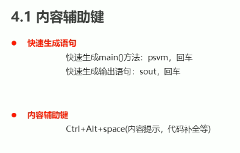

# 辅助键



1.psvm+回车 可以打出
2.sout+回车 可以打出
3.fori+回车 可以打出
4.Ctrl+Alt+V补全代码
5.alt + insert get set
6.Ctrl+Alt+L 整理格式

# 目录

## 基础1（52）

注释

关键字

常量

基本数据类型

变量

标识符（起名）

类型转换

运算符

顺序结构

if else结构

swich结构

循环结构

Random

## 基础2（148）

IDEA

数组

方法

重载

Debug

类和对象

private

this

封装（标准类）

构造方法

API

String（不可变，换地址）

StringBuilder（可变，不换地址）

ArrayList集合（python列表）

学生管理系统

## 基础3（168）

继承

super

重写

package

import

权限修饰符

final

static

## 基础4（219）

### 多态

你家有只猫和狗，你喂他们时，都可以用同一种方法来喂养（因为他们都是宠物），但是你却不能用这种方式让他们做动作，比如狗会摇尾巴，猫却不会。

喂养这个动作就可以使用多态，也就是动物父类来调用猫狗都存在的方法，不管是否存在重写。

猫吃饭、狗吃饭、猫爬树、狗摇尾巴这四个动作，使用多态就可以简化为：

动物吃饭（动物猫）、动物吃饭（动物狗）、猫爬树、狗摇尾巴

```java
AnimalEat(Animal c = new Cat());
AnimalEat(Animal c = new Dog());
Cat.climbTree();
Dog.wagTail();
```


### 抽象

抽象类为其他子类固定了一个框架，不能被实例化，更直观看到最基础的特征，可以理解成“目录”、“提纲”、“模板”。

抽象类会提出子类会什么什么，但子类怎么实现它不管。

### 接口

更彻底的抽象，里面默认抽象方法

Java是单继承，接口可以为其他的特征添加补丁，或者和形容词一样修饰类，并且一个类可以有很多形容词。主要的分类提取成父类，次要的提取成接口。

乒乓球运动员，乒乓球教练，篮球运动员，篮球教练 这四个对象，类可以是：

乒乓球运动员：运动员（子类）——人（父类）+ 乒乓球的（接口）


### 内部类


### 匿名内部类

为了不添加新类，临时重写出来一个对象来使用。

是一个对象，是子类重写后的对象，可以用多态赋值

```java
Animal a = new Animal(){
    @Override
    public void run() {
        System.out.println("猫跑的贼溜~~");
        //System.out.println(n);
    }
};
```

a这个匿名内部类就是Animal经过重写的子类对象，Animal那个位置也可以是接口。

Math

System

Object

冒泡排序

引用数据类型

### Arrays

是一个静态工具类，里面的方法都是静态


Integer

Date

Calendar

异常

List集合

Set集合

泛型

Map

HashMap
