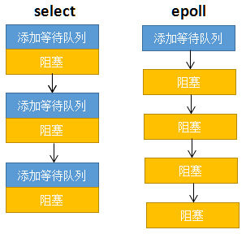
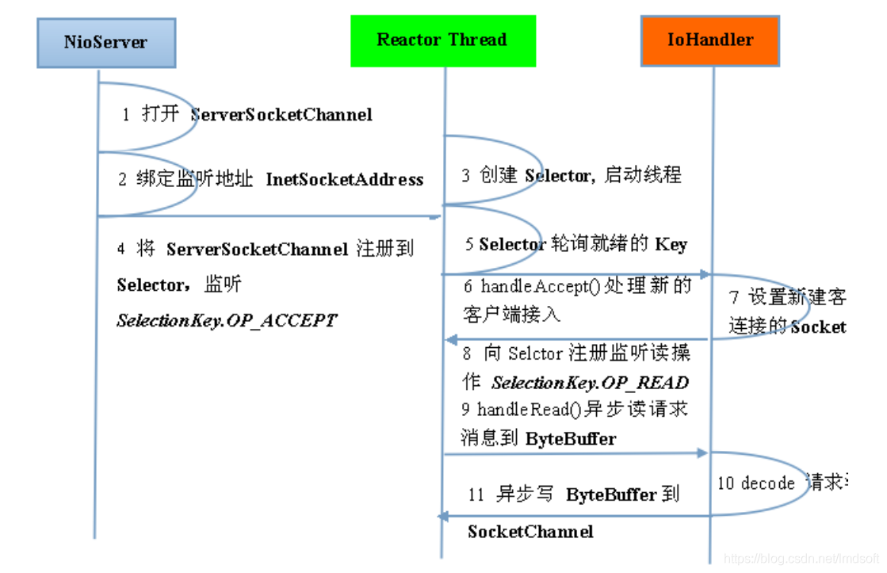
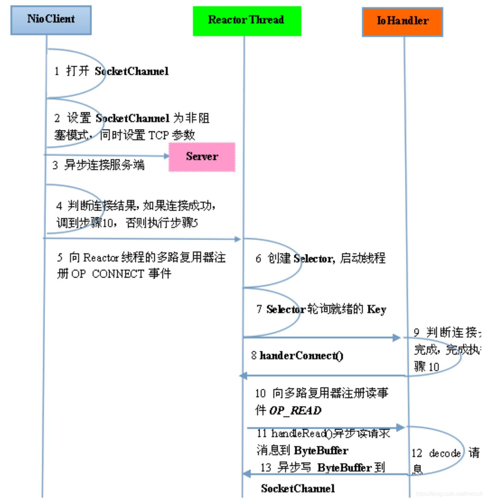
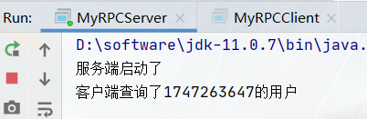
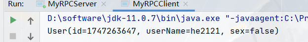

模拟一整套RPC项目从零开始的技术迭代过程

https://github.com/he2121/MyRPCFromZero

## 简介

### 0.一个最简单的RPC调用

#### **背景知识**

- java基础
- java socket编程入门
- 项目使用maven搭建，暂时只引入了lombok包

### 1.MyRPC版本1

#### 背景知识

- 反射
- 动态代理

### 2.MyRPC 版本2

#### 背景知识

- 代码解耦
- 线程池

### 3.MyRPC版本3

#### 背景知识

- netty高性能网络框架的使用

### 4.MyRPC版本4

#### 背景知识

- 各种序列化方式以及比较，（Java原生序列化， json，protobuf，kryo..）[参考博客](https://www.jianshu.com/p/937883b6b2e5)
- 自定义协议
- java IO 了解
- TCP粘包问题，解决方式

### 5.MyRPC版本5

#### 背景知识

- zookeeper安装， 基本概念
- 了解curator开源zookeeper客户端中的使用

### 6.MyRPC版本6

我们的RPC总体框架已经有了，接下来就是一些修修补补已经扩展功能的模块了

#### 背景知识

- 负载均衡

## 知识点

*Handler*主要用于异步消息的处理

### serverSocket

可以设置非阻塞NIO模式


### epllo原理

**网卡会把接收到的数据写入内存**

由硬件产生的信号需要cpu立马做出回应（不然数据可能就丢失），所以它的优先级很高。

**网卡向cpu发出一个中断信号，操作系统便能得知有新数据到来**，再通过网卡**中断程序**去处理数据。

**进程阻塞为什么不占用cpu资源？**

**等待队列**

操作系统添加等待队列只是添加了对这个“等待中”进程的引用，以便在接收到数据时获取进程对象、将其唤醒，而非直接将进程管理纳入自己之下。上图为了方便说明，直接将进程挂到等待队列之下。

**唤醒进程**

epoll的要义是**高效**的监视多个socket

**如果列表中的socket都没有数据，挂起进程，直到有一个socket收到数据，唤醒进程**。

我们先复习select的用法。在如下的代码中，先准备一个数组（下面代码中的fds），让fds存放着所有需要监视的socket。然后调用select，如果fds中的所有socket都没有数据，select会阻塞，直到有一个socket接收到数据，select返回，唤醒进程。用户可以遍历fds，通过FD_ISSET判断具体哪个socket收到数据，然后做出处理。

select低效的原因之一是将“维护等待队列”和“阻塞进程”两个步骤合二为一

epoll将这两个操作分开，先用epoll_ctl维护等待队列，再调用epoll_wait阻塞进程。



create

ctl

wait

mmap


### Netty

BIO收费站多人模式，人数（线程）浪费

NIO收费站单人模式，轮询空连接浪费

多路复用器select（bitmap） poll（异或），收费站的电话机询问哪里有事件，每次传递所有连接的状态（fd数据）

epoll再加一个记事本，基于事件的响应模型，

mmap


是对NIO网络传输模型的一种封装，提供简单易用的api

针对网络进行优化

有良好的生态

多路复用通讯方式

单线程的情况下可以同时处理多个客户端请求。与传统的多线程/多进程模型比，I/O 多路复用的

1.介绍一下自己对 Netty 的认识吧 

2.那你在说说为什么要用 Netty ？ 

3.那你在通俗地说一下 Netty 可以做什么事情？ 

4.Netty 核心组件了解吗？分别有什么作用？ 

5.在说说Netty 有几种线程模型吧？ 

6.你说一下对于这三种线程Reactor模型的理解？


两个循环：防止无效遍历，大部分无效连接在第一个循环，有效的进入下一个循环

基于事件的响应模型

select

Reactor

连接事件和读事件

两个核心线程池


服务端



客户端




零拷贝（DIRECT BUFFERS 使用堆外直接内存）

如果使用传统的堆内存（HEAP BUFFERS）进行 Socket 读写，

JVM 会将堆内存 Buffer 拷贝一份到直接内存中，然后才写入 Socket 中。相比于堆外直接内存，

消息在发送过程中多了一次缓冲区的内存拷贝。

https://blog.csdn.net/lmdsoft/article/details/105618052


![[外链图片转存失败,源站可能有防盗链机制,建议将图片保存下来直接上传(img-OmcTuKMK-1645170600487)(Netty基础.assets/1644371150805.png)]](img/watermark,type_d3F5LXplbmhlaQ,shadow_50,text_Q1NETiBA5oGS5ZOlfkJpbmdv,size_19,color_FFFFFF,t_70,g_se,x_16.png)

工作模型介绍

1. Netty 抽象出两组线程池BossGroup和WorkerGroup，BossGroup专门负责接收客户端的连接,WorkerGroup专门负责网络的读写

2. BossGroup和WorkerGroup类型都是NioEventLoopGroup

3. NioEventLoopGroup 相当于一个事件循环线程组, 这个组中含有多个事件循环线程，每一个事件循环线程是NioEventLoop

4. 每个NioEventLoop都有一个selector , 用于监听注册在其上的socketChannel的网络通讯

5. 每个Boss NioEventLoop线程内部循环执行的步骤有 3 步
   处理accept事件 , 与client 建立连接 , 生成 NioSocketChannel
   将NioSocketChannel注册到某个worker NIOEventLoop上的selector
   处理任务队列的任务 ， 即runAllTasks

6. 每个worker NIOEventLoop线程循环执行的步骤
   轮询注册到自己selector上的所有NioSocketChannel 的read, write事件
   处理 I/O 事件， 即read , write 事件， 在对应NioSocketChannel 处理业务
   runAllTasks处理任务队列TaskQueue的任务 ，一些耗时的业务处理一般可以放入TaskQueue中慢慢处理，这样不影响数据在 pipeline 中的流动处理

7. 每个worker NIOEventLoop处理NioSocketChannel业务时，会使用 pipeline (管道)，管道中维护了很多 handler 处理器用来处理 channel 中的数据

   https://blog.csdn.net/u013343114/article/details/123005370


Boss建立联系，下发工作到任务队列，worker循环处理，管道处理


## 知识记录

Socket

BIO,NIO,AIO

反射

动态代理：实现客户端代码解耦

反射实现服务端解耦

服务端抽象：普通实现和线程池实现

客户端抽象：两种实现，普通实现和Netty实现

Netty实现从BIO到NIO的转变

fastjson

zookeeper

负载均衡

## 简历写法

RPC 框架撰写

模拟RPC框架从零开始的技术迭代过程

抽象、反射和动态代理实现客户端和服务端代码解耦

使用 Netty（基于 NIO）替代 BIO 实现网络传输；

使用开源的序列化机制Fastjson替代 JDK 自带的序列化机制；

使用 Zookeeper 管理相关服务地址信息

客户端调用远程服务的时候进行负载均衡 

下一步：

客户端缓存服务地址列表，zookeeper监听服务提供者状态，更新客户端缓存

跨语言的RPC通信（protobuf）


## 实现记录

### 0.一个最简单的RPC调用

单接口单方法

#### **背景知识**

- java基础
- java socket编程入门
- 项目使用maven搭建，暂时只引入了lombok包

#### 目标

实现客户端与服务端的一个远程过程调用


#### 笔记

##### Socket类

getInputStream方法与getOutputStream方法的使用

**客户端上的使用**

getInputStream方法可以得到一个输入流，客户端的Socket对象上的getInputStream方法得到输入流其实就是从服务器端发回的数据。

getOutputStream方法得到的是一个输出流，客户端的Socket对象上的getOutputStream方法得到的输出流其实就是发送给服务器端的数据。

**服务器端上的使用**

getInputStream方法得到的是一个输入流，服务端的Socket对象上的getInputStream方法得到的输入流其实就是从客户端发送给服务器端的数据流。

getOutputStream方法得到的是一个输出流，服务端的Socket对象上的getOutputStream方法得到的输出流其实就是发送给客户端的数据。

##### ObjectOutputStream

将Java对象的原始数据类型和图形写入OutputStream。

作用：将对象以流的方式写入到文件中保存

可以使用 ObjectInputStream 读取（重构）对象。通过在流中使用文件可以实现对象的持久存储。如果流是网络套接字流，则可以在另一台主机上或另一个进程中重构对象。

##### ObjectInputStream的使用

对以前使用 ObjectOutputStream 写入的基本数据和对象进行反序列化。

##### new Random().nextInt(n)的用法

该方法的作用是生成一个随机的int值，该值介于[0,n)的区间，也就是0到n之间的随机int值，包含0而不包含n。

#### 结果：





#### 总结：

这个例子以不到百行的代码，实现了客户端与服务端的一个远程过程调用，非常适合上手，当然它是**及其不完善**的，甚至连消息格式都没有统一，我们将在接下来的版本更新中逐渐完善它。

通信：Socket固定通信

序列化与反序列化：ObjectOutputStream 和 ObjectInputStream

#### 此RPC的最大痛点：

1. 只能调用服务端Service唯一确定的方法，如果有两个方法需要调用呢?（Request需要抽象）
2. 返回值只支持User对象，如果需要传一个字符串或者一个Dog，String对象呢（Response需要抽象）
3. 客户端不够通用，host，port， 与调用的方法都特定（需要抽象）


### 1.MyRPC版本1


#### 背景知识

- 反射
- 动态代理

#### 目标

单接口多方法

客户端代码松耦合

BIO的方式监听Socket

#### 笔记

##### ServerSocket与Socket不同

Socket类代表一个客户端套接字，即任何时候连接到一个远程服务器应用时构建所需的socket。现在，要实现一个服务器应用，需要不同的做法。**服务器需随时待命**，因为不知道客户端什么时候会发来请求，此时，我们需要使用ServerSocket，对应的是java.net.ServerSocket类。 

ServerSocket与Socket不同，ServerSocket是等待客户端的请求，一旦获得一个连接请求，就创建一个Socket示例来与客户端进行通信。 

Socket直接创建一个连接对象，ServerSocket拿到请求再创建Socket对象

##### BIO,NIO,AIO

**BIO**:同步并阻塞，服务器实现模式为一个连接一个线程，即客户端有连接请求时服务器端就需要启动一个线程进行处理，如果这个连接不做任何事情会造成不必要的线程开销，当然可以通过线程池机制改善。BIO方式适用于连接数目比较小且固定的架构，这种方式对服务器资源要求比较高，并发局限于应用中，JDK1.4以前的唯一选择，但程序直观简单易理解。

**NIO**:同步非阻塞，服务器实现模式为一个请求一个线程，即客户端发送的连接请求都会注册到多路复用器上，多路复用器轮询到连接有I/O请求时才启动一个线程进行处理。NIO方式适用于连接数目多且连接比较短（轻操作）的架构，比如聊天服务器，并发局限于应用中，编程比较复杂，JDK1.4开始支持。

**AIO**:异步非阻塞，服务器实现模式为一个有效请求一个线程，客户端的I/O请求都是由OS先完成了再通知服务器应用去启动线程进行处理.AIO方式使用于连接数目多且连接比较长（重操作）的架构，比如相册服务器，充分调用OS参与并发操作，编程比较复杂，JDK7开始支持。

##### InvocationHandler

InvocationHandler位于JDK反射包下，其作用是在实现JDK动态代理的时候提供了动态执行增强逻辑的方法。InvocationHandler的用法如下：

##### lombok中的@Builder

可以链式编程

会创建一个builder()方法，它的目的是用来创建构建器。

提供一个build()方法，调用此方法，就会根据设置的值进行创建实体对象。

```
RPCResponse.builder().code(200).data(data).build();
```

##### 动态代理Proxy.newProxyInstance

newProxyInstance，方法有三个参数：

loader: 用哪个类加载器去加载代理对象

interfaces:动态代理类需要实现的接口

h:动态代理方法在执行时，会调用h里面的invoke方法去执行

#### 理解

服务端：使用反射，通过request传递过来的接口名、方法名和参数，把结果放入response里面

客户端：使用动态代理，通过创建代理对象传入的class文件，在调用方法时通过invoke方法去执行逻辑。

实现了客户端调用方法的解耦，但服务端的接口还是固定的使用。

#### 总结

1. 定义更加通用的消息格式：Request 与Response格式， 从此可能调用不同的方法，与返回各种类型的数据。
2. 使用了动态代理进行不同服务方法的Request的封装，
3. 客户端更加松耦合，不再与特定的Service，host，port绑定

#### 存在的痛点

1. 服务端我们直接绑定的是UserService服务，如果还有其它服务接口暴露呢?（多个服务的注册）
2. 服务端以BIO的方式性能是否太低，
3. 服务端功能太复杂：监听，处理。需要松耦合


### 2.MyRPC 版本2

#### 背景知识

- 代码解耦
- 线程池

#### 目标

多接口多方法

服务端代码松耦合

将直接调用实现类改变

#### 笔记

##### 线程池的使用

三大方法

七大参数

四种拒绝策略

```java
ThreadPoolExecutor(
    Runtime.getRuntime().availableProcessors(), //核心线程池大小，返回java虚拟机可用的处理器个数。
    1000, // 最大的线程池大小
    60, // 超时了没有人调用就会释放
    TimeUnit.SECONDS, //时间单位
    new ArrayBlockingQueue<>(100) //阻塞队列
);
```

#### 理解

服务端代码松耦合：使用反射将实现类Impl放入Map中，根据request中的接口名调用和实现


#### 总结：

在一版本中，我们重构了服务端的代码，代码更加简洁，

 添加线程池版的服务端的实现，性能应该会有所提升（未测）

并且服务端终于能够提供不同服务了， 功能更加完善，不再鸡肋

#### 此RPC最大的痛点

1. 传统的BIO与线程池网络传输性能低


### 3.MyRPC版本3

#### 背景知识

- netty高性能网络框架的使用

#### 目标

客户端抽象：两种实现，普通实现和Netty实现

从BIO到NIO的转变

序列化要减少字节流长度，提高序列化反序列化效率

#### 笔记

##### Netty解决粘包、拆包问题

**TCP粘包、拆包问题**

熟悉TCP编程的可能都知道，无论是服务器端还是客户端，当我们读取或者发送数据的时候，都需要考虑TCP底层的粘包/拆包机制。

TCP是一个“流”协议，所谓流就是没有界限的遗传数据。大家可以想象一下，如果河水就好比数据，他们是连成一片的，没有分界线，TCP底层并不了解上层业务数据的具体含义，它会根据TCP缓冲区的具体情况进行包的划分，也就是说，在业务上一个完整的包可能会被TCP分成多个包进行发送，也可能把多个小包封装成一个大的数据包发送出去，这就是所谓的粘包/拆包问题。

**解决方案：**

①消息定长，例如每个报文的大小固定为200个字节，如果不够，空位补空格。

②在包尾部增加特殊字符进行分割，例如加回车等。

③将消息分为消息头和消息体，在消息头中包含表示消息总长度的字段，然后进行业务逻辑的处理。

**Netty中解决TCP粘包/拆包的方法：**

①分隔符类：DelimiterBasedFrameDecoder（自定义分隔符）

②定长：FixedLengthFrameDecoder

##### SimpleChannelInboundHandler

拿到返回结果，释放内存

这个是 InboundHandler，在这里就实现了将外部请求分发给系统内部业务并进行处理。

channelRead0 和 channelRead()

当 channelRead0() 方法完成时，你已经有了传入消息，并且已经处理完它了。当该方法返回时，SimpleChannelInboundHandler负责释放指向保存该消息的ByteBuf的内存引用。

##### Netty之DefaultAttributeMap与AttributeKey的机制和原理

一、介绍和原理分析
1.什么是 DefaultAttributeMap？
DefaultAttributeMap 是一个 数组 ＋ 链表 结构的线程安全Map。

2.什么是 AttributeKey？
AttributeKey可以想象成一个缓存set，存放了一组key的集合，与DefaultAttributeMap之间的关系是，后者中的哈希图存放键值对（k-v）的v即是AttributeKey。

有了AttributeKey，你自然会想到Attribute，两者之间又有什么关系呢？下面会讲，慢慢理解，跟着我思路！

3. 什么是 Attribute？
Attribute顾名思义，就是与AttributeKey是一对的，形象一点说就是你跟你的对象（老婆），而你就是key，是一对一的，不能是一对多的关系

 作者：傲剑狂刀fhwqu https://www.bilibili.com/read/cv15902322 出处：bilibili

#### 理解

客户端和服务端都解耦以后，可以使用不同的处理模块

Netty初始化，解决粘包、拆包问题

Netty初始化两个核心线程池boss和work

服务端Handler接收request，发送response，释放内存request

客户端Handler接收response，释放内存request

客户端阻塞拿数据，但实际上不应通过阻塞，可通过回调函数（因为已经写入了Map）


#### 总结

此版本我们完成了客户端的重构，使之能够支持多种版本客户端的扩展（实现RPCClient接口）

并且使用netty实现了客户端与服务端的通信


#### 此RPC最大痛点

1. java自带序列化方式（Java序列化写入不仅是完整的类名，也包含整个类的定义，包含所有被引用的类），不够通用，不够高效


### 4.MyRPC版本4

#### 背景知识

- 各种序列化方式以及比较，（Java原生序列化， json，protobuf，kryo..）[参考博客](https://www.jianshu.com/p/937883b6b2e5)
- 自定义协议
- java IO 了解
- TCP粘包问题，解决方式

#### 笔记

##### jdk 自带对象序列化类ObjectInput(Out)Stream

1.无法跨语言。这应该是java序列化最致命的问题了。由于java序列化是java内部私有的协议，其他语言不支持，导致别的语言无法反序列化，这严重阻碍了它的应用。
 2.序列后的码流太大。java序列化的大小是二进制编码的5倍多！
 3.序列化性能太低。java序列化的性能只有二进制编码的6.17倍，可见java序列化性能实在太差了。

##### 阿里巴巴的FastJson

Fastjson是一个Java语言编写的高性能的JSON处理器,由阿里巴巴公司开发。无依赖，不需要例外额外的jar，能够直接跑在JDK上。FastJson在复杂类型的Bean转换Json上会出现一些问题，可能会出现引用的类型，导致Json转换出错，需要制定引用。FastJson采用独创的算法，将parse的速度提升到极致，超过所有json库。


#### 理解

 自定义编解码器：还是使用了fastjson


#### 总结

在这版本中，我们自己定义的消息格式，使之支持多种消息类型，序列化方式，使用消息头加长度的方式解决粘包问题

并且，实现了ObjectSerializer与JsonSerializer两种序列化器，也可以轻松扩展为其它序列化方式（实现Serialize接口）。

#### 此版本最大痛点

- 服务端与客户端通信的host与port预先就必须知道的，每一个客户端都必须知道对应服务的ip与端口号， 并且如果服务挂了或者换地址了，就很麻烦。扩展性也不强


### 5.MyRPC版本5

#### 背景知识

- zookeeper安装， 基本概念
- 了解curator开源zookeeper客户端中的使用

#### 笔记


#### 理解

客户端：new client不需要传入host与name， 而在发送request时，从注册中心获得

#### 总结

此版本中我们加入了注册中心，终于一个完整的RPC框架三个角色都有了：服务提供者，服务消费者，注册中心

#### 此版本最大痛点

- 根据服务名查询地址时，我们返回的总是第一个IP，导致这个提供者压力巨大，而其它提供者调用不到


### 6.MyRPC版本6

我们的RPC总体框架已经有了，接下来就是一些修修补补已经扩展功能的模块了

#### 背景知识

- 负载均衡

#### 总结

这一版本中，我们实现负载均衡的两种策略：随机与轮询。

在这一版本下，一个完整功能的RPC已经出现，当然还有许多性能上与代码质量上的工作需要完成。

#### 此版本最大痛点

- 客户端每次发起请求都要先与zookeeper进行通信得到地址，效率低下。

